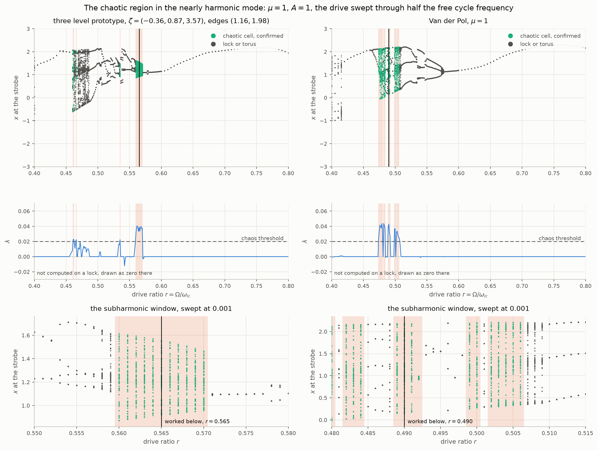
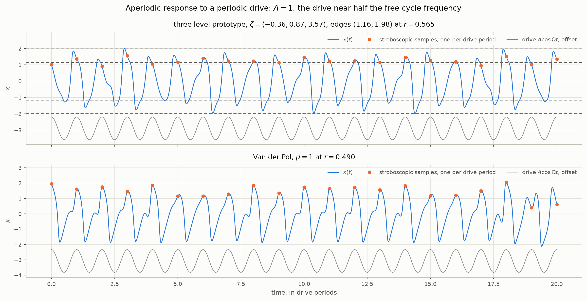
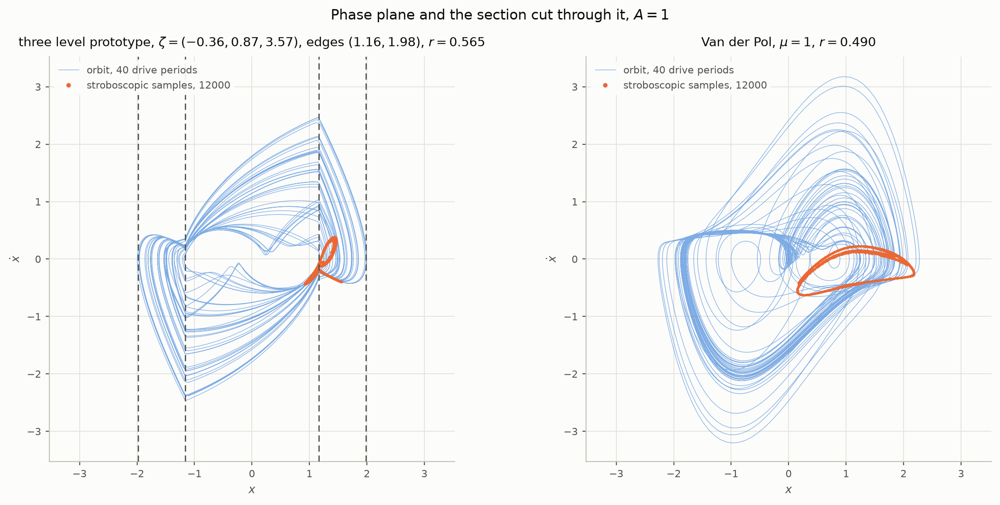
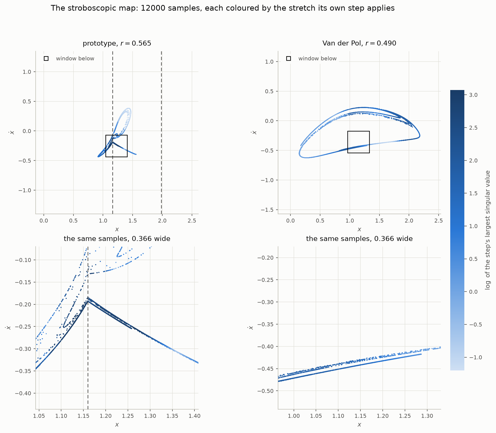
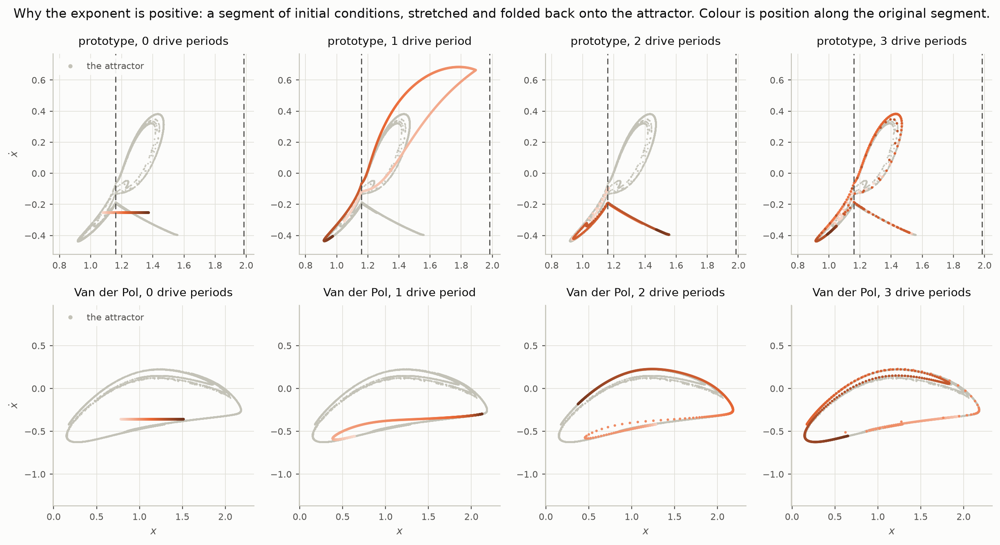

# Chaos in the nearly harmonic mode

`STROBOSCOPIC.md` took the three level prototype into its chaotic band at
$`\mu = 5`$ — the relaxation regime, where Van der Pol runs through a
period adding sequence and the chaos sits in the transitions between locks.
This document does the same job in the other mode, the one an ordinary
oscillator is usually in: $`\mu = 1`$, where the free cycle is nearly a
sinusoid and there is no period adding at all. `THREELEVEL.md` reports one
chaotic band there, two cells wide on a coarse sweep, and leaves it at
that. Here it is opened up.

The question is the simple one. Drive the prototype in the mode where it
oscillates normally, find where it goes chaotic, and look at what it is
doing — in time, in the phase plane, and on the section cut once per drive
period, which is the map. Then put the real oscillator beside it and see
how much of that is the same.

Nothing below is fitted. The parameters are `staircase.THREE_FITTED_MU1`,
fitted in `THREELEVEL.md` to two **lock plateau edges** at a different drive
strength and in a different part of the frequency range. Everything here is
a prediction of that fit. `chaos.py` produces every number and every
figure.

| | |
| --- | --- |
| model | $`\zeta = (-0.3578,\ 0.8653,\ 3.5731)`$, edges $`a = 1.1597`$, $`b = 1.9836`$ — `staircase.THREE_FITTED_MU1` |
| control | Van der Pol at $`\mu = 1`$, free period $`6.6633`$, $`\omega_{lc} = 0.94296`$ |
| drive | $`A = 1`$, frequency $`\Omega = r\,\omega_{lc}`$ with $`r`$ swept from 0.40 to 0.80 |
| section | the phase plane sampled once per drive period, as in `STROBOSCOPIC.md` |

The model is

```math
\ddot{x} + 2\zeta(x)\,\dot{x} + x = A\cos\Omega t,
\qquad
\zeta(x) = \begin{cases} \zeta_{2} & |x| \gt b \\ \zeta_{1} & a \lt |x| \lt b \\ \zeta_{0} & |x| \lt a \end{cases}
```

and the drive ratio $`r`$ is measured against **Van der Pol's** free cycle
frequency for both systems, so one value of $`r`$ is one drive frequency on
each. Their free periods agree to a tenth of a per cent, so nothing in the
comparison is a disguised frequency offset.

## Where the chaos is

A drive at $`A = 1`$ is what this mode needs: at $`A = 5`$, the strength the
model was fitted at, the 1:1 tongue is wide enough to swallow the whole
subharmonic region on both systems. The sweep runs $`r`$ from 0.40 to 0.80
at 0.005, refined to **0.001 between 0.46 and 0.60**, and each cell is
classified by `section.py` exactly as everywhere else in the repository:
a repeat of the stroboscopic point is a lock, and where there is no repeat
the largest Lyapunov exponent decides between a torus and chaos. Every
chaotic verdict is then re-tested by `section.confirm_chaos` at five times
the run length and a hundred times the twin separation, and a cell that
does not hold up is not counted.

| | confirmed chaotic bands, in drive ratio | cells |
| --- | --- | --- |
| three level prototype | 0.461–0.462, 0.466, 0.535, **0.560–0.570** | 15 |
| Van der Pol | 0.474–0.480, 0.482–0.484, 0.489–0.492, 0.499–0.500, **0.502–0.506** | 21 |

Both systems are chaotic in the same place in the same sense: a drive near
**half** the free cycle frequency, reached not through a sequence of locks
but by period doubling of the response to a subharmonic drive. Neither
system's cells sit on the other's. The prototype's main band is centred at
$`r = 0.565`$ and Van der Pol's chaotic region at about $`r = 0.490`$, an
offset of **15%** in drive ratio, with the prototype's two smaller bands at
0.461–0.466 falling just below Van der Pol's region and the isolated cell
at 0.535 between the two. `THREELEVEL.md` describes this offset as seven
per cent; that figure does not survive the finer sweep, and seven per cent
is the free period offset of the $`\mu = 5`$ fit rather than anything
measured here.

<picture>
  <source media="(prefers-color-scheme: dark)" srcset="figures/chaos-mu1-band-dark.png">
  
</picture>

*Top: every stroboscopic displacement of the settled response against drive ratio — a finite set of points on a lock, a smear on a torus or in chaos. Middle: the largest Lyapunov exponent, with the threshold as chrome; it is not computed on a lock and is drawn as zero there. Bottom: the same diagram over each system's own subharmonic window at 0.001, where the route in is resolved. Confirmed chaotic cells are green and shaded in every row.*

The bottom row is the reason for the fine grid. Coming up in frequency the
prototype runs

| $`r`$ | 0.550 | 0.552 | 0.553 | 0.557 | 0.558 | 0.560–0.570 | 0.571 | 0.573 |
| --- | --- | --- | --- | --- | --- | --- | --- | --- |
| | lock 2 | torus | lock 4 | lock 8 | torus | **chaos** | torus | lock 1 |

— a period doubling cascade, 2 to 4 to 8, ending in the chaotic band, and
then the 1:1 lock on the other side of it. A sweep at 0.005 sees the band
and none of the cascade; the 0.1 grid of `THREELEVEL.md`'s regime maps
steps over both. Van der Pol's own window is more broken up, with locks of
order 11, 5, 2, 1 and 4 threaded between its chaotic stretches — periodic
windows inside a chaotic region, which is what a smooth system of this kind
does and which the prototype shows less of.

Two drive ratios are worked in detail from here on, one inside each
system's own band: the prototype at $`r = 0.565`$ and Van der Pol at
$`r = 0.490`$. They are different drives, deliberately, and the reason is
the offset: at $`r = 0.490`$ the prototype is locked at order 3 while Van
der Pol is chaotic, and at $`r = 0.565`$ it is exactly the other way round.

## The response in time

<picture>
  <source media="(prefers-color-scheme: dark)" srcset="figures/chaos-mu1-time-dark.png">
  
</picture>

*Twenty drive periods of $`x(t)`$ on each attractor, with the drive drawn underneath as chrome and the stroboscopic samples — one per drive period — marked on the curve. The prototype's zone edges $`\pm a`$ and $`\pm b`$ are dashed.*

The drive is periodic and the response is not. Roughly two response cycles
fit into each drive period on both systems, and it is the *amplitude* that
never repeats: on the prototype the peak wanders between about 1.3 and a
largest excursion of 1.995, which is the outer edge $`b = 1.9836`$ to
within a hundredth.

That is the mechanism in one line, and it is worth being exact about which
zones do the work. Over the forty drive periods behind these figures the prototype spends
**59.8%** of the time inside the core $`|x| \lt a`$, where
$`\zeta_0 = -0.358`$ is pumping the orbit up, **40.0%** in the band, where
$`\zeta_1 = +0.865`$ is taking energy back out, and **0.2%** beyond
$`b`$. So the third level is barely visited: what limits the orbit here is
the band, and the outer level's job is to be the wall the largest
excursions graze. Van der Pol, measured against the same two displacements,
divides its time 61.1%, 37.1% and 1.9% — the same balance, with rather more
of the tail.

The samples are read off this same trajectory rather than recomputed.
Two integrations of a chaotic orbit from the same starting point diverge:
at $`\lambda = 0.04`$ per unit time, four hundred drive periods of settling
amplify the integrator's own error by $`e^{177}`$, so a separately strobed
run lands on the attractor but not on this curve. It cost a figure to
learn that.

## The phase plane

<picture>
  <source media="(prefers-color-scheme: dark)" srcset="figures/chaos-mu1-phase-dark.png">
  
</picture>

*Forty drive periods of orbit as a thin line, with twelve thousand stroboscopic samples on top. Same window and same scale on both panels; the prototype's zone edges are chrome.*

The orbits cover comparable ground — the prototype peaks at $`1.995`$ in
displacement and Van der Pol at $`2.275`$ — and they are visibly different
objects: the prototype's is a polygon of
circular arcs with corners on the lines $`x = \pm a`$ and $`x = \pm b`$,
where its field jumps, and Van der Pol's is smooth everywhere. The
stroboscopic samples are the small dense set inside — that is the attractor
of the map, and everything below is about it.

## The map cut once per drive period

Sampling the plane once per drive period turns the flow into a map of the
plane to itself, which is the section `STROBOSCOPIC.md` works on. For the
prototype the map is exact: `maps.py` composes the arcs analytically with a
saltation matrix at every wall crossed, so the one period Jacobian is the
map's own and not a difference of trajectories. It agrees with the
integrator to $`8.7\times10^{-10}`$ relative over forty steps. For Van der
Pol the same Jacobian comes from the variational equation integrated
alongside the state.

That Jacobian is what the colour carries: each sample is drawn in the
logarithm of the largest singular value of its own step — how much the map
pulls apart a small disc placed there. Both panels share the scale, so a
colour means the same stretch on either.

<picture>
  <source media="(prefers-color-scheme: dark)" srcset="figures/chaos-mu1-section-dark.png">
  
</picture>

*Twelve thousand samples of each attractor, coloured by the stretch its own step applies. Top: the same window and scale on both, so the size difference is real. Bottom: a zoom of the boxed region, the same width on both panels.*

Three things read off it.

**The attractors are the same kind of object and not the same size.** Both
are thin strands folded over on themselves rather than clouds — a curve
that has been stretched and doubled back, which is what a dissipative
planar map makes. The prototype's spans $`0.64`$ in $`x`$ and Van der
Pol's $`2.04`$, a factor of three, on the same drive strength.

**The prototype's attractor has a corner and Van der Pol's does not.** The
sharp kink in the lower left panel sits on the dashed line
$`x = a = 1.1597`$, the inner zone edge, and it is there because the map
itself has a crease along that line. Two starts either side of it are in
different zones from the first instant, so their orbits differ for the
whole period; what survives as the two starts close up is measured
directly, on the attractor's own strand at $`\dot{x} = -0.195`$:

| $`\epsilon`$ | $`10^{-2}`$ | $`10^{-3}`$ | $`10^{-4}`$ | $`10^{-5}`$ | $`10^{-6}`$ |
| --- | --- | --- | --- | --- | --- |
| $`\lVert y_+ - y_- \rVert`$ | 1.2e-1 | 1.3e-2 | 1.3e-3 | 1.3e-4 | 1.3e-5 |
| $`\lVert J_+ - J_- \rVert / \lVert J \rVert`$ | 1.26 | 1.16 | 1.14 | 1.14 | 1.14 |

The state after a drive period converges — the map is continuous across the
wall, as `STROBOSCOPIC.md` argues it must be for any field whose solutions
are unique — while the derivative does not: the two Jacobians stay
$`1.14`$ apart in norm, larger than the Jacobian itself, however close the
starts get. That is a crease, and an invariant set that crosses it gets a
corner. Note that this is a *different* edge from the grazing edges
`STROBOSCOPIC.md` measures and finds continuously differentiable: those are
where an orbit just touches a wall on its way round, this is the wall
itself. Van der Pol's zoom, at the same width, is a smooth pair of
strands, because it has no wall to cross.

**The stretching is not spread evenly over the attractor.** On both
systems the colour varies systematically along the strand rather than
scattering: whole branches stretch hard and whole branches barely stretch
at all, which is the map's structure showing through the samples. The
prototype's stretch runs from $`0.30`$ to $`25.8`$ per step with a median
of $`3.17`$; Van der Pol's is much narrower, $`0.35`$ to $`8.74`$ with a
median of $`4.51`$. The
prototype gets its stretching in rarer, larger events, which is what a
switch does compared with a smooth law.

## Stretch and fold

The exponent says an infinitesimal separation grows. The mechanism is
visible directly: lay a short segment of initial conditions across the
attractor and carry it forward, one drive period at a time.

<picture>
  <source media="(prefers-color-scheme: dark)" srcset="figures/chaos-mu1-fold-dark.png">
  
</picture>

*A segment and its first three images, one panel each, with the attractor behind in chrome. Colour is position along the original segment, so the order the points started in can be followed as the segment is drawn out and doubled back.*

The segment is drawn out, folded, and laid back down along the attractor;
by the third period it covers most of it, still in order. Its length goes

| | start | 1 period | 2 | 3 |
| --- | --- | --- | --- | --- |
| prototype | 0.295 | 2.975 | 2.778 | 8.770 |
| Van der Pol | 0.733 | 2.059 | 4.738 | 10.647 |

a factor of about 30 and 15 in three periods. That is faster than the
Lyapunov exponent's $`e^{\lambda T} = 1.56`$ and $`1.79`$ per period, and
the difference is not an inconsistency: a segment of finite length picks up
each step's *largest* stretch wherever it happens to lie, and the product
of the largest stretches is not the largest stretch of the product. The
exponent is the sustained rate after the directions have aligned; these
first three steps are before that.

The second image of the prototype's segment is *shorter* than the first.
That is the fold: the segment has been bent back on itself and part of it
sent into the heavily damped zone, where the map contracts.

## The numbers side by side

The area contraction is known exactly rather than measured, which fixes the
second exponent without a second twin trajectory: the determinant of the
one period Jacobian is the area factor of that step, its mean logarithm
over the attractor is $`\lambda_1 + \lambda_2`$ per unit time, and for a
planar map with $`\lambda_1 \gt 0 \gt \lambda_2`$ the Kaplan–Yorke
dimension is $`1 + \lambda_1/|\lambda_2|`$.

| | prototype, $`r = 0.565`$ | Van der Pol, $`r = 0.490`$ |
| --- | --- | --- |
| drive frequency $`\Omega`$ | 0.5328 | 0.4620 |
| drive period | 11.793 | 13.599 |
| $`\lambda_1`$, per unit time | $`+0.0375`$ | $`+0.0428`$ |
| $`\lambda_1`$, per drive period | $`+0.442`$ | $`+0.582`$ |
| $`\lambda_2`$, per unit time | $`-0.3264`$ | $`-0.3164`$ |
| area factor per drive period | 0.0331 | 0.0242 |
| stretch per step, median and largest | 3.17, 25.8 | 4.51, 8.74 |
| Kaplan–Yorke dimension | 1.115 | 1.135 |
| box counting dimension | 1.269 | 1.247 |
| attractor extent in $`x`$ | 0.64 | 2.04 |

The exponents agree to about an eighth of their own value, the contraction
per drive period to within forty per cent, and both dimension estimates agree to within
their own spread — the two attractors are equally thin objects, barely
above a curve, and the map that makes them contracts area by a factor of
thirty to forty every period while stretching along one direction. The box
counting figures are fitted over the box sizes where the count is neither
saturated by the grid nor by the sample, which is about a decade; they are
observed slopes over a tested range and not converged dimensions, and the
agreement with $`D_{KY}`$ to $`0.15`$ is as much as $`12000`$ points on a
thin set will support.

## What this is and is not evidence for

**It is evidence that the model predicts chaos where the real oscillator
has it, in a mode it was not fitted in.** The parameters came from two lock
plateau edges at $`A = 5`$; the chaos is at $`A = 1`$ near a drive ratio of
$`\tfrac{1}{2}`$, and it is there, reached the same way, with the same kind
of attractor, the same sign and nearly the same size of exponent, the same
contraction and the same dimension. For the purpose `DATASHEET.md` states
— saying whether a drive will produce chaos — that is the behaviour asked
for.

**It is not evidence that the model puts the chaos at the right
frequency.** The main band is 15% high in drive ratio, and no cell of one
system's band coincides with a cell of the other's. A user reading the
model for *where* to expect trouble gets the right window, about
$`0.46 \lt r \lt 0.57`$, and not the right cell within it.

**The route in is cleaner in the model than in the oscillator.** The
prototype gives a textbook cascade — 2, 4, 8, chaos — over 0.020 in drive
ratio, where Van der Pol's window is broken up by periodic windows of order
11, 5, 4 and 2. The prototype locks more readily than the smooth system at
high order, which is the same tendency both fits show, and here it shows up
as a tidier route rather than as extra locks.

**Untested.** Everything above is at one drive strength and one $`\mu`$.
Whether the offset in the band's position follows the power laws of
`THREELEVEL.md`'s campaign as $`\mu`$ changes is not measured here, and the
neighbouring bands at 0.461–0.466 and the isolated cell at 0.535 have not
been chased into their own cascades.
