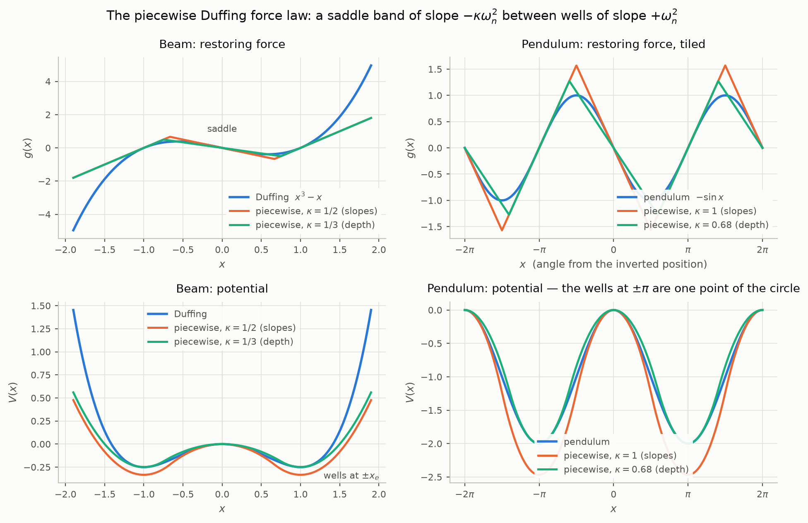
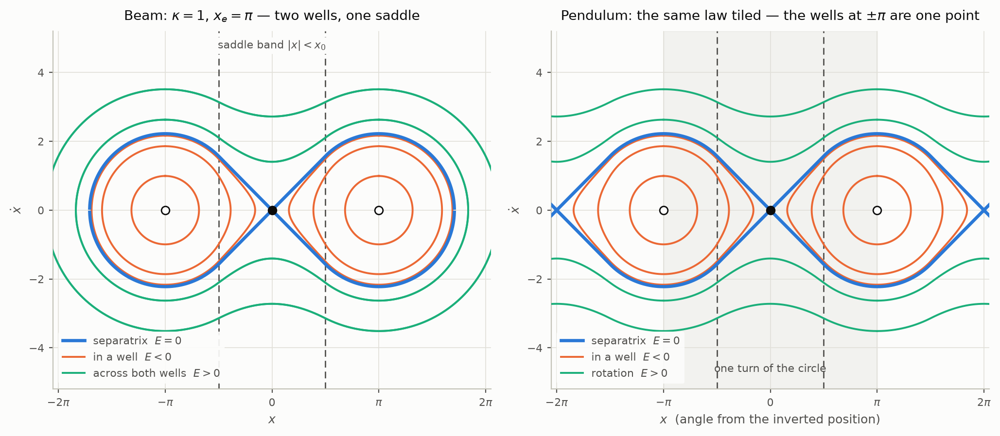
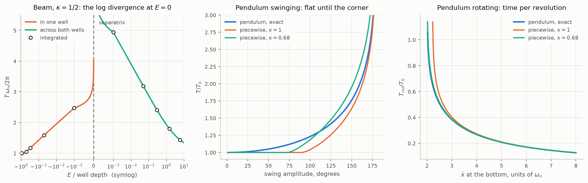
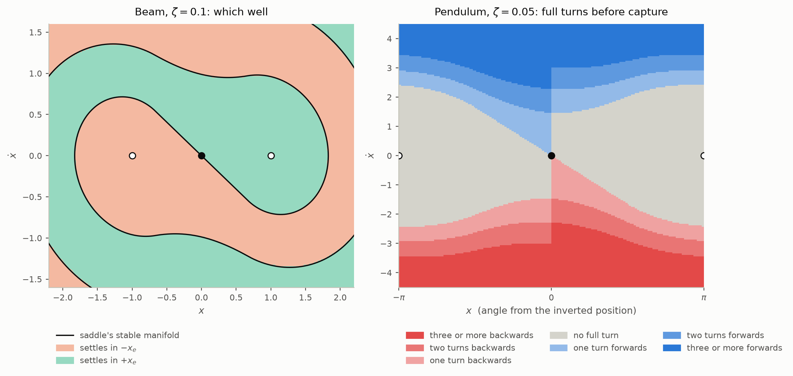
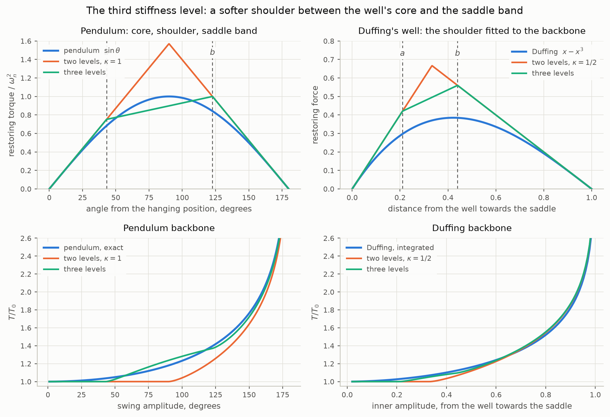
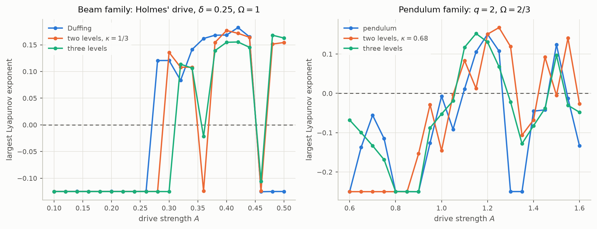
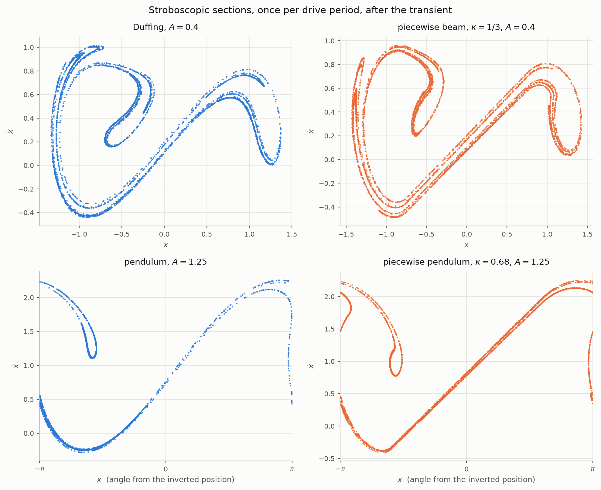

# The piecewise Duffing prototype

A second order oscillator whose **stiffness**, not its damping, is
switched at a displacement threshold: negative inside a band around the
origin, positive outside it, with the restoring force kept continuous.
It is the sixth prototype of this repository and the first with more than
one equilibrium. Every earlier prototype keeps the spring linear and puts
the nonlinearity in $`\zeta`$, so each has exactly one equilibrium and its
signature is a frequency that does not move with amplitude. This one has
a saddle between two wells, its frequency falls with amplitude and goes to
infinity at the separatrix, and under a periodic drive it is chaotic where
Duffing's double well and the driven pendulum are chaotic. `duffing.py`
carries the model, its closed forms and its figures, and prints every
number quoted here.

Two physical systems are the targets, and the same force law serves both:

- **A buckled beam.** An Euler strut loaded past its critical load has two
  buckled states and an unstable straight one between them. That is
  Duffing's double well $`-\alpha x + \beta x^3`$, here with the cubic
  replaced by two straight lines.
- **A pendulum over the full circle.** Measure the angle from the
  *inverted* position. The top is then the saddle at the origin, and the
  hanging position — one point of the circle — appears twice, at
  $`\pm\pi`$, as the two wells. Treating that single equilibrium as two
  makes the pendulum the same double well as the beam, and tiling the
  force with period $`2\pi`$ closes the circle so that full rotations are
  ordinary trajectories.

What is established, in one paragraph. Small oscillations in a well are
the linear prototype exactly. The period of every undamped orbit — in one
well, across both wells, a pendulum swing, a pendulum rotation — has an
elementary closed form that agrees with direct integration to
$`10^{-9}`$ and diverges logarithmically at the separatrix with the
coefficient the saddle's eigenvalue predicts. With damping the two wells
attract, the saddle's stable manifold is the basin boundary, and the
number of turns a damped pendulum makes before it is captured follows
from an energy map built on a closed form action. Fitted to Holmes'
forced Duffing beam and to the driven pendulum of Baker and Gollub, the
prototype's largest Lyapunov exponent is positive across the same band of
drive strength as the smooth system's, with the onset within one scan
step when the well depth is the matched quantity. A third stiffness level,
a softer shoulder between the core of a well and the saddle band, removes
the two level law's flat start: set from the pendulum's peak torque and
well depth it holds the swing period within 5% at every amplitude and the
rotation period within 1%, and fitted to Duffing's backbone it holds that
within 2.6%. Driven, the three level pendulum agrees with the exact
pendulum on whether each of 21 drive strengths is chaotic.

## Parameters and units

```math
\ddot{x} + 2\zeta\omega_n\dot{x} + g(x) = A\cos\Omega t,
\qquad
g(x) =
\begin{cases}
\omega_n^2\,(x - x_e) & x \gt x_0 \\
-\kappa\,\omega_n^2\,x & \lvert x\rvert \lt x_0 \\
\omega_n^2\,(x + x_e) & x \lt -x_0
\end{cases}
\qquad x_e = (1 + \kappa)\,x_0
```

Four numbers, each read off one measurement, of which one is a timescale
and one an amplitude scale:

| parameter | what it does | read from | units |
| --- | --- | --- | --- |
| $`\omega_n`$ | frequency of small oscillations about a well; sets every time | the period of a small oscillation about a buckled state, or of a hanging pendulum | rad/s |
| $`\zeta`$ | damping ratio, the same everywhere | the decrement of that oscillation | — |
| $`\kappa`$ | saddle stiffness ratio: the straight beam or inverted pendulum diverges at rate $`\sqrt{\kappa}\,\omega_n`$; the well depth is $`\kappa\,\omega_n^2 x_0 x_e/2`$ | the growth rate at the saddle, *or* the escape speed from a well — see the fitting section | — |
| $`x_0`$ | half-width of the saddle band; sets the amplitude scale and puts the wells at $`\pm x_e = \pm(1+\kappa)x_0`$ | the buckled deflection $`x_e`$; for the pendulum $`x_e = \pi`$ by geometry | units of $`x`$ |

Only $`\kappa`$ carries the shape. The beam has $`\kappa`$ and $`x_0`$
free; the pendulum has $`x_e = \pi`$ fixed and therefore only $`\kappa`$,
with $`x_0 = \pi/(1+\kappa)`$. Everything below is in units with
$`\omega_n = 1`$ except where a smooth target sets its own scale, and the
scaling rule near the end moves the results to any frequency and any
amplitude.

## Definition

### The force is continuous and the field never slides

The negative stiffness band cannot simply be switched in, because a jump
in the force at $`\pm x_0`$ would bring Filippov solutions with it, as the
README's offset boundary section found for damping. Continuity is what
fixes the wells: the band's force at its edge is $`-\kappa\omega_n^2 x_0`$
and the well's is $`\omega_n^2(x_0 - x_e)`$, and equating them gives
$`x_e = (1+\kappa)x_0`$. So the well position is not a free parameter but
the consequence of continuity, in the same way the virtual centres of the
README's velocity switched models were.

The force then has a corner at $`\pm x_0`$ and is continuous everywhere,
exactly as the deadzone model's was. The field is Lipschitz, solutions
exist and are unique, nothing slides, and a general purpose integrator
crosses the corners without chatter; only the Jacobian jumps, so the
stiffness is $`-\kappa\omega_n^2`$ in the band and $`+\omega_n^2`$ outside
it. Because the field is continuous the saltation matrix at a corner is
the identity, which is what lets the variational equation be integrated
straight through the corners later on.

### Potential and well depth

Taking $`V(0) = 0`$ at the saddle:

```math
V(x) =
\begin{cases}
-\tfrac{1}{2}\kappa\omega_n^2 x^2 & \lvert x\rvert \lt x_0 \\[4pt]
\tfrac{1}{2}\omega_n^2(\lvert x\rvert - x_e)^2 - \Delta V & \lvert x\rvert \gt x_0
\end{cases}
\qquad
\Delta V = \tfrac{1}{2}\kappa(1+\kappa)\,\omega_n^2 x_0^2 = \tfrac{1}{2}\kappa\,\omega_n^2 x_0 x_e
```

The energy $`E = \dot{x}^2/2 + V(x)`$ is conserved when $`\zeta = 0`$ and
$`A = 0`$, is zero on the separatrix, and is $`-\Delta V`$ at the bottom
of a well. The speed at a well bottom that just reaches the saddle is
$`\sqrt{2\Delta V}`$. Evaluated at $`\kappa = 1/2`$, $`x_0 = 2/3`$:
$`\Delta V = 0.166667`$ from the formula and $`V(x_e) = -0.166667`$ from
the code, which is the check that the two pieces of $`V`$ join.

### The beam and the pendulum are one law

The two variants share $`g`$ and differ only in whether $`x`$ wraps.

**Beam.** The wells are unbounded on their outer sides and the stiffness
keeps rising: two wells, one saddle, and no orbit ever leaves the frame.

**Pendulum.** The pendulum's own equation, with the angle $`\theta`$
measured from the hanging position, is
$`\ddot{\theta} + 2\zeta\omega_n\dot{\theta} + \omega_n^2\sin\theta = 0`$.
Substituting $`\theta = \pi + x`$ turns $`\sin\theta`$ into $`-\sin x`$: the
stiffness at $`x = 0`$ is $`-\omega_n^2`$, a saddle, and at $`x = \pm\pi`$ it
is $`+\omega_n^2`$, a well. The pendulum seen from the top *is* a double
well, with the one hanging equilibrium standing in for both wells. The
prototype takes the well spacing from that geometry, $`x_e = \pi`$, and
tiles $`g`$ with period $`2x_e = 2\pi`$, so that beyond the far side of
each well the next saddle band begins rather than the stiffness
continuing to rise. The state lives on a cylinder, and a rotation is a
trajectory that advances $`x`$ by $`2\pi`$ per turn.

At the same $`\kappa`$ and $`x_e`$ the two variants agree on
$`\lvert x\rvert \lt x_e + \kappa x_0`$, the whole band and the inner
face of each well; they part only where the pendulum's well turns over
into the next saddle. The beam's phase portrait is the pendulum's cut
there and unrolled.

<picture>
  <source media="(prefers-color-scheme: dark)" srcset="figures/duffing-force-dark.png">
  
</picture>

*The force law and its potential. Left: the beam against Duffing's
$`x^3 - x`$, at the two values of $`\kappa`$ that match its slopes and its
well depth. Right: the pendulum against $`-\sin x`$ over two turns of the
circle, tiled with period $`2\pi`$; the wells at $`\pm\pi`$ are one point.*

### Where Duffing and the pendulum sit

Duffing's $`-\alpha x + \beta x^3`$ has its saddle rate squared equal to
$`\alpha`$ and its well frequency squared equal to $`2\alpha`$, so it is a
double well of *fixed* shape, $`\kappa = 1/2`$ if the slopes are matched.
The pendulum has slope $`\mp\omega_n^2`$ at both equilibria, so slope
matching gives $`\kappa = 1`$. The prototype has $`\kappa`$ free, and that
is the point: a real strut's saddle rate and well frequency need not stand
in Duffing's ratio, and the prototype does not assume they do.

## Equilibria

There are three, at $`x = 0`$ and $`x = \pm x_e`$, with $`\dot{x} = 0`$.
Each lies inside one linear piece, so its eigenvalues are that piece's:

```math
\text{saddle:}\quad \lambda = \omega_n\left(-\zeta \pm \sqrt{\zeta^2 + \kappa}\right),
\qquad
\text{wells:}\quad \lambda = \omega_n\left(-\zeta \pm \sqrt{\zeta^2 - 1}\right)
```

The saddle has one positive and one negative eigenvalue for every
$`\zeta`$ and every $`\kappa \gt 0`$: damping never stabilises the straight
beam or the inverted pendulum, it only slows the escape. The wells are the
linear prototype's poles, stable for $`\zeta \gt 0`$.

Verified by evaluating the field at the three claimed points and
differencing the Jacobian, at $`\zeta = 0.1`$, $`\kappa = 1/2`$,
$`x_0 = 2/3`$: the field vanishes to machine precision at all three, the
differenced eigenvalues are $`0.614143`$ and $`-0.814143`$ at the saddle
against $`-0.1 \pm 0.994987j`$ at either well, and the formulas above
give the same six numbers.

## The undamped phase plane

With $`\zeta = 0`$ every orbit is a level set of $`E`$, and the sign of
$`E`$ sorts them:

| | $`E \lt 0`$ | $`E = 0`$ | $`E \gt 0`$ |
| --- | --- | --- | --- |
| beam | oscillation in one well | figure of eight through the saddle, two homoclinic loops | oscillation across both wells |
| pendulum | swing about the hanging position | the loop from the top round to the top again | rotation, one sense or the other |

<picture>
  <source media="(prefers-color-scheme: dark)" srcset="figures/duffing-phase-dark.png">
  
</picture>

*Both variants at $`\kappa = 1`$, $`x_e = \pi`$, drawn over two turns so
the correspondence shows: the beam's wells at $`\pm\pi`$ are the
pendulum's one hanging position, and the two portraits coincide on the
band and the inner face of each well. The pendulum's separatrix runs from
saddle to saddle, so rotations lie above and below it; the beam's closes
on itself, so cross-well orbits surround it.*

## Exact periods

Every arc is a solution of a linear constant coefficient equation, so the
period of any undamped orbit is a sum of elementary transit times. Write
$`\mu = \sqrt{\kappa}\,\omega_n`$ for the saddle rate and
$`R = \sqrt{2(E + \Delta V)}/\omega_n`$ for the amplitude of the well arc
about $`x_e`$. Inside a well the arc is $`x - x_e = R\cos\omega_n t`$;
inside the band it is $`x = x_-\cosh\mu t`$ about a turning point $`x_-`$,
or $`x = (v/\mu)\sinh\mu t`$ through the saddle at speed $`v`$.

**In one well of the beam**, $`-\Delta V \lt E \lt 0`$. While
$`R \le \kappa x_0`$ the orbit never reaches the band and the period is
$`2\pi/\omega_n`$ exactly. Beyond that it enters the band once per cycle:

```math
T = 2\left[\frac{1}{\omega_n}\arccos\!\left(-\frac{\kappa x_0}{R}\right)
  + \frac{1}{\mu}\,\mathrm{arccosh}\!\left(\frac{x_0}{x_-}\right)\right],
\qquad x_- = \frac{1}{\omega_n}\sqrt{\frac{-2E}{\kappa}}
```

**Across both wells of the beam**, $`E \gt 0`$, with $`v = \sqrt{2E}`$ the
speed at the saddle:

```math
T = 4\left[\frac{1}{\omega_n}\arccos\!\left(-\frac{\kappa x_0}{R}\right)
  + \frac{1}{\mu}\,\mathrm{arcsinh}\!\left(\frac{\mu x_0}{v}\right)\right]
```

**A pendulum swing**, $`-\Delta V \lt E \lt 0`$. The well is bounded by a
band at *both* ends, so a large swing enters a band twice per cycle and
the orbit is symmetric about the well:

```math
T = 4\left[\frac{1}{\omega_n}\arcsin\!\left(\frac{\kappa x_0}{R}\right)
  + \frac{1}{\mu}\,\mathrm{arccosh}\!\left(\frac{x_0}{x_-}\right)\right]
```

again $`2\pi/\omega_n`$ while $`R \le \kappa x_0`$.

**A pendulum rotation**, $`E \gt 0`$, time per revolution:

```math
T = \frac{2}{\omega_n}\arcsin\!\left(\frac{\kappa x_0}{R}\right)
  + \frac{2}{\mu}\,\mathrm{arcsinh}\!\left(\frac{\mu x_0}{v}\right)
```

Against direct integration at tight tolerance, $`\kappa = 1/2`$,
$`x_0 = 2/3`$ for the beam and $`\kappa = 1`$, $`x_0 = \pi/2`$ for the
pendulum:

| system | $`E/\Delta V`$ | orbit | closed form | integrated |
| --- | --- | --- | --- | --- |
| beam | $`-0.9`$ | well | 6.283185307 | 6.283185307 |
| beam | $`-0.5`$ | well | 6.605898288 | 6.605898288 |
| beam | $`-0.05`$ | well | 9.978652190 | 9.978652190 |
| beam | $`-0.001`$ | well | 15.528341773 | 15.528344197 |
| beam | $`+0.001`$ | cross | 31.058097759 | 31.058096773 |
| beam | $`+0.3`$ | cross | 15.136458020 | 15.136458012 |
| beam | $`+6`$ | cross | 9.015474991 | 9.015474990 |
| pendulum | $`-0.9`$ | swing | 6.283185307 | 6.283185307 |
| pendulum | $`-0.05`$ | swing | 10.520690307 | 10.520690306 |
| pendulum | $`+0.001`$ | rotation | 9.171699036 | 9.171698391 |
| pendulum | $`+1.5`$ | rotation | 2.025907507 | 2.025907507 |

Agreement is to $`10^{-9}`$ away from the separatrix and to $`10^{-6}`$
within a thousandth of the well depth of it, where the integrator is
following an orbit that lingers at the saddle. The pendulum's exact
period is an elliptic integral; the prototype's is an arc-cosine and an
arc-cosh.

### The logarithmic divergence at the separatrix

As $`E \to 0`$ the band time grows like $`\ln(1/\lvert E\rvert)/\mu`$ per
visit to the saddle, so the period diverges logarithmically with a
coefficient set by how many times per period the orbit visits it: once
for a beam oscillation in one well and once for a pendulum rotation,
twice for a beam oscillation across both wells and twice for a pendulum
swing, which reaches a saddle at each end. Measured as the slope of $`T`$
against $`-\ln\lvert E\rvert`$ between $`\lvert E\rvert = 10^{-6}`$ and
$`10^{-8}`$, multiplied by $`\mu`$:

| orbit | saddle visits per period | slope $`\times\mu`$ |
| --- | --- | --- |
| beam, one well | 1 | 1.00000 |
| beam, both wells | 2 | 2.00000 |
| pendulum swing | 2 | 2.00000 |
| pendulum rotation | 1 | 1.00000 |

This is the same universal divergence Duffing and the pendulum have, and
it comes from the same place: a hyperbolic saddle with eigenvalue $`\mu`$.

### The backbone is flat until the corner, then it softens

This is the prototype's signature and its main departure from the smooth
systems. A swing that stays inside the well region has the linear period
exactly, so $`T`$ does not move with amplitude at all until the amplitude
reaches the corner, $`\kappa x_0`$ from the well; beyond it $`T`$ rises
and goes to infinity at the separatrix. The pendulum's period rises from
the first degree. Period over the small amplitude period, against swing
amplitude, at the two fits:

| amplitude | pendulum | $`\kappa = 1`$ | $`\kappa = 0.68`$ |
| --- | --- | --- | --- |
| 30° | 1.0174 | 1.0000 | 1.0000 |
| 60° | 1.0732 | 1.0000 | 1.0000 |
| 90° | 1.1803 | 1.0000 | 1.0979 |
| 120° | 1.3729 | 1.2049 | 1.4107 |
| 150° | 1.7622 | 1.6409 | 1.9521 |
| 170° | 2.4394 | 2.3401 | 2.8018 |
| 179° | 3.9011 | 3.8059 | 4.5778 |

The corner is at 90° for $`\kappa = 1`$ and at 73° for $`\kappa = 0.68`$.
The slope matched fit is flat to 90° and then within 10% of the pendulum
all the way to 179°; the depth matched fit starts softening earlier and
overshoots. Rotating, where no corner intervenes, both track the
pendulum closely: time per revolution over $`2\pi/\omega_n`$ against the
speed at the bottom,

| bottom speed | pendulum | $`\kappa = 1`$ | $`\kappa = 0.68`$ |
| --- | --- | --- | --- |
| 2.5 | 0.5081 | 0.5728 | 0.5176 |
| 3.0 | 0.3840 | 0.4034 | 0.3879 |
| 4.0 | 0.2683 | 0.2737 | 0.2696 |
| 6.0 | 0.1716 | 0.1729 | 0.1719 |

within 2% of the pendulum from a bottom speed of $`3\omega_n`$ upward for
the depth matched fit, 1% for either fit from $`4\omega_n`$. Against
Duffing's own well at $`\alpha = \beta = 1`$, with amplitude measured from
the well bottom towards the saddle:

| inner amplitude | Duffing | $`\kappa = 1/2`$ | $`\kappa = 1/3`$ |
| --- | --- | --- | --- |
| 0.3 | 1.0573 | 1.0000 | 1.0301 |
| 0.5 | 1.1605 | 1.1187 | 1.2404 |
| 0.7 | 1.3529 | 1.3599 | 1.5428 |
| 0.9 | 1.8217 | 1.8611 | 2.1585 |
| 0.99 | 2.8532 | 2.8985 | 3.4292 |

The slope matched fit is within 4% of Duffing from an amplitude of 0.5
outward. The fix for the flat start is the one the three level prototype
applied to damping, a third stiffness level between the well and the
band, and it is built in its own section below.

<picture>
  <source media="(prefers-color-scheme: dark)" srcset="figures/duffing-period-dark.png">
  
</picture>

*Left: the beam's period on both sides of the separatrix, closed form
(lines) against integration (markers), on a symmetric log axis so the
divergence at $`E = 0`$ is visible from both sides. Middle: the pendulum
swinging — flat to the corner, then within 10% of the exact pendulum.
Right: the pendulum rotating, where there is no corner and the fits track
the exact pendulum closely.*

## What to measure to set the parameters

$`\omega_n`$ and $`\zeta`$ are read exactly as for the linear prototype,
from a small oscillation about a well: its period and its decrement. The
beam's $`x_e`$ is the buckled deflection; the pendulum's is $`\pi`$.

That leaves $`\kappa`$, and one number cannot match two things. With
$`\omega_n`$ and $`x_e`$ fixed, the saddle rate is $`\sqrt{\kappa}\,\omega_n`$
and the well depth is $`\kappa\omega_n^2 x_e^2/(2(1+\kappa))`$, and they
move together. Choose which the application needs:

| target | slope matched $`\kappa`$ | what it gets right | depth matched $`\kappa`$ | what it gets right |
| --- | --- | --- | --- | --- |
| pendulum | $`1`$ | growth rate at the top; well depth 2.467 against 2, escape speed $`2.22\omega_n`$ against $`2\omega_n`$ | $`4/(\pi^2 - 4) = 0.6815`$ | well depth 2, escape speed $`2\omega_n`$; saddle rate $`0.83\omega_n`$ against $`\omega_n`$ |
| Duffing, $`\alpha = \beta = 1`$ | $`1/2`$ | saddle rate; well depth $`1/3`$ against $`1/4`$ | $`1/3`$ | well depth $`1/4`$; saddle rate $`0.82\sqrt{\alpha}`$ against $`\sqrt{\alpha}`$ |

Which to prefer follows from what the model is for. If the question is
whether a perturbed strut or an inverted pendulum falls, and how fast,
match the slope. If the question is whether a given kick escapes a well,
how many turns a spun pendulum makes, or where a drive starts producing
chaos, match the depth: those are energy questions, and the drive results
below bear this out.

With the third level of the later section, two more measurements set
the shoulder: the peak of the restoring force and the well depth, or,
where those pull against the backbone as they do for Duffing, the period
at two amplitudes beyond the flat start.

For a strut the saddle rate can also be computed rather than measured:
the growth rate of the straight configuration is set by how far the load
exceeds the Euler load, and for a load a fraction $`p`$ above critical the
ratio of that rate squared to the buckled well's frequency squared is the
$`\kappa`$ to use. A pendulum's is $`\kappa = 1`$ on the same reasoning,
because $`\sin`$ has unit slope at both ends.

## With damping

### The beam: two basins, one boundary

For $`\zeta \gt 0`$ the wells are attracting foci and the saddle keeps one
stable direction, so its stable manifold — the pair of trajectories that
arrive exactly at the top and stop — divides the plane into the two
basins. Every other trajectory has energy that only falls, and once
$`E \lt 0`$ it can no longer reach the saddle, so the well it is in is the
well it ends in. That is what the basin computation uses: integrate until
the energy crosses zero and read the sign of $`x`$, with no need to wait
for the ringdown.

The basins interleave as spiral bands: a start with enough energy
crosses the saddle several times, and each crossing hands it to the other
well, so its fate flips with every band of the stable manifold it lies
between. At $`\zeta = 0.1`$, $`\kappa = 1/2`$, $`x_e = 1`$, over the window
$`\lvert x\rvert \lt 2.2`$, $`\lvert\dot{x}\rvert \lt 1.6`$ the two wells
take equal shares of the window to three figures, as the symmetry of the
field requires, and the stable manifold integrated backwards from the
saddle's stable eigenvector falls on the boundary between them.

### The pendulum: how many turns before capture

A damped pendulum spun from the bottom at speed $`v`$ rotates until its
energy falls below the top and then swings down into a well — but into
*which* copy of the well, on the unrolled axis, records how many full
turns it made. The smallest bottom speed that completes $`n`$ turns, at
$`\zeta = 0.05`$, $`\kappa = 1`$:

| turns | $`v_n`$, integrated | $`v_n`$, energy map | step from the previous |
| --- | --- | --- | --- |
| 1 | 2.4230 | 2.4674 | |
| 2 | 2.9204 | 3.0590 | 0.4974 |
| 3 | 3.4633 | 3.6772 | 0.5428 |
| 4 | 4.0319 | 4.3074 | 0.5686 |
| 5 | 4.6163 | 4.9436 | 0.5844 |

The energy map is the averaging estimate: each revolution removes the
work $`2\zeta\omega_n\oint\dot{x}\,dx`$ that the damping would do over the
undamped orbit of that energy, and the action integral has a closed form
in the prototype (checked against quadrature to nine figures), so the
map is elementary. It is first order in $`\zeta`$ and runs 2% to 7% high
at $`\zeta = 0.05`$, the error accumulating with the turns. For fast
rotation the action tends to $`2x_e v`$ and the map says each turn costs
$`4\zeta\omega_n x_e`$ of bottom speed, $`0.628`$ here; the measured steps
climb towards it, $`0.50, 0.54, 0.57, 0.58`$, from below.

<picture>
  <source media="(prefers-color-scheme: dark)" srcset="figures/duffing-basins-dark.png">
  
</picture>

*Left: the damped beam, coloured by which well each start settles in, with
the saddle's stable manifold drawn in ink along the boundary. Right: the
damped pendulum over one turn of the circle, coloured by the net number
of times it passes over the top before capture, on a diverging scale with
no full turn in neutral grey. The seam on the saddle line is the count
itself: a start just short of the top that carries over it has made one
more crossing than a start just past it.*

## The third stiffness level

The flat backbone comes from the well being linear all the way to the
corner. Put a softer level between the core of the well and the saddle
band and the softening starts earlier and in two stages instead of one.
Measured from the well, $`u = x_e - \lvert x\rvert`$:

```math
\hat{g}(u) =
\begin{cases}
\omega_n^2\,u & 0 \lt u \lt a \quad\text{(core)} \\
\omega_n^2\left[a + \sigma(u - a)\right] & a \lt u \lt b \quad\text{(shoulder)} \\
\kappa\,\omega_n^2\,(x_e - u) & b \lt u \lt x_e \quad\text{(saddle band)}
\end{cases}
\qquad
b = \frac{\kappa x_e - a + \sigma a}{\kappa + \sigma}
```

with $`0 \lt \sigma \lt 1`$ the shoulder's stiffness ratio and $`b`$ again
fixed by continuity at the band edge. Two new parameters, $`a`$ and
$`\sigma`$; at $`\sigma = 1`$ the shoulder is the core and the two level
law returns, which is checked: the general period machinery, written for
any list of linear pieces, reproduces the two level closed forms to
$`10^{-14}`$ over ten orbits. The force in $`x`$ is
$`g(x) = -\operatorname{sign}(x)\,\hat{g}(x_e - \lvert x\rvert)`$, and for the
beam the outer side of each well keeps the core stiffness. Small
oscillations are still the linear prototype: the backbone is flat to
$`a`$, but $`a`$ is now a parameter rather than a consequence of $`\kappa`$.

The period is the same piecewise sum as before with one more term. Each
piece has $`V = V_c + \tfrac{1}{2}k(u - c)^2`$ about its own virtual centre
$`c`$, so the transit across it is an arcsine, an arcsinh or an arccosh
of the endpoints, and the pendulum swing is four times the sum from the
well to the turning point, the beam's one well oscillation is
$`\pi/\omega_n`$ plus twice that sum, and rotations and cross well orbits
replace the turning point by the saddle. One numerical point: the piece
containing the turning point is ended analytically, because the
antiderivative has infinite slope there and a root found to $`10^{-12}`$
would still cost $`10^{-6}`$ in the time. Against integration the closed
forms agree to $`10^{-9}`$, swing and rotation, pendulum and beam.

### Setting the shoulder: four measurements or the backbone

With $`\omega_n`$ and $`\kappa`$ matching the slopes at the two equilibria,
the two new numbers can be read from two more properties of the target's
force law — its **peak** and its **well depth** — with nothing left to
fit: the peak fixes $`b = x_e - g_{\max}/(\kappa\omega_n^2)`$, the depth
then fixes $`a`$, and $`\sigma`$ follows from continuity. For the pendulum
the peak torque is $`\omega_n^2`$ at 90° and the depth is
$`2\omega_n^2`$, giving

```math
a = 0.7519\ (43.1°), \qquad b = 2.1416\ (122.7°), \qquad \sigma = 0.1785
```

so the three level pendulum matches the sine's slope at both equilibria,
its peak, and its well depth, hence also the escape speed $`2\omega_n`$.
Its swing period against the exact pendulum and the two level law:

| amplitude | pendulum | two levels, $`\kappa = 1`$ | three levels |
| --- | --- | --- | --- |
| 45° | 1.0400 | 1.0000 | 1.0044 |
| 60° | 1.0732 | 1.0000 | 1.0813 |
| 75° | 1.1190 | 1.0000 | 1.1634 |
| 90° | 1.1803 | 1.0000 | 1.2373 |
| 105° | 1.2622 | 1.0747 | 1.3027 |
| 120° | 1.3729 | 1.2049 | 1.3607 |
| 135° | 1.5279 | 1.3840 | 1.4826 |
| 150° | 1.7622 | 1.6409 | 1.7209 |
| 165° | 2.1854 | 2.0820 | 2.1538 |
| 175° | 2.8777 | 2.7813 | 2.8511 |

The worst error over 5° to 175° falls from 15.8% to 4.8%, and the error
now changes sign — slightly slow below 45°, fast around 90°, slow again
beyond 120° — which is what a two stage approximation to a smooth curve
should do. Fitting $`a`$ and $`\sigma`$ to the backbone directly, with
the two slopes kept, finds $`a = 0.7658`$ (43.9°), $`\sigma = 0.1958`$ and
a worst error of 3.7%: the four measurement construction is within one
percent of the best this shape can do, so the peak and the depth are the
right things to measure. Rotating, the third level closes the remaining
gap:

| bottom speed | pendulum | two levels, $`\kappa = 1`$ | three levels |
| --- | --- | --- | --- |
| 2.05 | 0.9087 | | 0.9002 |
| 2.20 | 0.6719 | | 0.6675 |
| 2.50 | 0.5081 | 0.5728 | 0.5062 |
| 3.00 | 0.3840 | 0.4034 | 0.3832 |
| 4.00 | 0.2683 | 0.2737 | 0.2680 |
| 6.00 | 0.1716 | 0.1729 | 0.1715 |

within 1% of the exact pendulum at every speed and within 0.4% from a
bottom speed of $`2.5\omega_n`$ upward, against 13% for the two level
slope matched law there. The two level law has no entry below
$`2.22\omega_n`$ because its well is deeper than the pendulum's; the
three level one rotates at every speed the pendulum does.

**Duffing is different.** Its peak force, $`2/(3\sqrt{3}) = 0.385`$ at
$`\alpha = \beta = 1`$, sits close to the saddle relative to its slopes,
so matching peak and depth forces a very soft shoulder,
$`a = 0.136`$, $`b = 0.615`$, $`\sigma = 0.118`$, and the period balloons:
1.144 against Duffing's 1.057 at an inner amplitude of 0.3, a worst error
of 10.6%, worse than the two level law. For Duffing the shoulder has to
be fitted to the backbone. Keeping both slopes and minimising the worst
relative error over inner amplitudes 0.05 to 0.95:

```math
a = 0.2103, \qquad b = 0.4400, \qquad \sigma = 0.3033
```

| inner amplitude | Duffing | two levels, $`\kappa = 1/2`$ | three levels | four point |
| --- | --- | --- | --- | --- |
| 0.2 | 1.0262 | 1.0000 | 1.0000 | 1.0544 |
| 0.3 | 1.0573 | 1.0000 | 1.0370 | 1.1444 |
| 0.4 | 1.1011 | 1.0344 | 1.0800 | 1.2174 |
| 0.5 | 1.1605 | 1.1187 | 1.1368 | 1.2772 |
| 0.6 | 1.2409 | 1.2250 | 1.2367 | 1.3271 |
| 0.7 | 1.3529 | 1.3599 | 1.3690 | 1.4226 |
| 0.8 | 1.5207 | 1.5466 | 1.5543 | 1.5967 |
| 0.9 | 1.8217 | 1.8611 | 1.8682 | 1.9058 |

The worst error falls from 6.7% to 2.6%. The fitted law has a peak of
$`0.560`$ against Duffing's $`0.385`$ and a well depth of $`0.314`$
against $`0.25`$: it buys the backbone by overstating the force, and a
use that needs the escape energy right should match the depth with
$`\kappa`$ instead, as the two level section did. The lesson is general:
three levels can match the backbone or the energetics closely, and for a
sine-like force both at once, but a force whose peak sits near the saddle
makes the two pull apart.

<picture>
  <source media="(prefers-color-scheme: dark)" srcset="figures/duffing-three-level-dark.png">
  
</picture>

*Top: the three level force law against the sine and against Duffing's
cubic, with the two level law for comparison and the core and shoulder
edges marked. Bottom: the backbones. The pendulum's third level is set
from four measurements and needs no fitting; Duffing's shoulder is fitted
to its backbone.*

### The drive band survives the third level

The test of the later section, repeated with the three level fits in
place of the two level ones. For the pendulum family the third level
turns a good match into a cell by cell one:

| $`A`$ | pendulum | two levels, $`\kappa = 0.68`$ | three levels |
| --- | --- | --- | --- |
| 1.00 | $`-0.007`$ | $`-0.146`$ | $`-0.052`$ |
| 1.05 | $`-0.092`$ | $`-0.004`$ | $`-0.019`$ |
| 1.10 | $`+0.011`$ | $`+0.083`$ | $`+0.117`$ |
| 1.15 | $`+0.105`$ | $`+0.013`$ | $`+0.152`$ |
| 1.20 | $`+0.150`$ | $`+0.151`$ | $`+0.130`$ |
| 1.25 | $`+0.108`$ | $`+0.167`$ | $`+0.068`$ |
| 1.30 | $`-0.250`$ | $`+0.119`$ | $`-0.022`$ |
| 1.35 | $`-0.250`$ | $`-0.106`$ | $`-0.128`$ |
| 1.45 | $`-0.042`$ | $`+0.092`$ | $`-0.038`$ |
| 1.50 | $`+0.124`$ | $`-0.005`$ | $`+0.097`$ |
| 1.55 | $`-0.013`$ | $`+0.141`$ | $`-0.030`$ |
| 1.60 | $`-0.133`$ | $`-0.026`$ | $`-0.048`$ |

Over the whole scan from $`A = 0.60`$ to $`1.60`$ the three level pendulum
has the same sign of exponent as the exact pendulum at all 21 cells: the
chaotic band $`1.10`$ to $`1.25`$, the periodic window at $`1.30`$ to
$`1.45`$, the isolated chaotic cell at $`1.50`$ and the periodic cells
beyond it. The two level law disagreed at four of them. Since the third
level was set from the sine's peak and depth, not from anything driven,
this is a prediction rather than a fit.

For the beam family the third level does not help, and the reason is
the one the backbone section found:

| $`A`$ | Duffing | two levels, $`\kappa = 1/3`$ | three levels |
| --- | --- | --- | --- |
| 0.28 | $`+0.121`$ | $`-0.125`$ | $`-0.125`$ |
| 0.30 | $`+0.121`$ | $`+0.136`$ | $`-0.125`$ |
| 0.32 | $`+0.083`$ | $`+0.108`$ | $`+0.114`$ |
| 0.36 | $`+0.162`$ | $`-0.124`$ | $`-0.022`$ |
| 0.38 | $`+0.168`$ | $`+0.154`$ | $`+0.139`$ |
| 0.44 | $`+0.165`$ | $`+0.164`$ | $`+0.145`$ |
| 0.46 | $`-0.125`$ | $`-0.124`$ | $`-0.106`$ |
| 0.48 | $`-0.125`$ | $`+0.151`$ | $`+0.168`$ |

Its onset moves to $`A = 0.32`$, a step later than the depth matched two
level law and two later than Duffing, and it disagrees with Duffing in
sign at five of the 21 cells against the two level law's four. The
Duffing shoulder was fitted to the backbone at the cost of a well 25%
too deep, and where chaos starts is an energy question: a drive has to
lift the state over the saddle. The pendulum's third level matched the
depth exactly and its drive band followed; Duffing's did not and its
band did not. Whichever quantity the shoulder is set from is the one the
driven behaviour inherits.

<picture>
  <source media="(prefers-color-scheme: dark)" srcset="figures/duffing-three-drive-dark.png">
  
</picture>

*The largest Lyapunov exponent across drive strength, one initial
condition per cell. Right: the three level pendulum follows the exact
pendulum through every band and window. Left: for the beam the third
level, fitted to the backbone rather than the energetics, shifts the
onset of chaos later rather than closer.*

## Under a drive

Duffing's double well and the driven pendulum are the two textbook routes
to chaos in a second order system, so a prototype claiming to stand in for
them has to reproduce that. The test is the one `CHAOS.md` applied to Van
der Pol: fit the prototype, scan the drive strength, and compare the
largest Lyapunov exponent of the two systems side by side.

**Beam.** Holmes' forced Duffing,
$`\ddot{x} + 0.25\dot{x} - x + x^3 = A\cos t`$. The prototype at
$`\omega_n = \sqrt{2}`$, $`x_e = 1`$, $`2\zeta\omega_n = 0.25`$, at both
values of $`\kappa`$, driven identically. Exponent per unit time from one
initial condition over 400 drive periods after 100 discarded:

| $`A`$ | Duffing | $`\kappa = 1/2`$ | $`\kappa = 1/3`$ |
| --- | --- | --- | --- |
| 0.26 | $`-0.125`$ | $`-0.125`$ | $`-0.125`$ |
| 0.28 | $`+0.121`$ | $`-0.125`$ | $`-0.125`$ |
| 0.30 | $`+0.121`$ | $`-0.125`$ | $`+0.136`$ |
| 0.34 | $`+0.141`$ | $`-0.125`$ | $`+0.108`$ |
| 0.36 | $`+0.162`$ | $`-0.032`$ | $`-0.124`$ |
| 0.38 | $`+0.168`$ | $`+0.151`$ | $`+0.154`$ |
| 0.42 | $`+0.182`$ | $`+0.162`$ | $`+0.172`$ |
| 0.44 | $`+0.165`$ | $`+0.159`$ | $`+0.164`$ |
| 0.46 | $`-0.125`$ | $`-0.033`$ | $`-0.124`$ |
| 0.48 | $`-0.125`$ | $`+0.177`$ | $`+0.151`$ |

Duffing is chaotic from $`A = 0.28`$ to $`0.44`$ on this scan. The depth
matched prototype turns chaotic at $`0.30`$, one step later, and the slope
matched one at $`0.38`$; both are chaotic across $`0.38`$ to $`0.44`$ with
exponents within 15% of Duffing's, and both stay chaotic at $`0.48`$ where
Duffing has returned to a periodic orbit. The $`-0.125`$ floor is
$`-\zeta\omega_n`$, the contraction rate of a periodic orbit, the same in
all three because they share the damping.

**Pendulum.** The driven pendulum of Baker and Gollub,
$`\ddot{\theta} + \dot{\theta}/2 + \sin\theta = A\cos(2t/3)`$. The prototype
at $`\omega_n = 1`$, $`\zeta = 1/4`$, $`x_e = \pi`$, both fits:

| $`A`$ | pendulum | $`\kappa = 1`$ | $`\kappa = 0.68`$ |
| --- | --- | --- | --- |
| 1.00 | $`-0.007`$ | $`-0.250`$ | $`-0.146`$ |
| 1.05 | $`-0.092`$ | $`-0.017`$ | $`-0.004`$ |
| 1.10 | $`+0.011`$ | $`+0.113`$ | $`+0.083`$ |
| 1.15 | $`+0.105`$ | $`+0.128`$ | $`+0.013`$ |
| 1.20 | $`+0.150`$ | $`-0.031`$ | $`+0.151`$ |
| 1.25 | $`+0.108`$ | $`+0.087`$ | $`+0.167`$ |
| 1.30 | $`-0.250`$ | $`+0.103`$ | $`+0.119`$ |
| 1.35 | $`-0.250`$ | $`-0.002`$ | $`-0.106`$ |

All three go chaotic at $`A = 1.10`$. Baker and Gollub's chaotic case is
$`A = 1.2`$, where the depth matched prototype has an exponent of
$`0.151`$ against the pendulum's $`0.150`$ and the slope matched one sits
in a periodic window; the prototype's band runs about one step further
than the pendulum's. Above $`1.35`$ all three systems show scattered
chaotic and periodic cells, as the driven pendulum is known to.

<picture>
  <source media="(prefers-color-scheme: dark)" srcset="figures/duffing-forced-dark.png">
  
</picture>

*Stroboscopic sections at one point inside each chaotic band: the beam
family at $`A = 0.40`$, the pendulum family at $`A = 1.25`$, smooth system
on the left and depth matched prototype on the right. The prototype's
attractor has the same folded shape as its target; the sharp creases in it
are the corners of the force law.*

These are single initial condition scans at one resolution, so a cell
where the exponent is negative may hold a periodic attractor that coexists
with a chaotic one, as Duffing's do. They establish that the prototype has
its chaos in the same place as its target, not that the bands coincide
cell for cell.

## Scaling

The rule is the one `scaling.py` proves for the three level prototype,
with the stiffness in place of the damping. With $`y(t) = \lambda\,x(\omega_n t)`$,
the equation in $`y`$ is the reference one at $`\omega_n = 1`$ with
$`x_0`$ and $`x_e`$ multiplied by $`\lambda`$, every time divided by
$`\omega_n`$, the drive frequency multiplied by $`\omega_n`$ and the drive
acceleration by $`\lambda\omega_n^2`$. $`\kappa`$ and $`\zeta`$ do not
change. Lyapunov exponents multiply by $`\omega_n`$. For the pendulum
$`x`$ is an angle, so $`\lambda = 1`$ and only the clock scales.

## What is not established

- **The backbone is still flat below $`a`$.** The third level moves the
  flat start from the corner to the core edge and cuts the worst error to
  a few percent; it does not remove it. More levels would stack the same
  way, and the period machinery is written for any number, but only three
  are set and checked here.
- **No exact map.** Every arc has a closed form with damping too — the
  well arcs are `frequency.kernels`, the band arcs the same expressions
  with $`\kappa`$ reversing the sign of the stiffness — so the section
  map of `MAPS.md` could be built for this prototype. The damped results
  here are integrated.
- **One initial condition per drive cell.** Coexisting attractors are
  not resolved, and the chaotic bands are compared as bands, not cell by
  cell. The fractal basin boundaries of the driven pendulum are not
  mapped.
- **Damping is uniform.** Combining a switched stiffness with the
  switched damping of the earlier prototypes is straightforward in the
  code and is not explored.
- **Not fitted to measured data.** The two fits are to equations.

## Reproducing the numbers

```
python3 duffing.py
```

prints every table above and writes the seven figures in both themes to
`figures/duffing-*.png`. `python3 duffing.py checks` prints the tables
only and `python3 duffing.py figures` writes the figures only; add
`quick` to either for a coarse run in a few minutes, and `fresh` to
discard the cached drive scans and basin grids in `figures/.duffing-*`.
The full run takes about a quarter of an hour, most of it in the basin
grids, the capture thresholds and the Lyapunov scans, which run on four
processes.
