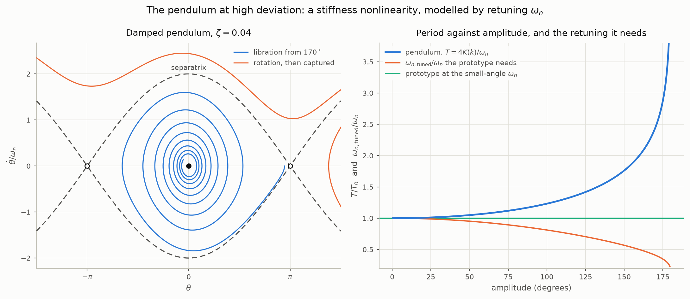
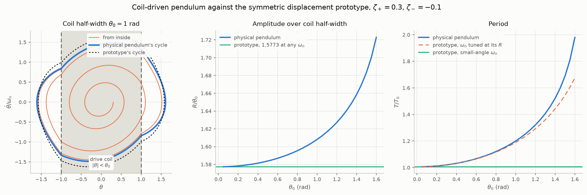

# Examples: the prototypes as physical systems

`README.md` develops the second order nonlinear prototype as a family of
piecewise linear oscillators whose **damping ratio** switches across a
boundary in the phase plane. This file takes each prototype and finds a
physical system it models, using the README's notation throughout:
$`x_1 = x`$, $`x_2 = \dot{x}`$, $`\zeta_{\pm}`$ for the damping ratio on
either side of the boundary, $`\bar{\zeta} = (\zeta_{+} + \zeta_{-})/2`$,
and $`\Sigma`$ for the boundary. Every number quoted is produced by
`python3 examples.py`, which also writes the figures.

| prototype (README section) | boundary | physical example here |
| --- | --- | --- |
| linear prototype | none | the pendulum at small angles; Maxwell's linearised governor |
| switched damping on the x-axis | $`\dot{x} = 0`$, through the equilibrium | a true governor with a one-sided flyball brake |
| offset boundary | $`\dot{x} = v_0`$ | an overspeed brake on a synchronised machine, set above synchronous speed |
| symmetric band in velocity | $`\lvert\dot{x}\rvert = v_0`$ | a governor deadband |
| symmetric band in displacement | $`\lvert x\rvert = x_0`$ | a pendulum sustained by a drive coil; a transistor LC oscillator |
| asymmetric boundary in displacement | $`x = x_0`$ | a driven pendulum with an eddy current plate on one side |
| overdamped regions | as above | a brake strong enough to overdamp its half plane |
| linear prototype, $`\omega_n`$ tuned to the amplitude | none | the pendulum at high deviation |

The prototypes are used exactly as the README defines them. Their
structure is never altered; only their parameters are tuned. Each
physical system below is either one of the prototypes outright, or is
integrated on its own as the reference that a prototype with tuned
parameters is compared against. The pendulum at high deviation is the
case that tests this discipline, because its nonlinearity is in the
restoring torque rather than the damping, and the only handle the
prototypes offer on it is $`\omega_n`$.

## The linear prototype: the pendulum at small angles

A pendulum of length $`l`$ with viscous damping $`c_\theta`$ and drive
torque $`\tau`$:

```math
m l^2\ddot{\theta} + c_\theta\dot{\theta} + m g l\sin\theta = \tau(t)
```

For small angles $`\sin\theta \simeq \theta`$ and this is the README's
linear prototype with

```math
\omega_n = \sqrt{\frac{g}{l}}, \qquad
\zeta = \frac{c_\theta}{2 m l^2\omega_n} = \frac{c_\theta}{2 m l\sqrt{g l}}
```

Maxwell's governor, linearised as he linearised it, is the other
instance and is taken up next.

## Maxwell's governor: the velocity-switched family

Maxwell's *On Governors* (1868) writes the engine as a moment of inertia
$`M`$ turning through an angle $`x`$ under a driving torque $`P`$ and a
resistance $`R`$, with a flyball mechanism that applies a liquid-friction
brake proportional to the excess of the speed over the set speed $`V`$,
and a *governor* proper that adjusts the driving power through an
accumulated motion $`y`$:

```math
M\ddot{x} = P - R - F\left(\dot{x} - V\right) - G y
```

Two things in that equation matter here.

The brake acts on the **relative** speed $`\dot{x} - V`$. That is exactly
the form the README had to choose, for a different reason, to keep the
offset boundary continuous: damping that acts on $`w = \dot{x} - v_0`$
vanishes on the boundary, so the two fields agree there and nothing
slides. In the governor it is simply what a flyball does — the friction
grows with how far the speed is above the set point.

And the brake is **one-sided**. A centrifugal piece pressed against a
friction surface can only press; below $`V`$ it is held clear by its
spring and there is no friction at all. Maxwell treated the friction as
acting for either sign of $`\dot{x} - V`$, which is what made his
analysis linear. The prototype keeps the switch he dropped:

```math
\text{brake} = F\,(\dot{x} - V)^{+} =
\begin{cases} F(\dot{x} - V) & \dot{x} \gt V \\ 0 & \dot{x} \lt V \end{cases}
```

Two more modelling choices reduce Maxwell's third order system to the
README's second order one. The accumulated motion is taken to be the
integrated speed error itself, $`\dot{y} = \dot{x} - V`$, so that
$`G y = G(x - Vt)`$ up to a constant; this is the defining property of
what Maxwell called a governor as opposed to a moderator, that the
speed is brought back to exactly $`V`$. And the net torque is allowed to
depend on speed, $`P - R = T_0 + c\,(\dot{x} - V)`$, with $`c \gt 0`$ for
an engine that runs faster the faster it goes — a self-excited machine,
the case a governor exists to tame.

The three configurations below are numerically normalised with
$`M = G = 1`$ (or $`M = K = 1`$), so that $`\omega_n = 1`$ and

```math
\zeta_{+} = \frac{F - c}{2}, \qquad \zeta_{-} = -\frac{c}{2}
```

In physical units both denominators are $`2\sqrt{MG}`$.

### A true governor with a one-sided brake: the boundary through the equilibrium

In the frame moving at the set speed, $`\xi = x - Vt - T_0/G`$:

```math
M\ddot{\xi} + \left[F\,H(\dot{\xi}) - c\right]\dot{\xi} + G\xi = 0
```

with $`H`$ the unit step. The equilibrium is $`\xi = \dot{\xi} = 0`$,
that is $`\dot{x} = V`$ exactly, and the brake switches on
$`\dot{\xi} = 0`$: the boundary passes **through the equilibrium**. This
is the README's first nonlinear prototype, switched damping on the
x-axis, with $`\zeta_{+} = (F - c)/(2\sqrt{MG})`$ on the braked side and
$`\zeta_{-} = -c/(2\sqrt{MG})`$ on the free side.

Everything the README derived for that prototype now reads as a
statement about governors:

- **Stability is decided by the mean damping**, $`\bar{\zeta} \gt 0`$,
  which here is $`F \gt 2c`$.
  Maxwell's linear analysis of the same reduced system gives $`F \gt c`$.
  The one-sided brake needs to be **twice** as strong, because it acts for
  only half of each hunt. At $`F = c`$, which the linear analysis calls
  marginal, the hunt grows by a factor $`2.69`$ per cycle.
- **There is no limit cycle.** However the brake is set, the hunt either
  dies away or grows without bound; the speed cannot settle into a
  sustained oscillation about $`V`$. The next section shows what has to
  change for it to do so.
- **A one-sided brake on a naturally damped engine** ($`c = 0`$) decays
  by $`e^{-\delta(\zeta_{+})}`$ per cycle rather than
  $`e^{-2\delta(\zeta_{+})}`$: at $`\zeta_{+} = 0.3`$ that is $`0.372`$
  against $`0.139`$.

Integrated, with the amplitude ratio per full cycle against the README's
closed form $`e^{-(\delta(\zeta_{+}) + \delta(\zeta_{-}))}`$:

| $`F`$ | $`c`$ | $`\zeta_{+}`$ | $`\zeta_{-}`$ | ratio per cycle | closed form | |
| --- | --- | --- | --- | --- | --- | --- |
| 0.6 | 0 | 0.30 | 0 | 0.372326 | 0.372326 | decays |
| 0.3 | 0.2 | 0.05 | $`-0.10`$ | 1.171712 | 1.171712 | grows |
| 0.4 | 0.2 | 0.10 | $`-0.10`$ | 1.000000 | 1.000000 | neutral, $`F = 2c`$ |
| 0.8 | 0.2 | 0.30 | $`-0.10`$ | 0.510562 | 0.510562 | decays |
| 0.6 | 0.6 | 0 | $`-0.30`$ | 2.685818 | 2.685818 | grows, $`F = c`$ |

The README's complete classification covers the strong-brake and
strongly self-excited corners too, and integration agrees at each:

| $`F`$ | $`c`$ | $`\zeta_{+}`$ | $`\zeta_{-}`$ | outcome |
| --- | --- | --- | --- | --- |
| 2.4 | 0.4 | 1.0 | $`-0.2`$ | decays — the braked half plane is critically damped and captures everything |
| 2.8 | 0.4 | 1.2 | $`-0.2`$ | decays — a decaying sector, however self-excited the free side |
| 3.0 | 2.4 | 0.3 | $`-1.2`$ | escapes — the free engine runs away without oscillating |
| 4.8 | 2.4 | 1.2 | $`-1.2`$ | mixed — the outcome depends on the initial hunt |

The overdamped-brake rows are the physical content of the README's
*overdamped regions* section: a brake strong enough to stop the braked
half plane oscillating captures every trajectory, whatever the engine
does on the other side, provided the engine is not itself overdamped in
the unstable direction ($`c \lt 2\sqrt{MG}`$).

### An overspeed brake on a synchronised machine: the offset boundary

For the boundary to leave the equilibrium, the restoring torque must be
referenced to something other than the set speed. A machine
**synchronised to a grid** is the natural case: its rotor angle
$`\delta`$, measured from a frame turning at the synchronous speed
$`\omega_s`$, feels a synchronising torque $`K\delta`$, and its
equilibrium speed is $`\omega_s`$ whatever the governor is set to. Put
the same one-sided brake on it, set to bite at
$`V = \omega_s + v_0`$, and keep the self-excitation $`c`$:

```math
M\ddot{\delta} = -K\delta + c\,\dot{\delta} - F\,(\dot{\delta} - v_0)^{+}
```

This is the README's offset boundary prototype. The README writes the
lower region's damping on $`w`$ as well, which differs from the form
above by the constant $`c\,v_0`$ in both regions; the shift
$`x = \delta - c\,v_0/K`$ absorbs it, and moves the README's equilibrium
$`x^{*} = 2\zeta_{-}v_0/\omega_n`$ to $`\delta = 0`$. The machine at
synchronous speed on its load angle is the equilibrium, and the brake
threshold sits a distance $`v_0`$ above it in the speed direction.

The README's existence condition $`\zeta_{-} \lt 0 \lt \bar{\zeta}`$ is
$`c \gt 0`$ and $`F \gt 2c`$ again, and now it is the condition for a
**sustained hunt**:

| $`F`$ | $`c`$ | $`\zeta_{+}`$ | $`\zeta_{-}`$ | $`\bar{\zeta}`$ | hunting amplitude $`r^{*}/v_0`$ | period $`T\omega_n`$ |
| --- | --- | --- | --- | --- | --- | --- |
| 0.8 | 0.2 | 0.30 | $`-0.10`$ | $`+0.100`$ | 2.1507 | 6.3671 |
| 0.5 | 0.2 | 0.15 | $`-0.10`$ | $`+0.025`$ | 5.4265 | 6.3299 |
| 1.2 | 0.2 | 0.50 | $`-0.10`$ | $`+0.200`$ | 1.5994 | 6.4049 |
| 0.3 | 0.2 | 0.05 | $`-0.10`$ | $`-0.025`$ | grows unbounded | |
| 0.8 | 0.6 | 0.10 | $`-0.30`$ | $`-0.100`$ | grows unbounded | |

Read as engineering:

- **The brake does not stabilise the machine; it caps the hunt.** Small
  swings grow because of the self-excitation; once they reach $`v_0`$ the
  brake bites on the fast part of each swing, and the amplitude settles
  where the two balance.
- **The hunting amplitude is exactly proportional to the brake margin**
  $`v_0 = V - \omega_s`$, by the README's scaling argument. Setting the
  brake closer to synchronous shrinks the hunt in proportion; setting it
  *at* synchronous ($`v_0 = 0`$) recovers the previous section, where the
  hunt decays. The margin is the unfolding parameter.
- **The hunting frequency is set by the damping ratios alone**, a little
  below $`\omega_n = \sqrt{K/M}`$, and does not move when the margin is
  changed.
- **Weaker braking hunts harder and slower**: $`F = 0.5`$ gives two and a
  half times the amplitude of $`F = 0.8`$.
- Below $`F = 2c`$ the swings grow without bound. In the linearised swing
  equation that is loss of synchronism — and the full swing equation has
  $`\sin\delta`$ in place of $`K\delta`$, which is the pendulum at high
  deviation of the next section.

### A governor deadband: the symmetric band

Real governors have a deadband: no action within $`\pm v_0`$ of the set
speed, proportional action beyond it. With the set speed at synchronous:

```math
M\ddot{\delta} = -K\delta + c\,\dot{\delta} - F\,\mathrm{dz}_{v_0}(\dot{\delta})
```

with $`\mathrm{dz}`$ the README's deadzone function. This is the
symmetric band prototype exactly, and the README's result that the mean
damping drops out of the existence condition is the statement that a
deadband governor sustains a hunt whenever

```math
F \gt c
```

rather than $`F \gt 2c`$, because far outside the band the governor acts
on both halves of the swing:

| $`F`$ | $`c`$ | $`\zeta_{+}`$ | $`\zeta_{-}`$ | one-sided brake | deadband: $`r^{*}/v_0`$ | $`T\omega_n`$ |
| --- | --- | --- | --- | --- | --- | --- |
| 0.8 | 0.2 | 0.30 | $`-0.10`$ | hunts at 2.1507 | 1.5895 | 6.3194 |
| 0.8 | 0.6 | 0.10 | $`-0.30`$ | grows unbounded | 5.0741 | 6.3032 |
| 0.7 | 0.6 | 0.05 | $`-0.30`$ | grows unbounded | 8.9007 | 6.2893 |

The middle row is the wedge in the README's existence figure: the same
brake that lets a one-sided arrangement run away holds a deadband
arrangement to a bounded hunt. The price is that the deadband hunt is
never absent — for any $`c \gt 0`$ the machine oscillates at an
amplitude proportional to the half-width of the band. Governor deadband
as a source of sustained small frequency oscillations is a known effect
in power systems, and this is its second order prototype.

<picture>
  <source media="(prefers-color-scheme: dark)" srcset="figures/example-governor-dark.png">
  
</picture>

*Left: a true governor with a one-sided brake ($`c = 0.2`$) — the hunt decays for $`F \gt 2c`$, is neutral at $`F = 2c`$ and grows below it, and never settles into a cycle. Middle: the same brake set $`v_0`$ above synchronous on a synchronised machine — a small hunt grows until the brake bites (shaded) and then holds a cycle. Right: a deadband at synchronous speed holds a cycle at a smaller amplitude.*

### Summary of the governor family

| configuration | boundary | prototype | sustained hunt when | amplitude |
| --- | --- | --- | --- | --- |
| true governor, one-sided brake | $`\dot{x} = V`$, through the equilibrium | switched damping on the x-axis | never | decays if $`F \gt 2c`$, else grows |
| overspeed brake above synchronous | $`\dot{\delta} = v_0`$ | offset boundary | $`c \gt 0`$ and $`F \gt 2c`$ | $`\propto v_0`$, e.g. $`2.15\,v_0`$ |
| deadband at synchronous | $`\lvert\dot{\delta}\rvert = v_0`$ | symmetric band | $`c \gt 0`$ and $`F \gt c`$ | $`\propto v_0`$, e.g. $`1.59\,v_0`$ |

Maxwell's own distinction between a *moderator* and a *governor* is the
distinction between the offset boundary and the boundary through the
equilibrium: a governor forces the equilibrium speed onto the set point,
a moderator leaves them apart, and the gap between them is what the
README calls $`v_0`$.

## The pendulum at high deviation

Back to the pendulum, without the small-angle approximation and with
$`\omega_n = \sqrt{g/l}`$:

```math
\ddot{\theta} + 2\zeta\omega_n\dot{\theta} + \omega_n^2\sin\theta = 0
```

### What kind of nonlinearity it is

Every prototype in the README keeps $`\omega_n`$ fixed and switches
$`\zeta`$. The pendulum does the opposite: its damping is linear, and
its restoring torque is a smooth, softening function of the
displacement. There is no switching boundary anywhere in the phase
plane, and with $`\zeta \gt 0`$ every libration decays to the bottom and
every rotation is eventually captured into a well. Nothing in the
pendulum can produce a limit cycle; it dissipates energy and has no way
to feed it back. Its period is

```math
T = \frac{4}{\omega_n}K(k), \qquad k = \sin\frac{\theta_{\max}}{2}
```

with $`K`$ the complete elliptic integral of the first kind, and it
diverges logarithmically as the amplitude approaches the inverted
position, because the separatrix through $`(\pm\pi, 0)`$ passes through
a saddle.

### What the prototype can do with it: tune $`\omega_n`$

The prototype's stiffness is linear and stays linear. The one parameter
that touches the pendulum's amplitude dependence is $`\omega_n`$ itself,
so the prototype models the pendulum at a given amplitude by being
retuned to that amplitude:

```math
\omega_{n,\text{tuned}}(\theta_{\max}) = \frac{2\pi}{T(\theta_{\max})}
= \frac{\pi\,\omega_n}{2K(k)}
```

This makes the prototype's period exact at the amplitude it is tuned
for, and its orbit an ellipse of the right period through the right
turning point. The retuning is not small at high deviation:

| amplitude | $`T/T_0`$, exact and integrated | $`\omega_{n,\text{tuned}}/\omega_n`$ |
| --- | --- | --- |
| $`10^\circ`$ | 1.0019 | 0.9981 |
| $`30^\circ`$ | 1.0174 | 0.9829 |
| $`60^\circ`$ | 1.0732 | 0.9318 |
| $`90^\circ`$ | 1.1803 | 0.8472 |
| $`120^\circ`$ | 1.3729 | 0.7284 |
| $`150^\circ`$ | 1.7622 | 0.5675 |
| $`170^\circ`$ | 2.4394 | 0.4099 |
| $`179^\circ`$ | 3.9011 | 0.2563 |

What the tuned prototype captures is the period and the timescale of
the decay at one amplitude. What it cannot capture, at any tuning, is
the amplitude dependence *within* a single decaying swing — every orbit
of the prototype has the same period, so a pendulum ringing down from
$`150^\circ`$ to $`10^\circ`$ passes through a range of tunings and no
single one follows it — and the separatrix, the saddles at $`\pm\pi`$
and the rotations beyond them, none of which a linear stiffness has.

<picture>
  <source media="(prefers-color-scheme: dark)" srcset="figures/example-pendulum-dark.png">
  
</picture>

*Left: the damped pendulum. A libration from $`170^\circ`$ decays to the bottom; a rotation loses energy until it is captured by a well. The separatrix through the saddles at $`\pm\pi`$ has no counterpart in a prototype. Right: period against amplitude, the prototype at the small-angle $`\omega_n`$ (flat), and the ratio by which $`\omega_n`$ has to be lowered for the prototype to match at each amplitude.*

### Verdict

The pendulum at high deviation is not one of the switched damping
prototypes and cannot be made one: its nonlinearity is a smooth
softening stiffness with no boundary and no energy source. The
prototypes model it the one way their fixed structure allows, by
retuning $`\omega_n`$ to the operating amplitude, and that is exact for
the period at that amplitude and blind to everything that varies with
amplitude. The next section puts a damping switch on the pendulum, where
the prototypes apply directly and the retuning is all that high
deviation asks of them.

## Switched damping on a pendulum: the displacement-switched pair

Viscous damping localised in *position* is easy to build with a magnet
on the bob. A coil under the rest position senses the bob's velocity as
an induced voltage and, driven back through the coil, pushes with a
force proportional to that velocity — negative viscous damping that
exists only while the magnet is over the coil, $`\lvert\theta\rvert \lt \theta_0`$.
A copper plate does the reverse: eddy currents brake the magnet with a
force proportional to velocity, only while it is over the plate. Both
are switched on displacement and both are proportional to velocity,
which is exactly what the README's displacement models assume.

### A drive coil under the rest position: the symmetric model

With air damping $`\zeta_a`$ everywhere and the coil's negative damping
$`\zeta_d \gt \zeta_a`$ inside the band:

```math
\ddot{\theta} + 2\zeta(\theta)\,\omega_n\dot{\theta} + \omega_n^2\sin\theta = 0,
\qquad
\zeta(\theta) =
\begin{cases}
\zeta_{-} = \zeta_a - \zeta_d \lt 0 & \lvert\theta\rvert \lt \theta_0 \\
\zeta_{+} = \zeta_a \gt 0 & \lvert\theta\rvert \gt \theta_0
\end{cases}
```

This is the README's symmetric displacement model — the piecewise
constant Van der Pol — with the pendulum's $`\sin\theta`$ in place of the
prototype's linear stiffness. The prototype is not changed to match it.
Instead the physical pendulum is integrated as the reference, and the
prototype models it with its structure intact: for $`\zeta_{+} = 0.3`$,
$`\zeta_{-} = -0.1`$ it predicts a cycle of amplitude
$`R = 1.5773\,\theta_0`$ whatever $`\omega_n`$ is, and a period of
$`6.3194/\omega_n`$, with $`\omega_n`$ tuned to the amplitude it has
just predicted, as in the previous section:

| $`\theta_0`$ (rad) | pendulum $`R`$ (rad) | $`R/\theta_0`$ | pendulum $`T\omega_n`$ | prototype, tuned at $`1.5773\,\theta_0`$ | error |
| --- | --- | --- | --- | --- | --- |
| 0.1 | 0.1578 | 1.5775 | 6.3293 | 6.3292 | 0.00% |
| 0.4 | 0.6326 | 1.5814 | 6.4829 | 6.4803 | $`-0.04\%`$ |
| 0.8 | 1.2763 | 1.5954 | 7.0385 | 7.0124 | $`-0.37\%`$ |
| 1.0 | 1.6080 | 1.6080 | 7.5393 | 7.4701 | $`-0.92\%`$ |
| 1.2 | 1.9526 | 1.6272 | 8.2984 | 8.1184 | $`-2.2\%`$ |
| 1.4 | 2.3219 | 1.6585 | 9.5600 | 9.0586 | $`-5.2\%`$ |
| 1.6 | 2.7565 | 1.7228 | 12.4388 | 10.5203 | $`-15\%`$ |
| 1.68 | 3.0045 | 1.7884 | | | |
| 1.72 | over the top | | | | |

- **The amplitude rule survives.** The prototype's $`R = 1.5773\,\theta_0`$
  is within 2% of the pendulum up to $`R \approx 1.6`$ rad ($`92^\circ`$)
  and within 5% up to $`2.3`$ rad ($`133^\circ`$). The energy balance
  that sets the amplitude cares about *where* the orbit crosses the band,
  and the softening stiffness moves that only slowly.
- **The tuned period holds to 1% up to $`92^\circ`$**, then fails
  quickly, because the prototype's slight under-prediction of the
  amplitude is fed into a period that is very steep in amplitude near
  the top. Tuned at the pendulum's *measured* amplitude instead, the
  prototype's period is within about 1% all the way to $`158^\circ`$ — the two
  slowings, the pendulum's and the damping switch's, compound almost
  independently — but that is no longer a prediction.
- **The cycle survives to within eight degrees of the top**,
  $`R = 172^\circ`$ at $`\theta_0 = 1.68`$.
- **Then it goes over.** Between $`\theta_0 = 1.68`$ and $`1.72`$ the
  amplitude the energy balance demands exceeds $`\pi`$, and the pendulum
  rotates instead. No tuning of the prototype represents this: a linear
  spring can always be stretched further.

<picture>
  <source media="(prefers-color-scheme: dark)" srcset="figures/example-driven-pendulum-dark.png">
  
</picture>

*Left: coil half-width one radian. The pendulum's cycle is fatter in displacement and flatter in velocity than the prototype's, as a softening spring should be. Middle and right: amplitude over coil half-width, and period, against the half-width. The prototype's amplitude rule is flat and close; its period is flat at the small-angle $`\omega_n`$ and follows the pendulum once retuned at its own predicted amplitude, up to about a radian.*

### An eddy current plate on one side: the asymmetric model

Give the pendulum negative damping everywhere — a drive with velocity
feedback, or a coil spanning the swing — and put the copper plate on one
side only, beyond $`\theta_0`$. That is the README's asymmetric
displacement model, which at $`\zeta_{+} = 0.3`$, $`\zeta_{-} = -0.1`$
predicts amplitude $`2.5090\,\theta_0`$ on the plate side and period
$`6.3671/\omega_n`$. Against the physical pendulum, with the prototype
again tuned at its own predicted amplitude:

| $`\theta_0`$ (rad) | $`R_{+}`$ (plate side) | $`R_{-}`$ (free side) | $`R_{+}/\theta_0`$ | pendulum $`T\omega_n`$ | prototype, tuned | error |
| --- | --- | --- | --- | --- | --- | --- |
| 0.1 | 0.2511 | $`-0.2546`$ | 2.5108 | 6.3929 | 6.3922 | $`-0.01\%`$ |
| 0.4 | 1.0156 | $`-1.0333`$ | 2.5391 | 6.8178 | 6.7927 | $`-0.37\%`$ |
| 0.8 | 2.1537 | $`-2.2523`$ | 2.6921 | 9.1525 | 8.4815 | $`-7.3\%`$ |
| 0.9 | 2.5452 | $`-2.8105`$ | 2.8280 | 11.9217 | 9.3158 | $`-22\%`$ |
| 0.92 | over the top | | | | | |

The same picture, with two differences. The cycle is no longer
symmetric: the free side swings further than the plate side, and it is
the free side that reaches the top first — at $`\theta_0 = 0.9`$ the
plate side is at $`146^\circ`$ while the free side is at $`161^\circ`$.
And the one-sided arrangement needs a larger amplitude per unit of
$`\theta_0`$ to balance its energy (the plate only works half the time),
so it goes over the top at about half the half-width the coil does, and
the tuned prototype loses accuracy correspondingly sooner.

## A transistor LC oscillator: saturation as the switch

A single NPN transistor across an LC tank, fed back through a tickler
winding (the Armstrong or Meissner arrangement), is Van der Pol's triode
oscillator with the valve replaced. Write the tank voltage as $`v`$, the
tank's loss as a parallel conductance $`G`$, and the current the
transistor feeds back into the tank as $`f(v)`$. Kirchhoff's current law
at the tank, differentiated once:

```math
C\ddot{v} + \left[G - f'(v)\right]\dot{v} + \frac{v}{L} = 0
```

The transistor's incremental gain $`f'(v)`$ appears as **negative
damping**, and its collapse outside the linear range is what limits the
amplitude — the "nonlinear gain" of the transistor is a damping
nonlinearity in $`v`$, and it is switched on displacement. The
hard-switched version, gain $`g_m`$ inside $`\lvert v\rvert \lt v_0`$ and
zero beyond it (cut off on one side, saturated on the other), is the
README's symmetric displacement model with

```math
\zeta_{+} = \frac{1}{2Q}, \qquad
\zeta_{-} = \frac{1 - A}{2Q}, \qquad
Q = \frac{\omega_0 C}{G}, \quad A = \frac{g_m}{G}, \quad
\omega_0 = \frac{1}{\sqrt{LC}}
```

$`A`$ is the small-signal loop gain. The README's existence condition
$`\zeta_{-} \lt 0 \lt \zeta_{+}`$ is $`A \gt 1`$ and $`G \gt 0`$: the
oscillator starts whenever the loop gain exceeds one (Barkhausen), and
the tank's own loss is what stops it, with no condition on the mean.
The README's energy balance gives the amplitude directly:

```math
2\phi - \sin 2\phi = \pi\rho, \qquad \rho = 1 - \frac{1}{A}, \qquad
R = \frac{v_0}{\cos\phi}
```

For large loop gain this tends to $`R \to (4/\pi)\,A\,v_0`$, the
describing-function result for a hard limiter: $`R/(A v_0)`$ runs
$`1.268,\ 1.272,\ 1.273`$ at $`A = 5, 10, 20`$ against
$`4/\pi = 1.2732`$.

Real saturation is smooth. Integrating the same circuit with
$`f(v) = I_0\tanh(g_m v/I_0)`$ — the same small-signal gain and the same
saturation current, so $`v_0 = I_0/g_m`$ — measures what the hard switch
costs:

| $`Q`$ | $`A`$ | $`\zeta_{+}`$ | $`\zeta_{-}`$ | $`R/v_0`$, clip | energy balance | $`R/v_0`$, tanh | $`T\omega_0`$, clip | $`T\omega_0`$, tanh |
| --- | --- | --- | --- | --- | --- | --- | --- | --- |
| 10 | 1.5 | 0.050 | $`-0.025`$ | 1.8075 | 1.8074 | 1.5284 | 6.28470 | 6.28374 |
| 10 | 2 | 0.050 | $`-0.050`$ | 2.4757 | 2.4754 | 2.3164 | 6.28591 | 6.28461 |
| 10 | 3 | 0.050 | $`-0.100`$ | 3.7751 | 3.7746 | 3.6949 | 6.28736 | 6.28607 |
| 10 | 5 | 0.050 | $`-0.200`$ | 6.3409 | 6.3397 | 6.2995 | 6.28870 | 6.28773 |
| 3 | 2 | 0.167 | $`-0.167`$ | 2.4782 | 2.4754 | 2.3173 | 6.31361 | 6.29904 |
| 3 | 5 | 0.167 | $`-0.667`$ | 6.3534 | 6.3397 | 6.3093 | 6.34510 | 6.33398 |

- **The switch overestimates the amplitude near threshold** — by 18% at
  $`A = 1.5`$ — because a smooth characteristic loses gain before the
  clip does. By $`A = 3`$ the two agree within 2%, and by $`A = 5`$
  within 1%. A hard-switched gain is a good model of a transistor
  oscillator running with reasonable loop gain, and a poor one just
  above start-up.
- **The frequency is barely touched.** Both run within a few hundredths
  of a percent of each other, and both a little *below* $`\omega_0`$,
  as the README's "always slower than $`\omega_n`$" result requires; at
  $`Q = 3`$ the switched version is 1% slow and the smooth one 0.8%.
- **The energy balance is exact for the clip** to four figures at
  $`Q = 10`$, because the orbit is nearly circular; at $`Q = 3`$ it is
  within about 0.2%.

<picture>
  <source media="(prefers-color-scheme: dark)" srcset="figures/example-oscillator-dark.png">
  
</picture>

*Left: $`Q = 10`$, loop gain 3. Start-up from a small disturbance spirals out through the transistor's linear band and settles on the cycle; the clipped and tanh characteristics give almost the same orbit. Right: amplitude against loop gain, with the README's energy balance following the clip exactly and the tanh model converging on it as the gain rises.*

The same prototype covers the Wien bridge, where the RC network makes
the circuit second order and the amplifier gain $`A_v`$ plays the role
of $`f'`$: $`\zeta = (3 - A_v)/2`$, negative while the amplifier is
linear with $`A_v \gt 3`$ and positive once it saturates.

## What fits and what does not

- **Velocity-switched damping is what a governor is.** Maxwell's brake
  term $`F(\dot{x} - V)`$ is the relative-velocity damping the README
  needed for continuity, its one-sidedness is the switch, and whether the
  set speed coincides with the equilibrium speed — Maxwell's governor
  versus moderator — is whether the boundary passes through the
  equilibrium. The one-sided brake needs $`F \gt 2c`$, a deadband only
  $`F \gt c`$.
- **Displacement-switched damping is what a saturating amplifier is**,
  and what a position-limited electromagnetic drive or brake is. The
  transistor oscillator's amplitude follows the README's energy balance
  and tends to the describing-function limit.
- **The pendulum at high deviation is not a prototype and cannot be
  made one.** Its nonlinearity is a smooth softening stiffness with no
  boundary and no energy source. With their structure kept fixed, the
  prototypes reach it only through $`\omega_n`$, retuned to the operating
  amplitude: exact for the period at that amplitude, blind to everything
  that varies with amplitude. Put a damping switch on the pendulum and
  the displacement-switched prototypes apply directly — the amplitude
  rule holds to 2% up to $`92^\circ`$ and the retuned period to 1% —
  until the pendulum goes over the top, which no tuning represents.

## Reproducing the numbers

```
python3 examples.py
```

prints every table above, checking each integrated number against the
closed form or exact reduction that predicts it, and writes the four
figures in both themes to `figures/example-*.png`. It imports the
README's analysis modules (`frequency.py`, `symmetric.py`,
`displacement.py`, `stability.py`) and the plotting chrome from
`figures.py`, so the examples run on the same code as the prototypes.
