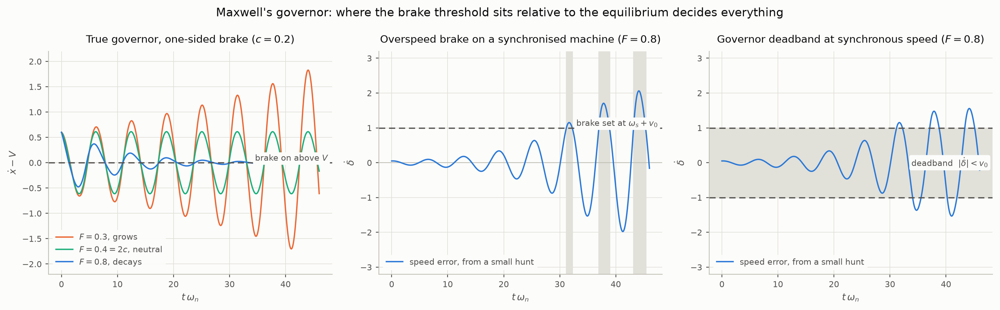
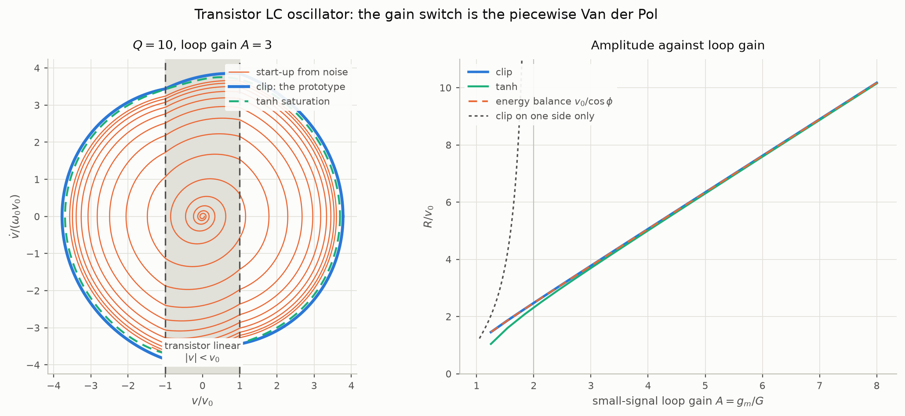

# Examples: the prototypes as physical systems

`README.md` develops the second order nonlinear prototype as a family of
piecewise linear oscillators whose **damping ratio** switches across a
boundary in the phase plane. This file takes each prototype and finds a
physical system it models, using the README's notation throughout:
$`x_1 = x`$, $`x_2 = \dot{x}`$, $`\zeta_{\pm}`$ for the damping ratio on
either side of the boundary, $`\bar{\zeta} = (\zeta_{+} + \zeta_{-})/2`$,
and $`\Sigma`$ for the boundary. Every number quoted is produced by
`python3 examples.py`, which also writes the figures.

| prototype (README section) | boundary | physical example here |
| --- | --- | --- |
| linear prototype | none | an LC tank with loss; Maxwell's linearised governor |
| switched damping on the x-axis | $`\dot{x} = 0`$, through the equilibrium | a true governor with a one-sided flyball brake |
| offset boundary | $`\dot{x} = v_0`$ | an overspeed brake on a synchronised machine, set above synchronous speed |
| symmetric band in velocity | $`\lvert\dot{x}\rvert = v_0`$ | a governor deadband |
| symmetric band in displacement | $`\lvert x\rvert = x_0`$ | a transistor LC oscillator clipping on both sides |
| asymmetric boundary in displacement | $`x = x_0`$ | the same oscillator clipping on one side only |
| overdamped regions | as above | a brake strong enough to overdamp its half plane |

The prototypes are used exactly as the README defines them. Their
structure is never altered; only their parameters are tuned to the
system in hand. Every example below is one of the prototypes outright.
Where a physical system has a smoother nonlinearity than the switch —
the transistor's saturation — it is integrated separately as the
reference the prototype is compared against, and the prototype is not
bent to meet it. Systems whose nonlinearity is not a damping switch,
the pendulum among them, are left for a prototype of their own.

## The linear prototype: an LC tank, and Maxwell's governor linearised

A parallel LC tank with loss conductance $`G`$, written for the tank
voltage $`v`$:

```math
C\ddot{v} + G\dot{v} + \frac{v}{L} = 0,
\qquad
\omega_0 = \frac{1}{\sqrt{LC}}, \quad \zeta = \frac{1}{2Q}, \quad Q = \frac{\omega_0 C}{G}
```

is the README's linear prototype with the quality factor standing in for
the damping ratio. The transistor oscillator below is this tank with its
loss switched. Maxwell's governor, linearised as he linearised it, is the
other instance and is taken up next: it is the linear prototype with
$`\omega_n = \sqrt{G/M}`$ and $`\zeta = (F - c)/(2\sqrt{MG})`$ in the
notation of the next section.

## Maxwell's governor: the velocity-switched family

Maxwell's *On Governors* (1868) writes the engine as a moment of inertia
$`M`$ turning through an angle $`x`$ under a driving torque $`P`$ and a
resistance $`R`$, with a flyball mechanism that applies a liquid-friction
brake proportional to the excess of the speed over the set speed $`V`$,
and a *governor* proper that adjusts the driving power through an
accumulated motion $`y`$:

```math
M\ddot{x} = P - R - F\left(\dot{x} - V\right) - G y
```

Two things in that equation matter here.

The brake acts on the **relative** speed $`\dot{x} - V`$. That is exactly
the form the README had to choose, for a different reason, to keep the
offset boundary continuous: damping that acts on $`w = \dot{x} - v_0`$
vanishes on the boundary, so the two fields agree there and nothing
slides. In the governor it is simply what a flyball does — the friction
grows with how far the speed is above the set point.

And the brake is **one-sided**. A centrifugal piece pressed against a
friction surface can only press; below $`V`$ it is held clear by its
spring and there is no friction at all. Maxwell treated the friction as
acting for either sign of $`\dot{x} - V`$, which is what made his
analysis linear. The prototype keeps the switch he dropped:

```math
\text{brake} = F\,(\dot{x} - V)^{+} =
\begin{cases} F(\dot{x} - V) & \dot{x} \gt V \\ 0 & \dot{x} \lt V \end{cases}
```

Two more modelling choices reduce Maxwell's third order system to the
README's second order one. The accumulated motion is taken to be the
integrated speed error itself, $`\dot{y} = \dot{x} - V`$, so that
$`G y = G(x - Vt)`$ up to a constant; this is the defining property of
what Maxwell called a governor as opposed to a moderator, that the
speed is brought back to exactly $`V`$. And the net torque is allowed to
depend on speed, $`P - R = T_0 + c\,(\dot{x} - V)`$, with $`c \gt 0`$ for
an engine that runs faster the faster it goes — a self-excited machine,
the case a governor exists to tame.

The three configurations below are numerically normalised with
$`M = G = 1`$ (or $`M = K = 1`$), so that $`\omega_n = 1`$ and

```math
\zeta_{+} = \frac{F - c}{2}, \qquad \zeta_{-} = -\frac{c}{2}
```

In physical units both denominators are $`2\sqrt{MG}`$.

### A true governor with a one-sided brake: the boundary through the equilibrium

In the frame moving at the set speed, $`\xi = x - Vt - T_0/G`$:

```math
M\ddot{\xi} + \left[F\,H(\dot{\xi}) - c\right]\dot{\xi} + G\xi = 0
```

with $`H`$ the unit step. The equilibrium is $`\xi = \dot{\xi} = 0`$,
that is $`\dot{x} = V`$ exactly, and the brake switches on
$`\dot{\xi} = 0`$: the boundary passes **through the equilibrium**. This
is the README's first nonlinear prototype, switched damping on the
x-axis, with $`\zeta_{+} = (F - c)/(2\sqrt{MG})`$ on the braked side and
$`\zeta_{-} = -c/(2\sqrt{MG})`$ on the free side.

Everything the README derived for that prototype now reads as a
statement about governors:

- **Stability is decided by the mean damping**, $`\bar{\zeta} \gt 0`$,
  which here is $`F \gt 2c`$.
  Maxwell's linear analysis of the same reduced system gives $`F \gt c`$.
  The one-sided brake needs to be **twice** as strong, because it acts for
  only half of each hunt. At $`F = c`$, which the linear analysis calls
  marginal, the hunt grows by a factor $`2.69`$ per cycle.
- **There is no limit cycle.** However the brake is set, the hunt either
  dies away or grows without bound; the speed cannot settle into a
  sustained oscillation about $`V`$. The next section shows what has to
  change for it to do so.
- **A one-sided brake on a naturally damped engine** ($`c = 0`$) decays
  by $`e^{-\delta(\zeta_{+})}`$ per cycle rather than
  $`e^{-2\delta(\zeta_{+})}`$: at $`\zeta_{+} = 0.3`$ that is $`0.372`$
  against $`0.139`$.

Integrated, with the amplitude ratio per full cycle against the README's
closed form $`e^{-(\delta(\zeta_{+}) + \delta(\zeta_{-}))}`$:

| $`F`$ | $`c`$ | $`\zeta_{+}`$ | $`\zeta_{-}`$ | ratio per cycle | closed form | |
| --- | --- | --- | --- | --- | --- | --- |
| 0.6 | 0 | 0.30 | 0 | 0.372326 | 0.372326 | decays |
| 0.3 | 0.2 | 0.05 | $`-0.10`$ | 1.171712 | 1.171712 | grows |
| 0.4 | 0.2 | 0.10 | $`-0.10`$ | 1.000000 | 1.000000 | neutral, $`F = 2c`$ |
| 0.8 | 0.2 | 0.30 | $`-0.10`$ | 0.510562 | 0.510562 | decays |
| 0.6 | 0.6 | 0 | $`-0.30`$ | 2.685818 | 2.685818 | grows, $`F = c`$ |

The README's complete classification covers the strong-brake and
strongly self-excited corners too, and integration agrees at each:

| $`F`$ | $`c`$ | $`\zeta_{+}`$ | $`\zeta_{-}`$ | outcome |
| --- | --- | --- | --- | --- |
| 2.4 | 0.4 | 1.0 | $`-0.2`$ | decays — the braked half plane is critically damped and captures everything |
| 2.8 | 0.4 | 1.2 | $`-0.2`$ | decays — a decaying sector, however self-excited the free side |
| 3.0 | 2.4 | 0.3 | $`-1.2`$ | escapes — the free engine runs away without oscillating |
| 4.8 | 2.4 | 1.2 | $`-1.2`$ | mixed — the outcome depends on the initial hunt |

The overdamped-brake rows are the physical content of the README's
*overdamped regions* section: a brake strong enough to stop the braked
half plane oscillating captures every trajectory, whatever the engine
does on the other side, provided the engine is not itself overdamped in
the unstable direction ($`c \lt 2\sqrt{MG}`$).

### An overspeed brake on a synchronised machine: the offset boundary

For the boundary to leave the equilibrium, the restoring torque must be
referenced to something other than the set speed. A machine
**synchronised to a grid** is the natural case: its rotor angle
$`\delta`$, measured from a frame turning at the synchronous speed
$`\omega_s`$, feels a synchronising torque $`K\delta`$, and its
equilibrium speed is $`\omega_s`$ whatever the governor is set to. Put
the same one-sided brake on it, set to bite at
$`V = \omega_s + v_0`$, and keep the self-excitation $`c`$:

```math
M\ddot{\delta} = -K\delta + c\,\dot{\delta} - F\,(\dot{\delta} - v_0)^{+}
```

This is the README's offset boundary prototype. The README writes the
lower region's damping on $`w`$ as well, which differs from the form
above by the constant $`c\,v_0`$ in both regions; the shift
$`x = \delta - c\,v_0/K`$ absorbs it, and moves the README's equilibrium
$`x^{*} = 2\zeta_{-}v_0/\omega_n`$ to $`\delta = 0`$. The machine at
synchronous speed on its load angle is the equilibrium, and the brake
threshold sits a distance $`v_0`$ above it in the speed direction.

The README's existence condition $`\zeta_{-} \lt 0 \lt \bar{\zeta}`$ is
$`c \gt 0`$ and $`F \gt 2c`$ again, and now it is the condition for a
**sustained hunt**:

| $`F`$ | $`c`$ | $`\zeta_{+}`$ | $`\zeta_{-}`$ | $`\bar{\zeta}`$ | hunting amplitude $`r^{*}/v_0`$ | period $`T\omega_n`$ |
| --- | --- | --- | --- | --- | --- | --- |
| 0.8 | 0.2 | 0.30 | $`-0.10`$ | $`+0.100`$ | 2.1507 | 6.3671 |
| 0.5 | 0.2 | 0.15 | $`-0.10`$ | $`+0.025`$ | 5.4265 | 6.3299 |
| 1.2 | 0.2 | 0.50 | $`-0.10`$ | $`+0.200`$ | 1.5994 | 6.4049 |
| 0.3 | 0.2 | 0.05 | $`-0.10`$ | $`-0.025`$ | grows unbounded | |
| 0.8 | 0.6 | 0.10 | $`-0.30`$ | $`-0.100`$ | grows unbounded | |

Read as engineering:

- **The brake does not stabilise the machine; it caps the hunt.** Small
  swings grow because of the self-excitation; once they reach $`v_0`$ the
  brake bites on the fast part of each swing, and the amplitude settles
  where the two balance.
- **The hunting amplitude is exactly proportional to the brake margin**
  $`v_0 = V - \omega_s`$, by the README's scaling argument. Setting the
  brake closer to synchronous shrinks the hunt in proportion; setting it
  *at* synchronous ($`v_0 = 0`$) recovers the previous section, where the
  hunt decays. The margin is the unfolding parameter.
- **The hunting frequency is set by the damping ratios alone**, a little
  below $`\omega_n = \sqrt{K/M}`$, and does not move when the margin is
  changed.
- **Weaker braking hunts harder and slower**: $`F = 0.5`$ gives two and a
  half times the amplitude of $`F = 0.8`$.
- Below $`F = 2c`$ the swings grow without bound. In the linearised swing
  equation that is loss of synchronism.

### A governor deadband: the symmetric band

Real governors have a deadband: no action within $`\pm v_0`$ of the set
speed, proportional action beyond it. With the set speed at synchronous:

```math
M\ddot{\delta} = -K\delta + c\,\dot{\delta} - F\,\mathrm{dz}_{v_0}(\dot{\delta})
```

with $`\mathrm{dz}`$ the README's deadzone function. This is the
symmetric band prototype exactly, and the README's result that the mean
damping drops out of the existence condition is the statement that a
deadband governor sustains a hunt whenever

```math
F \gt c
```

rather than $`F \gt 2c`$, because far outside the band the governor acts
on both halves of the swing:

| $`F`$ | $`c`$ | $`\zeta_{+}`$ | $`\zeta_{-}`$ | one-sided brake | deadband: $`r^{*}/v_0`$ | $`T\omega_n`$ |
| --- | --- | --- | --- | --- | --- | --- |
| 0.8 | 0.2 | 0.30 | $`-0.10`$ | hunts at 2.1507 | 1.5895 | 6.3194 |
| 0.8 | 0.6 | 0.10 | $`-0.30`$ | grows unbounded | 5.0741 | 6.3032 |
| 0.7 | 0.6 | 0.05 | $`-0.30`$ | grows unbounded | 8.9007 | 6.2893 |

The middle row is the wedge in the README's existence figure: the same
brake that lets a one-sided arrangement run away holds a deadband
arrangement to a bounded hunt. The price is that the deadband hunt is
never absent — for any $`c \gt 0`$ the machine oscillates at an
amplitude proportional to the half-width of the band. Governor deadband
as a source of sustained small frequency oscillations is a known effect
in power systems, and this is its second order prototype.

<picture>
  <source media="(prefers-color-scheme: dark)" srcset="figures/example-governor-dark.png">
  
</picture>

*Left: a true governor with a one-sided brake ($`c = 0.2`$) — the hunt decays for $`F \gt 2c`$, is neutral at $`F = 2c`$ and grows below it, and never settles into a cycle. Middle: the same brake set $`v_0`$ above synchronous on a synchronised machine — a small hunt grows until the brake bites (shaded) and then holds a cycle. Right: a deadband at synchronous speed holds a cycle at a smaller amplitude.*

### Summary of the governor family

| configuration | boundary | prototype | sustained hunt when | amplitude |
| --- | --- | --- | --- | --- |
| true governor, one-sided brake | $`\dot{x} = V`$, through the equilibrium | switched damping on the x-axis | never | decays if $`F \gt 2c`$, else grows |
| overspeed brake above synchronous | $`\dot{\delta} = v_0`$ | offset boundary | $`c \gt 0`$ and $`F \gt 2c`$ | $`\propto v_0`$, e.g. $`2.15\,v_0`$ |
| deadband at synchronous | $`\lvert\dot{\delta}\rvert = v_0`$ | symmetric band | $`c \gt 0`$ and $`F \gt c`$ | $`\propto v_0`$, e.g. $`1.59\,v_0`$ |

Maxwell's own distinction between a *moderator* and a *governor* is the
distinction between the offset boundary and the boundary through the
equilibrium: a governor forces the equilibrium speed onto the set point,
a moderator leaves them apart, and the gap between them is what the
README calls $`v_0`$.

## A transistor LC oscillator: saturation as the switch

A single NPN transistor across an LC tank, fed back through a tickler
winding (the Armstrong or Meissner arrangement), is Van der Pol's triode
oscillator with the valve replaced. Write the tank voltage as $`v`$, the
tank's loss as a parallel conductance $`G`$, and the current the
transistor feeds back into the tank as $`f(v)`$. Kirchhoff's current law
at the tank, differentiated once:

```math
C\ddot{v} + \left[G - f'(v)\right]\dot{v} + \frac{v}{L} = 0
```

The transistor's incremental gain $`f'(v)`$ appears as **negative
damping**, and its collapse outside the linear range is what limits the
amplitude — the "nonlinear gain" of the transistor is a damping
nonlinearity in $`v`$, and it is switched on displacement. The
hard-switched version, gain $`g_m`$ inside $`\lvert v\rvert \lt v_0`$ and
zero beyond it (cut off on one side, saturated on the other), is the
README's symmetric displacement model with

```math
\zeta_{+} = \frac{1}{2Q}, \qquad
\zeta_{-} = \frac{1 - A}{2Q}, \qquad
Q = \frac{\omega_0 C}{G}, \quad A = \frac{g_m}{G}, \quad
\omega_0 = \frac{1}{\sqrt{LC}}
```

$`A`$ is the small-signal loop gain. The README's existence condition
$`\zeta_{-} \lt 0 \lt \zeta_{+}`$ is $`A \gt 1`$ and $`G \gt 0`$: the
oscillator starts whenever the loop gain exceeds one (Barkhausen), and
the tank's own loss is what stops it, with no condition on the mean.
The README's energy balance gives the amplitude directly:

```math
2\phi - \sin 2\phi = \pi\rho, \qquad \rho = 1 - \frac{1}{A}, \qquad
R = \frac{v_0}{\cos\phi}
```

For large loop gain this tends to $`R \to (4/\pi)\,A\,v_0`$, the
describing-function result for a hard limiter: $`R/(A v_0)`$ runs
$`1.268,\ 1.272,\ 1.273`$ at $`A = 5, 10, 20`$ against
$`4/\pi = 1.2732`$.

Real saturation is smooth. Integrating the same circuit with
$`f(v) = I_0\tanh(g_m v/I_0)`$ — the same small-signal gain and the same
saturation current, so $`v_0 = I_0/g_m`$ — measures what the hard switch
costs:

| $`Q`$ | $`A`$ | $`\zeta_{+}`$ | $`\zeta_{-}`$ | $`R/v_0`$, clip | energy balance | $`R/v_0`$, tanh | $`T\omega_0`$, clip | $`T\omega_0`$, tanh |
| --- | --- | --- | --- | --- | --- | --- | --- | --- |
| 10 | 1.5 | 0.050 | $`-0.025`$ | 1.8075 | 1.8074 | 1.5284 | 6.28470 | 6.28374 |
| 10 | 2 | 0.050 | $`-0.050`$ | 2.4757 | 2.4754 | 2.3164 | 6.28591 | 6.28461 |
| 10 | 3 | 0.050 | $`-0.100`$ | 3.7751 | 3.7746 | 3.6949 | 6.28736 | 6.28607 |
| 10 | 5 | 0.050 | $`-0.200`$ | 6.3409 | 6.3397 | 6.2995 | 6.28870 | 6.28773 |
| 3 | 2 | 0.167 | $`-0.167`$ | 2.4782 | 2.4754 | 2.3173 | 6.31361 | 6.29904 |
| 3 | 5 | 0.167 | $`-0.667`$ | 6.3534 | 6.3397 | 6.3093 | 6.34510 | 6.33398 |

- **The switch overestimates the amplitude near threshold** — by 18% at
  $`A = 1.5`$ — because a smooth characteristic loses gain before the
  clip does. By $`A = 3`$ the two agree within 2%, and by $`A = 5`$
  within 1%. A hard-switched gain is a good model of a transistor
  oscillator running with reasonable loop gain, and a poor one just
  above start-up.
- **The frequency is barely touched.** Both run within a few hundredths
  of a percent of each other, and both a little *below* $`\omega_0`$,
  as the README's "always slower than $`\omega_n`$" result requires; at
  $`Q = 3`$ the switched version is 1% slow and the smooth one 0.8%.
- **The energy balance is exact for the clip** to four figures at
  $`Q = 10`$, because the orbit is nearly circular; at $`Q = 3`$ it is
  within about 0.2%.

<picture>
  <source media="(prefers-color-scheme: dark)" srcset="figures/example-oscillator-dark.png">
  
</picture>

*Left: $`Q = 10`$, loop gain 3. Start-up from a small disturbance spirals out through the transistor's linear band and settles on the cycle; the clipped and tanh characteristics give almost the same orbit. Right: amplitude against loop gain, with the README's energy balance following the clip exactly and the tanh model converging on it as the gain rises.*

### Clipping on one side only: the asymmetric model

A stage with plenty of headroom on one side of the swing and cutoff on
the other — a class A stage biased near cutoff, say — loses its gain at
one boundary only. Taking $`v`$ positive towards cutoff, the gain is
$`g_m`$ for $`v \lt v_0`$ and zero beyond, which is the README's
asymmetric displacement model with the same two damping ratios as
before. Its existence condition brings the mean back:

```math
\zeta_{-} \lt 0 \lt \bar{\zeta}
\qquad \Longleftrightarrow \qquad
1 \lt A \lt 2
```

A one-sided clip bounds the amplitude only while the loop gain is below
two, because the loss on the cutoff side has to pay for the gain on the
other over a whole cycle. The amplitude follows the README's asymmetric
energy balance, $`2\phi - \sin 2\phi = 2\pi\rho`$, and diverges as
$`A \to 2`$:

| $`A`$ | $`\zeta_{-}`$ | $`\bar{\zeta}`$ | $`R/v_0`$, integrated | energy balance | $`T\omega_0`$ |
| --- | --- | --- | --- | --- | --- |
| 1.2 | $`-0.010`$ | $`+0.020`$ | 1.8076 | 1.8074 | 6.28437 |
| 1.5 | $`-0.025`$ | $`+0.0125`$ | 3.7772 | 3.7746 | 6.28690 |
| 1.8 | $`-0.040`$ | $`+0.005`$ | 11.460 | 11.445 | 6.28944 |
| 1.95 | $`-0.048`$ | $`+0.0013`$ | 49.71 | 49.65 | 6.29066 |
| 2.5 | $`-0.075`$ | $`-0.0125`$ | grows unbounded | | |

all at $`Q = 10`$. Above $`A = 2`$ the swing grows until it runs out of
headroom on the conducting side too, at which point the stage is
clipping on both sides and the symmetric model above takes over. So a
real oscillator started with a large loop gain ends up in the symmetric
regime whatever its bias, and the one-sided model describes the low
gain, high headroom corner.

The same prototype covers the Wien bridge, where the RC network makes
the circuit second order and the amplifier gain $`A_v`$ plays the role
of $`f'`$: $`\zeta = (3 - A_v)/2`$, negative while the amplifier is
linear with $`A_v \gt 3`$ and positive once it saturates.

## What fits

- **Velocity-switched damping is what a governor is.** Maxwell's brake
  term $`F(\dot{x} - V)`$ is the relative-velocity damping the README
  needed for continuity, its one-sidedness is the switch, and whether the
  set speed coincides with the equilibrium speed — Maxwell's governor
  versus moderator — is whether the boundary passes through the
  equilibrium. The one-sided brake needs $`F \gt 2c`$, a deadband only
  $`F \gt c`$.
- **Displacement-switched damping is what a saturating amplifier is.**
  The transistor oscillator's amplitude follows the README's energy balance
  and tends to the describing-function limit; clipping on one side only
  is the asymmetric model, bounded only for loop gain below two.
- **What is left out.** The pendulum. At small angles it is only the
  linear prototype, and at large angles its nonlinearity is in the
  restoring torque, which none of these prototypes switches. It will get
  a prototype of its own.

## Reproducing the numbers

```
python3 examples.py
```

prints every table above, checking each integrated number against the
closed form or exact reduction that predicts it, and writes the two
figures in both themes to `figures/example-*.png`. It imports the
README's analysis modules (`frequency.py`, `symmetric.py`,
`displacement.py`, `stability.py`) and the plotting chrome from
`figures.py`, so the examples run on the same code as the prototypes.
