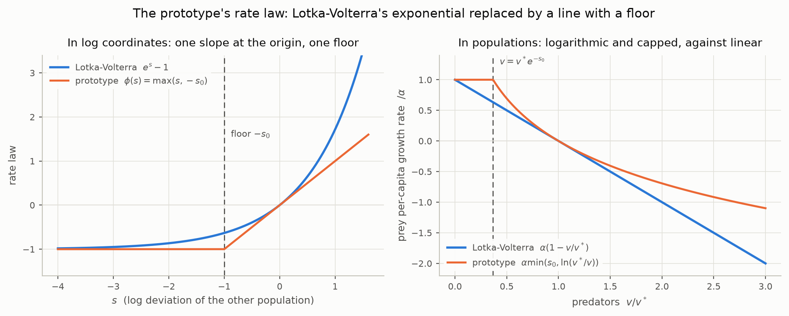
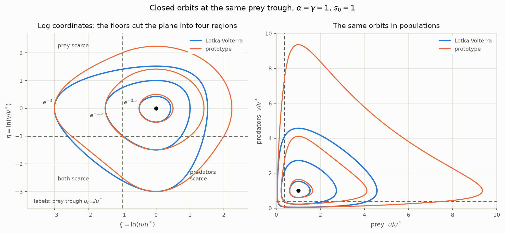
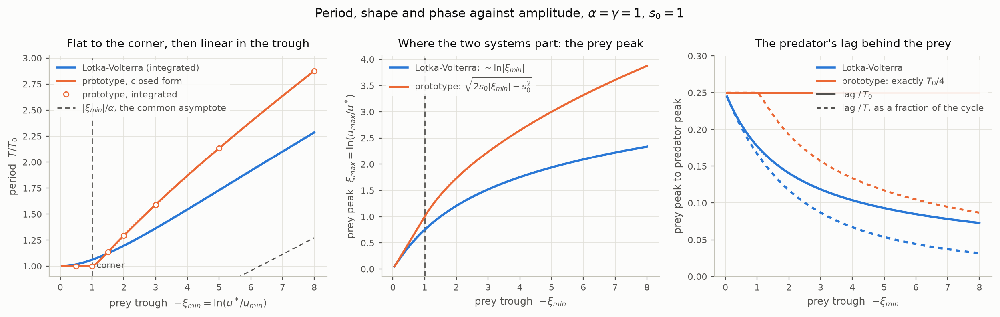
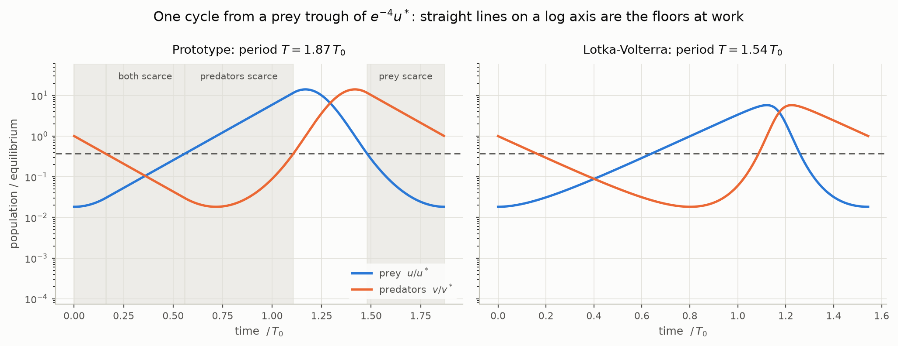
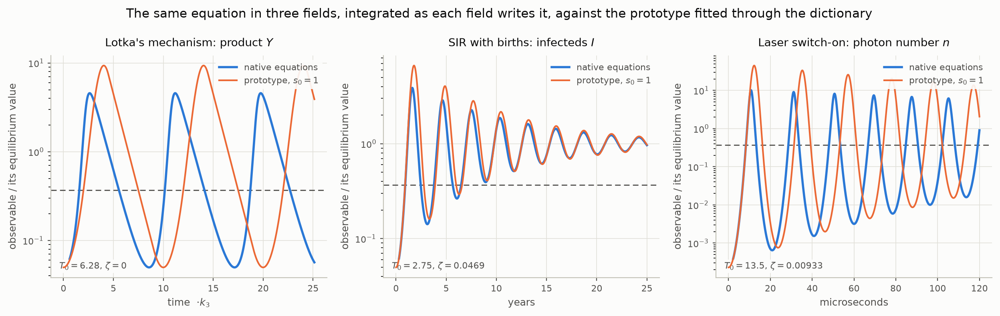
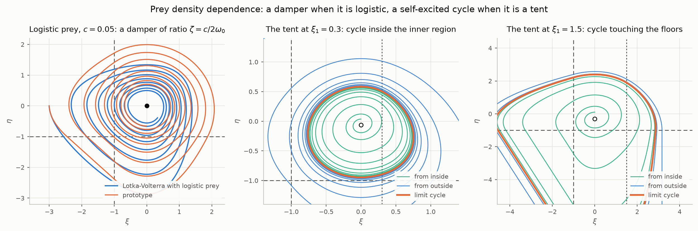

# The Lotka-Volterra prototype

A predator and its prey, each growing or dying at a rate set by the other,
with the rate laws made piecewise linear. It is the seventh prototype of
this repository and the first whose two states are not a position and a
velocity but two populations. Every earlier prototype is a second order
oscillator with one equilibrium; this one has one equilibrium too, but it
is a **centre**: a continuum of closed orbits with no isolated cycle, the
situation the README's marginal case $`\bar{\zeta} = 0`$ reached only on a
knife edge and this prototype has by construction, because it conserves a
quantity. Its period rises with amplitude, its orbits are lopsided in the
way real population cycles are, and the two additions that ecology makes
to Lotka-Volterra — the prey's own density dependence, and a hump in it —
turn out to be the damping and the switched damping of the earlier
prototypes seen in different coordinates. `lotka.py` carries the model,
its closed forms and its figures, and prints every number quoted here.

The same equation appears, under other names, in chemical kinetics, in
epidemiology, in laser physics and in economics; a section near the end
gives each field's version and the dictionary onto the prototype's
parameters, checked by integrating each equation as its own field writes
it.

What is established, in one paragraph. In log coordinates centred on the
equilibrium the prototype is Lotka-Volterra with the exponential replaced
by a straight line and a floor, so the plane falls into four regions with
a linear field in each, the field is continuous, and an energy is
conserved. The period of every orbit is an elementary sum of an arc of an
ellipse, two parabolic transits and a straight line, agreeing with direct
integration to $`10^{-10}`$; it is the linear period exactly until the
orbit reaches a floor, then rises linearly with the depth of the prey
trough with the same coefficient as Lotka-Volterra's. The predator's peak
lags the prey's by exactly a quarter of the small amplitude period at
every amplitude. Logistic growth of the prey is a linear damper on the
predator oscillator, with the damping ratio in closed form and the
equilibrium globally attracting. A hump in the prey's growth law gives a
limit cycle, and while that cycle stays within a factor $`e^{s_0}`$ of the
equilibrium it *is* the README's offset boundary cycle — the same
amplitude, period and multiplier to every digit printed.

## Parameters and units

Prey $`u`$ and predators $`v`$, with the interior equilibrium
$`(u^*, v^*)`$ and the log deviations $`\xi = \ln(u/u^*)`$,
$`\eta = \ln(v/v^*)`$:

```math
\dot{\xi} = -\alpha\,\phi(\eta), \qquad
\dot{\eta} = \gamma\,\phi(\xi), \qquad
\phi(s) = \max(s, -s_0)
```

Five numbers, of which two are population scales and one is a timescale:

| parameter | what it does | read from | units |
| --- | --- | --- | --- |
| $`\alpha`$ | how fast the prey's per-capita growth rate falls with $`\ln v`$ at the equilibrium; with $`\gamma`$ it sets the clock, $`\omega_0 = \sqrt{\alpha\gamma}`$ | the small oscillation period and the ratio of the two populations' log swings | 1/time |
| $`\gamma`$ | the same for the predator's growth in $`\ln u`$ | as above | 1/time |
| $`s_0`$ | the floor: a population below $`e^{-s_0}`$ of its equilibrium value has no further effect on the other. The prey's greatest growth rate is $`\alpha s_0`$ and the predator's greatest death rate is $`\gamma s_0`$ | the prey's growth rate with no predators, divided by $`\alpha`$; $`s_0 = 1`$ matches Lotka-Volterra | — |
| $`u^*, v^*`$ | the equilibrium populations | the time averages over a cycle | populations |

Only $`\alpha/\gamma`$ and $`s_0`$ carry the shape. Everything below is in
units with $`\alpha = \gamma = 1`$, so $`\omega_0 = 1`$ and the small
amplitude period is $`T_0 = 2\pi`$, except where a line says otherwise;
the scaling rule near the end moves the results to any rates.

## Definition

### Lotka-Volterra in log coordinates

The equations as Lotka and Volterra wrote them,
$`\dot{u} = \alpha u - \beta uv`$, $`\dot{v} = -\gamma v + \delta uv`$, have
the equilibrium $`u^* = \gamma/\delta`$, $`v^* = \alpha/\beta`$. Dividing
each by its population and substituting $`u = u^* e^{\xi}`$,
$`v = v^* e^{\eta}`$ removes $`\beta`$ and $`\delta`$ entirely:

```math
\dot{\xi} = -\alpha\left(e^{\eta} - 1\right), \qquad
\dot{\eta} = \gamma\left(e^{\xi} - 1\right)
```

The two rate constants that remain are the ones with a direct meaning:
$`\alpha`$ is the prey's growth rate with no predators and $`\gamma`$ the
predator's death rate with no prey. The system is Hamiltonian in these
coordinates, with
$`H = \gamma(e^{\xi} - \xi - 1) + \alpha(e^{\eta} - \eta - 1)`$ conserved,
and every orbit in the positive quadrant is closed.

### The prototype

Replace $`e^s - 1`$ by the straight line of the same slope at the origin,
floored at the same value the exponential tends to:

```math
\phi(s) = \max(s, -s_0)
```

With $`s_0 = 1`$ the floor is the exponential's own, $`-1`$: the prey
cannot grow faster than $`\alpha`$ however scarce the predators, and the
predators cannot die faster than $`\gamma`$ however scarce the prey. The
prototype keeps $`s_0`$ free because a real prey's greatest growth rate
need not stand in that ratio to the slope at equilibrium. Above the floor
$`\phi`$ is linear where the exponential curves upward, and that is the
whole approximation.

<picture>
  <source media="(prefers-color-scheme: dark)" srcset="figures/lotka-law-dark.png">
  
</picture>

*Left: $`\phi`$ against $`e^s - 1`$. Right: the same law as the prey's
per-capita growth rate against predator density, where Lotka-Volterra's
is a straight line and the prototype's is logarithmic with a cap.*

In population terms the prey's per-capita growth rate is
$`\alpha\min(s_0, \ln(v^*/v))`$, logarithmic in the predator density and
capped, where Lotka-Volterra's is linear in it; the predator's is the
mirror image. That is a different functional form from the mass action
term $`\beta uv`$, and the comparison is made at the level of the
dynamics, not of the rate law.

### The field is continuous, and an energy is conserved

$`\phi`$ is continuous with a corner at $`-s_0`$, so the field is
continuous and Lipschitz everywhere, solutions exist and are unique, and
nothing slides. The two lines $`\xi = -s_0`$ and $`\eta = -s_0`$ cut the
plane into four regions, in each of which the field is affine:

| region | where | prey | predators | the arc |
| --- | --- | --- | --- | --- |
| inner | $`\xi \gt -s_0,\ \eta \gt -s_0`$ | $`\dot{\xi} = -\alpha\eta`$ | $`\dot{\eta} = \gamma\xi`$ | an ellipse, traversed at the fixed angular rate $`\omega_0`$ |
| prey scarce | $`\xi \lt -s_0,\ \eta \gt -s_0`$ | $`\dot{\xi} = -\alpha\eta`$ | $`\dot{\eta} = -\gamma s_0`$ | a parabola: predators die at their greatest rate |
| predators scarce | $`\xi \gt -s_0,\ \eta \lt -s_0`$ | $`\dot{\xi} = \alpha s_0`$ | $`\dot{\eta} = \gamma\xi`$ | a parabola: prey grow at their greatest rate |
| both scarce | $`\xi \lt -s_0,\ \eta \lt -s_0`$ | $`\dot{\xi} = \alpha s_0`$ | $`\dot{\eta} = -\gamma s_0`$ | a straight line |

With $`\Phi(s) = \int_0^s \phi`$, which is $`s^2/2`$ above the floor and
$`-s_0 s - s_0^2/2`$ below it, the quantity

```math
H = \gamma\,\Phi(\xi) + \alpha\,\Phi(\eta)
```

is conserved: $`\dot{H} = \gamma\phi(\xi)\dot{\xi} + \alpha\phi(\eta)\dot{\eta} = 0`$
term by term. Every level set is a closed curve around the origin, so
every orbit is periodic and the origin is a centre, exactly as in
Lotka-Volterra. Checked by integration: over three periods of the orbits
with prey troughs $`e^{-1.5}`$ and $`e^{-5}`$, $`H`$ drifts by
$`8\times10^{-10}`$ and $`5\times10^{-10}`$ on values of $`1`$ and $`4.5`$.

### As a second order oscillator

Differentiating the predator equation while $`\xi \gt -s_0`$, where
$`\xi = \dot{\eta}/\gamma`$ can be recovered from the predator's velocity,

```math
\ddot{\eta} + \omega_0^2\,\phi(\eta) = 0 \qquad (\xi \gt -s_0)
```

The predator's log population is a mass on a spring whose restoring
force is linear above $`-s_0`$ and *constant* below it: a spring that
turns into a fixed pull when the predators are scarce. Where the prey are
scarce, $`\xi \lt -s_0`$, the second order form breaks down, because the
predator's velocity is pinned at $`\dot{\eta} = -\gamma s_0`$ whatever
happens to the prey — a rate limiter rather than a spring. So the
prototype is a switched *stiffness* oscillator in the predator coordinate
with a velocity saturation, and by symmetry a switched stiffness
oscillator in the prey coordinate with a velocity saturation of its own.
The earlier prototypes' second order form is a special case of the pair
form, not the other way round.

## Equilibrium

The origin, with $`u = u^*`$, $`v = v^*`$, lies inside the inner region,
so its eigenvalues are that region's:

```math
\lambda = \pm i\,\omega_0, \qquad \omega_0 = \sqrt{\alpha\gamma}
```

a centre for every $`\alpha, \gamma \gt 0`$. Verified: the field vanishes at
the origin, the differenced Jacobian has eigenvalues $`\pm i`$ at
$`\alpha = \gamma = 1`$, and the field evaluated a step of $`10^{-9}`$ either
side of each floor line differs by $`10^{-9}`$, which is continuity.

Neutral stability is the structural weakness Lotka-Volterra is known
for: no orbit is preferred, the amplitude is set by the initial condition
alone, and any perturbation of the equations destroys the centre. The
prototype has the same weakness for the same reason, a conserved
quantity, and the density dependence section below is what removes it —
in both systems, in the same way.

## The phase plane

<picture>
  <source media="(prefers-color-scheme: dark)" srcset="figures/lotka-phase-dark.png">
  
</picture>

*Orbits with prey troughs at $`e^{-0.5}`$, $`e^{-1.5}`$ and $`e^{-3}`$ of
the equilibrium, both systems. Left, in log coordinates: the smallest
orbit is an exact ellipse; the others cross the floors and pick up
parabolic and straight arcs. Right, the same orbits in populations, with
the characteristic egg shape and the prototype's higher prey peaks.*

The four phases that every account of a predator-prey cycle describes are
the four regions, taken counterclockwise: predators decline while the
prey are scarce; both are scarce and the prey begin to recover; the prey
boom while the predators are scarce; then the inner region, where the
predators catch up, the prey crash, and the cycle hands back to the first
phase. The inner region is the linear oscillator; the other three are the
saturated phases that Lotka-Volterra's exponential reaches only
asymptotically and the prototype enters at a definite line.

## Exact periods

Every arc is elementary, so the period of any orbit is a finite sum.
Write $`r = \sqrt{2H}`$, so that in the inner region the orbit is the
circle $`\gamma\xi^2 + \alpha\eta^2 = r^2`$ traversed at angular rate
$`\omega_0`$, and let $`\sigma_\xi = \sqrt{\gamma}\,s_0/r`$ and
$`\sigma_\eta = \sqrt{\alpha}\,s_0/r`$ be the floors in units of that
radius.

**Below both floors**, $`r \lt \min(\sqrt{\alpha}, \sqrt{\gamma})\,s_0`$: the
orbit is the ellipse and $`T = 2\pi/\omega_0`$ exactly.

**Beyond the corner**, $`r^2 \gt r_c^2 = (\alpha + \gamma)\,s_0^2`$, the orbit
visits all four regions once and

```math
T = \underbrace{\frac{1}{\omega_0}\left[\frac{\pi}{2} + \arcsin\sigma_\xi + \arcsin\sigma_\eta\right]}_{\text{inner arc}}
  + \underbrace{\frac{1}{\gamma}\left[1 + \frac{\sqrt{r^2 - \gamma s_0^2}}{\sqrt{\alpha}\,s_0}\right]}_{\text{prey scarce}}
  + \underbrace{\frac{r^2 - r_c^2}{2\alpha\gamma s_0^2}}_{\text{both scarce}}
  + \underbrace{\frac{1}{\alpha}\left[1 + \frac{\sqrt{r^2 - \alpha s_0^2}}{\sqrt{\gamma}\,s_0}\right]}_{\text{predators scarce}}
```

Each term is one region's transit time: the inner arc runs from where
the circle re-enters through the floor $`\eta = -s_0`$ to where it leaves
through the wall $`\xi = -s_0`$; in the prey scarce region the predators
fall at the fixed rate $`\gamma s_0`$ from the wall crossing height
$`\sqrt{(r^2 - \gamma s_0^2)/\alpha}`$ down to the floor; the corner is a
straight line at fixed speed; and the predators scarce region is the
mirror of the prey scarce one, entered through the wall and left through
the floor. The energy fixes every entry point, which is why the sum needs
no matching conditions. Between the two limits an orbit may touch one
floor but not the corner, and its period swaps one arc of the ellipse,
$`2\arccos\sigma/\omega_0`$, for one parabolic excursion of duration
$`2\sqrt{r^2 - \gamma s_0^2}/(\gamma s_0\sqrt{\alpha})`$ or its mirror.
`period_formula` assembles all the cases and `circuit` walks the regions
one arc at a time with the same closed forms.

Against direct integration at tight tolerance, at $`\alpha = \gamma = 1`$,
$`s_0 = 1`$, orbits labelled by their prey trough:

| prey trough $`\xi_{min}`$ | $`H`$ | regions visited | closed form | integrated | difference |
| --- | --- | --- | --- | --- | --- |
| $`-0.5`$ | 0.125 | inner | 6.283185307 | 6.283185307 | 0 |
| $`-1.0`$ | 0.5 | inner | 6.283185307 | 6.283185307 | $`10^{-15}`$ |
| $`-1.5`$ | 1.0 | inner, both floors | 7.141592654 | 7.141592654 | $`7\times10^{-11}`$ |
| $`-2.0`$ | 1.5 | all four | 8.130182869 | 8.130182869 | $`4\times10^{-10}`$ |
| $`-3.0`$ | 2.5 | all four | 9.998091545 | 9.998091545 | $`2\times10^{-10}`$ |
| $`-5.0`$ | 4.5 | all four | 13.407324395 | 13.407324395 | $`2\times10^{-10}`$ |
| $`-8.0`$ | 7.5 | all four | 18.076425922 | 18.076425922 | $`4\times10^{-11}`$ |

and at $`\alpha = 2`$, $`\gamma = 1/2`$, $`s_0 = 0.7`$, where the two floors
are reached at different energies so the one-floor case occurs:

| prey trough | $`H`$ | regions visited | closed form | integrated | difference |
| --- | --- | --- | --- | --- | --- |
| $`-0.4`$ | 0.040 | inner | 6.283185307 | 6.283185307 | 0 |
| $`-0.9`$ | 0.193 | inner, prey scarce | 6.500473503 | 6.500473503 | $`9\times10^{-11}`$ |
| $`-1.5`$ | 0.403 | inner, prey scarce | 7.334056231 | 7.334056231 | $`3\times10^{-11}`$ |
| $`-3.0`$ | 0.928 | all four | 9.407697926 | 9.407697926 | $`9\times10^{-12}`$ |
| $`-6.0`$ | 1.978 | all four | 13.262798915 | 13.262798914 | $`10^{-10}`$ |

The corner energy is $`H_c = (\alpha + \gamma)s_0^2/2`$, which is $`1`$ in
the first table and the boundary between its third and fourth rows.

### Flat to the corner, then linear in the trough

As with the piecewise Duffing prototype, the backbone is flat until the
orbit reaches a corner: any orbit within a factor $`e^{s_0}`$ of the
equilibrium in both populations has the linear period exactly, where
Lotka-Volterra's period rises from the first. Beyond the corner the
"both scarce" term dominates, and in terms of the prey trough, using
$`H = \gamma(s_0\lvert\xi_{min}\rvert - s_0^2/2)`$,

```math
T \approx \frac{\lvert\xi_{min}\rvert}{\alpha s_0} + O\!\left(\sqrt{\lvert\xi_{min}\rvert}\right)
```

Lotka-Volterra's large amplitude period is $`\lvert\xi_{min}\rvert/\alpha`$
to leading order as well — the cycle is dominated by the prey's recovery
from their trough at the rate $`\alpha`$, which is also the time the
predators take to fall from equilibrium to their own trough at the rate
$`\gamma`$ — so with $`s_0 = 1`$ the two systems share both ends of the
backbone. They differ in the approach: the prototype's correction is of
order $`\sqrt{\lvert\xi_{min}\rvert}`$ and Lotka-Volterra's of order
$`\ln\lvert\xi_{min}\rvert`$, so the prototype's period is the longer at
every finite amplitude beyond the corner. The ratio
$`T\alpha/\lvert\xi_{min}\rvert`$ at troughs of $`-5, -10, -20, -40`$ is
$`2.17, 1.66, 1.38, 1.22`$ for Lotka-Volterra and
$`2.68, 2.10, 1.74, 1.50`$ for the prototype, both falling towards $`1`$.

### Against Lotka-Volterra at the same prey trough

| prey trough | $`u_{min}/u^*`$ | $`T/T_0`$, LV | $`T/T_0`$, prototype | prey peak $`\xi_{max}`$, LV | prototype | lag$`/T_0`$, LV | prototype |
| --- | --- | --- | --- | --- | --- | --- | --- |
| $`-0.5`$ | 0.607 | 1.0178 | 1.0000 | 0.429 | 0.500 | 0.207 | 0.250 |
| $`-1.0`$ | 0.368 | 1.0622 | 1.0000 | 0.751 | 1.000 | 0.177 | 0.250 |
| $`-1.5`$ | 0.223 | 1.1238 | 1.1366 | 1.003 | 1.414 | 0.156 | 0.250 |
| $`-2.0`$ | 0.135 | 1.1970 | 1.2940 | 1.207 | 1.732 | 0.141 | 0.250 |
| $`-3.0`$ | 0.050 | 1.3637 | 1.5912 | 1.519 | 2.236 | 0.119 | 0.250 |
| $`-5.0`$ | 0.0067 | 1.7298 | 2.1338 | 1.938 | 3.000 | 0.093 | 0.250 |
| $`-8.0`$ | 0.0003 | 2.2858 | 2.8770 | 2.336 | 3.873 | 0.073 | 0.250 |

Three things stand out.

**The period** is within 8% of Lotka-Volterra's up to a trough of
$`e^{-2}`$, 17% at $`e^{-3}`$, and 26% at $`e^{-8}`$, the prototype
running long once past the corner for the reason above.

**The prey peak** is where the two systems part. Lotka-Volterra's
exponential crashes the prey ever faster as the predators grow, so its
peak rises only as the logarithm of the trough; the prototype's linear
law lets the prey run on, and its peak is
$`\xi_{max} = \sqrt{2 s_0\lvert\xi_{min}\rvert - s_0^2}`$. At a trough of
$`e^{-5}`$ the prototype's prey peak at $`20\,u^*`$ is three times
Lotka-Volterra's $`7\,u^*`$. A steeper slope above the origin, a third
piece of $`\phi`$, would close this and is not built. At $`\alpha = \gamma`$
both systems have $`\eta_{min} = \xi_{min}`$ and $`\eta_{max} = \xi_{max}`$
exactly, because $`H`$ is the same function of each coordinate, so the
predator columns would only repeat these.

**The lag** from the prey's peak to the predator's is exactly
$`\pi/(2\omega_0)`$ in the prototype at every amplitude: both peaks lie in
the inner region — the prey peak is where $`\eta = 0`$ and the predator
peak where $`\xi = 0`$ — and the inner region is traversed at the fixed
angular rate $`\omega_0`$, so the quarter turn between them always takes a
quarter of $`T_0`$. Verified by integration at troughs of $`-3`$ and
$`-8`$: $`1.570796327`$ both times. Lotka-Volterra's lag shrinks with
amplitude, from a quarter period towards zero, because its boom and
crash accelerate. As a fraction of the *actual* period both lags fall,
the prototype's because its period grows; the difference between them is
the exponential's upper half, the same gap as the prey peak.

<picture>
  <source media="(prefers-color-scheme: dark)" srcset="figures/lotka-period-dark.png">
  
</picture>

*Left: period against the prey trough, closed form (line) against
integration (markers) and against Lotka-Volterra; flat to the corner at
$`s_0`$, then linear. Middle: the prey peak, square root against
logarithm. Right: the predator's lag behind the prey, in units of $`T_0`$
(solid) and as a fraction of the cycle (dashed).*

<picture>
  <source media="(prefers-color-scheme: dark)" srcset="figures/lotka-time-dark.png">
  
</picture>

*One cycle from a prey trough of $`e^{-4}u^*`$ on a log axis, where an
exponential phase is a straight line. In the prototype the three shaded
regions are the saturated phases and the straight segments are exact; in
Lotka-Volterra the same segments are straight only asymptotically. The
prototype's boom runs higher and its cycle longer.*

## What to measure to set the parameters

$`u^*`$ and $`v^*`$ are the time averages of the two populations over a
cycle — in Lotka-Volterra exactly, because $`\oint(e^{\xi} - 1)\,dt = 0`$
follows from the predator equation, and in the prototype approximately,
because what the same argument makes vanish there is the average of
$`\phi(\xi)`$, the log deviation with its floor.

$`\omega_0 = \sqrt{\alpha\gamma}`$ is read from the period of a small
oscillation, and $`\alpha/\gamma`$ from the ratio of the two populations'
log swings: on the inner ellipse $`\gamma\xi^2 + \alpha\eta^2`$ is
constant, so the prey swing over the predator swing, in log units, is
$`\sqrt{\alpha/\gamma}`$. A small oscillation therefore pins both rates.
Separately, $`\alpha`$ is the slope of the prey's per-capita growth rate
in $`\ln v`$ at the equilibrium and $`\gamma`$ the predator's in $`\ln u`$,
if the rates themselves can be measured.

$`s_0`$ is the prey's greatest growth rate — its rate with no predators —
divided by $`\alpha`$, or the predator's greatest death rate divided by
$`\gamma`$. The prototype uses one $`s_0`$ for both; the code takes one
too, and separate floors would be a one-line change. With Lotka-Volterra
as the target, $`s_0 = 1`$ is the only fit and matches both ends of the
backbone; for a real prey $`s_0`$ is whatever the two measurements say.

The predator's lag of a quarter of $`T_0`$ behind the prey is a check on
the fit rather than a parameter: if the measured lag is shorter than a
quarter of the small amplitude period, the prey's crash is faster than
linear in $`\ln v`$ and the prototype will overstate the prey peak.

## The same equation in other fields

Lotka found the equations in a hypothetical chemical reaction five years
before he applied them to populations, and the same pair has been
rediscovered wherever one quantity feeds on another. Each row below is
that field's equation in its own variables; the dictionary gives the
prototype's $`\alpha`$, $`\gamma`$ and, where the field adds it, the density
dependence $`c`$ of the next section. Every row was checked by integrating
the field's own equations from a 1% kick and measuring the period and the
decrement of the small oscillation against $`2\pi/\omega_0\sqrt{1-\zeta^2}`$
and $`e^{-2\pi\zeta/\sqrt{1-\zeta^2}}`$, with $`\omega_0 = \sqrt{\alpha\gamma}`$
and $`\zeta = c/2\omega_0`$.

| field | prey $`u`$ | predator $`v`$ | the equations as written | $`\alpha`$ | $`\gamma`$ | $`c`$ |
| --- | --- | --- | --- | --- | --- | --- |
| ecology | prey | predators | $`\dot{u} = \alpha u - \beta uv`$, $`\dot{v} = -\gamma v + \delta uv`$ | $`\alpha`$ | $`\gamma`$ | 0 |
| chemical kinetics | intermediate $`X`$ | intermediate $`Y`$ | $`A + X \to 2X`$ at $`k_1`$, $`X + Y \to 2Y`$ at $`k_2`$, $`Y \to B`$ at $`k_3`$, with $`A`$ held fixed: $`\dot{X} = k_1 A X - k_2 XY`$, $`\dot{Y} = k_2 XY - k_3 Y`$ | $`k_1 A`$ | $`k_3`$ | 0 |
| epidemics | susceptibles $`S`$ | infecteds $`I`$ | $`\dot{S} = \mu N - \mu S - \beta SI`$, $`\dot{I} = \beta SI - (\gamma_r + \mu)I`$ | $`\beta I^* = \mu(R_0 - 1)`$ | $`\gamma_r + \mu`$ | $`\mu R_0`$ |
| lasers | population inversion $`N`$ | photon number $`n`$ | $`\dot{N} = P - \gamma_\parallel N - GNn`$, $`\dot{n} = (GN - \kappa)\,n`$ | $`Gn^* = \gamma_\parallel(p - 1)`$ | $`\kappa`$ | $`\gamma_\parallel\,p`$ |
| economics | employment rate $`e`$ | wage share $`w`$ | $`\dot{e}/e = (1 - w)/\sigma - (a + n)`$, $`\dot{w}/w = \rho e - (a + g)`$ | $`w^*/\sigma`$ | $`\rho e^*`$ | 0 |

The **chemical** version is Lotka's 1920 mechanism: a substrate $`A`$
kept at fixed concentration feeds an autocatalytic intermediate $`X`$,
which feeds a second autocatalytic intermediate $`Y`$, which decays. It is
Lotka-Volterra to the letter with $`X^* = k_3/k_2`$, $`Y^* = k_1 A/k_2`$,
and it oscillates without damping for the same reason: nothing in it
depends on a concentration's own level except through the other. Real
oscillating reactions — the Belousov-Zhabotinsky reaction and its
Oregonator model, the Brusselator — have limit cycles rather than a
centre, and their relatives in this repository are the tent of the last
section and the three level prototype, not the conservative model.

The **epidemic** version is the SIR model with births and deaths at rate
$`\mu`$, in a population $`N`$ with recovery rate $`\gamma_r`$ and basic
reproduction number $`R_0 = \beta N/(\gamma_r + \mu)`$. Susceptibles are
the prey, consumed by infection and replenished by births; infecteds are
the predators. The births make the prey's density dependence
$`c\,(e^{-\xi} - 1)`$ rather than logistic growth's $`-c\,(e^{\xi} - 1)`$,
the same slope $`-c`$ at the equilibrium with the floor on the other
side; for the susceptibles, which never stray far from $`S^*`$ because
$`\alpha \ll \gamma`$, the difference is invisible. The classical
inter-epidemic period $`2\pi/\sqrt{\mu(R_0 - 1)(\gamma_r + \mu)}`$ is
$`2\pi/\omega_0`$ read off the dictionary. With a life expectancy of 70
years, an infectious period of two weeks and $`R_0 = 15`$ — measles
before vaccination — $`T_0`$ is 2.75 years and $`\zeta = 0.047`$.

The **laser** version is the class B rate equations for the population
inversion $`N`$ and the photon number $`n`$: pumping at rate $`P`$,
spontaneous decay of the inversion at $`\gamma_\parallel`$, stimulated
emission at $`GNn`$ and cavity loss at $`\kappa`$. The inversion is the
prey, the photons the predators, and $`p = P/(\gamma_\parallel N^*)`$ is the
pump in units of threshold. The relaxation oscillation frequency
$`\sqrt{\gamma_\parallel\kappa(p - 1)}`$ and its damping rate
$`\gamma_\parallel p/2`$, standard results, are $`\omega_0`$ and $`c/2`$.
For an Nd:YAG rod with a 230 µs upper state lifetime, a 20 ns cavity
lifetime and $`p = 2`$: $`T_0 = 13.5`$ µs and $`\zeta = 0.0093`$, which is
why such lasers spike for hundreds of cycles after switch-on.

The **economic** version is Goodwin's growth cycle: the employment rate
is the prey, the wage share of output the predator. High employment
drives wages up through the Phillips curve $`\rho e - g`$; a high wage
share cuts investment and employment through the capital-output ratio
$`\sigma`$ and the growth rates $`a`$ of productivity and $`n`$ of the
labour force. It is conservative like the ecological original, with a
period of years to decades.

| field | $`u^*`$ | $`v^*`$ | $`\omega_0`$ | $`\zeta`$ | period, formula | period, measured | decrement, formula | measured |
| --- | --- | --- | --- | --- | --- | --- | --- | --- |
| ecology, $`\alpha = \beta = \gamma = \delta = 1`$ | 1 | 1 | 1 | 0 | 6.2832 | 6.2832 | 1 | 1.000000 |
| chemistry, $`k_1 A = k_2 = k_3 = 1`$ | 1 | 1 | 1 | 0 | 6.2832 | 6.2832 | 1 | 1.000000 |
| epidemics, years | 0.0667 | $`5.1\times10^{-4}`$ | 2.284 | 0.0469 | 2.7539 | 2.7539 | 0.7445 | 0.7442 |
| laser, seconds | $`5\times10^{7}`$ | 4348 | $`4.66\times10^{5}`$ | 0.0093 | $`1.34765\times10^{-5}`$ | $`1.34765\times10^{-5}`$ | 0.9431 | 0.9429 |
| economics, years | 0.92 | 0.91 | 0.374 | 0 | 16.821 | 16.821 | 1 | 1.000000 |

The periods agree to five figures and the decrements to three, the
residue being the finite size of the 1% kick. Beyond small oscillations
the prototype is fitted through the dictionary with $`s_0 = 1`$ and
compared with each field's own equations from a large excursion:

<picture>
  <source media="(prefers-color-scheme: dark)" srcset="figures/lotka-examples-dark.png">
  
</picture>

*The field's observable — the product $`Y`$, the number infected, the
photon number — from its own equations and from the prototype, each
started with the predator at $`e^{-3}`$ of its equilibrium, the laser at
one photon. The prototype has the right period and damping and overshoots
each peak, by the factor the prey peak comparison above predicts: $`Y`$
peaks at $`9.4\,Y^*`$ against $`4.6`$, the epidemic at $`6.7\,I^*`$
against $`3.9`$, the laser's first spike at $`45\,n^*`$ against $`10`$.*

## Density dependence is damping

Real prey compete among themselves, and the smallest change that
expresses it is logistic growth, $`\dot{u} = r u(1 - u/K) - \beta uv`$. In
log coordinates the new term is $`-c\,(e^{\xi} - 1)`$ with
$`c = r u^*/K`$, and the prototype takes it floored like every other
rate:

```math
\dot{\xi} = -\alpha\,\phi(\eta) - c\,\phi(\xi), \qquad \dot{\eta} = \gamma\,\phi(\xi)
```

Two things follow at once. The energy now obeys

```math
\dot{H} = -c\,\gamma\,\phi(\xi)^2 \le 0
```

so $`H`$ falls whenever the prey are away from equilibrium and the origin
attracts every orbit, for any $`c \gt 0`$ and from any start — the
prototype's version of the global stability of logistic Lotka-Volterra,
and by the same argument. And in the predator coordinate, wherever
$`\xi \gt -s_0`$,

```math
\ddot{\eta} + c\,\dot{\eta} + \omega_0^2\,\phi(\eta) = 0
```

because the new term is $`-c\phi(\xi) = -c\dot{\eta}/\gamma`$ exactly: the
prey's crowding is a *linear damper* on the predator oscillator, with
damping ratio

```math
\zeta = \frac{c}{2\omega_0}
```

and the floored spring as before. Where the prey are scarce the damping
force saturates at $`c\gamma s_0`$, since the term it multiplies has. So
inside the inner region the damped prototype is the linear prototype of
the README exactly, and a small oscillation decays by
$`e^{-2\pi\zeta/\sqrt{1-\zeta^2}}`$ per cycle: at $`c = 0.05`$ the
successive predator peaks of an orbit started inside stand in the ratio
$`0.854594029`$, three times over, against $`0.854594029`$ from the
formula. The Jacobian's eigenvalues at the origin are
$`-0.025 \pm 0.999687i`$ by differencing and by
$`-\zeta\omega_0 \pm i\omega_0\sqrt{1-\zeta^2}`$.

For an ecologist the number is $`\zeta = (u^*/2K)\,r/\omega_0`$: the damping
ratio is set by how close the prey's equilibrium sits to its carrying
capacity. Lotka-Volterra's neutral cycles are the limit $`K \to \infty`$.

From a large orbit the decay is faster than the linear rate, because the
prey spend the scarce phase at $`\phi = -s_0`$, where the damping does
work at its saturated rate for the whole of a phase that grows with
amplitude. The successive prey troughs after a first trough at $`e^{-6}`$,
at $`c = 0.05`$:

| cycle | prototype, integrated | prototype, energy map | Lotka-Volterra with logistic prey, integrated |
| --- | --- | --- | --- |
| 1 | $`-4.62`$ | $`-4.42`$ | $`-4.19`$ |
| 2 | $`-3.61`$ | $`-3.33`$ | $`-3.11`$ |
| 3 | $`-2.85`$ | $`-2.55`$ | $`-2.39`$ |
| 4 | $`-2.28`$ | $`-1.99`$ | $`-1.89`$ |
| 5 | $`-1.84`$ | $`-1.57`$ | $`-1.52`$ |
| 6 | $`-1.51`$ | $`-1.26`$ | $`-1.24`$ |

The energy map is the averaging estimate: the loss per cycle is
$`c\gamma\oint\phi(\xi)^2\,dt`$ over the conservative orbit of that energy,
evaluated arc by arc, and the next trough is read from the energy left.
It is first order in $`c`$, and here, where a cycle removes $`1.58`$ of an
$`H`$ of $`5.5`$, it runs ahead of the integration by four to sixteen
percent. Lotka-Volterra with the same $`c`$ settles faster still, its
exponential crash losing more energy per cycle than the prototype's
linear one.

## A limit cycle: a hump in the prey's growth law

Logistic growth removes the centre and leaves a focus. What ecology
needs beyond that is a *sustained* cycle, and the classical route to one
is a prey isocline with a hump — the prey's per-capita growth rate, at
fixed predators, rising with prey density before it falls. Rosenzweig's
criterion is that the equilibrium sits on the rising side. Give the
prototype that shape by making the density dependence a tent instead of
a line, with its apex at a best density $`u^* e^{\xi_1}`$ and slopes
written in the README's notation:

```math
\dot{\xi} = -\alpha\,\phi(\eta) - 2\zeta(\xi)\,\omega_0\left(\phi(\xi) - \xi_1\right), \qquad
\zeta = \begin{cases} \zeta_{+} & \phi(\xi) \gt \xi_1 \\ \zeta_{-} & \phi(\xi) \lt \xi_1 \end{cases}
```

With $`\zeta_{-} \lt 0`$ the prey's growth improves with density below
$`\xi_1`$ and with $`\zeta_{+} \gt 0`$ it worsens above it: a weak Allee
effect on one side of the best density and crowding on the other. Using
$`\phi(\xi)`$ rather than $`\xi`$ keeps the penalty on scarce prey bounded,
as every other rate in the model is. The predators' equilibrium moves to
$`\eta_{eq} = 2\zeta_{-}\omega_0\xi_1/\alpha`$, below $`v^*`$, because prey at
$`u^*`$ now carry a growth penalty and support fewer predators; its
eigenvalues are $`\omega_0(-\zeta_{-} \pm i\sqrt{1 - \zeta_{-}^2})`$, an
unstable focus for $`\zeta_{-} \lt 0`$.

### Inside the inner region it is the README's offset boundary prototype

Wherever $`\xi \gt -s_0`$ the substitution $`\xi = \dot{\eta}/\gamma`$ turns
the predator equation into

```math
\ddot{\eta} + 2\zeta(w)\,\omega_0\,w + \omega_0^2\,\eta = 0, \qquad w = \dot{\eta} - v_0, \qquad v_0 = \gamma\xi_1
```

which is the README's offset boundary prototype, letter for letter, in
$`x = \eta`$: the damping switched on the velocity *relative to a moving
boundary*, the mass on a belt. The prey's best density is the belt speed.
The same equation seen from the prey is the README's *displacement*
switched prototype, $`\ddot{\xi} + 2\zeta(\xi)\omega_0\dot{\xi} + \omega_0^2\xi = 0`$
switched at $`\xi = \xi_1`$, and the README's finding that the velocity
and displacement models have identical periods is here the statement
that predator and prey share one cycle.

So every result of the README's offset section transfers, provided the
cycle never leaves the inner region. At $`\zeta_{+} = 0.3`$,
$`\zeta_{-} = -0.1`$ the README's cycle at $`v_0 = 1`$, $`\omega_n = 1`$ has
radius $`2.150651224`$ on the section $`\{\dot{x} = 0\}`$, period
$`6.367077`$ and multiplier $`0.5390`$, and scales exactly with $`v_0`$.
The prototype at $`\xi_1 = 0.3`$, $`\alpha = \gamma = s_0 = 1`$, on the
section $`\{\xi = 0,\ \eta \gt \eta_{eq}\}`$ — the predator peak — with
$`r = \eta - \eta_{eq}`$:

| | $`r^*`$ | $`T`$ | multiplier | $`\xi_{min}`$, $`\eta_{min}`$ on the cycle |
| --- | --- | --- | --- | --- |
| prototype, integrated | 0.645195367 | 6.367077 | 0.5389 | $`-0.763`$, $`-0.945`$ |
| README's cycle $`\times\, v_0 = 0.3`$ | 0.645195367 | 6.367077 | 0.5390 | |

Identical to every digit printed, and the cycle's lowest points stay
above both floors at $`-1`$, which is the condition. The README's
existence condition $`\zeta_{-} \lt 0 \lt \bar{\zeta}`$ and its linear law
$`r^* \propto \xi_1`$ hold in the same range:

| $`\xi_1`$ | $`r^*/\xi_1`$ | $`T`$ | multiplier | $`\xi_{min}`$ | $`\eta_{min}`$ |
| --- | --- | --- | --- | --- | --- |
| 0.1 | 2.150651 | 6.367077 | 0.539 | $`-0.25`$ | $`-0.32`$ |
| 0.3 | 2.150651 | 6.367077 | 0.539 | $`-0.76`$ | $`-0.94`$ |
| 0.5 | 2.099567 | 7.221316 | 0.442 | $`-1.25`$ | $`-1.66`$ |
| 0.7 | 2.003462 | 8.738707 | 0.397 | $`-1.76`$ | $`-2.51`$ |
| 1.0 | 1.907234 | 11.727443 | 0.328 | $`-2.70`$ | $`-4.29`$ |
| 1.5 | 1.798847 | 18.868111 | 0.213 | $`-4.69`$ | $`-9.01`$ |

### Beyond it the floors take over

Once the cycle reaches a floor the correspondence ends: the amplitude
stops scaling with $`\xi_1`$, the period stretches with the saturated
phases exactly as the conservative period did, and the cycle becomes
more strongly attracting. At $`\xi_1 = 1.5`$ the predators fall to
$`e^{-9}`$ of their equilibrium on every cycle and the period is three
times the linear one. The floors also change what the crowding side
does: where the predators are scarce the prey grow at
$`\alpha s_0 - 2\zeta_{+}\omega_0(\xi - \xi_1)`$, which vanishes at
$`\xi_1 + \alpha s_0/(2\zeta_{+}\omega_0)`$ — the crowding slope gives the
prey a carrying capacity, visible as the vertical right edge of the large
cycle in the figure — and the energy balance at large amplitude is no
longer the README's mean damping. Re-running the README's four existence
cases at $`\xi_1 = 0.3`$:

| $`\zeta_{+}`$ | $`\zeta_{-}`$ | $`\bar{\zeta}`$ | README | prototype |
| --- | --- | --- | --- | --- |
| $`+0.30`$ | $`-0.10`$ | $`+0.10`$ | limit cycle | limit cycle, $`r^* = 0.6452`$, multiplier 0.539 |
| $`+0.05`$ | $`-0.10`$ | $`-0.025`$ | grows unbounded | limit cycle, $`r^* = 3.7371`$, $`T = 21.98`$, multiplier 0.781 |
| $`+0.30`$ | $`+0.10`$ | $`+0.20`$ | decays to the equilibrium | decays to the equilibrium |
| $`+0.10`$ | $`-0.30`$ | $`-0.10`$ | grows unbounded | grows unbounded |

The second row is the new case: a mean damping that is negative, so that
the README's model runs away, but a floor that stops the prey's growth
and a saturated crash that removes enough energy for a large cycle to
close. It is observed, not proved, and the fourth row shows the floors do
not always suffice.

<picture>
  <source media="(prefers-color-scheme: dark)" srcset="figures/lotka-damped-dark.png">
  
</picture>

*Left: logistic prey at $`c = 0.05`$, both systems from the same start,
spiralling to the equilibrium. Middle: the tent at $`\xi_1 = 0.3`$, whose
cycle stays inside the inner region and is the README's cycle exactly,
approached from inside and outside. Right: the tent at $`\xi_1 = 1.5`$,
whose cycle crosses both floors; its vertical right edge is the carrying
capacity the crowding slope imposes when the predators are scarce.*

## Scaling

Multiplying both rates by the same factor, $`\alpha \to k\alpha`$,
$`\gamma \to k\gamma`$, divides every time by $`k`$ and changes no orbit:
$`\omega_0`$, $`c`$ and the tent's slopes all scale with $`k`$ and the
damping ratios do not. Changing $`\alpha/\gamma`$ alone stretches the inner
ellipse, with the prey's log swing over the predator's equal to
$`\sqrt{\alpha/\gamma}`$, and moves the two floors to different energies,
$`\gamma s_0^2/2`$ and $`\alpha s_0^2/2`$, as the second period table
shows; the closed forms carry both rates explicitly. The populations
scale with $`u^*`$ and $`v^*`$ and nothing else, since the equations are
in logarithms; there is no amplitude scale to choose, which is the one
respect in which this prototype is simpler than the others. Multiplying
$`s_0`$ by $`\lambda`$ together with $`\xi`$ and $`\eta`$ scales the whole
log plane by $`\lambda`$ and every time by nothing — the conservative
prototype is positively homogeneous in $`(\xi, \eta, s_0)`$ jointly, which
is why $`s_0`$ alone sets the amplitude at which the backbone leaves the
flat.

## What is not established

- **The upper half of the exponential.** Above the origin $`\phi`$ is
  linear where $`e^s - 1`$ is convex, so the prey peak grows as the square
  root of the trough rather than its logarithm, the period runs long past
  the corner and the predator's lag does not shrink. A third piece of
  $`\phi`$, a steeper slope above some $`s_1 \gt 0`$, is the fix on the
  pattern of the three level prototype and is not built.
- **The flat backbone.** Below the corner the period does not move,
  where Lotka-Volterra's rises from the first; the same third piece
  would address it.
- **One floor for both populations.** $`s_0`$ is shared; separate floors
  are trivial in the code and not explored.
- **The tent's large cycles.** The existence and uniqueness of the cycle
  once it touches the floors are observed over the parameters tested, not
  proved, and the new existence case in the last table is a single
  example.
- **Predator satiation.** The other classical route to a predator-prey
  cycle, a predation rate that saturates in prey density
  (Rosenzweig-MacArthur), couples the two populations inside one term and
  is not separable in log coordinates; the prototype's hump is in the
  prey's own growth law. Both give a humped prey isocline, and only the
  hump has been built.
- **No forcing.** Seasonal forcing of the epidemic and ecological versions
  is where their chaos lives, and none of it is examined here.
- **Not fitted to measured data.** The five dictionaries are to equations,
  with textbook parameter values.

## Reproducing the numbers

```
python3 lotka.py
```

prints every table above and writes the six figures in both themes to
`figures/lotka-*.png`. `python3 lotka.py checks` prints the tables only
and `python3 lotka.py figures` writes the figures only. Nothing is
cached; a full run takes about four minutes, most of it in the
Lotka-Volterra integrations behind the period figure and in the return
map iterations for the tent.
