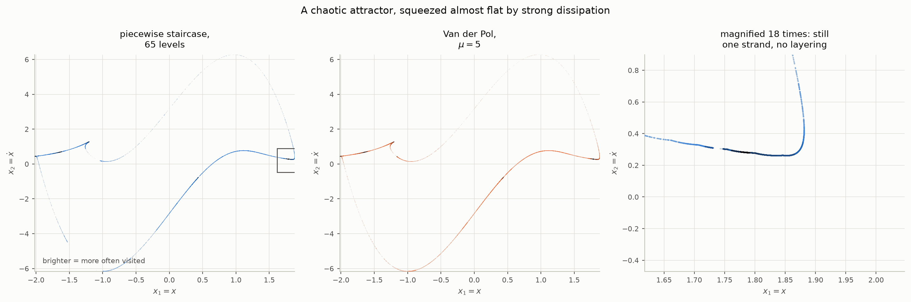

# From flows to maps

`README.md` develops the prototypes as differential equations and analyses
each one with whatever tool suited it — a logarithmic decrement here, an
energy balance there, an integrator where nothing else would do. This
document does something narrower and more mechanical: it turns each
prototype into a **discrete map**, by the same recipe every time.

The reason is that a map is the useful object. It is what you iterate to
find a cycle, differentiate to get a multiplier, continue in a parameter to
find a bifurcation, and eventually fit to measured data. An integrator gives
you a trajectory; a map gives you the structure the trajectory came from.

`maps.py` carries the code, and `python3 maps.py` checks every number below.

## Why this is possible at all

Each prototype is **linear inside each zone**. The nonlinearity is entirely
in *which* zone you are in, never in the dynamics once you are there. So
between one boundary crossing and the next, the state does not need
integrating — it advances by a matrix.

A trajectory is then a finite alternation: advance by a matrix, hit a
boundary, advance by another matrix. Composing them collapses the flow to a
map.

One qualification, stated plainly because it is the only thing that is not
exact. The crossing *times* solve transcendental equations and need a scalar
root find each. Everything else — the state advance, and the derivative — is
exact arithmetic. So "discrete" here means *finitely many analytic pieces
joined by scalar root finds*, not a closed form.

## The three pieces

### 1. The zone flow

Inside a zone with damping ratio $`\zeta`$, the prototype is a linear
oscillator about a centre $`y_c = (x_c, 0)`$ which need not be the origin:

```math
y(t) = y_c + \Phi(\zeta, t)\,\bigl(y_0 - y_c\bigr)
```

```math
\Phi(\zeta, t) =
\begin{bmatrix}
c + \zeta\omega_n s & s \\
-\omega_n^2 s & c - \zeta\omega_n s
\end{bmatrix}
```

with the two kernels the rest of the library already uses,

```math
c(t) = e^{-\zeta\omega_n t}\cos\omega_d t,
\qquad
s(t) = e^{-\zeta\omega_n t}\,\frac{\sin\omega_d t}{\omega_d},
\qquad
\omega_d = \omega_n\sqrt{1-\zeta^2}
```

Both are entire in $`\omega_d^2`$, so an overdamped zone needs no separate
formula — $`\cos`$ becomes $`\cosh`$ and the expression carries on working.

### 2. The crossing time

Every boundary in this library is a straight line $`g^{\mathsf T} y = \ell`$,
with $`g = (1,0)`$ for a displacement threshold and $`g = (0,1)`$ for a
velocity one. Applying $`g`$ to the zone flow collapses two dimensions to
one:

```math
\alpha\, c(t) + \beta\, s(t) = \ell - g^{\mathsf T} y_c
```

where, writing $`u_0 = y_0 - y_c`$,

| boundary | $`\alpha`$ | $`\beta`$ |
| --- | --- | --- |
| displacement, $`g = (1,0)`$ | $`u_{0,1}`$ | $`u_{0,2} + \zeta\omega_n u_{0,1}`$ |
| velocity, $`g = (0,1)`$ | $`u_{0,2}`$ | $`-(\omega_n^2 u_{0,1} + \zeta\omega_n u_{0,2})`$ |

So the entire geometry of a crossing, in any of these models, is one scalar
equation of the same shape. That is the whole reason a single piece of code
handles all of them.

A crossing also has a **direction**, and it belongs inside the root find
rather than as a test afterwards. A section is generally met twice per
revolution — once at each extreme — and only one of those is the return. An
early version of this code took the first root and rejected it when the
direction was wrong, which left it with nothing to return on the simplest
model in the document.

### 3. The Jacobian, which is the point

Differentiating a crossing is not simply $`\Phi`$, because moving the state
moves the crossing *time* as well. Carrying that through gives the
**saltation matrix**:

```math
S = I + \frac{\bigl(f^{+} - f^{-}\bigr)\, g^{\mathsf T}}{g^{\mathsf T} f^{-}}
```

with $`f^{-}`$ and $`f^{+}`$ the field on the two sides of the boundary.
Over one cycle the monodromy is the alternating product

```math
M = \Phi_n\, S_{n-1} \cdots S_1\, \Phi_1
```

and the map's derivative follows by projecting along the flow onto the
section $`g_\Sigma^{\mathsf T} y = \ell_\Sigma`$:

```math
DP = \left(I - \frac{f\, g_\Sigma^{\mathsf T}}{g_\Sigma^{\mathsf T} f}\right) M
```

$`DP`$ has two eigenvalues: one is zero, the flow direction having been
projected out, and the other is the Floquet multiplier.

**When $`S`$ matters.** Where the field is continuous across a boundary,
$`f^{+} = f^{-}`$ and $`S = I`$. That is every velocity-switched model here,
by construction — the README makes continuity the design requirement that
keeps Filippov sliding out. The displacement-switched models jump by
$`2(\zeta_{+}-\zeta_{-})\omega_n\dot{x}`$ and need the full factor. The
continuity distinction the README draws structurally reappears here as
whether a correction term is required.

This is not a refinement. Dropping $`S`$ on the displacement model does not
perturb its multiplier, it destroys it — see the last section.

---

# The prototypes, one at a time

## 0. The linear prototype

One zone, no boundaries. Take the section $`\Sigma = \{\dot{x} = 0\}`$
crossed downwards, so successive returns are successive maxima of $`x`$, one
full damped period apart at $`T_d = 2\pi/\omega_d`$.

At exactly that time $`\sin\omega_d T_d = 0`$ and $`\cos\omega_d T_d = 1`$, so
$`s = 0`$, $`c = e^{-\zeta\omega_n T_d}`$, and the transition matrix collapses
to a scalar:

```math
\Phi(\zeta, T_d) = e^{-2\delta(\zeta)}\, I,
\qquad
\delta(\zeta) = \frac{\pi\zeta}{\sqrt{1-\zeta^2}}
```

recovering the logarithmic decrement the README opens with. The map is

```math
r_{n+1} = e^{-2\delta(\zeta)}\, r_n
```

exactly linear, with multiplier $`e^{-2\delta}`$. Trivial, and worth doing:
it fixes the section convention and the sign of $`\delta`$, and it is the
one case where the map can be checked against algebra with nothing else in
the way.

| $`\zeta`$ | from the map | $`e^{-2\delta}`$ | relative error |
| --- | --- | --- | --- |
| 0.05 | 0.7301153802 | 0.7301153802 | 0 |
| 0.10 | 0.5318020829 | 0.5318020829 | 0 |
| 0.30 | 0.1386267284 | 0.1386267284 | 0 |
| 0.60 | 0.0089832910 | 0.0089832910 | $`7.7\times10^{-16}`$ |

## 1. Switched damping across the x-axis

Two zones, $`\zeta_{+}`$ for $`\dot{x} \gt 0`$ and $`\zeta_{-}`$ below, both
centred on the origin, with one boundary $`\dot{x} = 0`$ — which is also the
section. The field is continuous, so $`S = I`$.

Each half cycle takes $`\pi/\omega_d`$ in its own zone, and at that time
$`\sin = 0`$, $`\cos = -1`$, so again $`s = 0`$ and the block is a scalar:

```math
\Phi(\zeta_{\pm}, \pi/\omega_{d\pm}) = -e^{-\delta(\zeta_{\pm})}\, I
```

The two signs cancel and

```math
M = e^{-\left(\delta(\zeta_{+}) + \delta(\zeta_{-})\right)}\, I
```

**This derivation explains the model's central limitation.** $`M`$ is a
scalar multiple of the identity and does not depend on where the trajectory
started. The map is therefore a pure scaling at every amplitude, which is
the positive homogeneity the README invokes to rule out an isolated limit
cycle — arrived at here as a property of the monodromy rather than as a
symmetry argument. Stability is global, and the marginal case gives a
continuum.

| $`\zeta_{+}`$ | $`\zeta_{-}`$ | from the map | $`e^{-(\delta_{+}+\delta_{-})}`$ | rel. err. |
| --- | --- | --- | --- | --- |
| 0.3 | $`-0.1`$ | 0.5105619787 | 0.5105619787 | 0 |
| 0.2 | 0.1 | 0.3840368157 | 0.3840368157 | $`1.4\times10^{-16}`$ |
| 0.5 | $`-0.4`$ | 0.6423024871 | 0.6423024871 | 0 |

## 2. Offsetting the boundary

Now the damping acts on the relative velocity $`w = \dot{x} - v_0`$, so
within a zone

```math
\ddot{x} + 2\zeta\omega_n\dot{x} + \omega_n^2 x = 2\zeta\omega_n v_0
```

an oscillator about $`x_c = 2\zeta v_0/\omega_n`$. Those are the **virtual
centres** the README tracks, and in the map they are simply each zone's
$`y_c`$ — no new machinery, one extra field per zone.

Boundary at $`\dot{x} = v_0`$, section $`\dot{x} = 0`$ crossed downwards,
field continuous so $`S = I`$.

What changes is decisive. The two zones no longer have a common centre, so
the crossing times depend on the amplitude, the half-cycle blocks are no
longer scalar multiples of $`I`$, and $`M`$ varies along the section. The
map stops being a pure scaling and acquires an isolated fixed point.

At $`\zeta_{+} = 0.3`$, $`\zeta_{-} = -0.1`$, $`v_0 = 1`$:

| quantity | from the map | reference |
| --- | --- | --- |
| cycle radius $`r^{*}`$ | 2.150651224 | |
| period $`T`$ | 6.367077 | 6.367077082 (`frequency.py`) |
| multiplier | 0.538924872 | 0.538923 (README) |

The README's figure came from differencing an integrated return map; the
gap of $`2\times10^{-6}`$ is that estimate's error, not this one's.

## 3. The symmetric deadzone

Three zones — the band $`\lvert\dot{x}\rvert \lt v_0`$ with $`\zeta_{-}`$ about
the origin, and the two outer zones with $`\zeta_{+}`$ about
$`x_c = \pm 2(\zeta_{+}-\zeta_{-})v_0/\omega_n`$ — and two boundaries
$`\dot{x} = \pm v_0`$. Field continuous, $`S = I`$.

Structurally this is prototype 2 with one more zone and one more wall. That
is the entire change in the code, which is the point of doing it this way.

At $`\zeta_{+} = 0.3`$, $`\zeta_{-} = -0.1`$, $`v_0 = 1`$:

| quantity | from the map | reference |
| --- | --- | --- |
| cycle radius $`r^{*}`$ | 1.589461853 | 1.589461853 (`symmetric.py`) |
| period $`T`$ | 6.319387 | 6.319387375 |
| multiplier | 0.203639654 | 0.203634 (README) |

## 4. Switching on displacement

Boundaries at $`x = x_0`$, or $`\lvert x \rvert = x_0`$ for the symmetric
variant. Every zone shares the origin as its centre — the damping term
carries a factor of $`\dot{x}`$, which vanishes on $`\dot{x} = 0`$ whatever
$`x`$ is — so unlike the velocity models there are no virtual centres at
all.

What these have instead is a **discontinuous field**. Across $`x = x_0`$ the
damping ratio jumps while $`\dot{x} \neq 0`$, so

```math
f^{+} - f^{-} = \bigl(0,\; -2(\zeta_{+}-\zeta_{-})\omega_n \dot{x}\bigr)
```

and $`S \neq I`$. This is the first prototype where the saltation factor
does anything.

At $`\zeta_{+} = 0.3`$, $`\zeta_{-} = -0.1`$, $`x_0 = 1`$, symmetric:

| quantity | from the map | reference |
| --- | --- | --- |
| period $`T`$ | 6.319387 | 6.319387 (`displacement.py`) |
| multiplier | 0.203639654 | 0.203640 (README) |

**The multiplier is the deadzone's, to ten significant figures.** The README
argues that the velocity and displacement models are related by
differentiation and must therefore share their Floquet multipliers; here
that falls out of two independently constructed maps agreeing, which is a
stronger check than the argument.

### What the saltation factor is worth

Recomputing the same cycle with $`S`$ forced to the identity:

| model | field across the wall | with $`S`$ | with $`S = I`$ |
| --- | --- | --- | --- |
| displacement, symmetric | discontinuous | 0.203639654 | **1.000000000** |
| deadzone | continuous | 0.203639653860 | 0.203639653860 |

On the continuous model it changes nothing, to $`5.6\times10^{-17}`$, exactly
as the theory says it should. On the discontinuous one, dropping it does not
introduce an error of a few per cent — it returns exactly 1, reporting a
hyperbolic cycle as neutrally stable and implying a continuum of orbits that
is not there. A plausible-looking wrong answer, of the kind that survives a
first reading.

## Why bother, when finite differences exist

Because they fail quietly, and this repository has the scars. Differencing a
return map produced a Floquet multiplier of $`10^{12}`$ in `staircase.py`
(a bug, since fixed), and on the Van der Pol fit at $`\mu = 5`$ it produces
exactly zero — one pass through a zone with $`\zeta = 20`$ annihilates every
bit of the perturbation, so no step size can recover the answer. A published
contraction figure turned out to be the noise floor of the same estimator.

The analytic Jacobian multiplies that contraction out symbolically and
returns it however small it is. It is also cheaper, needs no step size, and
is differentiable with respect to the parameters — which is what a fitting
tool will eventually want.

## Still to do

The remaining prototypes follow the same recipe and are not yet written up
here:

- **the two-threshold staircase**, which is prototype 3 with more zones and
  more walls, and where the analytic Jacobian should resolve the multiplier
  that finite differences cannot;
- **the forced models**, where each zone gains a particular solution and the
  map becomes affine rather than linear, and the natural section is
  stroboscopic rather than geometric.

Neither needs new theory — only the same three pieces, applied again.


---

# As difference equations, one step per cycle

**Scope.** Everything below assumes the cycle *closes* — the prototype is
underdamped, or carries a limit cycle. That is the case these equations are
for. A trajectory that leaves without returning has no once-per-cycle map
and is not covered.

The maps above were built arc by arc. Multiplying every arc of one full
return together collapses them into a single matrix per cycle, so each
output is the next cycle's starting point.

## The form

A zone's flow is affine, $`y \mapsto y_c + \Phi(y - y_c)`$. Carrying a
constant alongside the state turns each arc into a $`3\times 3`$ matrix, and
the product of a cycle's arcs is one matrix $`C`$:

```math
\begin{bmatrix} y \\ 1 \end{bmatrix}_{k+1}
= C(r_k)\, \begin{bmatrix} y \\ 1 \end{bmatrix}_{k},
\qquad
C = A_n \cdots A_1,
\qquad
A_i = \begin{bmatrix} \Phi(\zeta_i, t_i) & (I - \Phi(\zeta_i, t_i))\, y_{c,i} \\ 0 & 1 \end{bmatrix}
```

On the section $`\dot{x} = 0`$ the state is $`(r, 0)`$, so only the first row
matters and the whole prototype reduces to a **scalar affine recurrence in
the amplitude**:

```math
r_{k+1} = a(r_k)\, r_k + b(r_k),
\qquad
a = C_{11},
\qquad
b = C_{13}
```

Each step is linear. All the nonlinearity is in how $`a`$ and $`b`$ depend on
the amplitude, and that dependence enters through exactly one thing: the
dwell times, each solving $`\alpha c(t) + \beta s(t) = \ell`$ for its arc.

Two chains run over the same events and must not be confused. The **state**
chain is the arcs alone, as above. The **perturbation** chain interleaves the
saltation factors and is what gives the multiplier; saltation shears
neighbouring trajectories, which arrive at a boundary at slightly different
times, and does not move the trajectory itself.

## What the coefficients do, prototype by prototype

Measured at three amplitudes spanning a factor of several:

| prototype | $`r`$ | $`a(r)`$ | $`b(r)`$ |
| --- | --- | --- | --- |
| linear, $`\zeta = 0.1`$ | 0.5 | 0.531802082944 | 0 |
| | 1.0 | 0.531802082944 | 0 |
| | 4.0 | 0.531802082944 | 0 |
| through equilibrium | 0.5 | 0.510561978719 | 0 |
| | 1.0 | 0.510561978719 | 0 |
| | 4.0 | 0.510561978719 | 0 |
| offset boundary | 1.50 | 0.557504209459 | 0.867848526249 |
| | 2.15 | 0.533974721260 | 0.909523789597 |
| | 4.00 | 0.516879088318 | 0.957471911398 |
| symmetric deadzone | 1.00 | 0.328931581112 | 1.116359956182 |
| | 1.59 | 0.203599857938 | 1.265847656454 |
| | 3.00 | 0.161692352304 | 1.353319293136 |
| displacement, symmetric | 1.200 | 1.242835918972 | 0 |
| | 1.577 | 1.000141817566 | 0 |
| | 3.000 | 0.608284421113 | 0 |

Three distinct forms fall out, and they line up with structure the README
arrived at by other means.

**Constant $`a`$, zero $`b`$ — a true linear difference equation.**

```math
r_{k+1} = \lambda\, r_k
```

The linear prototype ($`\lambda = e^{-2\delta}`$) and the
through-equilibrium one ($`\lambda = e^{-(\delta_{+}+\delta_{-})}`$). The
coefficients do not move to twelve decimals across an eightfold change in
amplitude, because every zone shares the origin as its centre and is
therefore left at a fixed phase of its own oscillation whatever the
amplitude.

**Amplitude-dependent gain, zero $`b`$.** The displacement-switched models.
All zones still share the origin — the damping term carries a factor
$`\dot{x}`$, which vanishes on $`\dot{x} = 0`$ whatever $`x`$ is — so there is
no affine term. But the thresholds are crossed at amplitude-dependent
phases, so the gain varies:

```math
r_{k+1} = a(r_k)\, r_k, \qquad a(r^{*}) = 1 \;\text{at the cycle}
```

At $`r = 1.577`$, $`a = 1.000142`$ — the cycle is where the gain reaches one.

**Both coefficients varying.** The velocity-switched models, offset and
deadzone. Damping the *relative* velocity moves each zone onto a virtual
centre $`x_c = 2\zeta v_0/\omega_n`$, and that centre is exactly what the
affine term $`b`$ carries. The cycle solves

```math
a(r^{*})\, r^{*} + b(r^{*}) = r^{*}
```

## Why the first two can have no isolated cycle

A constant-coefficient affine recurrence $`z_{k+1} = A z_k + b`$ has one
fixed point $`z^{*} = (I-A)^{-1}b`$ when $`I - A`$ is invertible, and every
orbit obeys $`z_k - z^{*} = A^{k}(z_0 - z^{*})`$. Its behaviour is therefore
global — everything converges if $`\rho(A) \lt 1`$, everything diverges if
$`\rho(A) \gt 1`$ — and an *isolated* limit cycle is impossible. Closed
orbits require an eigenvalue exactly on the unit circle, which gives a
**continuum** of them, not one.

That is the README's result for the through-equilibrium prototype, reached
here from the algebra of difference equations instead of from positive
homogeneity: no isolated cycle, and a continuum in the marginal case
$`\bar{\zeta} = 0`$. The prototypes that do carry an isolated cycle cannot be
written with constant coefficients, so the amplitude dependence of $`a`$ and
$`b`$ is not bookkeeping — it is what the cycle is made of.

## Reading the multiplier off correctly

The multiplier is $`\mathrm{d}r_{k+1}/\mathrm{d}r_k`$ at the fixed point,
which for a varying $`a`$ is **not** $`a(r^{*})`$:

```math
\frac{\mathrm{d}r_{k+1}}{\mathrm{d}r_k}
= a(r^{*}) + a'(r^{*})\,r^{*} + b'(r^{*})
```

For the displacement prototype $`a(r^{*}) = 1`$ exactly, so the entire
multiplier of 0.203639654 comes from the derivative terms. Taking $`a`$ for
the multiplier would report every such cycle as neutrally stable. The
perturbation chain gives the correct value directly, without needing
$`a'`$ or $`b'`$.

## Verification

The single cycle matrix reproduces the arc-by-arc map exactly:
$`a(r)\,r + b(r)`$ against the mapped amplitude agrees to $`0`$ or
$`4.4\times10^{-16}`$ at every amplitude in the table above. The state chain
and the perturbation chain were each checked against the map they came from
across all five prototypes, at $`\le 4.4\times10^{-16}`$ and exactly
respectively.

## What this buys

A cycle is now one matrix whose entries are explicit functions of the
damping ratios and the dwells, and whose product is differentiable with
respect to them. Multipliers come from that product rather than from
differencing an integrated orbit — the estimator that produced a value of
$`10^{12}`$ in `staircase.py`, returned exactly zero at the Van der Pol fit
where one pass through a $`\zeta = 20`$ zone annihilates the perturbation,
and supplied a published contraction figure that was its own noise floor.

---

# Reading it in the z domain

Once a cycle is a linear map, its Jacobian's eigenvalues are **discrete
poles**, and the whole apparatus of sampled-data stability applies. The
README classifies the prototypes by their s-plane poles, zone by zone; this
is the discrete counterpart, and it classifies the *cycle* rather than the
zones.

The rule is the usual one. A cycle is stable when every pole lies inside the
unit circle, unstable when any lies outside, and marginal on it. The
bistable staircase has one of each:

| cycle | $`r^{*}`$ | pole | |
| --- | --- | --- | --- |
| inner | 1.167843885 | 4.188310 | outside the unit circle — repels |
| outer | 2.253398366 | 0.163194 | inside — attracts |

(Both agree with `staircase.py`, built independently, to
$`3\times10^{-7}`$; the values here are the analytic ones.)

Finding the inner one needs care worth recording: iterating the map only
ever finds attractors. Started near the repelling cycle, iteration slides
off it and converges to the origin. Bracketing $`P(r) - r`$ finds both.

## What each way out of the unit circle predicts

The value of the z-domain reading is that *where* a pole crosses says which
bifurcation is happening, and each of the three has already been seen
elsewhere in this repository under another name:

**Through $`+1`$ — a fold of cycles.** Two cycles collide and annihilate.
That is the bistable staircase's fate: its inner and outer cycles approach
as the middle damping level is weakened, and at the fold they merge and both
vanish, taking the hard-excitation behaviour with them. The multipliers
4.188 and 0.163 are on either side of $`+1`$ and must meet there.

**Through $`-1`$ — period doubling.** The cascade that ends in chaos. This
is the crossing the forcing work was implicitly looking for when it asked
whether contraction was strong enough to prevent one.

**A complex pair through the circle — Neimark–Sacker.** The cycle loses
stability to a torus, and the response becomes quasi-periodic. This is
exactly the locked/quasi-periodic boundary the forcing maps are covered in:
every "torus" cell there is a cycle whose poles have left the unit circle as
a complex pair, and every "locked" cell one whose poles are still inside.

The regime maps in `README.md` were produced by classifying stroboscopic
sections numerically. The same three regions are what a pole plot of these
maps would predict, from algebra rather than by sampling.

## Chaos, and what the forced form offers

Chaos needs the forced models. The autonomous prototypes are planar, so
Poincare-Bendixson caps them at equilibria and cycles however many zones
they have — the once-per-cycle map of an autonomous prototype is a scalar
map that cannot be chaotic.

With a drive the picture changes, and the arc stays linear. A sinusoid is
itself a linear system, its state $`(\cos\Omega t, \sin\Omega t)`$ rotating,
so carrying it alongside gives a $`5\times 5`$ arc matrix on
$`[x, \dot{x}, \cos, \sin, 1]`$ — the block form is in
`maps.forced_arc_matrix`, and it reproduces integrated forced arcs to
$`10^{-12}`$, including strongly overdamped zones and the drive parameters
at which Van der Pol is chaotic. The natural section becomes stroboscopic:
sample once per drive period, and the recurrence steps sample to sample.

That form makes an exact Lyapunov exponent available in principle. The
stroboscopic map's Jacobian is a product of these matrices, known
analytically, so the exponent is the growth rate of that product — no twin
trajectory, no separation to choose, and no noise floor. This matters
because the twin-trajectory estimator used elsewhere in the repository has a
noise floor around $`0.008`$, which was large enough to flip four verdicts
out of seven and to make a published contraction figure meaningless.

## The exponent, measured

The stroboscopic map is now assembled — `maps.strobe_step` advances exactly
one drive period through the zone switching, and `maps.forced_lyapunov`
takes the exponent from the Jacobian product. Against the twin-trajectory
estimator, on staircases fitted to Van der Pol at $`\mu = 5`$ and driven at
$`A = 5`$, $`\Omega = 2.466`$:

| levels | regime | exact | twin trajectory | difference |
| --- | --- | --- | --- | --- |
| 5 | lock 3 | $`-0.442424`$ | $`-0.441577`$ | 0.0008 |
| 9 | not locked | $`+0.105275`$ | $`+0.093137`$ | 0.0121 |
| 17 | **lock 4** (see below) | $`-0.012498`$ | $`-0.011869`$ | 0.0006 |
| 33 | not locked | $`+0.069203`$ | $`+0.055238`$ | 0.0140 |
| 65 | not locked | $`+0.072203`$ | $`+0.088378`$ | 0.0162 |

**The two agree in sign at every point tested**, and agree closely — to
within 0.0008 — wherever the exponent is clearly negative. Where it is
positive they differ by up to 0.016, and the difference has **no consistent
direction**: the exact value is higher at 9 and 33 levels and lower at 65.
An earlier draft of this section claimed the exact value runs consistently
higher and explained why; that was generalising from two points and is
withdrawn.

What the exact method gives is not a better digit but the absence of a
floor. The twin-trajectory estimator has a noise floor near 0.008 — enough
to have flipped four verdicts out of seven elsewhere in this repository —
because it must choose a separation and renormalise. The Jacobian product
chooses nothing.

### The regime labels are less reliable than the exponents

The 17 level row is marked as a lock above, and was originally published
here as a torus. It is a **period 4 orbit**, and the correction matters less
for that one row than for what it exposes.

The lock test asks whether the stroboscopic point returns to within
$`10^{-6}`$ of itself, relative to the orbit. Integrating a strongly damped
piecewise system accumulates error faster than that. At 17 levels the
period 4 residual measures $`1.5\times10^{-6}`$ — above the threshold, so no
lock is certified — and it stays there at integrator tolerances of
$`10^{-9}`$, $`10^{-11}`$ and $`10^{-12}`$ alike. It is an error floor, not a
tolerance that can be bought down. The orbit was therefore reported as
unlocked, and then, its exponent being negative, as a torus.

The exact map resolves the same orbit at $`2.4\times10^{-9}`$ — three orders
inside the threshold — because a product of matrices accumulates no
integration error. This is the clearest case yet for building the maps: not
an argument from principle but an orbit the integrator could not classify
and the map could.

**So a "torus" verdict from `section.py` means no lock was detected, not
that no lock exists.** `section.lock_margin` now reports how close the call
was, and `classify` returns `undecided` rather than `torus` when the margin
is within thirty times the threshold. Measured at the drive used here:

| levels | verdict | margin |
| --- | --- | --- |
| 5 | lock 1:3 | $`1.0\times10^{-7}`$ |
| 9 | torus | $`1.1`$ |
| 17 | undecided | $`1.3\times10^{-6}`$ |
| 33 | torus | $`1.2`$ |
| 65 | torus | $`1.1`$ |

The genuinely non-periodic cases miss by a factor of a million, so those
verdicts are safe; only the marginal one needed flagging.

**What this does not touch.** Every chaos or no-chaos conclusion in this
repository rests on the sign of the Lyapunov exponent, and mistaking a lock
for a torus does not change "not chaotic". The Arnold tongue widths and the
agreement figures compare *chaotic* frequencies. What is unreliable is the
split between lock and torus within the non-chaotic cells.

### What building it cost, which is the part worth recording

Two silent failures, both of which produced plausible wrong answers rather
than errors.

**A crossing root at zero.** A state sitting exactly on a wall makes the
crossing residual zero at $`t = 0`$, so the search returned $`t = 0`$ for
ever: the step advanced nothing and eventually gave up. This is not an edge
case to be waved at — fitting 33 levels over $`x \in [0, 3]`$ puts an edge at
exactly 2.0, which is the natural starting amplitude.

**An event cap that truncated instead of raising.** The step allowed 48
boundary crossings per drive period and, on exceeding that, returned the
state reached so far as though the period were complete. At 65 levels an
orbit crosses about 66 zones per period, so every step was wrong while still
looking like a trajectory.

Both were found only by checking a 30-step chain against continuous
integration at *every* level count. The original check covered one level
count, which is why the failures survived into a merged version and one
published exponent had to be withdrawn. The chain now agrees with
integration at $`4.4\times10^{-12}`$ to $`1.3\times10^{-7}`$ across all five,
and exceeding the cap raises rather than returning.

## The attractor

<picture>
  <source media="(prefers-color-scheme: dark)" srcset="figures/strange-attractor-dark.png">
  
</picture>

*Left, the piecewise staircase at 65 levels; middle, the smooth Van der Pol it was fitted to under the same drive; right, the boxed patch magnified. Brightness encodes how often each region is visited.*

**This is not the picture a strange attractor is supposed to make.** A
textbook one is a Cantor-like stack of filaments; this is a strand, and it
stays a strand at eighteen times magnification.

That is the dissipation, not an error. At $`\mu = 5`$ the contraction per
cycle is below what double precision can express — the same fact that made a
finite-difference multiplier return bit-zero earlier in this document — so
the attractor is squeezed to within a few per cent of a one-dimensional
curve. The fractal structure is real, and the positive exponent measures the
stretching that builds it, but it lives far below the scale that 30000
points and an eighteen-fold zoom can reach.

Nor is a fatter example available by looking harder. Of five drive settings
tried, the only two that are genuinely chaotic have transverse thickness
0.030 and 0.036; the three with visible girth have *negative* exponents —
they are periodic orbits, and their girth is the width of a closed curve.
Thin attractors are what strongly damped oscillators give.

What the figure does establish is the comparison. The piecewise staircase
and the smooth oscillator trace the same shape under identical forcing,
which is the geometric counterpart of the agreement in exponent and in lock
structure that `README.md` reports: the piecewise model reproduces not just
that there is chaos, but where the orbit goes.
