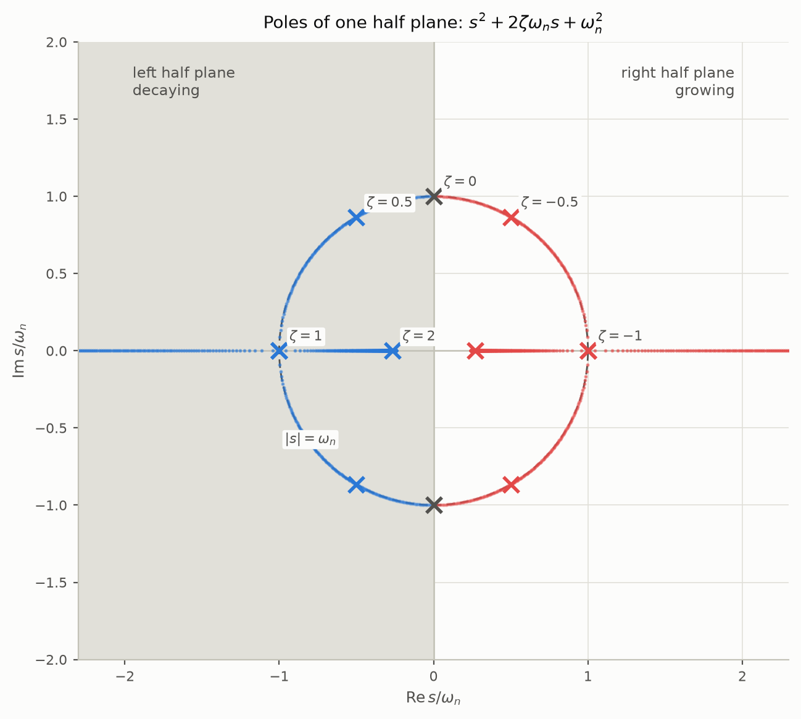
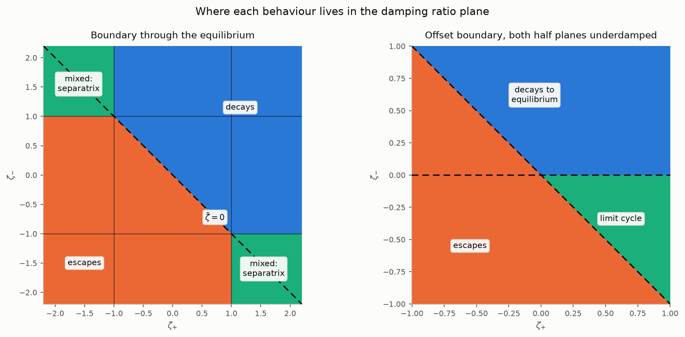
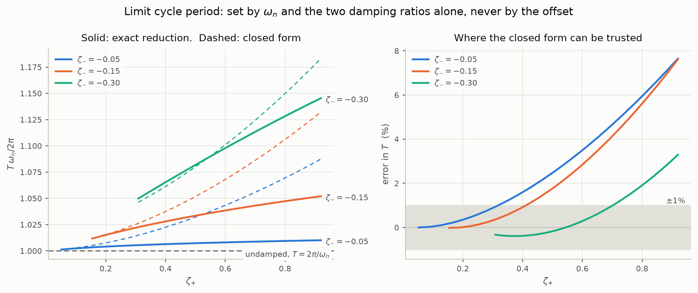
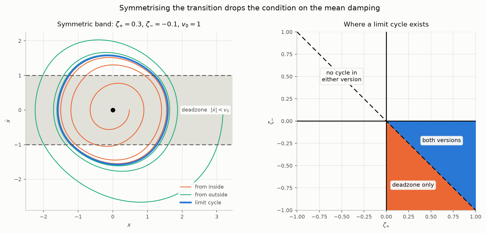
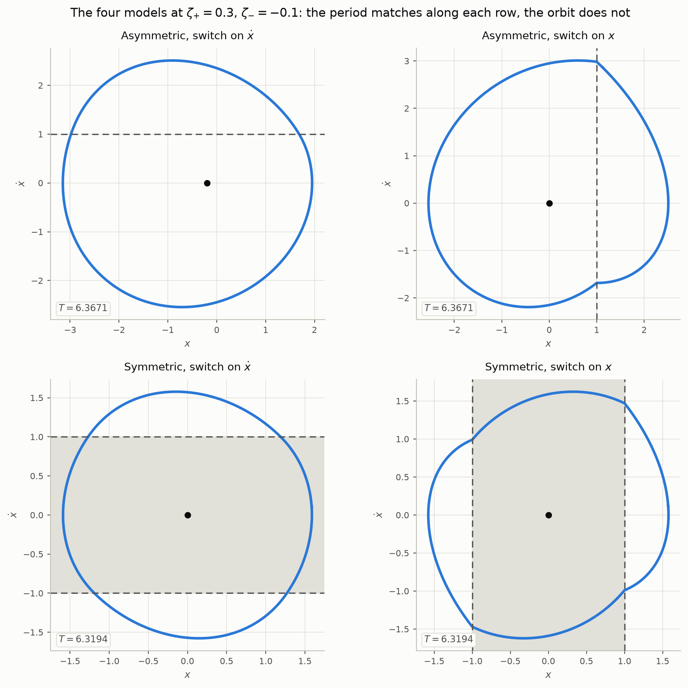
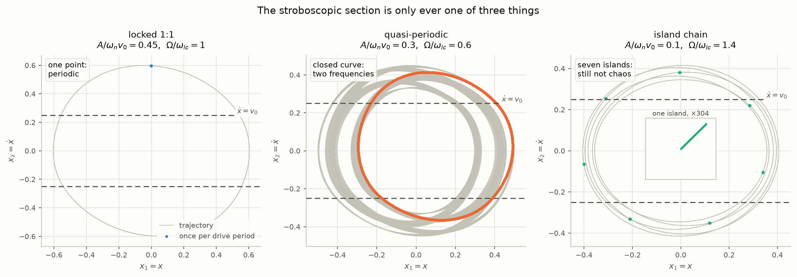
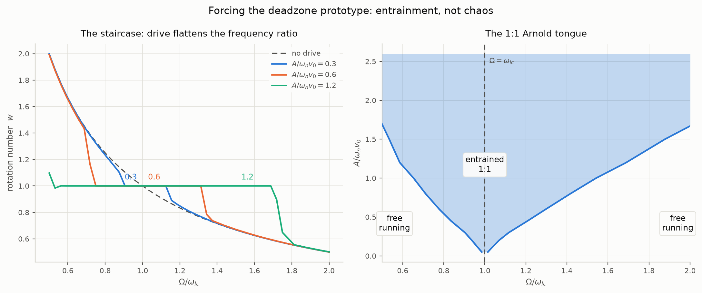
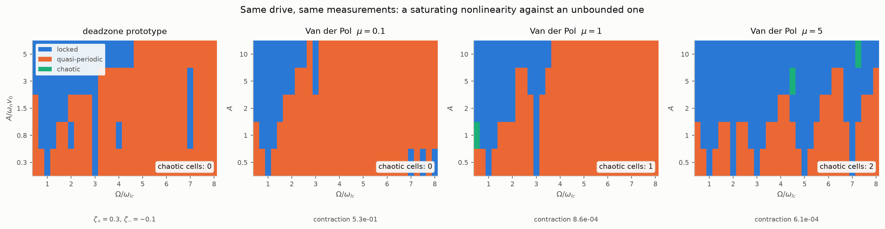

# Second order nonlinear prototype 

This project covers the second order nonlinear prototype. The starting point is
the second order **linear** prototype; the nonlinear prototype builds on it by
introducing a switching boundary in the phase plane.

`EXAMPLES.md` fits physical systems to each prototype — Maxwell's governor
and a transistor LC oscillator — with the numbers produced by `examples.py`.

## Second order linear prototype

As a single second order ordinary differential equation:

```math
\ddot{x} + 2\zeta\omega_n\dot{x} + \omega_n^2 x = \omega_n^2 u(t)
```

where $`\omega_n`$ is the undamped natural frequency, $`\zeta`$ is the damping
ratio, and $`u(t)`$ is the input. In raw coefficient form this is

```math
m\ddot{x} + c\dot{x} + kx = f(t)
```

with $`\omega_n = \sqrt{k/m}`$ and $`\zeta = c / (2\sqrt{km})`$.

## As a set of first order ordinary differential equations

Taking the states as position and velocity, $`x_1 = x`$ and $`x_2 = \dot{x}`$:

```math
\begin{aligned}
\dot{x}_1 &= x_2 \\
\dot{x}_2 &= -\omega_n^2 x_1 - 2\zeta\omega_n x_2 + \omega_n^2 u
\end{aligned}
```

The second derivative $`\ddot{x}`$ no longer appears: one second order equation
has become two coupled first order equations, with $`\dot{x}_2`$ carrying what
was $`\ddot{x}`$.

## State space form

```math
\begin{bmatrix}\dot{x}_1 \\ \dot{x}_2\end{bmatrix}
=
\begin{bmatrix}0 & 1 \\ -\omega_n^2 & -2\zeta\omega_n\end{bmatrix}
\begin{bmatrix}x_1 \\ x_2\end{bmatrix}
+
\begin{bmatrix}0 \\ \omega_n^2\end{bmatrix} u
```

```math
y = \begin{bmatrix}1 & 0\end{bmatrix}
\begin{bmatrix}x_1 \\ x_2\end{bmatrix}
```

<picture>
  <source media="(prefers-color-scheme: dark)" srcset="figures/linear-prototype-dark.png">
  
</picture>

*The linear prototype for three damping ratios. Every trajectory spirals into the single equilibrium at the origin; larger $`\zeta`$ removes the overshoot entirely.*

## Nonlinear prototype: switched damping across a boundary on the x-axis

The first nonlinear prototype keeps the dynamics linear on either side of a
single straight switching boundary, and puts the nonlinearity in the **damping
coefficient**. Taking the phase plane with $`x`$ on the horizontal axis and
$`\dot{x}`$ on the vertical axis, the boundary is the x-axis itself:

```math
\Sigma = \{ (x_1, x_2) \in \mathbb{R}^2 : h(x_1, x_2) = x_2 = 0 \}
```

splitting the plane into the two open half planes

```math
S^{+} = \{ x_2 > 0 \}, \qquad S^{-} = \{ x_2 < 0 \}
```

Since $`x_2 = \dot{x}`$, the boundary is crossed whenever the velocity changes
sign. The damping ratio takes a different value on each side:

```math
\ddot{x} + 2\zeta(\dot{x})\,\omega_n\dot{x} + \omega_n^2 x = \omega_n^2 u(t),
\qquad
\zeta(\dot{x}) =
\begin{cases}
\zeta_{+} & \dot{x} > 0 \\
\zeta_{-} & \dot{x} < 0
\end{cases}
```

Writing the mean and half difference of the two damping ratios as
$`\bar{\zeta} = (\zeta_{+} + \zeta_{-})/2`$ and
$`\Delta\zeta = (\zeta_{+} - \zeta_{-})/2`$, the switch can be folded into a
single term and the nonlinearity shows up as an absolute value:

```math
\ddot{x} + 2\omega_n\bar{\zeta}\,\dot{x} + 2\omega_n\Delta\zeta\,\lvert\dot{x}\rvert + \omega_n^2 x = \omega_n^2 u(t)
```

Setting $`\Delta\zeta = 0`$ recovers the linear prototype exactly.

### As a set of first order ordinary differential equations

With $`x_1 = x`$ and $`x_2 = \dot{x}`$ as before:

```math
\begin{aligned}
\dot{x}_1 &= x_2 \\
\dot{x}_2 &= -\omega_n^2 x_1 - 2\omega_n\left(\bar{\zeta}x_2 + \Delta\zeta\lvert x_2 \rvert\right) + \omega_n^2 u
\end{aligned}
```

Equivalently, as one linear system per half plane, $`\dot{x} = A^{\pm}x + b\,u`$:

```math
A^{\pm} =
\begin{bmatrix}
0 & 1 \\
-\omega_n^2 & -2\zeta_{\pm}\omega_n
\end{bmatrix},
\qquad
b = \begin{bmatrix} 0 \\ \omega_n^2 \end{bmatrix}
\qquad \text{on } S^{\pm}
```

with eigenvalues $`\lambda_{\pm} = \omega_n\left(-\zeta_{\pm} \pm \sqrt{\zeta_{\pm}^2 - 1}\right)`$.

### The field is continuous across the boundary

This is the structural difference from putting the switch in a *force* term.
The two fields differ only in the damping term $`-2\zeta_{\pm}\omega_n x_2`$,
and that term vanishes on $`\Sigma`$ where $`x_2 = 0`$. So

```math
f^{+}(x) = f^{-}(x) \quad \text{for all } x \in \Sigma
```

The vector field is continuous everywhere — only its Jacobian jumps across
$`\Sigma`$. The system is therefore piecewise smooth and continuous, and
Lipschitz, so ordinary solutions exist and are unique: no Filippov convex
combination is needed, there is no sliding or sticking set, and every
trajectory crosses $`\Sigma`$ transversally except at an equilibrium. The
boundary changes the *rate* at which the system gains or loses energy, not the
force acting on it.

### Stability

Take $`u = 0`$, so the equilibrium is the origin. The system is not
differentiable there, so stability is decided by the half-cycle map rather
than by linearisation.

Within $`S^{-}`$, a trajectory leaving the boundary at $`(x_1, 0)`$ with
$`x_1 = A_n \gt 0`$ follows the linear system with damping $`\zeta_{-}`$, and for
$`\lvert\zeta_{-}\rvert \lt 1`$ returns to the boundary after exactly half a
damped period at $`(-A_n e^{-\delta(\zeta_{-})},\, 0)`$, where the logarithmic
decrement per half cycle is

```math
\delta(\zeta) = \frac{\pi\zeta}{\sqrt{1-\zeta^2}}
```

The next half cycle runs through $`S^{+}`$ with $`\zeta_{+}`$, so the amplitude
after a full cycle is

```math
A_{n+1} = A_n\,e^{-\left(\delta(\zeta_{+}) + \delta(\zeta_{-})\right)}
```

The origin is asymptotically stable exactly when
$`\delta(\zeta_{+}) + \delta(\zeta_{-}) \gt 0`$. Since $`\delta`$ is odd and
strictly increasing on $`(-1, 1)`$, this collapses to a condition on the mean
damping alone:

```math
\zeta_{+} + \zeta_{-} > 0
\qquad \Longleftrightarrow \qquad
\bar{\zeta} > 0
```

So one half plane may have **negative** damping and the origin still be
asymptotically stable, provided the other half plane damps harder. What
matters is the average over a cycle, not the sign on either side.

Three cases follow:

| condition | behaviour |
| --- | --- |
| $`\bar{\zeta} \gt 0`$ | origin asymptotically stable |
| $`\bar{\zeta} = 0`$ | full cycle map is the identity — a continuum of closed orbits |
| $`\bar{\zeta} \lt 0`$ | origin unstable, oscillation grows without bound |

**There is no limit cycle.** With $`u = 0`$ the field is positively homogeneous
of degree one, $`f(\lambda x) = \lambda f(x)`$ for $`\lambda \gt 0`$, so the return
map is an exact scaling and its behaviour cannot depend on amplitude.
Stability is global, and the marginal case gives a continuum of periodic
orbits rather than an isolated one. Producing an isolated limit cycle requires
amplitude dependence — a $`\zeta`$ that varies with $`x`$, or a boundary that does
not pass through the equilibrium.

For constant $`u \neq 0`$ the equilibrium moves to $`(u, 0)`$, which still lies on
$`\Sigma`$, and the same analysis applies in the shifted coordinate $`x_1 - u`$.

<picture>
  <source media="(prefers-color-scheme: dark)" srcset="figures/switched-damping-dark.png">
  
</picture>

*The three cases, with $`\Sigma`$ on the x-axis. Note the middle panel: at $`\bar{\zeta} = 0`$ the closed orbits come in a continuum, one through every starting point, rather than as one isolated cycle.*

<picture>
  <source media="(prefers-color-scheme: dark)" srcset="figures/decrement-dark.png">
  
</picture>

*Amplitude after each full cycle, integrated (markers) against $`e^{-(\delta(\zeta_+)+\delta(\zeta_-))n}`$ (dashed). Straight lines on a log scale: the decay is exactly geometric and its direction is set by the sign of $`\bar{\zeta}`$, not by the sign of either $`\zeta_{\pm}`$ alone.*

### Pole locations of the two half planes

Each half plane is an ordinary second order system, so it has a
characteristic polynomial and a pole pair:

```math
s^2 + 2\zeta\omega_n s + \omega_n^2 = 0,
\qquad s = \omega_n\left(-\zeta \pm \sqrt{\zeta^2 - 1}\right)
```

While $`\lvert\zeta\rvert \lt 1`$ the poles are a complex conjugate pair of
modulus $`\omega_n`$, so they sit on a circle of radius $`\omega_n`$ at
$`\cos\theta = \zeta`$ from the negative real axis. At
$`\lvert\zeta\rvert = 1`$ they meet on the real axis and split along it.

| $`\zeta`$ | poles | where | that half plane alone |
| --- | --- | --- | --- |
| $`\zeta \gt 1`$ | real, distinct, negative | LHP real axis | overdamped, decays without oscillating |
| $`\zeta = 1`$ | real, repeated, at $`-\omega_n`$ | LHP real axis | critically damped |
| $`0 \lt \zeta \lt 1`$ | complex pair, LHP | arc of $`\lvert s\rvert = \omega_n`$ | decaying spiral |
| $`\zeta = 0`$ | $`\pm j\omega_n`$ | imaginary axis | undamped, closed circle |
| $`-1 \lt \zeta \lt 0`$ | complex pair, RHP | arc of $`\lvert s\rvert = \omega_n`$ | growing spiral |
| $`\zeta = -1`$ | real, repeated, at $`+\omega_n`$ | RHP real axis | grows without oscillating |
| $`\zeta \lt -1`$ | real, distinct, positive | RHP real axis | escapes without oscillating |

Both half planes share the same $`\omega_n`$, so the two pole pairs lie on
**one** circle. Crossing $`\Sigma`$ hops the pole pair between two points on
it. Nothing else about the poles changes.

<picture>
  <source media="(prefers-color-scheme: dark)" srcset="figures/pole-zero-dark.png">
  
</picture>

*The pole pair as $`\zeta`$ runs from $`-2`$ to $`2`$. Colour is on a
diverging scale because the encoded quantity has a meaningful zero: the
imaginary axis, where the poles cross from decaying to growing.*

### Stability is the dwell weighted sum of the pole real parts

Write $`\sigma_{\pm} = -\zeta_{\pm}\omega_n`$ for the real parts and
$`t_{\pm}`$ for the time spent in each half plane per cycle. The single
quantity that governs everything is

```math
\Lambda = \sigma_{+}t_{+} + \sigma_{-}t_{-}
```

**Boundary through the equilibrium.** Each arc is half a revolution, so
$`t_{\pm} = \pi/\omega_d^{\pm}`$ and

```math
\Lambda = -\left[\frac{\pi\zeta_{+}}{\sqrt{1-\zeta_{+}^2}}
  + \frac{\pi\zeta_{-}}{\sqrt{1-\zeta_{-}^2}}\right]
  = -\left[\delta(\zeta_{+}) + \delta(\zeta_{-})\right]
```

which is exactly the decrement of the earlier section. The amplitude gain
per cycle is $`e^{\Lambda}`$, so the origin attracts when $`\Lambda \lt 0`$,
which collapses to $`\bar{\zeta} \gt 0`$.

**Offset boundary.** For a planar periodic orbit the Floquet multiplier is
$`\exp\oint \nabla\!\cdot\! f\,dt`$, and here
$`\nabla\!\cdot\! f = -2\zeta\omega_n`$, so

```math
\text{multiplier} = e^{2\Lambda}
```

For $`\zeta_{+} = 0.3`$, $`\zeta_{-} = -0.1`$ that gives $`0.538925`$
against a measured $`0.538923`$. The same $`\Lambda`$ that decides whether
the origin attracts also decides whether the limit cycle attracts. It is a
weighted sum of pole real parts in both cases — only the weights change,
because the offset changes how long the state dwells on each side.

This is the control engineering moral of the prototype: **you cannot read
the switched system off the two pole pairs separately.** A pole pair in the
right half plane is perfectly survivable provided the other pair sits far
enough into the left half plane, in the dwell weighted sense.

### The complete classification

Once $`\lvert\zeta\rvert \ge 1`$ on either side the poles are real, and real
poles bring **invariant rays** $`x_2 = \lambda x_1`$. The sign always places
at least one inside its own half plane:

- $`\zeta \le -1`$: both $`\lambda \gt 0`$, so an **escaping ray** lies in
  that half plane. A trajectory reaching it leaves along it and never
  returns.
- $`\zeta \ge 1`$: both $`\lambda \lt 0`$, so a **decaying sector** lies in
  that half plane — for $`\zeta \gt 1`$ the whole open wedge between the two
  rays is invariant and runs to the equilibrium without ever crossing
  $`\Sigma`$.

Whether each exists gives four cases:

| escaping ray | decaying sector | outcome |
| --- | --- | --- |
| no | no | mean damping decides: $`\bar{\zeta} \gt 0`$ decays, $`\bar{\zeta} = 0`$ neutral, $`\bar{\zeta} \lt 0`$ escapes |
| no | yes | every trajectory decays |
| yes | no | every trajectory escapes |
| yes | yes | **mixed**: a separatrix splits the plane, some initial conditions decay and others escape |

Case by case:

1. **Both underdamped**, $`\lvert\zeta_{\pm}\rvert \lt 1`$. Every trajectory
   rotates, so the return map applies and the result is global. If both
   damping ratios are positive the system is stable and no argument is
   needed; the interesting part is that one may be negative provided
   $`\bar{\zeta} \gt 0`$.
2. **One side overdamped and stable**, $`\zeta \ge 1`$, with neither side
   at $`\zeta \le -1`$. The decaying sector captures everything and the
   origin attracts globally, however negative the other damping ratio is.
   The unstable spiral cannot escape, because it must eventually enter the
   sector.
3. **One side overdamped and unstable**, $`\zeta \le -1`$, with neither
   side at $`\zeta \ge 1`$. The escaping ray is reachable from everywhere,
   so every trajectory escapes, however positive the other damping ratio.
4. **One side at $`\zeta \le -1`$ and the other at $`\zeta \ge 1`$.** Both
   invariant sets exist at once, neither can be reached from the other, and
   the plane divides. This is the only case in which the outcome depends on
   where the system starts.

Case 4 is worth pausing on: it is the only place in the prototype where the
initial condition matters at all. Everywhere else the behaviour is global,
because positive homogeneity makes the phase portrait scale invariant and
the dynamics depend only on the direction of the state.

Verified by sampling 32 initial directions per cell over a 9 by 9 grid
spanning $`\zeta_{\pm} \in [-2, 2]`$: the rule matches at every cell. The
only apparent exceptions are on the line $`\bar{\zeta} = 0`$, where the
measured growth rates are within $`10^{-3}`$ of zero — numerically neutral,
as the rule says.

<picture>
  <source media="(prefers-color-scheme: dark)" srcset="figures/stability-map-dark.png">
  
</picture>

*Where each behaviour lives. Blue decays and orange escapes in both panels.
Left: boundary through the equilibrium, the whole plane. Right: offset
boundary, restricted to the underdamped square, where the third region is
the limit cycle rather than a separatrix.*

### Notes for numerical work

- Both half planes must be underdamped, $`\lvert\zeta_{\pm}\rvert \lt 1`$, for the
  half cycle map above to be defined. If the trajectory enters a half plane
  with $`\zeta_{\pm} \ge 1`$ it decays monotonically to the equilibrium without
  recrossing $`\Sigma`$; with $`\zeta_{\pm} \le -1`$ it diverges monotonically.
- The field is continuous, so a general purpose integrator will not chatter
  the way it would across a discontinuous force. Accuracy still drops at each
  crossing because the Jacobian jumps, so use event detection on $`x_2 = 0`$ to
  place a step boundary at the switch.
- $`\bar{\zeta} = 0`$ is non-hyperbolic and structurally fragile: integration
  error alone will make the orbits drift in or out.

## Offsetting the boundary from the equilibrium

The previous prototype has no isolated limit cycle. The reason was scale
invariance, and that points at what has to change: not the position of the
boundary relative to the *axis*, but its position relative to the
*equilibrium*.

Positive homogeneity, $`f(\lambda x) = \lambda f(x)`$, holds precisely when the
switching set is a cone through the fixed point — for a straight boundary,
a line through the equilibrium. Every equilibrium of a second order system has
$`\dot{x} = 0`$ and so lies on the x-axis. Putting the boundary on the x-axis
therefore *forces* it through the equilibrium, which is exactly what made the
return map a pure scaling. Moving the boundary off the axis is the way to move
it off the equilibrium, and that is what breaks the degeneracy.

### Keeping the field continuous

Offsetting needs a little care. Switching on $`\dot{x} - v_0`$ while the damping
still acts on the absolute velocity $`\dot{x}`$ makes the field jump across the
boundary by $`2(\zeta_{+}-\zeta_{-})\omega_n v_0 \neq 0`$, which brings Filippov
solutions and sliding back. To isolate the offset as the only new ingredient,
let the damping act on the velocity *relative to the boundary*,
$`w = \dot{x} - v_0`$:

```math
\ddot{x} + 2\zeta(w)\,\omega_n w + \omega_n^2 x = \omega_n^2 u(t),
\qquad
\zeta(w) =
\begin{cases}
\zeta_{+} & w > 0 \\
\zeta_{-} & w < 0
\end{cases}
```

The damping term vanishes on $`\Sigma = \{ \dot{x} = v_0 \}`$, so the field is
again continuous there and solutions stay unique. This is the geometry of a
mass on a belt moving at speed $`v_0`$.

The equilibrium sits at

```math
x^{*} = \left( u + \frac{2\zeta_{-}v_0}{\omega_n},\; 0 \right)
```

a distance $`v_0`$ from $`\Sigma`$ in the $`x_2`$ direction. For $`v_0 \gt 0`$ it lies in
the $`w \lt 0`$ region, so its local stability is governed by $`\zeta_{-}`$ alone.

### Why this produces a limit cycle

The offset makes the share of each cycle spent on either side of $`\Sigma`$
depend on amplitude, which is precisely what the through-equilibrium case
could not do:

- orbits small enough never reach $`\Sigma`$ and see damping $`\zeta_{-}`$ only;
- as amplitude grows the fraction of the cycle spent in $`w \gt 0`$ rises towards
  one half, so the effective damping tends to the mean $`\bar{\zeta}`$.

The effective damping therefore runs from $`\zeta_{-}`$ at small amplitude to
$`\bar{\zeta}`$ at large amplitude. If those two have opposite signs it must
vanish somewhere in between, and that amplitude is a limit cycle:

```math
\zeta_{-} < 0 < \bar{\zeta} = \frac{\zeta_{+} + \zeta_{-}}{2}
```

Small oscillations grow because the equilibrium is an unstable focus; large
ones decay because the cycle average is dissipative. The cycle is where the
two balance.

<picture>
  <source media="(prefers-color-scheme: dark)" srcset="figures/limit-cycle-dark.png">
  
</picture>

*The equilibrium sits a distance $`v_0`$ below $`\Sigma`$ and is an unstable focus, so trajectories starting inside spiral outwards and those starting outside spiral inwards, both onto the same closed orbit.*

### The cycle is hyperbolic, not a conservative artefact

This is the substantive difference from the marginal case $`\bar{\zeta} = 0`$ of
the previous section, where the closed orbits came in a continuum and existed
only on a knife edge. Taking $`\omega_n = 1`$, $`u = 0`$, $`\zeta_{+} = 0.3`$,
$`\zeta_{-} = -0.1`$, $`v_0 = 1`$ and the section
$`\{x_2 = 0,\; x_1 \gt x_1^{*}\}`$ with $`r = x_1 - x_1^{*}`$, the return map $`P`$ has

```math
r^{*} = 2.150651224, \qquad T = 6.367077, \qquad
\left.\frac{dP}{dr}\right|_{r^{*}} = 0.5390
```

The multiplier is strictly inside the unit circle, so the orbit is hyperbolic
and attracting: trajectories starting anywhere from $`r_0 = 0.02`$ to
$`r_0 = 40`$ converge to the same orbit. Perturbing $`\zeta_{+}`$ by $`\pm 10\%`$
moves $`r^{*}`$ smoothly over $`2.34 \ldots 2.01`$ without destroying the cycle.
Nothing here rests on a conserved quantity, a centre, or a family of
neutrally stable orbits — the cycle is a dissipative attractor with a basin,
and it survives perturbation.

The existence condition behaves as predicted:

| $`\zeta_{+}`$ | $`\zeta_{-}`$ | $`\bar{\zeta}`$ | result |
| --- | --- | --- | --- |
| $`+0.30`$ | $`-0.10`$ | $`+0.100`$ | limit cycle, $`r^{*} = 2.1507`$ |
| $`+0.05`$ | $`-0.10`$ | $`-0.025`$ | grows unbounded |
| $`+0.30`$ | $`+0.10`$ | $`+0.200`$ | decays to the equilibrium |
| $`+0.10`$ | $`-0.30`$ | $`-0.100`$ | grows unbounded |

Setting $`v_0 = 0`$ with the same damping ratios restores the pure scaling of
the previous section: successive radii $`0.510562,\ 0.260674,\ 0.133090,\ldots`$
in constant ratio $`0.510562 = e^{-(\delta(\zeta_{+}) + \delta(\zeta_{-}))}`$,
with no fixed point away from the origin.

### The offset is the unfolding parameter

With $`u = 0`$ the system is invariant under
$`(x, v_0) \mapsto (\lambda x, \lambda v_0)`$ for $`\lambda \gt 0`$, because $`\zeta`$
depends only on the sign of $`w`$. The limit cycle amplitude is therefore
*exactly* proportional to the offset,

```math
r^{*}(v_0) = v_0\, r^{*}(1)
```

confirmed numerically as $`r^{*}/v_0 = 2.150651224`$ to ten significant figures
for $`v_0 = 0.25, 1, 4, 16`$. So $`v_0`$ unfolds the degeneracy: as
$`v_0 \to 0`$ the cycle shrinks onto the equilibrium and collides with the
boundary, recovering the scale invariant case. This is a
discontinuity-induced (boundary equilibrium) bifurcation rather than a smooth
Hopf, and the linear growth $`r^{*} \propto v_0`$ rather than
$`\sqrt{\text{parameter}}`$ is its signature.

Two caveats. Uniqueness of the crossing is observed numerically over the
amplitudes tested, not proved here. And the offset only helps because it
separates the boundary from the equilibrium: a boundary that still passes
through the equilibrium, at any angle, leaves the system homogeneous and the
result of the previous section intact.

<picture>
  <source media="(prefers-color-scheme: dark)" srcset="figures/return-map-dark.png">
  
</picture>

*Left: the return map. With the boundary offset it crosses $`P(r) = r`$ transversally at $`r^{*}`$; with the boundary through the equilibrium it is a ray through the origin that never crosses. Right: the amplitude is exactly proportional to the offset.*

## Frequency of the limit cycle

### What the frequency can depend on

With $`u`$ constant the system is invariant under
$`(x, v_0) \mapsto (\lambda x, \lambda v_0)`$ for $`\lambda \gt 0`$, and that
scaling does not touch time. The period therefore cannot depend on the
offset, on $`u`$, or on amplitude. Only $`\omega_n`$ and the two damping
ratios are left, and $`\omega_n`$ merely sets the timescale, so

```math
T = \frac{F(\zeta_{+}, \zeta_{-})}{\omega_n}
```

with $`F`$ dimensionless. Integrating the cycle at
$`v_0 = 0.25,\ 1,\ 4,\ 16`$ returns $`T = 6.367077082`$ every time, identical
to nine decimal places over a sixty four fold range of offset.

### Exact reduction

The cycle is two arcs joined on $`\Sigma`$. Inside each half plane the
system is an ordinary linear oscillator about that region's own centre
$`c_{\pm} = 2\zeta_{\pm}v_0/\omega_n`$, so $`\xi = x - c_{\pm}`$ obeys
$`\ddot{\xi} + 2\zeta_{\pm}\omega_n\dot{\xi} + \omega_n^2\xi = 0`$. An arc
enters at $`\dot{x} = v_0`$ and leaves when the velocity next returns to
$`v_0`$, so its transit time is the first positive root of

```math
e^{-\zeta\omega_n t}\left[v_0\cos\omega_d t
  - \frac{\xi_0 + \zeta\omega_n v_0}{\omega_d}\sin\omega_d t\right] = v_0
```

and it leaves at

```math
\xi(t) = e^{-\zeta\omega_n t}\left[\xi_0\cos\omega_d t
  + \frac{v_0 + \zeta\omega_n\xi_0}{\omega_d}\sin\omega_d t\right]
```

where $`\omega_d = \omega_n\sqrt{1-\zeta^2}`$ is that half plane's damped
natural frequency. Requiring the exit of each arc to be the entry of the
other closes the cycle and leaves a one dimensional fixed point. The period
is then simply

```math
T = t_{+} + t_{-}
```

This is exact. Against direct integration it agrees to around
$`10^{-12}`$, and it costs a few root finds rather than integrating to
convergence. `frequency.py` implements it.

For $`\zeta_{+} = 0.3`$, $`\zeta_{-} = -0.1`$: $`t_{+} = 2.364493`$ and
$`t_{-} = 4.002584`$, giving $`T = 6.367077082`$. Neither arc is a half
revolution of its own oscillator — those would be $`3.293`$ and $`3.157`$ —
because the boundary does not pass through either centre.

### Two exact limits

```math
\bar{\zeta} \to 0^{+}: \quad
T \to \frac{\pi}{\omega_d^{+}} + \frac{\pi}{\omega_d^{-}}
```

The cycle grows without bound relative to $`v_0`$, the offset becomes
negligible, and each half plane takes half a revolution.

```math
\zeta_{-} \to 0^{-}: \quad T \to \frac{2\pi}{\omega_d^{-}}
```

The cycle shrinks onto the boundary and spends the whole revolution in the
lower region. Both are confirmed numerically to six figures.

### A closed form for weak damping

Treating the cycle as near circular of radius $`R`$ in
$`(x, \dot{x}/\omega_n)`$, the boundary cuts it at
$`\sin\alpha = v_0/(\omega_n R)`$, so the upper region occupies
$`\pi - 2\alpha`$ of the revolution. The cycle sits where the energy put in
over a revolution cancels the energy taken out.

That balance is **not** the time in each region weighted by its damping
ratio. The damping force is proportional to $`w`$, not to $`\dot{x}`$, so
the power is proportional to $`w\dot{x}`$. Doing the integral properly:

```math
\pi - 2\alpha - \sin 2\alpha = 2\pi\rho,
\qquad \rho = \frac{-\zeta_{-}}{\zeta_{+} - \zeta_{-}}
```

$`\rho`$ runs over exactly $`(0, \tfrac{1}{2})`$ on the existence region
$`\zeta_{-} \lt 0 \lt \bar{\zeta}`$, mapping to $`\alpha`$ in
$`(0, \pi/2)`$ — the formula is defined on precisely the parameters that
have a cycle, and nowhere else. It also gives the amplitude,
$`R = v_0/(\omega_n\sin\alpha)`$, good to about 2% at moderate damping.

Each half plane contributes its own damped period weighted by its share of
the revolution. Expanding $`1/\sqrt{1-\zeta^2}`$ to second order:

```math
T \simeq \frac{2\pi}{\omega_n}
  \left[1 + \frac{\theta_{+}\zeta_{+}^2 + \theta_{-}\zeta_{-}^2}{4\pi}\right],
\qquad \theta_{\pm} = \pi \mp 2\alpha
```

```math
\omega_{\text{osc}} = \frac{2\pi}{T} \simeq \omega_n
  \left[1 - \frac{\theta_{+}\zeta_{+}^2 + \theta_{-}\zeta_{-}^2}{4\pi}\right]
```

So the fractional slowing is half the phase weighted mean square damping
ratio. Over 506 parameter points the formula is within **1.1%** while both
damping ratios stay inside about 0.35, degrading to 8.5% by 0.5. Use the
exact reduction when the number matters.

### How the parameters act

- **$`\omega_n`$ sets the scale and nothing else.** $`T\omega_n`$ is a
  function of the damping ratios alone.
- **The offset $`v_0`$ does not enter at all.** It fixes the amplitude,
  exactly proportionally, and leaves the frequency untouched. Amplitude and
  frequency are independently tunable: $`v_0`$ for one, the damping ratios
  for the other.
- **The cycle is always slower than $`\omega_n`$.** The correction goes as
  $`\zeta^2`$, so it has the same sign whichever way the damping points;
  the negative damping in the inner region slows the oscillator just as the
  positive damping does. Across all 506 points tested, not one had
  $`T \lt 2\pi/\omega_n`$.
- **The larger damping ratio dominates**, through $`\zeta^2`$ weighted by
  phase. Raising $`\zeta_{+}`$ at fixed $`\zeta_{-}`$ both slows the
  oscillator and shrinks the cycle.

<picture>
  <source media="(prefers-color-scheme: dark)" srcset="figures/frequency-dark.png">
  
</picture>

*Left: period normalised by the undamped period. Every curve stays above
one, and the dashed closed form tracks the exact reduction closely at small
damping. Right: the error of the closed form, with the one percent band
marked.*

## Symmetric variant: a deadzone instead of one boundary

The offset prototype puts the destabilising damping on one side of a single
boundary. This variant makes the transition symmetric about the axis: the
damping ratio is $`\zeta_{-}`$ inside a band $`\lvert\dot{x}\rvert \lt v_0`$
and $`\zeta_{+}`$ outside it, above and below alike.

### Keeping the field continuous forces a deadzone

The switched term has to vanish on **both** boundaries at once, so it can no
longer act through a relative velocity. It acts through a deadzone:

```math
\ddot{x} + 2\omega_n\left[\zeta_{-}\dot{x}
  + (\zeta_{+}-\zeta_{-})\,\mathrm{dz}_{v_0}(\dot{x})\right]
  + \omega_n^2 x = 0
```

```math
\mathrm{dz}_{v_0}(v) =
\begin{cases}
v - v_0 & v \gt v_0 \\
0 & \lvert v \rvert \le v_0 \\
v + v_0 & v \lt -v_0
\end{cases}
```

Inside the band this is the linear oscillator with damping $`\zeta_{-}`$
about the origin. Outside it, the linear oscillator with damping
$`\zeta_{+}`$ about a virtual centre at
$`\pm 2(\zeta_{+}-\zeta_{-})v_0/\omega_n`$.

The field is now **odd**, $`f(-z) = -f(z)`$. Two things follow. The
equilibrium sits at the origin rather than offset, and the cycle is
symmetric under $`(x, \dot{x}) \mapsto (-x, -\dot{x})`$, so a half cycle
determines the whole orbit.

### The mean damping drops out of the existence condition

This is the substantive change. A large orbit now spends almost all of its
time *outside* the band rather than half of it, so the effective damping
runs from $`\zeta_{-}`$ at small amplitude to $`\zeta_{+}`$ at large
amplitude — not to the mean. The two only need opposite signs:

```math
\zeta_{-} \lt 0 \lt \zeta_{+}
```

with no condition on $`\bar{\zeta}`$ at all. Pairs that escape in the
single-boundary version because their mean damping is negative have a limit
cycle here. Integrating $`\zeta_{+} = 0.1`$, $`\zeta_{-} = -0.3`$
($`\bar{\zeta} = -0.1`$) gives a cycle at $`r^{*} = 5.0741`$, and
$`\zeta_{+} = 0.05`$, $`\zeta_{-} = -0.5`$ ($`\bar{\zeta} = -0.225`$) gives
one at $`r^{*} = 14.0048`$.

### The amplitude equation keeps its shape and halves its right hand side

The orbit crosses the band at $`\sin\beta = v_0/(\omega_n R)`$ and spends
$`4\beta`$ of each revolution inside it. Balancing the energy over a
revolution, with the damping force acting through the deadzone:

```math
\pi - 2\beta - \sin 2\beta = \pi\rho,
\qquad \rho = \frac{-\zeta_{-}}{\zeta_{+} - \zeta_{-}}
```

The same left hand side as the single-boundary case, and the same $`\rho`$;
only the right hand side changes from $`2\pi\rho`$ to $`\pi\rho`$. Since
the left side runs from $`\pi`$ down to zero, one needs $`\rho \lt 1/2`$
and the other only $`\rho \lt 1`$ — which are exactly the two existence
conditions, falling out of the formula rather than being imposed on it.
The amplitude is $`R = v_0/(\omega_n\sin\beta)`$, within about 1% of the
integrated value.

### Period

The exact reduction is *simpler* here. A half cycle is one arc outside the
band followed by one arc inside it, and oddness closes it: the inner arc
must end at minus where the outer arc began. That is one scalar condition,
so a single root find replaces the fixed point iteration the asymmetric
case needed. It reproduces direct integration to seven decimal places.

The closed form keeps its shape, with the band taking $`4\beta`$ of the
revolution:

```math
T \simeq \frac{2\pi}{\omega_n}\left[1 +
  \frac{4\beta\,\zeta_{-}^2 + (2\pi - 4\beta)\,\zeta_{+}^2}{4\pi}\right]
```

It is looser than its counterpart — 1.3% while both ratios stay within 0.2,
3.9% by 0.35, 14% by 0.7 — because the two regions' circularising frames
differ more here, and the measured phase angles sum to noticeably less than
$`2\pi`$, which the expression assumes. Use the exact reduction when the
number matters.

### What changes and what does not

For $`\zeta_{+} = 0.3`$, $`\zeta_{-} = -0.1`$, $`v_0 = 1`$:

| | single boundary | deadzone |
| --- | --- | --- |
| equilibrium | offset to $`2\zeta_{-}v_0/\omega_n`$ | at the origin |
| symmetry | none | odd |
| existence | $`\zeta_{-} \lt 0 \lt \bar{\zeta}`$ | $`\zeta_{-} \lt 0 \lt \zeta_{+}`$ |
| large orbit damping tends to | $`\bar{\zeta}`$ | $`\zeta_{+}`$ |
| amplitude equation | $`\pi - 2\alpha - \sin 2\alpha = 2\pi\rho`$ | $`\pi - 2\beta - \sin 2\beta = \pi\rho`$ |
| phase split | $`\pi \mp 2\alpha`$ | $`4\beta`$ inside, $`2\pi - 4\beta`$ outside |
| closing the cycle | fixed point in two arcs | one root find, closed by symmetry |
| period | $`6.367077`$ | $`6.319387`$ |
| amplitude $`r^{*}`$ | $`2.150651`$ | $`1.589462`$ |
| Floquet multiplier | $`0.538923`$ | $`0.203634`$ |

Unchanged: the period is still fixed by $`\omega_n`$ and the two damping
ratios alone — identical to nine decimals across a sixty four fold range of
$`v_0`$ — the amplitude is still exactly proportional to $`v_0`$, the
multiplier is still $`e^{2\Lambda}`$ with $`\Lambda`$ the dwell weighted sum
of pole real parts (predicting $`0.203640`$ against $`0.203634`$), and the
cycle is still always slower than $`\omega_n`$, with none of 49 tested
points below $`2\pi/\omega_n`$.

The cycle also attracts far harder: multiplier $`0.204`$ against $`0.539`$
at the same damping ratios, because the orbit now spends more of each
revolution in the damped region — about $`3.5`$ radians against about
$`2.3`$, on the near circular estimate that both phase splits come from.

<picture>
  <source media="(prefers-color-scheme: dark)" srcset="figures/symmetric-dark.png">
  
</picture>

*Left: the deadzone variant, band shaded, converging onto one odd-symmetric
cycle from inside and outside. Right: where a limit cycle exists. The single
boundary needs the mean damping positive, a triangle; the deadzone needs
only $`\zeta_{+} \gt 0`$, the whole quadrant. The wedge between them is
where symmetrising the transition creates a cycle that was not there
before.*

## Overdamped regions

Everything above assumes both regions underdamped,
$`\lvert\zeta_{\pm}\rvert \lt 1`$, so that each arc oscillates. Relaxing
that needs no new formulas, only a wider reading of the ones already here.

### The transit equations continue analytically

The two kernels the arcs are built from, $`\cos\omega_d t`$ and
$`\sin(\omega_d t)/\omega_d`$, are entire functions of $`\omega_d^2`$. They
stay real when $`\omega_d`$ turns imaginary — $`\cos`$ becomes $`\cosh`$,
and $`\sin(\omega_d t)/\omega_d`$ becomes $`\sinh(\mu t)/\mu`$ with
$`\mu = \omega_n\sqrt{\zeta^2-1}`$ — so one complex expression covers both
branches and the overdamped case needs no separate derivation.

`frequency.kernels` does this, and returns the kernels already multiplied by
$`e^{-\zeta\omega_n t}`$. That last part matters numerically: forming
$`\cosh\mu t`$ first and applying the decay afterwards overflows for a
strongly overdamped arc, and the resulting `0 * inf` puts NaN into the root
search. Writing the product as a sum of exponentials of the two
characteristic roots never forms the large intermediate.

The continuation reproduces every previously verified underdamped period
exactly, and agrees with direct integration to about $`10^{-10}`$ in the
overdamped cases below.

### Overdamping the outer region costs nothing

Both variants keep their limit cycle for $`\zeta_{+}`$ far beyond 1, tested
to $`\zeta_{+} = 20`$. The outer region is where energy is removed; making
that removal aperiodic does not stop the orbit closing.

### The deadzone variant tolerates arbitrary damping

It keeps a cycle at every pair tried, including both ratios at magnitude 10:

| $`\zeta_{+}`$ | $`\zeta_{-}`$ | $`r^{*}`$ | period |
| --- | --- | --- | --- |
| 0.5 | $`-1`$ | 4.04 | 6.73 |
| 0.5 | $`-3`$ | 9.66 | 6.98 |
| 0.5 | $`-10`$ | 29.15 | 7.15 |
| 3 | $`-0.2`$ | 1.34 | 6.72 |
| 10 | $`-0.2`$ | 1.32 | 6.87 |
| 3 | $`-3`$ | 6.54 | 14.93 |
| 10 | $`-10`$ | 20.27 | 44.77 |

The reason is that the band is bounded in velocity. Every trajectory must
leave it, and the amplitude grows until the entry point is far enough out
for the crossing to happen — which is what $`r^{*}`$ running
$`4.04, 9.66, 29.15`$ as $`\zeta_{-}`$ goes $`-1, -3, -10`$ is showing. So
the existence condition $`\zeta_{-} \lt 0 \lt \zeta_{+}`$ appears to hold
with no restriction on magnitude.

Every period measured stayed above $`2\pi/\omega_n`$, so that result
survives overdamping, though the margin grows from a fraction of a percent
to a factor of seven.

### The offset variant with a strongly negative inner damping

The cycle survives all the way to $`\zeta_{-} \to -1`$. There is no floor
short of it. What happens instead is that the orbit becomes enormously
elongated, and a naive escape test mistakes that for divergence.

The mechanism is in the inner arc. As $`\zeta_{-} \to -1`$ the inner
region's damped frequency $`\omega_d^{-} = \omega_n\sqrt{1-\zeta_{-}^2}`$
goes to zero, while the angle that arc has to sweep stays close to constant
at about $`3.23`$ radians. The time it takes therefore diverges like
$`1/\omega_d^{-}`$, and over that time the unstable inner region amplifies
the state by $`e^{\lvert\zeta_{-}\rvert t_{-}}`$. The period grows slowly;
the spatial extent grows exponentially.

| $`\zeta_{-}`$ | period | $`t_{-}`$ | $`t_{-}\omega_d^{-}`$ | extent at $`\dot{x}=v_0`$ | $`e^{\lvert\zeta_{-}\rvert t_{-}}`$ |
| --- | --- | --- | --- | --- | --- |
| $`-0.50`$ | 12.33 | 4.80 | 4.16 | 12.3 | 11.0 |
| $`-0.80`$ | 30.33 | 6.20 | 3.72 | 158 | 143 |
| $`-0.90`$ | 50.51 | 8.13 | 3.54 | $`1.68\times10^{3}`$ | $`1.50\times10^{3}`$ |
| $`-0.95`$ | 77.76 | 10.97 | 3.42 | $`3.75\times10^{4}`$ | $`3.34\times10^{4}`$ |
| $`-0.98`$ | 130.19 | 16.68 | 3.32 | $`1.41\times10^{7}`$ | $`1.26\times10^{7}`$ |
| $`-0.99`$ | 188.50 | 23.16 | 3.27 | $`1.02\times10^{10}`$ | $`9.08\times10^{9}`$ |
| $`-0.995`$ | 270.54 | 32.34 | 3.23 | $`1.07\times10^{14}`$ | $`9.48\times10^{13}`$ |

at $`\zeta_{+} = 4`$, $`v_0 = 1`$. The swept angle converges, and the extent
tracks the predicted amplification to about ten percent throughout.

The exact reduction and direct integration agree once the integration is
allowed to follow the orbit: both give $`130.1909`$ at $`\zeta_{-} = -0.98`$
and $`188.4971`$ at $`-0.99`$. Verified down to $`\zeta_{-} = -0.995`$,
where the orbit spans $`10^{14}`$. Past that the numerics fail for a reason
that is arithmetic rather than dynamics: the cycle balances a growth of
$`e^{+72}`$ against an equal contraction, and double precision cannot carry
it.

Two earlier claims are withdrawn. There is no constant floor at
$`\zeta_{-} \approx -0.984`$ independent of $`\zeta_{+}`$ — that number was
the point where the orbit outgrew an escape threshold of $`10^{8}`$, not a
bifurcation. And the exact reduction was not converging on a spurious
solution: its entry point of $`-1678.86`$ at $`\zeta_{-} = -0.9`$ is exactly
where the integrated orbit crosses $`\dot{x} = v_0`$. The two methods never
actually disagreed; the escape test did.

The practical lesson is that these orbits reach far in $`x`$ while staying
modest in $`\dot{x}`$ — a radius of $`2.56`$ at $`\dot{x} = 0`$ alongside an
extent of $`1.68\times10^{3}`$ at $`\dot{x} = v_0`$ — so an escape test on
the state norm has to be scaled to the expected extent, or it reports
divergence for a perfectly good limit cycle.

the physical cycle there.

## Switching on displacement: the complete set of four

The two nonlinear models so far switch the damping on **velocity** — a
single boundary at $`\dot{x} = v_0`$, or a band $`\lvert\dot{x}\rvert \lt v_0`$.
The same pair exists with the boundary on **displacement**, and together the
four are the complete set:

```math
\ddot{x} + 2\zeta(x)\,\omega_n\dot{x} + \omega_n^2 x = 0,
\qquad
\zeta =
\begin{cases}
\zeta_{+} & x \gt x_0 \ \ \text{(asymmetric)} \\
\zeta_{+} & \lvert x \rvert \gt x_0 \ \ \text{(symmetric)} \\
\zeta_{-} & \text{otherwise}
\end{cases}
```

The symmetric one is a piecewise constant Van der Pol: negative damping near
the origin, positive damping outside, switched on displacement.

### The field is discontinuous, but nothing slides

The velocity models could be kept continuous because the switched term
carried a factor vanishing on the boundary. That is impossible here — a
damping force must be proportional to $`\dot{x}`$, so it cannot also vanish
on a line of constant $`x`$. The jump across the boundary is

```math
2(\zeta_{+}-\zeta_{-})\,\omega_n\dot{x}
```

zero only where the boundary meets $`\dot{x} = 0`$.

Sliding is nevertheless impossible. The boundary is a vertical line in the
phase plane, so the component of the field normal to it is $`\dot{x}`$ —
which is continuous, and therefore *identical* on both sides. The two sides
can never point at each other, so every crossing is transversal except at
the two tangency points $`(\pm x_0, 0)`$. The discontinuity lives entirely
in the tangential component. What it does leave is a genuine corner in the
orbit at each crossing, visible in the figure below.

One simplification comes free: the damping term vanishes at $`\dot{x} = 0`$
whatever $`x`$ is, so the equilibrium is the origin in every region and
there are no virtual centres. Every arc is an oscillation about the same
point.

### The amplitude equations keep their shape

With the orbit meeting the boundary where $`\cos\phi = x_0/R`$, and the
power now weighted by $`\dot{x}^2`$:

```math
2\phi - \sin 2\phi = 2\pi\rho \quad \text{(asymmetric)},
\qquad
2\phi - \sin 2\phi = \pi\rho \quad \text{(symmetric)}
```

with the same $`\rho = -\zeta_{-}/(\zeta_{+}-\zeta_{-})`$ and the same
halving between asymmetric and symmetric. The left side runs from zero to
$`\pi`$, so the first needs $`\rho \lt 1/2`$ and the second only
$`\rho \lt 1`$ — the same two existence conditions as before, and again
they fall out of the formula rather than being imposed:

| | asymmetric | symmetric |
| --- | --- | --- |
| existence | $`\zeta_{-} \lt 0 \lt \bar{\zeta}`$ | $`\zeta_{-} \lt 0 \lt \zeta_{+}`$ |

The amplitude is $`R = x_0/\cos\phi`$, within about 1% of the integrated
value. And this is the *same function of angle* as the velocity models'
equation under $`\alpha = \pi/2 - \phi`$: switching on displacement instead
of velocity measures the chord from the other axis.

### The period is identical to the velocity model

Not approximately — exactly, to machine precision, and it is the sharpest
result of the set. Comparing the two exact reductions:

| $`\zeta_{+}`$ | $`\zeta_{-}`$ | asym on $`\dot{x}`$ | asym on $`x`$ | sym on $`\dot{x}`$ | sym on $`x`$ |
| --- | --- | --- | --- | --- | --- |
| 0.30 | $`-0.10`$ | 6.3670771 | 6.3670771 | 6.3193874 | 6.3193874 |
| 0.20 | $`-0.15`$ | 6.3786659 | 6.3786659 | 6.3182093 | 6.3182093 |
| 0.60 | $`-0.30`$ | 6.8978517 | 6.8978517 | 6.5061243 | 6.5061243 |
| 0.90 | $`-0.40`$ | 7.6788014 | 7.6788014 | 6.7358171 | 6.7358171 |

Agreement is to $`10^{-14}`$ or exact. The individual dwell times match too,
not merely their sum — at $`\zeta_{+} = 0.3`$, $`\zeta_{-} = -0.1`$ both
symmetric models give $`t_{\text{out}} = 1.784550`$ and
$`t_{\text{in}} = 1.375143`$ per half cycle. Since $`\Lambda`$ depends only
on the dwell times, the Floquet multipliers coincide as well: $`0.203640`$
for both symmetric models, $`0.538925`$ for both asymmetric ones.

The amplitudes do **not** coincide — $`2.5090`$ against $`2.1507`$ for the
asymmetric pair, $`1.5773`$ against $`1.5895`$ for the symmetric pair. So
moving the boundary from velocity to displacement rotates *which part* of
the cycle is damped without changing *how long* the orbit spends damped.

### Why the equality is exact

Because the displacement-switched model *is* the velocity-switched model
differentiated.

Differentiating a solution of a linear constant coefficient equation gives
another solution of the same equation. Within any one region the velocity
models obey

```math
\ddot{x} + 2\zeta_{\pm}\omega_n\dot{x} + \omega_n^2 x = c_{\pm}
```

where $`c_{\pm}`$ is a constant on that region — $`2\zeta_{\pm}\omega_n v_0`$
for the single boundary model, $`\pm 2\Delta\zeta\,\omega_n v_0`$ for the
deadzone, zero inside the band. Differentiating, $`X = \dot{x}`$ satisfies

```math
\ddot{X} + 2\zeta_{\pm}\omega_n\dot{X} + \omega_n^2 X = 0
```

The constant differentiates away. That is precisely why the virtual centres
disappear and every region of the displacement models is centred on the
origin — they were never anything but an artefact of the constant.

The switching condition was on $`\dot{x}`$, so in the new variable it reads
$`X \gtrless v_0`$ or $`\lvert X \rvert \lessgtr v_0`$: a condition on the
new system's **displacement**. So $`X(t) = \dot{x}(t)`$ solves the
displacement-switched model with $`x_0 = v_0`$, on the same time axis and
with no reparametrisation.

Every temporal quantity is then identical by construction, not by
coincidence: the period, both dwell times separately, $`\Lambda`$, and the
Floquet multiplier. The correspondence is a bijection on periodic orbits,
so the existence conditions must agree too — which is why the asymmetric
pair share $`\bar{\zeta} \gt 0`$ and the symmetric pair share
$`\zeta_{+} \gt 0`$.

It is not an isometry, which is why the amplitudes differ. The displacement
model's radius is the velocity model's **peak velocity**: at the section
$`\dot{X} = 0`$, meaning $`\ddot{x} = 0`$, the value of $`X`$ is
$`\max\dot{x}`$ over the original cycle. Measured, $`2.509033`$ against
$`2.509032`$ for the asymmetric pair and $`1.577281`$ against $`1.577281`$
for the symmetric pair.

It also explains the $`\alpha = \pi/2 - \phi`$ relation between the two
amplitude equations: differentiating a near circular orbit advances its
phase by a quarter turn, which is exactly what measuring the chord from the
other axis amounts to. And it explains the loss of continuity — the
deadzone force is continuous but has corners, and differentiating a corner
gives a jump.

So the four models are two, up to differentiation. They are genuinely
different systems in the phase plane, with different orbits, different
amplitudes and different smoothness, but they share every property that is
measured in time.

<picture>
  <source media="(prefers-color-scheme: dark)" srcset="figures/four-models-dark.png">
  
</picture>

*The four models at the same damping ratios and the same boundary value.
Period matches along each row; the orbit does not. The corners on the right
hand orbits are real — those fields are discontinuous, so curvature jumps
at every crossing.*

### Numerical note

The displacement-switched fields being discontinuous, an integrator without
event detection will step across a boundary and smear the corner. Bound the
step size or detect the crossing. The exact reduction has no such problem:
it solves each arc analytically and matches at the crossing.

## Forcing: what a drive does to the cycle

All four prototypes are planar and autonomous, so Poincaré–Bendixson caps
them at equilibria and limit cycles. Chaos needs a third state, and the
ordinary way a real system acquires one is a drive. Adding a sinusoid to
the symmetric deadzone model changes only the right hand side:

```math
\ddot{x} + 2\omega_n\left[\zeta_{-}\dot{x} + (\zeta_{+}-\zeta_{-})\,\mathrm{dz}(\dot{x})\right] + \omega_n^2 x = A\cos\Omega t
```

Everything switched is untouched, so $`A = 0`$ recovers the unforced
prototype exactly and the whole preceding analysis is the $`A = 0`$ edge of
what follows. `forced.py` carries this section.

### The drive adds no parameters

The unforced problem has one scale, the deadzone half width $`v_0`$, and the
period depends only on $`\omega_n`$ and the two damping ratios. The drive
brings a frequency and an acceleration, and both are measured against what
is already there:

```math
r = \frac{\Omega}{\omega_{lc}}, \qquad a = \frac{A}{\omega_n v_0}
```

where $`\omega_{lc} = 2\pi/T`$ is the *cycle* frequency from the previous
sections, not $`\omega_n`$. The pair $`(r, a)`$ is the complete parameter
plane. Scaling $`v_0`$ and $`A`$ together by three scales the orbit by
3.000000 and leaves the rotation number at 1.000000 — verified, not assumed.

The differentiation correspondence also survives. If $`x`$ solves the
deadzone model under $`A\cos\Omega t`$ then $`X = \dot{x}`$ solves the
displacement-switched model under $`-A\Omega\sin\Omega t`$, so the peak
velocity of one equals the peak displacement of the other. Checked at three
$`(r, a)`$ pairs, agreeing to $`2.7\times 10^{-10}`$. The four models remain
two pairs related by differentiation.

### The response entrains, and that is all it does

Sample the state once per drive period. Across every combination tested the
section is one of exactly three things.

<picture>
  <source media="(prefers-color-scheme: dark)" srcset="figures/forced-sections-dark.png">
  
</picture>

*A single point is a response locked to the drive. A closed curve carries two incommensurate frequencies. A chain of islands appears once the contraction per cycle is weak; the inset shows one island is a flattened curve, not a point. A fractal cloud — what chaos would look like — does not appear.*

The rotation number $`w`$, orbit windings per drive period, makes this
quantitative. With no drive it is the smooth hyperbola $`w = 1/r`$: an
autonomous cycle keeps its own frequency because it has nothing to lock to.
Drive flattens it into plateaus.

<picture>
  <source media="(prefers-color-scheme: dark)" srcset="figures/forced-tongues-dark.png">
  
</picture>

*Left: the staircase, at three drive strengths. Right: the 1:1 Arnold tongue, each edge located by bisection. It closes to a point at zero drive on $`\Omega = \omega_{lc}`$ and widens from there; where an edge leaves the frequency window the fill runs to the axis and no edge is drawn.*

The 1:1 tongue is the whole story at the reference pair
$`\zeta_{+} = 0.3`$, $`\zeta_{-} = -0.1`$. Bisecting for its edges:

| $`a = A/\omega_n v_0`$ | left edge | right edge | width | $`(r_{+}-1)/(1-r_{-})`$ |
| --- | --- | --- | --- | --- |
| 0.05 | 0.9853 | 1.0149 | 0.0295 | 1.01 |
| 0.10 | 0.9689 | 1.0323 | 0.0634 | 1.04 |
| 0.20 | 0.9370 | 1.0691 | 0.1321 | 1.10 |
| 0.45 | 0.8354 | 1.2083 | 0.3728 | 1.27 |
| 0.80 | 0.7115 | 1.4170 | 0.7055 | 1.45 |
| 1.20 | 0.5857 | 1.6886 | 1.1029 | 1.66 |
| 1.80 | 0.4801 | 2.0941 | 1.6140 | 2.10 |
| 2.20 | 0.4190 | 2.3789 | 1.9599 | 2.37 |

Two things to read off it. The width opens as $`a^{1.079}`$ over
$`0.05 \le a \le 0.20`$ — close to the linear opening an Arnold tongue
should have, and the small departure from 1 is the measured value, not a
correction to it. And the tongue is symmetric only while it is narrow: the
last column is the ratio of how far it reaches above $`\omega_{lc}`$ to how
far below, and it grows from 1.01 to 2.37. A strong drive can pull this
oscillator well above its free frequency but not nearly so far below it.

Higher order locks exist but are narrow: a 2:1 near $`r = 2`$, a 4:1 at
$`r = 1.35`$, a 5:1 at $`r = 0.70`$, an 11:1 at $`r = 2.20`$. Everything
else in a 41 × 14 grid over $`r \in [0.4, 2.4]`$, $`a \in [0.05, 3.0]`$ is
quasi-periodic.

**No chaos was found anywhere.** The largest Lyapunov exponent over every
non-locked cell of that grid is $`+0.0012`$, consistent with a torus. The
same held at $`(\zeta_{+}, \zeta_{-})`$ of $`(1.0, -0.5)`$, $`(2.0, -0.8)`$,
$`(4.0, -0.9)`$ and $`(8.0, -0.95)`$ — overdamped outside, nearly escaping
inside — with every exponent still negative.

That grid stops at $`r = 2.4`$, which turned out to be too narrow a window to
draw a conclusion from: the control system's chaos lives above $`r = 4`$. A
second grid taking $`r`$ out to 8 at drive strengths up to $`a = 5`$ — 155
cells — also finds none, and the four largest exponents in it converge to
$`-0.0007`$, $`+0.00003`$, $`-0.0118`$ and $`-0.0003`$ under a fivefold longer
run. The result stands; the window it stands over is $`r \le 8`$.

### Why not, and where to look

The unforced Floquet result survives forcing unchanged, and it explains the
absence. Differencing the $`q`$-fold stroboscopic map at its fixed point
gives two multipliers whose product is the same $`\exp(2\Lambda)`$ built
from the dwell weighted sum of the pole real parts:

| $`a`$ | $`r`$ | $`q`$ | $`\mu_1, \mu_2`$ | $`\mu_1\mu_2`$ | $`e^{2\Lambda T}`$ |
| --- | --- | --- | --- | --- | --- |
| 0.45 | 1.00 | 1 | 0.5502, 0.1611 | 8.864e-02 | 8.856e-02 |
| 1.50 | 0.60 | 1 | $`-0.245 \pm 0.244i`$ | 1.197e-01 | 1.195e-01 |
| 0.60 | 1.35 | 4 | 0.8547, 0.2843 | 2.430e-01 | 2.391e-01 |
| 1.00 | 2.00 | 2 | 0.4479, 0.7846 | 3.515e-01 | 3.520e-01 |

The pair itself is sometimes real and sometimes complex, so only the product
is pinned — but the product is what matters. The stroboscopic map contracts
area by $`\exp(2\Lambda)`$ every cycle, and at ordinary damping ratios that
is 0.20.

It is tempting to stop there and say chaos needs that contraction near unity,
so that a multiplier can reach $`-1`$ and start a period doubling cascade.
**That explanation is wrong, and the next section is what refutes it.** Van
der Pol at $`\mu = 5`$ contracts by $`6.1\times10^{-4}`$ per cycle — a
thousand times more strongly than this prototype — and is chaotic. Strong
contraction does not prevent chaos. What distinguishes the two systems is
something else, and the comparison isolates it.

Following that down does produce the expected precursors. As
$`\exp(2\Lambda)`$ rises the staircase fills in — high order locks appear
where there had been only the 1:1 tongue and smooth tori — and some
sections stop being simple curves and break into chains of islands. Both
are the near-resonant structure of a nearly area-preserving map:

| $`\zeta_{+}`$ | $`\zeta_{-}`$ | $`\exp(2\Lambda)`$ | lock orders seen | max Lyapunov |
| --- | --- | --- | --- | --- |
| 0.300 | $`-0.1000`$ | 0.2036 | 1, 2, 4, 5, 11 | $`+0.0012`$ |
| 0.050 | $`-0.0150`$ | 0.7731 | 1, 3 | $`+0.0004`$ |
| 0.010 | $`-0.0030`$ | 0.9498 | 1, 2, 3, 9, 13, 19 | $`+0.0002`$ |
| 0.003 | $`-0.0009`$ | 0.9847 | 1, 2, 3, 6, 7, 8, 9, 13, 17, 19 | $`+0.00002`$ |

Alongside those, island chains: at $`\zeta_{+} = 0.01`$, $`\zeta_{-} = -0.003`$
the section at $`a = 0.1`$, $`r = 1.4`$ settles onto seven small closed
curves permuted cyclically, and stays at a scatter of $`1.6\times10^{-4}`$
however long the transient is run — so it is a chain, not a lock that has
not finished settling. That is the middle case the third panel above draws.

Every one of those rows still has no chaotic cell in it.

$`\exp(2\Lambda)`$ here is verified against a directly differenced monodromy
matrix, not taken from the algebra: at the reference pair the formula gives
0.203640 where the measured multipliers are $`(0.99997, 0.20363)`$, the unit
one being the neutral direction along the cycle.

**A limit, stated plainly.** This is a negative result over a tested range,
not a proof. Chaos is not excluded — the filling staircase and the island
chains say the mechanism is assembling — only unobserved at every parameter
combination reached here. And the reach is bounded by settling time, not by
patience: a transient decays by $`\exp(2\Lambda)`$ per cycle, so the closer
the contraction is to unity the longer a sweep must run before a lock can be
distinguished from a torus at all. At $`\exp(2\Lambda) = 0.985`$ that is
already about 1200 cycles per grid point, and the cost of going further rises
as $`1/\lvert\Lambda\rvert`$.

### Numerical note

Every threshold in this section is relative to the orbit, and each was
absolute first, and wrong. Clustering the stroboscopic points at a fixed
radius invented locks three ways: it chopped a small invariant curve into
twenty phantom clusters, it could not tell an island chain from a lock of
the same order, and it split a still-settling orbit into several tight
clusters. Testing recurrence directly fixes all three. But an *absolute*
recurrence threshold then manufactured chaos: at the centre of the 1:1
tongue the resonant orbit is ten times larger than off resonance, so the
integrator's own error grows with it, the residual crossed a fixed
$`10^{-7}`$ while the relative residual was $`10^{-8}`$ — identical to the
locked cells either side — and the Lyapunov estimate, whose separation had
fallen below the integration error at that scale, read the noise as
exponents up to $`+0.30`$. Four cells were reported as chaotic. All four are
1:1 locks with rotation number 1.000000.

The discarded transient has to be computed too. At $`\exp(2\Lambda) = 0.985`$
a transient needs about 1200 cycles to fall below the recurrence threshold;
a sweep discarding 500 reported the entire 1:1 tongue as absent, and every
one of those cells is a 1:1 lock once the transient is given time to die.

The lesson generalises past this section: in a piecewise linear system the
orbit's scale and its settling time both vary by orders of magnitude across
the parameter plane, so any fixed tolerance is a claim about a region rather
than a method.


## Control: the same analysis on Van der Pol

Every result above is about one system, and a negative result about one
system is worth little without a control. Van der Pol is the natural one.
It is also a second order oscillator with nonlinear damping and a limit
cycle, it is the most studied forced oscillator there is, and it is *known*
to go chaotic — so it tests the measurements as much as the prototype.

```math
\ddot{x} - \mu(1 - x^2)\dot{x} + \omega_n^2 x = A\cos\Omega t
```

`vanderpol.py` carries it. Both systems are measured by the same engine,
`section.py`, which takes the flow as an argument; `forced.py` is left
untouched, so the two are independent code paths, and `section.py`'s self
check reproduces `forced.py`'s answers on all eight cases its lock test was
debugged against.

### The positive control

At $`\mu = 5`$, $`A = 5`$, $`\Omega = 2.466`$ — the classic chaotic case —
the classifier returns **chaos, $`\lambda = +0.094`$**, while the
neighbouring cells come back as clean locks of order 3 and 5 at
$`\lambda = -0.20`$ to $`-0.40`$.

This matters more than any single number in this document. Before it, every
"no chaos" result here was produced by machinery that had never once
detected chaos, and so was equally consistent with the machinery not working.
It works.

### What is the same, and what is not

<picture>
  <source media="(prefers-color-scheme: dark)" srcset="figures/vanderpol-compare-dark.png">
  
</picture>

*The same drive, the same grid, the same measurements. At weak nonlinearity Van der Pol reproduces the prototype; at strong nonlinearity it goes chaotic where the prototype does not.*

Over $`r \in [0.5, 8]`$, 155 cells each, chaotic cells counted after the
convergence check described below:

| system | contraction | chaotic cells | largest $`\lambda`$ |
| --- | --- | --- | --- |
| deadzone prototype | 0.2036 | 0 | $`+0.0034`$ |
| Van der Pol, $`\mu = 0.1`$ | 0.5330 | 0 | $`+0.0002`$ |
| Van der Pol, $`\mu = 1.0`$ | $`8.6\times10^{-4}`$ | 1 | $`+0.0380`$ |
| Van der Pol, $`\mu = 5.0`$ | $`6.1\times10^{-4}`$ | 2 | $`+0.1180`$ |

**At $`\mu = 0.1`$ Van der Pol *is* the prototype**, behaviourally: a 1:1
tongue opening from $`\Omega = \omega_{lc}`$, narrow higher order locks at
$`r = 2, 3, 7`$, tori between them, no chaos. Everything the forcing section
above concluded is reproduced by a completely different nonlinearity.

**The contraction does not order the outcome.** $`\mu = 1`$ and $`\mu = 5`$
have almost the same contraction, $`8.6\times10^{-4}`$ against
$`6.1\times10^{-4}`$, and behave very differently; $`\mu = 0.1`$ has by far
the *weakest* contraction of the three and is the one with no chaos at all.
Whatever separates these systems, it is not how fast they forget a
transient — which retires the explanation offered in the previous section.

### What does separate them

Two structural differences, both measurable rather than argued.

**The damping saturates in one and not the other.** Outside the deadzone the
prototype's damping ratio is exactly $`\zeta_{+}`$, however hard the orbit is
driven; the nonlinearity lives in a band of width $`2v_0`$ and a large orbit
spends proportionally less of its time there. The prototype is therefore
*asymptotically linear*, and driving it harder makes it more linear, not
less. Van der Pol's damping is $`-\mu(1-x^2)`$, which grows without bound, so
a larger orbit is a more nonlinear one. Drive amplitude buys nonlinearity in
Van der Pol; in the prototype it buys the opposite.

That also explains the shape of the maps: the prototype's 1:1 tongue widens
with drive until it swallows the whole frequency range, which is exactly what
an oscillator being driven towards linearity should do.

**There is no free amplitude scale in Van der Pol.** The prototype's cycle
amplitude is proportional to $`v_0`$, so $`v_0`$ scales out and the forced
problem has exactly two parameters. Van der Pol's cycle sits at $`x \approx 2`$
whatever $`\mu`$ is — measured as 2.00010 at $`\mu = 0.1`$ and 2.02151 at
$`\mu = 5`$ — fixed by the polynomial, with nothing to scale out. Scaling the
drive by three grows the prototype's orbit by exactly 3.0 and Van der Pol's by
1.0890. So $`\mu`$ is an irreducible third parameter, and it is the one that
turns chaos on.

### What this says about the family

The prototypes buy their clean stability boundaries with a bounded
nonlinearity, and that same bound appears to be why forcing them produces
entrainment rather than chaos. They are the right tool for fitting a system
whose nonlinearity saturates — a deadzone, a clearance, a friction
threshold, a limiter. They are the wrong tool for one whose nonlinearity
grows with amplitude, and the honest test for which case a measurement falls
into is the two-amplitude class test in `speculation.md`: drive it at two
amplitudes and see whether the effective damping keeps changing.

### Numerical note

The chaos threshold was set from the noise floor rather than chosen. A first
pass called seven cells chaotic; re-running each exponent at five times the
run length and a hundred times the twin separation flipped four of them —
$`+0.0071 \to -0.0003`$, $`+0.0079 \to +0.0004`$, $`+0.0123 \to -0.0001`$,
$`+0.0041 \to -0.0010`$ — while the three that held, $`+0.094`$, $`+0.101`$
and $`+0.036`$, barely moved. The floor is therefore about 0.008, and the
threshold used above is 0.02, with a factor of two of clearance either side.
`section.confirm_chaos` runs that test, so a marginal cell can be checked
rather than trusted.
