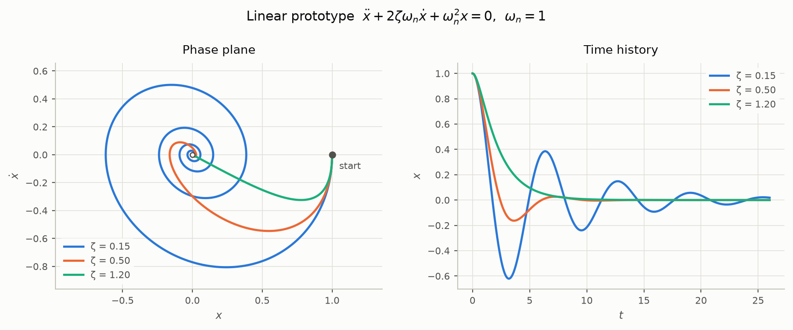
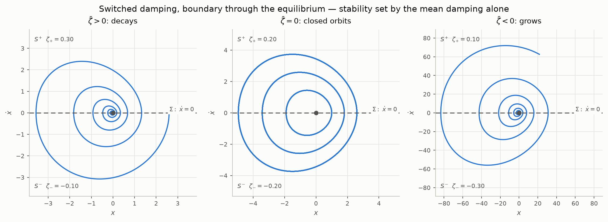
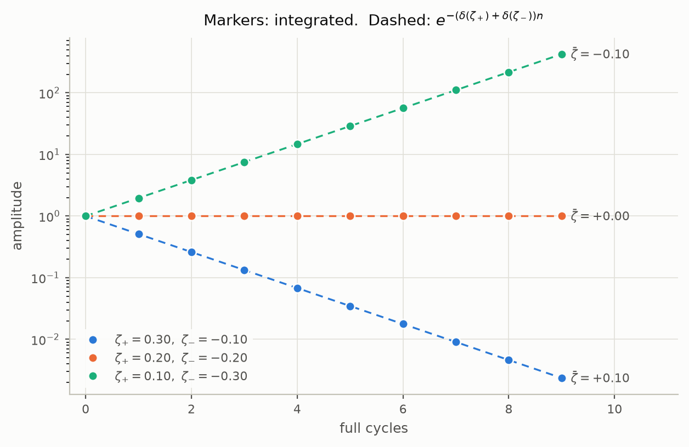
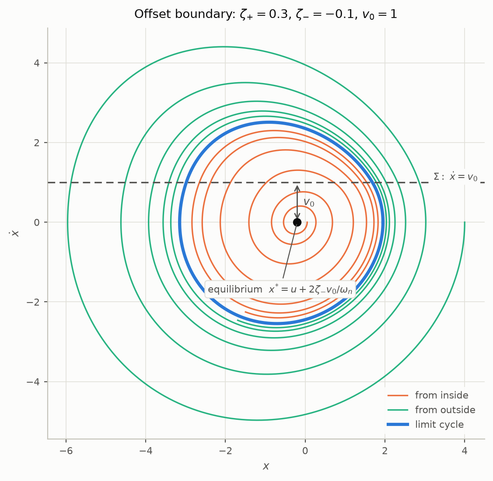
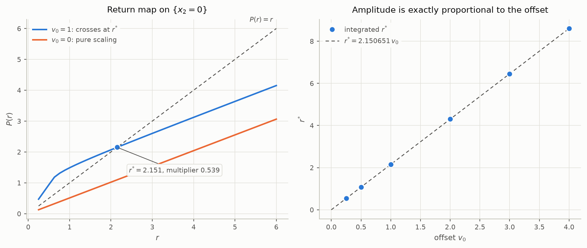

# Second order nonlinear prototype 

This project covers the second order nonlinear prototype. The starting point is
the second order **linear** prototype; the nonlinear prototype builds on it by
introducing a switching boundary in the phase plane.

## Second order linear prototype

As a single second order ordinary differential equation:

```math
\ddot{x} + 2\zeta\omega_n\dot{x} + \omega_n^2 x = \omega_n^2 u(t)
```

where $`\omega_n`$ is the undamped natural frequency, $`\zeta`$ is the damping
ratio, and $`u(t)`$ is the input. In raw coefficient form this is

```math
m\ddot{x} + c\dot{x} + kx = f(t)
```

with $`\omega_n = \sqrt{k/m}`$ and $`\zeta = c / (2\sqrt{km})`$.

## As a set of first order ordinary differential equations

Taking the states as position and velocity, $`x_1 = x`$ and $`x_2 = \dot{x}`$:

```math
\begin{aligned}
\dot{x}_1 &= x_2 \\
\dot{x}_2 &= -\omega_n^2 x_1 - 2\zeta\omega_n x_2 + \omega_n^2 u
\end{aligned}
```

The second derivative $`\ddot{x}`$ no longer appears: one second order equation
has become two coupled first order equations, with $`\dot{x}_2`$ carrying what
was $`\ddot{x}`$.

## State space form

```math
\begin{bmatrix}\dot{x}_1 \\ \dot{x}_2\end{bmatrix}
=
\begin{bmatrix}0 & 1 \\ -\omega_n^2 & -2\zeta\omega_n\end{bmatrix}
\begin{bmatrix}x_1 \\ x_2\end{bmatrix}
+
\begin{bmatrix}0 \\ \omega_n^2\end{bmatrix} u
```

```math
y = \begin{bmatrix}1 & 0\end{bmatrix}
\begin{bmatrix}x_1 \\ x_2\end{bmatrix}
```

<picture>
  <source media="(prefers-color-scheme: dark)" srcset="figures/linear-prototype-dark.png">
  
</picture>

*The linear prototype for three damping ratios. Every trajectory spirals into the single equilibrium at the origin; larger $`\zeta`$ removes the overshoot entirely.*

## Nonlinear prototype: switched damping across a boundary on the x-axis

The first nonlinear prototype keeps the dynamics linear on either side of a
single straight switching boundary, and puts the nonlinearity in the **damping
coefficient**. Taking the phase plane with $`x`$ on the horizontal axis and
$`\dot{x}`$ on the vertical axis, the boundary is the x-axis itself:

```math
\Sigma = \{ (x_1, x_2) \in \mathbb{R}^2 : h(x_1, x_2) = x_2 = 0 \}
```

splitting the plane into the two open half planes

```math
S^{+} = \{ x_2 > 0 \}, \qquad S^{-} = \{ x_2 < 0 \}
```

Since $`x_2 = \dot{x}`$, the boundary is crossed whenever the velocity changes
sign. The damping ratio takes a different value on each side:

```math
\ddot{x} + 2\zeta(\dot{x})\,\omega_n\dot{x} + \omega_n^2 x = \omega_n^2 u(t),
\qquad
\zeta(\dot{x}) =
\begin{cases}
\zeta_{+} & \dot{x} > 0 \\
\zeta_{-} & \dot{x} < 0
\end{cases}
```

Writing the mean and half difference of the two damping ratios as
$`\bar{\zeta} = (\zeta_{+} + \zeta_{-})/2`$ and
$`\Delta\zeta = (\zeta_{+} - \zeta_{-})/2`$, the switch can be folded into a
single term and the nonlinearity shows up as an absolute value:

```math
\ddot{x} + 2\omega_n\bar{\zeta}\,\dot{x} + 2\omega_n\Delta\zeta\,\lvert\dot{x}\rvert + \omega_n^2 x = \omega_n^2 u(t)
```

Setting $`\Delta\zeta = 0`$ recovers the linear prototype exactly.

### As a set of first order ordinary differential equations

With $`x_1 = x`$ and $`x_2 = \dot{x}`$ as before:

```math
\begin{aligned}
\dot{x}_1 &= x_2 \\
\dot{x}_2 &= -\omega_n^2 x_1 - 2\omega_n\left(\bar{\zeta}x_2 + \Delta\zeta\lvert x_2 \rvert\right) + \omega_n^2 u
\end{aligned}
```

Equivalently, as one linear system per half plane, $`\dot{x} = A^{\pm}x + b\,u`$:

```math
A^{\pm} =
\begin{bmatrix}
0 & 1 \\
-\omega_n^2 & -2\zeta_{\pm}\omega_n
\end{bmatrix},
\qquad
b = \begin{bmatrix} 0 \\ \omega_n^2 \end{bmatrix}
\qquad \text{on } S^{\pm}
```

with eigenvalues $`\lambda_{\pm} = \omega_n\left(-\zeta_{\pm} \pm \sqrt{\zeta_{\pm}^2 - 1}\right)`$.

### The field is continuous across the boundary

This is the structural difference from putting the switch in a *force* term.
The two fields differ only in the damping term $`-2\zeta_{\pm}\omega_n x_2`$,
and that term vanishes on $`\Sigma`$ where $`x_2 = 0`$. So

```math
f^{+}(x) = f^{-}(x) \quad \text{for all } x \in \Sigma
```

The vector field is continuous everywhere — only its Jacobian jumps across
$`\Sigma`$. The system is therefore piecewise smooth and continuous, and
Lipschitz, so ordinary solutions exist and are unique: no Filippov convex
combination is needed, there is no sliding or sticking set, and every
trajectory crosses $`\Sigma`$ transversally except at an equilibrium. The
boundary changes the *rate* at which the system gains or loses energy, not the
force acting on it.

### Stability

Take $`u = 0`$, so the equilibrium is the origin. The system is not
differentiable there, so stability is decided by the half-cycle map rather
than by linearisation.

Within $`S^{-}`$, a trajectory leaving the boundary at $`(x_1, 0)`$ with
$`x_1 = A_n \gt 0`$ follows the linear system with damping $`\zeta_{-}`$, and for
$`\lvert\zeta_{-}\rvert \lt 1`$ returns to the boundary after exactly half a
damped period at $`(-A_n e^{-\delta(\zeta_{-})},\, 0)`$, where the logarithmic
decrement per half cycle is

```math
\delta(\zeta) = \frac{\pi\zeta}{\sqrt{1-\zeta^2}}
```

The next half cycle runs through $`S^{+}`$ with $`\zeta_{+}`$, so the amplitude
after a full cycle is

```math
A_{n+1} = A_n\,e^{-\left(\delta(\zeta_{+}) + \delta(\zeta_{-})\right)}
```

The origin is asymptotically stable exactly when
$`\delta(\zeta_{+}) + \delta(\zeta_{-}) \gt 0`$. Since $`\delta`$ is odd and
strictly increasing on $`(-1, 1)`$, this collapses to a condition on the mean
damping alone:

```math
\zeta_{+} + \zeta_{-} > 0
\qquad \Longleftrightarrow \qquad
\bar{\zeta} > 0
```

So one half plane may have **negative** damping and the origin still be
asymptotically stable, provided the other half plane damps harder. What
matters is the average over a cycle, not the sign on either side.

Three cases follow:

| condition | behaviour |
| --- | --- |
| $`\bar{\zeta} \gt 0`$ | origin asymptotically stable |
| $`\bar{\zeta} = 0`$ | full cycle map is the identity — a continuum of closed orbits |
| $`\bar{\zeta} \lt 0`$ | origin unstable, oscillation grows without bound |

**There is no limit cycle.** With $`u = 0`$ the field is positively homogeneous
of degree one, $`f(\lambda x) = \lambda f(x)`$ for $`\lambda \gt 0`$, so the return
map is an exact scaling and its behaviour cannot depend on amplitude.
Stability is global, and the marginal case gives a continuum of periodic
orbits rather than an isolated one. Producing an isolated limit cycle requires
amplitude dependence — a $`\zeta`$ that varies with $`x`$, or a boundary that does
not pass through the equilibrium.

For constant $`u \neq 0`$ the equilibrium moves to $`(u, 0)`$, which still lies on
$`\Sigma`$, and the same analysis applies in the shifted coordinate $`x_1 - u`$.

<picture>
  <source media="(prefers-color-scheme: dark)" srcset="figures/switched-damping-dark.png">
  
</picture>

*The three cases, with $`\Sigma`$ on the x-axis. Note the middle panel: at $`\bar{\zeta} = 0`$ the closed orbits come in a continuum, one through every starting point, rather than as one isolated cycle.*

<picture>
  <source media="(prefers-color-scheme: dark)" srcset="figures/decrement-dark.png">
  
</picture>

*Amplitude after each full cycle, integrated (markers) against $`e^{-(\delta(\zeta_+)+\delta(\zeta_-))n}`$ (dashed). Straight lines on a log scale: the decay is exactly geometric and its direction is set by the sign of $`\bar{\zeta}`$, not by the sign of either $`\zeta_{\pm}`$ alone.*

### Notes for numerical work

- Both half planes must be underdamped, $`\lvert\zeta_{\pm}\rvert \lt 1`$, for the
  half cycle map above to be defined. If the trajectory enters a half plane
  with $`\zeta_{\pm} \ge 1`$ it decays monotonically to the equilibrium without
  recrossing $`\Sigma`$; with $`\zeta_{\pm} \le -1`$ it diverges monotonically.
- The field is continuous, so a general purpose integrator will not chatter
  the way it would across a discontinuous force. Accuracy still drops at each
  crossing because the Jacobian jumps, so use event detection on $`x_2 = 0`$ to
  place a step boundary at the switch.
- $`\bar{\zeta} = 0`$ is non-hyperbolic and structurally fragile: integration
  error alone will make the orbits drift in or out.

## Offsetting the boundary from the equilibrium

The previous prototype has no isolated limit cycle. The reason was scale
invariance, and that points at what has to change: not the position of the
boundary relative to the *axis*, but its position relative to the
*equilibrium*.

Positive homogeneity, $`f(\lambda x) = \lambda f(x)`$, holds precisely when the
switching set is a cone through the fixed point — for a straight boundary,
a line through the equilibrium. Every equilibrium of a second order system has
$`\dot{x} = 0`$ and so lies on the x-axis. Putting the boundary on the x-axis
therefore *forces* it through the equilibrium, which is exactly what made the
return map a pure scaling. Moving the boundary off the axis is the way to move
it off the equilibrium, and that is what breaks the degeneracy.

### Keeping the field continuous

Offsetting needs a little care. Switching on $`\dot{x} - v_0`$ while the damping
still acts on the absolute velocity $`\dot{x}`$ makes the field jump across the
boundary by $`2(\zeta_{+}-\zeta_{-})\omega_n v_0 \neq 0`$, which brings Filippov
solutions and sliding back. To isolate the offset as the only new ingredient,
let the damping act on the velocity *relative to the boundary*,
$`w = \dot{x} - v_0`$:

```math
\ddot{x} + 2\zeta(w)\,\omega_n w + \omega_n^2 x = \omega_n^2 u(t),
\qquad
\zeta(w) =
\begin{cases}
\zeta_{+} & w > 0 \\
\zeta_{-} & w < 0
\end{cases}
```

The damping term vanishes on $`\Sigma = \{ \dot{x} = v_0 \}`$, so the field is
again continuous there and solutions stay unique. This is the geometry of a
mass on a belt moving at speed $`v_0`$.

The equilibrium sits at

```math
x^{*} = \left( u + \frac{2\zeta_{-}v_0}{\omega_n},\; 0 \right)
```

a distance $`v_0`$ from $`\Sigma`$ in the $`x_2`$ direction. For $`v_0 \gt 0`$ it lies in
the $`w \lt 0`$ region, so its local stability is governed by $`\zeta_{-}`$ alone.

### Why this produces a limit cycle

The offset makes the share of each cycle spent on either side of $`\Sigma`$
depend on amplitude, which is precisely what the through-equilibrium case
could not do:

- orbits small enough never reach $`\Sigma`$ and see damping $`\zeta_{-}`$ only;
- as amplitude grows the fraction of the cycle spent in $`w \gt 0`$ rises towards
  one half, so the effective damping tends to the mean $`\bar{\zeta}`$.

The effective damping therefore runs from $`\zeta_{-}`$ at small amplitude to
$`\bar{\zeta}`$ at large amplitude. If those two have opposite signs it must
vanish somewhere in between, and that amplitude is a limit cycle:

```math
\zeta_{-} < 0 < \bar{\zeta} = \frac{\zeta_{+} + \zeta_{-}}{2}
```

Small oscillations grow because the equilibrium is an unstable focus; large
ones decay because the cycle average is dissipative. The cycle is where the
two balance.

<picture>
  <source media="(prefers-color-scheme: dark)" srcset="figures/limit-cycle-dark.png">
  
</picture>

*The equilibrium sits a distance $`v_0`$ below $`\Sigma`$ and is an unstable focus, so trajectories starting inside spiral outwards and those starting outside spiral inwards, both onto the same closed orbit.*

### The cycle is hyperbolic, not a conservative artefact

This is the substantive difference from the marginal case $`\bar{\zeta} = 0`$ of
the previous section, where the closed orbits came in a continuum and existed
only on a knife edge. Taking $`\omega_n = 1`$, $`u = 0`$, $`\zeta_{+} = 0.3`$,
$`\zeta_{-} = -0.1`$, $`v_0 = 1`$ and the section
$`\{x_2 = 0,\; x_1 \gt x_1^{*}\}`$ with $`r = x_1 - x_1^{*}`$, the return map $`P`$ has

```math
r^{*} = 2.150651224, \qquad T = 6.367077, \qquad
\left.\frac{dP}{dr}\right|_{r^{*}} = 0.5390
```

The multiplier is strictly inside the unit circle, so the orbit is hyperbolic
and attracting: trajectories starting anywhere from $`r_0 = 0.02`$ to
$`r_0 = 40`$ converge to the same orbit. Perturbing $`\zeta_{+}`$ by $`\pm 10\%`$
moves $`r^{*}`$ smoothly over $`2.34 \ldots 2.01`$ without destroying the cycle.
Nothing here rests on a conserved quantity, a centre, or a family of
neutrally stable orbits — the cycle is a dissipative attractor with a basin,
and it survives perturbation.

The existence condition behaves as predicted:

| $`\zeta_{+}`$ | $`\zeta_{-}`$ | $`\bar{\zeta}`$ | result |
| --- | --- | --- | --- |
| $`+0.30`$ | $`-0.10`$ | $`+0.100`$ | limit cycle, $`r^{*} = 2.1507`$ |
| $`+0.05`$ | $`-0.10`$ | $`-0.025`$ | grows unbounded |
| $`+0.30`$ | $`+0.10`$ | $`+0.200`$ | decays to the equilibrium |
| $`+0.10`$ | $`-0.30`$ | $`-0.100`$ | grows unbounded |

Setting $`v_0 = 0`$ with the same damping ratios restores the pure scaling of
the previous section: successive radii $`0.510562,\ 0.260674,\ 0.133090,\ldots`$
in constant ratio $`0.510562 = e^{-(\delta(\zeta_{+}) + \delta(\zeta_{-}))}`$,
with no fixed point away from the origin.

### The offset is the unfolding parameter

With $`u = 0`$ the system is invariant under
$`(x, v_0) \mapsto (\lambda x, \lambda v_0)`$ for $`\lambda \gt 0`$, because $`\zeta`$
depends only on the sign of $`w`$. The limit cycle amplitude is therefore
*exactly* proportional to the offset,

```math
r^{*}(v_0) = v_0\, r^{*}(1)
```

confirmed numerically as $`r^{*}/v_0 = 2.150651224`$ to ten significant figures
for $`v_0 = 0.25, 1, 4, 16`$. So $`v_0`$ unfolds the degeneracy: as
$`v_0 \to 0`$ the cycle shrinks onto the equilibrium and collides with the
boundary, recovering the scale invariant case. This is a
discontinuity-induced (boundary equilibrium) bifurcation rather than a smooth
Hopf, and the linear growth $`r^{*} \propto v_0`$ rather than
$`\sqrt{\text{parameter}}`$ is its signature.

Two caveats. Uniqueness of the crossing is observed numerically over the
amplitudes tested, not proved here. And the offset only helps because it
separates the boundary from the equilibrium: a boundary that still passes
through the equilibrium, at any angle, leaves the system homogeneous and the
result of the previous section intact.

<picture>
  <source media="(prefers-color-scheme: dark)" srcset="figures/return-map-dark.png">
  
</picture>

*Left: the return map. With the boundary offset it crosses $`P(r) = r`$ transversally at $`r^{*}`$; with the boundary through the equilibrium it is a ray through the origin that never crosses. Right: the amplitude is exactly proportional to the offset.*
