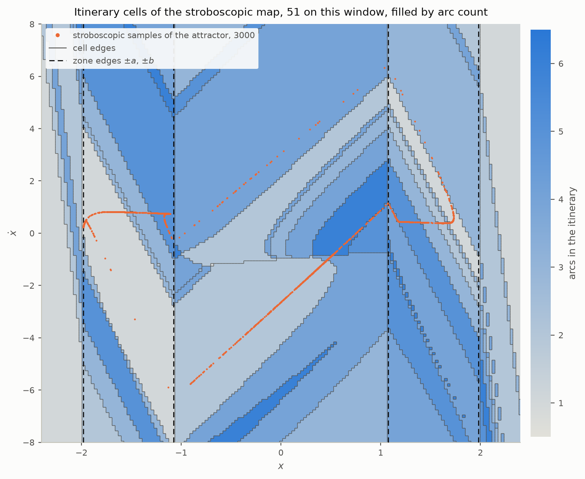
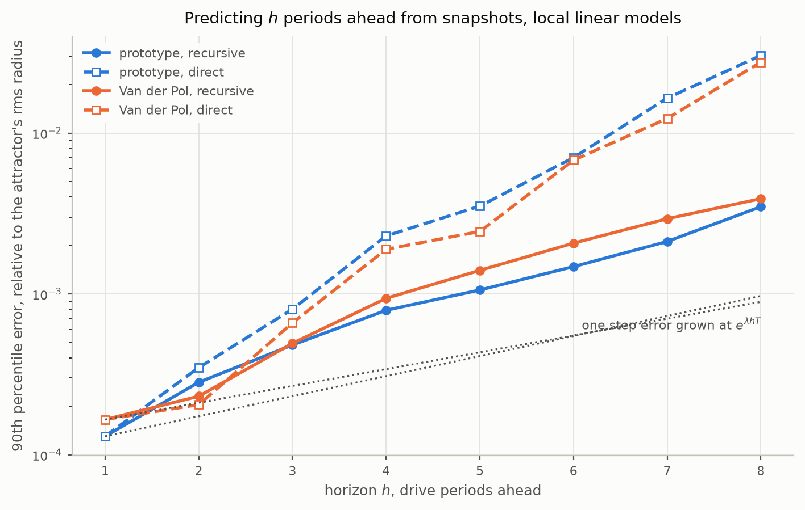

# The stroboscopic map: a two dimensional section

`MAPS.md` turned the prototypes into discrete maps on a *geometric*
section, the line $`\dot{x} = 0`$, and ended by declaring the line of work
closed: the sequence of zones a trajectory visits cannot be known before
stepping it, so a chain of arcs is an event driven simulation and not a
predictive difference equation.

This document revisits that verdict with one change. The section is not a
line in the phase plane but the **whole phase plane, sampled once per drive
period** — a snapshot $`(x, \dot{x})`$ taken every time the forcing
completes a cycle. The map sends each snapshot to the next. It is two
dimensional, it is defined at every point, and every point returns after
exactly the same time.

Only the three level prototype of `THREELEVEL.md` is treated, at the drive
it was fitted at, and everything that can be checked against the Van der
Pol oscillator it was fitted to is checked. The other prototypes of
`MAPS.md` are not revisited. `strobe.py` produces every number below and
the two figures.

The system throughout:

| | |
| --- | --- |
| model | $`\zeta = (-1.7351,\ 3.8360,\ 15.0471)`$, edges $`a = 1.0750`$, $`b = 1.9812`$ — `staircase.THREE_FITTED` |
| drive | $`A = 5`$, $`\Omega = 2.470`$, period $`T = 2.5438`$ — inside the chaotic band both systems have between lock 3 and lock 5 |
| control | Van der Pol at $`\mu = 5`$ under the same drive |

## What the change of section buys

On the geometric section, a return is an event: it happens when the
trajectory next crosses the line downwards, after a time that depends on
the state, and it may not happen at all. On the stroboscopic section the
return is a clock tick. That has three consequences, and all of the rest
follows from them.

**The map is total.** Every point of the plane has an image after time
$`T`$. There is no orbit that fails to return.

**The map is continuous.** The state after a fixed time is a continuous
function of the state before it, for any field whose solutions are unique,
and the three level field is one — discontinuous across its walls but
never sliding, as `README.md` establishes. So the map has no jumps, only
places where its derivative misbehaves.

**The itinerary is a function of the point.** Which zones the orbit visits
during one period, and in what order, is decided by where it starts. So
the plane is tiled into **cells**, one per itinerary, and inside a cell the
sequence of zones is fixed. That is exactly the information `MAPS.md` said
could not be known in advance. It cannot be known *analytically*, but it
is a partition of the plane that can be computed once and then looked up.

## The difference equation on a cell

Inside a cell the orbit takes $`m`$ arcs, in zones $`k_1, \ldots, k_m`$
with dwells $`\tau_1, \ldots, \tau_m`$ summing to $`T`$. Each arc is a
forced arc matrix of `maps.py`, $`5 \times 5`$ on the augmented state
$`[x, \dot{x}, \cos\Omega t, \sin\Omega t, 1]`$, and the step is their
product:

```math
M(\tau) = M_{k_m}(\tau_m) \cdots M_{k_1}(\tau_1)
```

On the stroboscopic section the drive state is $`(1, 0)`$ at every sample,
so the step collapses to an **affine map of the plane**:

```math
y_{n+1} = A(\tau)\, y_n + b(\tau),
\qquad
A(\tau) = \Phi(\zeta_{k_m}, \tau_m) \cdots \Phi(\zeta_{k_1}, \tau_1)
```

with $`\Phi`$ the zone transition matrix and $`b`$ carrying the drive's
particular solutions through the same product. The dwells are where the
nonlinearity lives: each solves a crossing equation in the state, so
$`\tau = \tau_\sigma(y_n)`$ depends on the point and on the cell
$`\sigma`$ it is in.

Written out, the stroboscopic map is a **set of three equations**:

```math
\sigma_n = \sigma(y_n),
\qquad
\tau_n = \tau_{\sigma_n}(y_n),
\qquad
y_{n+1} = A(\tau_n)\, y_n + b(\tau_n)
```

The first is a lookup on the partition. The second is a smooth function on
each cell. The third is exact arithmetic. This is the form the rest of the
document works with, and it is verified: the product $`M(\tau)`$
reproduces the event stepping of `maps.strobe_step` to $`3.7 \times
10^{-14}`$ over fifty steps of the attractor, $`A`$ is the product of the
$`\Phi`$ blocks to $`10^{-12}`$, and the dwells of every step sum to
$`T`$ to $`10^{-12}`$.

For the first step of the orbit, an itinerary through the core and back
into the band:

```math
A = \begin{bmatrix} -24.397 & -2.556 \\ 0.0328 & -0.0007 \end{bmatrix},
\qquad
b = \begin{bmatrix} -32.595 \\ 0.649 \end{bmatrix}
```

The determinant of $`A`$ is $`0.1`$ against a second column that is
essentially zero: one direction is stretched twenty-four fold and the
other annihilated. That is the strong dissipation `MAPS.md` found squeezing
the attractor onto a curve, read off one matrix.

## How many cells there are

**On the attractor, seventeen.** Over six thousand samples of the chaotic
orbit, the itineraries that occur:

| share | arcs | itinerary, as zones with the wall crossed between |
| --- | --- | --- |
| 19.9% | 1 | band |
| 18.1% | 2 | band, $`+a`$, core |
| 12.1% | 3 | band, $`-a`$, core, $`+a`$, band |
| 12.1% | 2 | core, $`-a`$, band |
| 11.9% | 5 | band, $`-a`$, core, $`+a`$, band, $`+b`$, outer, $`+b`$, band |
| 5.9% | 3 | band, $`-a`$, core, $`-a`$, band |
| 5.5% | 5 | band, $`+a`$, core, $`-a`$, band, $`-b`$, outer, $`-b`$, band |
| 2.9% | 6 | core, $`+a`$, band, $`+a`$, core, $`-a`$, band, $`-b`$, outer, $`-b`$, band |
| 12 more | 2 to 5 | each under 2.1%, together 11.6% |

The eight most visited cells carry 88% of the steps. Each of the seventeen
is one affine map of the form above, so on the attractor the chaotic
stroboscopic map is **seventeen affine maps and a rule for choosing among
them**. Notice that the itineraries are short — one to six arcs, never
more — and that the outer zone is only ever visited as a brief excursion
through the wall at $`\pm b`$ and straight back; the orbit never ends a
period there.

**On a window of the plane, fifty-one.** A grid of $`161 \times 161`$
points over $`x \in [-2.4, 2.4]`$, $`\dot{x} \in [-8, 8]`$, which contains
the attractor with room to spare:

<picture>
  <source media="(prefers-color-scheme: dark)" srcset="figures/strobe-partition-dark.png">
  
</picture>

*The plane tiled by itinerary. Fill is the number of arcs, cell edges are drawn, the zone edges are dashed, and the attractor's samples lie on top. The attractor threads seventeen of the fifty-one cells.*

The cells are large and simply shaped: bands running diagonally, because a
point higher in $`\dot{x}`$ reaches the same wall sooner, cut by the
vertical zone edges and by curves along which the orbit grazes a wall.
Nothing in the picture is fractal. The partition is *coarse*, which is the
property that makes it usable.

## What the map does at the edges of a cell

`MAPS.md` gave grazing as the second reason to close the work: where the
orbit touches a wall without crossing, the branch structure changes and
the derivative is undefined. `speculation.md` put Nordmark's square root
first on its reading list. Here that is measured.

There are three kinds of edge, and they behave differently.

**A grazing edge**, where an excursion into a neighbouring zone shrinks to
nothing. Symmetric differences straddling the edge at distance $`s`$, so
that anything smooth cancels — the second difference of the map,
$`\lvert P(y_b + sn) + P(y_b - sn) - 2P(y_b) \rvert`$, and the difference
of its Jacobian either side:

| $`s`$ | second difference | Jacobian difference |
| --- | --- | --- |
| $`10^{-2}`$ | $`4.0\times10^{-4}`$ | $`6.6\times10^{-2}`$ |
| $`10^{-3}`$ | $`1.3\times10^{-5}`$ | $`1.9\times10^{-2}`$ |
| $`10^{-4}`$ | $`4.7\times10^{-7}`$ | $`6.9\times10^{-3}`$ |
| $`10^{-5}`$ | $`1.6\times10^{-8}`$ | $`2.4\times10^{-3}`$ |
| $`3\times10^{-6}`$ | $`2.6\times10^{-9}`$ | $`1.3\times10^{-3}`$ |

Fitted exponents 1.47 and 0.47; a second grazing edge gives 1.68 and 0.65.
A smooth map would give 2 and 1; a map with a corner would give 1 and 0.
This is neither: the map is $`C^1`$ across a grazing edge, and the
singularity is one order up — the derivative varies as a **square root**
of the distance to the edge, so the second derivative is what diverges.
The exponents are observed, not derived, though the derivation is short:
the damping force across a displacement wall jumps by
$`2\Delta\zeta\,\omega_n\dot{x}`$, whose integral over an excursion that
returns to the same $`x`$ vanishes at first order, leaving an effect of
order $`s^{3/2}`$.

So Nordmark's square root **does not appear in the map**. It appears in
the *dwells*: the time spent on an excursion grows as the square root of
the distance past the edge, and that singularity is only visible if the
dwells are what one tries to predict. That distinction decides the
learning results below.

**A zone edge**, the line $`x = -a`$ itself, where the starting point
changes zone. Second difference exponent 1.00, Jacobian difference a
constant 0.81: the map has a corner, with a jump in its derivative equal
to the saltation factor of the wall. These edges are straight lines at
known places.

**A resolution edge.** The partition is computed, and the crossing search
that computes it has a resolution of its own: an excursion shorter than
about $`10^{-3}`$ in time can fall between the points of its scan. Where
that happens the computed edge sits at a small but non-zero dwell rather
than at the true tangency, and the computed map carries a derivative jump
of $`4\times10^{-4}`$ and a jump in value of $`10^{-9}`$ there. That is the
numerical fuzz of the partition, and it is small.

### What building it cost

Measuring the map across a grazing edge exposed a failure in
`maps.strobe_step` of the kind `MAPS.md` records: an answer of order one
that looked like a completed step. Exactly at a tangency the scan found
the *entry* into the outer zone and missed the *exit* $`4\times10^{-5}`$
later, then coasted the remaining 1.37 time units in a zone with
$`\zeta = 15`$ and landed 0.4 away from where its neighbours $`10^{-9}`$
either side landed. The step now checks that every coasting arc ends in
the zone it was computed in; when it does not, a crossing was missed, and
the step either recovers it on a fine grid or, if the excursion is below
resolution, drops it and continues in the zone the orbit came from. On the
staircases `MAPS.md` measured, the repair never fires in a thousand steps,
so the exponents published there stand; nor does it fire once in the 6000
steps of this attractor. The failure lives on a sliver of the plane a free
running orbit does not visit, which is why the chain checks of `MAPS.md`
never saw it. The script counts the repairs it makes.

Independently of the repair, every one of the 6000 steps of the attractor
was integrated directly and compared with the exact map. The median
disagreement is $`10^{-10}`$; the worst is $`3\times10^{-6}`$, on a step
with a short excursion into the core — and there the same integrator at a
tighter tolerance, and a different integrator, agree with the map to
$`5\times10^{-12}`$. The $`10^{-6}`$ is the integration floor of the
piecewise field `MAPS.md` measured, and it belongs to the integrator.

## The locked orbits, and their poles

Before the chaotic drive, a check that the two dimensional map gives what
`MAPS.md`'s z-domain section asked for. Iterating the exact map at eight
drive frequencies, against `section.lock_order` on Van der Pol integrated
under the same drive:

| $`\Omega`$ | 2.20 | 2.30 | 2.40 | 2.45 | 2.47 | 2.50 | 2.60 | 3.00 |
| --- | --- | --- | --- | --- | --- | --- | --- | --- |
| prototype | lock 3 | lock 3 | lock 3 | none | none | lock 5 | lock 5 | lock 5 |
| Van der Pol | lock 3 | lock 3 | lock 3 | lock 4 | none | lock 5 | lock 5 | lock 5 |

The same locks in the same places. At 2.45 Van der Pol sits on an
interleaved period 4 lock inside the band and the prototype does not — a
lock inside a chaotic band being exactly the kind of fine structure
`THREELEVEL.md` reports the two systems trading at the cell level.

At $`\Omega = 2.30`$ the lock is a period 3 orbit of the map. Newton with
the exact Jacobian product converges to it exactly, and its Jacobian's two
eigenvalues are its two poles: $`4.6\times10^{-4}`$ and $`0`$ to double
precision. On a two dimensional section a locked orbit has two
multipliers, one per direction, and here one of them is below what double
precision can represent — the same annihilation `MAPS.md` saw make a
finite difference return bit zero. Van der Pol's period 3 orbit at the
same drive, by finite differences (`section.multipliers`), has poles
$`3.1\times10^{-4}`$ and $`6\times10^{-6}`$: the same magnitude for the
surviving pole and a noise floor for the other, which is what a
differenced Jacobian gives, for the reason `section.py` records.

## Multiple prediction problems

The point of writing the map as three equations is that each is a
different kind of prediction problem, and computer science has a vocabulary
for what happens when a hard prediction problem is split into several
easier ones. Four ideas from that literature are exploited here.

- **Mixture of experts.** A gate chooses one of several local models and
  the chosen model predicts; the gate learns the partition, the experts
  learn the pieces. Here the gate is the cell, $`\sigma(y)`$, and the
  experts are one map per cell. (Jacobs, Jordan, Nowlan and Hinton, 1991.)
- **Hybrid system identification.** The same decomposition from the
  control side: a piecewise affine system is identified by clustering the
  data into modes, classifying the modes, and regressing within each.
  (Ferrari-Trecate, Muselli, Liberati and Morari, 2003; Paoletti, Juloski,
  Ferrari-Trecate and Vidal, 2007.)
- **Local models, the method of analogues.** Rather than one global fit,
  a separate affine model for each query, fitted to its nearest
  neighbours in the record. Lorenz's analogue forecasting, made
  quantitative for chaotic time series by Farmer and Sidorowich (1987).
- **Recursive against direct multi-step prediction.** To predict $`h`$
  steps ahead, either iterate a one step model $`h`$ times or fit one
  model per horizon directly — a *separate prediction problem per
  horizon*. Recursive compounds its errors; direct must learn a harder
  function. (Ben Taieb, Bontempi, Atiya and Sorjamaa, 2012.)

The experiment: 4000 consecutive stroboscopic snapshots of the attractor
as the training record, the next 2000 as the test, and the map fitted from
the snapshots alone, as it would be from a measurement. Errors are
relative to the attractor's root mean square radius (1.33 for the
prototype, 1.39 for Van der Pol) and reported as median, 90th percentile
and maximum over the test record.

### One problem, or several

| how the map is fitted | prototype | Van der Pol |
| --- | --- | --- |
| one global polynomial, degree 4 | 0.36 / 1.2 / 4.4 | 0.27 / 1.2 / 4.1 |
| one global polynomial, degree 8 | 0.24 / 1.0 / 4.2 | — |
| gated, one cubic per cell | $`3\times10^{-4}`$ / 0.09 / 3.6 | — |
| local linear, 8 neighbours, gated | $`2\times10^{-6}`$ / $`1\times10^{-4}`$ / 0.08 | $`3\times10^{-6}`$ / $`2\times10^{-4}`$ / 0.08 |
| dwells regressed per cell, cubic, then the exact product | $`2\times10^{-3}`$ / 0.28 / 3.9 | — |
| dwells regressed locally, then the exact product | $`1\times10^{-5}`$ / $`4\times10^{-4}`$ / 0.05 | — |
| the true dwells through the exact product | $`3\times10^{-16}`$ / $`2\times10^{-15}`$ / $`3\times10^{-14}`$ | — |

Read down the first column.

**A single global problem fails.** A polynomial of degree 8 in two
variables has 45 coefficients and still misses by a quarter of the
attractor's radius at the median. The map is not one smooth function: it
is fifty-one of them joined at edges, and no polynomial of useful degree
follows that.

**Splitting on the cell fixes the median and not the tail.** One cubic per
cell brings the median down by three orders. Its 90th percentile is still
9% and its worst case is the whole attractor. The reason is the shape of
the data, not the shape of the map: the attractor is a curve a few per
cent thick, so within a cell the snapshots lie almost on a line, and a
polynomial fitted along a line is unconstrained across it. Test points
that sit slightly off the line get whatever the polynomial extrapolates.
Snapshots of a free running orbit sample the map *on the attractor*, not
on the plane.

**Local models are what work.** A separate affine fit to the eight nearest
snapshots predicts the next one to two millionths of the radius at the
median, and to a ten-thousandth at the 90th percentile. Nothing is
extrapolated, because every prediction is made among data. This is the
form a measured system would be modelled in.

**The exact structure does not help the fit, and the reason is the square
root.** Regressing the dwells and pushing them through the exact matrix
product is worse than fitting the map directly — by an order of magnitude
locally, and by everything globally, where a cubic per cell in the dwells
reaches 28% at the 90th percentile. The dwell functions carry the square
root singularities at the grazing edges of every cell; the map, being
$`C^1`$ there, does not. The decomposition into cell, dwells and product
is exact, but it moves the difficulty into the part that has to be learned.
Fitting the *map* on each cell is the better set of prediction problems.

### The gate is cheap to get wrong

The gate learned from the record — the itinerary of the nearest training
snapshot — is right for 99.9% of test points, wrong for two in two
thousand. Where it is wrong, the gated local model's error is
$`2.5\times10^{-6}`$; where it is right, the median is the same and the
tail is longer. Giving the fit the *true* cell instead changes nothing in
any row of the table.

That is the $`C^1`$ result from the edges section doing work. A point
just across a grazing edge, handed to the neighbouring cell's model, gets
the analytic continuation of a map that agrees with the true one in value
and in slope. Misclassification near an edge costs $`s^{3/2}`$, and the
gate only errs near edges. The classification problem, which is the one
`MAPS.md` said could not be solved in advance, turns out to be both easy
and forgiving.

### Several steps ahead

Predicting $`h`$ drive periods ahead with the local linear model, iterated
(recursive) against refitted per horizon (direct), on both systems:

| $`h`$ | prototype, recursive | prototype, direct | Van der Pol, recursive | Van der Pol, direct | $`e^{\lambda h T}`$ |
| --- | --- | --- | --- | --- | --- |
| 1 | $`1.8\times10^{-6}`$ / $`1.3\times10^{-4}`$ | same | $`2.7\times10^{-6}`$ / $`1.7\times10^{-4}`$ | same | 1.3 / 1.3 |
| 2 | $`5.2\times10^{-6}`$ / $`2.8\times10^{-4}`$ | $`4.2\times10^{-6}`$ / $`3.5\times10^{-4}`$ | $`7.0\times10^{-6}`$ / $`2.3\times10^{-4}`$ | $`5.6\times10^{-6}`$ / $`2.1\times10^{-4}`$ | 1.8 / 1.6 |
| 4 | $`1.5\times10^{-5}`$ / $`7.9\times10^{-4}`$ | $`2.6\times10^{-5}`$ / $`2.3\times10^{-3}`$ | $`1.9\times10^{-5}`$ / $`9.4\times10^{-4}`$ | $`2.1\times10^{-5}`$ / $`1.9\times10^{-3}`$ | 3.2 / 2.6 |
| 8 | $`5.1\times10^{-5}`$ / $`3.5\times10^{-3}`$ | $`1.8\times10^{-4}`$ / $`3.0\times10^{-2}`$ | $`7.4\times10^{-5}`$ / $`3.9\times10^{-3}`$ | $`2.3\times10^{-4}`$ / $`2.8\times10^{-2}`$ | 9.9 / 6.9 |

<picture>
  <source media="(prefers-color-scheme: dark)" srcset="figures/strobe-horizon-dark.png">
  
</picture>

*The 90th percentile error against horizon. Solid: the one step model iterated. Dashed: a fresh model per horizon. Dotted: the one step error grown at the Lyapunov rate.*

**Recursive wins, on both systems, from four periods on.** At two and
three the two strategies are level; by eight periods ahead the direct fit
is seven to nine times worse at the 90th percentile.
That is the outcome Farmer and Sidorowich reported for clean deterministic
data and Ben Taieb's review attributes to an accurate one step model:
iterating a good model compounds a small error, while a direct model has
to learn $`P^h`$, which has $`e^{\lambda h T}`$ times the slope and, on
the prototype, a partition of 310 cells by $`h = 8`$ where $`P`$ had
seventeen. The error of the iterated model grows faster than the Lyapunov rate —
thirty-fold at $`h = 8`$ against ten on the prototype, twenty-fold against
seven on Van der Pol — because a local model's error is set by its worst
neighbourhoods, not by the typical stretch.

**And Van der Pol behaves the same way.** Same order of one step error,
same growth, same verdict between the two strategies. Every claim in this
section that can be tested on the smooth oscillator holds on it, so none
of it is an artefact of the prototype's piecewise structure. The
exponents that scale the last column are $`\lambda = 0.113`$ for the
prototype, from the exact Jacobian product, and $`0.095`$ for Van der Pol
by twin trajectories.

## Against Van der Pol, point by point

The learning results transfer. The map itself is another matter, and it
is worth being precise about what the prototype is and is not.

`THREELEVEL.md` establishes that the fitted model reproduces Van der Pol's
lock structure and its chaotic bands, and `MAPS.md` that the two
attractors have the same shape. Neither says that the two *maps* agree.
Evaluating both one period maps at 1500 points of Van der Pol's attractor:

| | median | 90th percentile | maximum |
| --- | --- | --- | --- |
| prototype's map against Van der Pol's, relative to the radius | 0.15 | 2.2 | 5.0 |
| within 1% of each other | 0.1% of points | | |
| within 10% | 13.5% of points | | |

**They do not agree pointwise.** At the median the two maps send the same
snapshot to places 15% of the attractor's radius apart, and for a tenth of
the points they disagree by more than the attractor is wide. The
disagreement is largest where a period ends near the relaxation jump: a
few per cent of timing difference there moves the velocity by several
units. As sets the attractors overlap — at a resolution of a tenth of the
radius, 82% of Van der Pol's samples lie on the prototype's attractor and
90% the other way — and the exponents are within 20%. As maps they are
different maps with the same regime structure.

That is the honest statement of what a prototype fitted on plateau edges
is: a model with the **same bifurcation structure**, not a surrogate for
the other system's dynamics one step at a time. Anyone wanting Van der
Pol's map to a millionth has it in the previous section, from Van der
Pol's own snapshots, with no prototype involved.

## What this changes about the closed verdict

`MAPS.md`'s reasons for closing the map route were that the zone sequence
cannot be known in advance, and that grazing makes the map's derivative
undefined. On the stroboscopic section:

- The zone sequence is a function of the starting point, the plane
  partitions into fifty-one cells on the window that matters and
  seventeen on the attractor, and the partition is a lookup. The sequence
  still cannot be *derived* — the cells are found by stepping, once each,
  not by algebra — but it no longer has to be discovered per trajectory.
- The map is continuous everywhere and $`C^1`$ across grazing edges. Its
  derivative is defined; its second derivative is not. The square root is
  real and lives in the dwells.
- The difference equation exists and is exact: seventeen affine maps and
  a gate. But the useful predictive object for a *measured* system is not
  that structure. It is the gate plus a local model per query, which is
  what a chaotic time series has always wanted, and which works the same
  on the smooth oscillator as on the piecewise one.

What does not survive is the hope that the structure, once found, would
be the thing to fit. The dwells are the wrong quantity to learn, for a
reason that is now measured rather than suspected.

## Reproducing the numbers

```
python3 strobe.py          # everything, and the two figures; a few minutes on four cores
python3 strobe.py quick    # without the phase plane partition and its figure
```

`maps.strobe_step` gained a `record` argument that returns the itinerary
and the dwells of a step, and the consistency check described above; both
are what `strobe.py` builds on. `python3 maps.py` still passes.

### References

1. R. Jacobs, M. Jordan, S. Nowlan, G. Hinton, "Adaptive mixtures of
   local experts", *Neural Computation* 3(1), 1991.
2. G. Ferrari-Trecate, M. Muselli, D. Liberati, M. Morari, "A clustering
   technique for the identification of piecewise affine systems",
   *Automatica* 39(2), 2003.
3. S. Paoletti, A. Juloski, G. Ferrari-Trecate, R. Vidal, "Identification
   of hybrid systems: a tutorial", *European Journal of Control* 13(2–3),
   2007.
4. J. D. Farmer, J. Sidorowich, "Predicting chaotic time series",
   *Physical Review Letters* 59(8), 1987.
5. E. Lorenz, "Atmospheric predictability as revealed by naturally
   occurring analogues", *Journal of the Atmospheric Sciences* 26, 1969.
6. S. Ben Taieb, G. Bontempi, A. Atiya, A. Sorjamaa, "A review and
   comparison of strategies for multi-step ahead time series forecasting
   based on the NN5 forecasting competition", *Expert Systems with
   Applications* 39(8), 2012.
7. A. Nordmark, "Non-periodic motion caused by grazing incidence in an
   impact oscillator", *Journal of Sound and Vibration* 145(2), 1991.
8. M. di Bernardo, C. Budd, A. Champneys, P. Kowalczyk, *Piecewise-smooth
   Dynamical Systems*, Springer, 2008 — the grazing normal forms by degree
   of smoothness, of which the $`3/2`$ measured here is the case of a
   discontinuous field.
