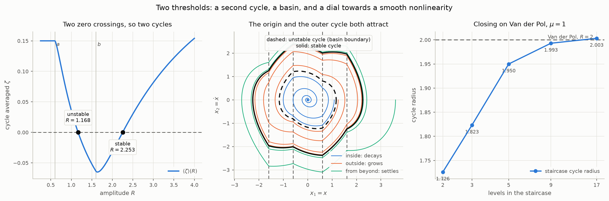
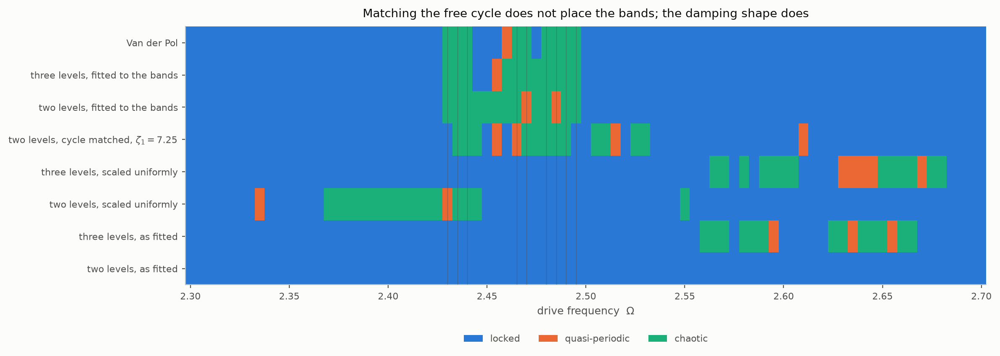
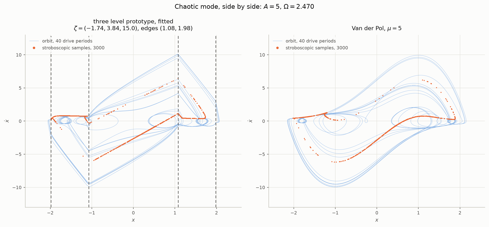
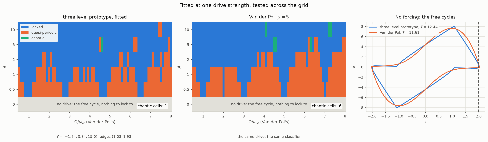
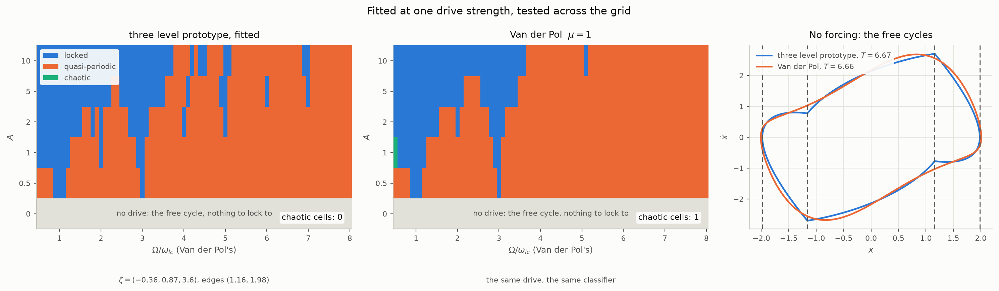
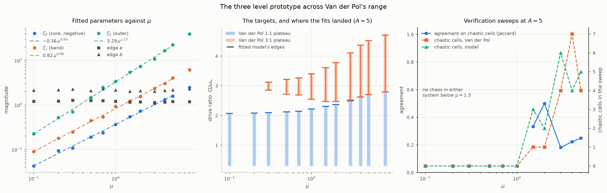

# The three level prototype

A second order oscillator whose damping ratio takes one of three values,
switched at two displacement thresholds. It is the fifth prototype of this
repository and the one that carries the behaviour the other four cannot:
hard excitation, and entrainment with chaos under a periodic drive, placed
where a smooth relaxation oscillator has it. `staircase.py` carries the
model, `maps.py` its exact map, and `figures.py` its figures.

The aim is the same utility the linear second order prototype has. That
prototype has two parameters, $`\omega_n`$ and $`\zeta`$, each read off a
measurement — a period and a decrement — and a set of charts that say what
the system will do. This document is the same thing for a system with
switched damping: which parameters there are, what each one is read from,
what behaviour each region of parameter space gives, and where the model is
known to hold. The target throughout is the Van der Pol oscillator in its
different modes of operation, because it is the smooth self-excited
oscillator whose behaviour is best mapped; the purpose is a model a user
can tune to their own data. A perfect match to Van der Pol is not the
criterion. Behavioural integrity is: the right kind of response, the
locks and the transitions in the right places, and the ability to say
that chaos is coming.

What is established, in one paragraph. Fitted to two plateau edges of Van
der Pol's driven response at $`\mu = 5`$ and one drive strength, the model
reproduces Van der Pol's lock structure at every drive strength on the
tested grid and its chaotic bands at the two strengths that have them,
missing one band a single fine cell wide, with a two per cent frequency
offset it inherits from a seven per cent longer free period. Its five
parameters are a shape chosen for the driven response, not a sampling of
Van der Pol's damping law. At $`\mu = 1`$, where Van der Pol only entrains
apart from one narrow period-doubled band, the fit is below.

## Parameters and units

```math
\ddot{x} + 2\zeta(x)\,\omega_n\dot{x} + \omega_n^2 x = A\cos\Omega t,
\qquad
\zeta(x) = \begin{cases} \zeta_{2} & |x| \gt b \\ \zeta_{1} & a \lt |x| \lt b \\ \zeta_{0} & |x| \lt a \end{cases}
```

Six numbers, of which one is a timescale and one an amplitude scale:

| parameter | what it does | units |
| --- | --- | --- |
| $`\omega_n`$ | sets every time: periods, settling, drive frequency | rad/s |
| the edges $`a \lt b`$ | set the amplitude scale; every orbit scales with them exactly | units of $`x`$ |
| $`\zeta_{0}`$ | damping inside the core, negative for self-excitation | — |
| $`\zeta_{1}`$ | damping in the band | — |
| $`\zeta_{2}`$ | damping outside | — |

Only the three ratios and the edge ratio $`a/b`$ carry behaviour. Every
result below is in units with $`\omega_n = 1`$ and $`b`$ of order 2, and
scales to a physical system by multiplying times by $`1/\omega_n`$ and
displacements by the measured amplitude over the model's. A drive enters
through two dimensionless numbers, the ratio $`r = \Omega/\omega_{lc}`$ of
drive frequency to free cycle frequency and the strength
$`a = A/(\omega_n b)`$; with them the forced model has four parameters.

## Definition

Every prototype in `README.md` switches the damping ratio **once**. This
one switches it twice. Take the symmetric displacement-switched member —
the piecewise constant Van der Pol, the README's last prototype — and add
a second threshold, giving five zones and three levels:

```math
\zeta(x) =
\begin{cases}
\zeta_{2} & |x| \gt b \\
\zeta_{1} & a \lt |x| \lt b \\
\zeta_{0} & |x| \lt a
\end{cases}
\qquad 0 \lt a \lt b
```

Nothing else changes: the field is still discontinuous and still never
slides, every zone is still an oscillation about the origin, and the arcs
are still the same kernels. `staircase.py` carries it, for any number of
levels.

### The reduction extends rather than restarts

The quantity $`2\phi - \sin 2\phi`$ already used above is the share of a
near-circular cycle's $`\dot{x}^2`$ weight lying beyond a threshold — the
damping does work at a rate proportional to $`\zeta(x)\dot{x}^2`$, and with
$`x = R\cos\theta`$ the zone $`|x| \gt e`$ is the arc where
$`|\cos\theta| \gt e/R`$. So levels simply stack:

```math
\langle\zeta\rangle(R) = \zeta_{0} + \sum_{k}(\zeta_{k} - \zeta_{k-1})\,w\!\left(\frac{e_k}{R}\right),
\qquad
w(c) = \frac{2\phi - \sin 2\phi}{\pi},\quad \phi = \arccos c
```

A limit cycle sits wherever this crosses zero. For two levels it collapses
to $`2\phi - \sin 2\phi = \pi\rho`$, the equation already derived — same
cycle radius as `displacement.py` to $`2.2\times10^{-16}`$, so none of the
earlier results are disturbed.

### What the second threshold buys: a second cycle

With one threshold $`\langle\zeta\rangle`$ runs monotonically from
$`\zeta_{0}`$ to $`\zeta_{1}`$ and can cross zero only once, so there is at
most one limit cycle. Three levels let it turn, and it can cross twice.

Taking $`\zeta_{0} = 0.15`$, $`\zeta_{1} = -0.25`$, $`\zeta_{2} = 0.40`$,
$`a = 0.6`$, $`b = 1.6`$ — quiet at the origin, self-exciting in a band,
heavily damped beyond it:

| cycle | averaged | exact | multiplier | |
| --- | --- | --- | --- | --- |
| inner | 1.16599 | 1.167844 | 4.188310 | unstable |
| outer | 2.25042 | 2.253398 | 0.163194 | stable |

The origin attracts, the outer cycle attracts, and **the inner cycle is the
boundary between their basins**. Direct integration confirms it: starting 3%
inside the inner cycle decays to zero, starting 3% outside converges to
2.253398 — the stable radius to six decimals.

<picture>
  <source media="(prefers-color-scheme: dark)" srcset="figures/staircase-dark.png">
  
</picture>

*Left: the averaged damping turns, so it crosses zero twice. Middle: the unstable cycle separates the origin's basin from the outer cycle's. Right: adding levels closes the gap to Van der Pol.*

That is **hard excitation** — a system that sits quietly until something
knocks it past a threshold, then runs away to a large oscillation and stays
there. It is a common failure mode, and none of the four earlier prototypes
can represent it, because one threshold cannot turn the effective damping
round.

## Behaviours, and where in parameter space they live

The averaged damping $`\langle\zeta\rangle(R)`$ of the reduction below runs
from $`\zeta_{0}`$ at small amplitude through $`\zeta_{1}`$ to $`\zeta_{2}`$
at large amplitude, and a limit cycle sits wherever it crosses zero. That
gives the behaviour map:

| behaviour | signs | example | what the drive does |
| --- | --- | --- | --- |
| damped to rest | $`\zeta_{0} \gt 0`$, $`\langle\zeta\rangle`$ never negative | any | linear response, no locking |
| one self-excited cycle, soft excitation | $`\zeta_{0} \lt 0 \lt \zeta_{1} \le \zeta_{2}`$ | the fits to Van der Pol below | locks, tori, chaos at the transitions between locks once the outer levels are heavy |
| hard excitation, two cycles, bistable | $`\zeta_{0} \gt 0`$, $`\zeta_{1} \lt 0`$, $`\zeta_{2} \gt 0`$ | $`(0.15, -0.25, 0.40)`$, edges $`(0.6, 1.6)`$ | not mapped |
| relaxation oscillation | $`\zeta_{0} \lt 0`$, $`\zeta_{2} \gg 1`$ | $`(-1.74, 3.84, 15.0)`$, edges $`(1.08, 1.98)`$ | Van der Pol at $`\mu = 5`$: period adding with chaotic bands |
| nearly harmonic self-excited cycle | $`\zeta_{0} \lt 0`$, all ratios below about 1 | the $`\mu = 1`$ fit below | Van der Pol at $`\mu = 1`$: two tongues, tori elsewhere, one narrow period-doubled chaotic band |

The first two rows are the two level model's behaviours with a third level
that does nothing new; the third needs the sign pattern only three levels
can make; the last two are the same sign pattern as the second at
different ratios, and the ratios are what the driven response reads.

## Fitting it to a driven response

The free cycle does not determine the driven response. That is the central
result of `VANDERPOL.md`'s normalisation chapter and it decides how this
model is fitted: matching Van der Pol's free amplitude and period exactly
leaves the driven transitions where they were, and scaling every ratio and
edge uniformly moves nothing. What places the transitions is the shape of
the damping across the amplitude range the driven orbit visits — the ratio
between the levels — so that is what is fitted, with the free cycle
allowed to follow within a leeway.

The recipe, `staircase.fit_bands`: drive the system at one strength, find
the two frequencies at which one lock plateau ends and the next begins,
and move all five parameters by Nelder–Mead until the model's plateau edges
sit on them, with the free amplitude and period held within 20% of the
measured ones. Each evaluation is a coarse frequency sweep with a
bisection on each edge, about a minute; a fit takes forty to sixty of
them.

**Fitting the bands directly, with leeway.** Give up the exact free
cycle — allow the amplitude and period 20% either way — free every
parameter, and fit the two plateau edges, the last frequency locked 3:1
and the first locked 5:1 from there on, to Van der Pol's 2.4275 and 2.4975.
Each evaluation is a coarse sweep with bisection on the edges, about a
minute; Nelder–Mead takes forty to sixty of them. Where it lands:

| model | $`\zeta`$ | edges | free $`r`$ | free $`T`$ | plateau edges | chaotic | shared | agreement |
| --- | --- | --- | --- | --- | --- | --- | --- | --- |
| Van der Pol | — | — | 2.0215 | 11.612 | 2.4275, 2.4975 | 9 | 9 | 1 |
| two levels | $`-1.242,\ 8.329`$ | 1.436 | 1.887 ($`-6.7\%`$) | 11.90 ($`+2.4\%`$) | 2.4263, 2.4962 | 12 | 7 | **0.500** |
| three levels | $`-1.735,\ 3.836,\ 15.05`$ | 1.075, 1.981 | 1.996 ($`-1.3\%`$) | 12.44 ($`+7.1\%`$) | 2.4263, 2.4988 | 11 | 9 | **0.818** |

Both put the plateau edges on Van der Pol's to within the grid. The two
level model then fills the region between them with chaos, where Van der
Pol has a 4:1 lock at 2.445 to 2.455: with one edge and two ratios there
is nothing left to shape the inside of the region with, and 0.50 is where
that lands — better than seventeen fitted levels, short of thirty three.
The three level model reproduces the inside as well: lock 3 to 2.425,
chaos 2.430 to 2.440, lock 4 at 2.445, a period doubled lock 8 at 2.450,
a torus, chaos from 2.460 to 2.495, lock 5 from 2.500. Its one extra
chaotic cell, 2.460, fails confirmation and is a torus at the longer run,
which takes it to ten chaotic cells sharing all nine of Van der Pol's:
agreement 0.90, the sixty five level staircase's 0.89 with five
parameters instead of sixty four. The remaining ten cells all confirm.

<picture>
  <source media="(prefers-color-scheme: dark)" srcset="figures/normalised-dark.png">
  
</picture>

*Bottom to top: the staircases as fitted, scaled uniformly onto Van der Pol's free cycle, the two level model with its shape freedom spent on the bands, and the two models fitted to the bands with 20% leeway. Thin lines mark Van der Pol's chaotic frequencies. Scaling moves nothing; shape moves everything.*

So the answer is yes, and it is cheap: a three level model with five
parameters, its free cycle within 1.3% in amplitude and 7% in period of
Van der Pol's, reproduces the driven period adding structure as well as
sixty five fitted levels do. The cost is that the parameters are no
longer a sampling of Van der Pol's damping law — the three level model's
core damping is $`-1.74`$ against the law's $`-2.5`$ at the origin, and
its outer level 15 against 13 — but a shape chosen for the driven
response. Which is the point `VANDERPOL.md` makes about fitting field data, turned into a method: fit the driven response, let the free
cycle follow within its leeway, and the model needs almost no levels.

**Where this left the candidate.** The candidate was the three
level model defined above, with its five parameters
chosen for the driven response. It carries the right chaos, it does so
with five numbers, it stays exact by pieces with the map machinery of
`MAPS.md` applying unchanged, and it has the bistability the two level
model lacks. What it has not yet been asked to do is hold across drive
amplitude: it has been matched at one drive strength, one frequency
window and one $`\mu`$. `VANDERPOL.md`'s forcing chapter found the two level
prototype's tongues widening differently from Van der Pol's as the drive
grows, because a saturating damping makes a larger orbit more linear, and
the fitted three level orbit peaks at 2.06 against an outer edge at 1.98,
so a stronger drive would put it on its outer plateau while Van der Pol
keeps getting more nonlinear. The test that decides between a prototype
and a fit is the regime map in drive ratio and drive strength, on the grid
`VANDERPOL.md`'s control chapter used, for the fitted three level model
beside Van der Pol. That map is the next section.

<picture>
  <source media="(prefers-color-scheme: dark)" srcset="figures/chaos-phase-dark.png">
  
</picture>

*The candidate and the real thing in chaotic mode, $`A = 5`$, $`\Omega = 2.470`$, a frequency inside both chaotic bands. Thin line: forty drive periods of orbit. Dots: three thousand stroboscopic samples, one per drive period, which are the attractor. The prototype's orbit is arcs joined with corners at its zone edges, where its field jumps; Van der Pol's is smooth. The attractors have the same shape — a strand from lower left to upper right threading the loops of the slow crawl — and differ in where the samples gather: on the prototype they pile up along the walls it has, on Van der Pol along the fold of the law it has instead.*

## The proof at $`\mu = 5`$: across the drive grid

`staircase.regime_compare` classifies the fitted three level model and
Van der Pol over `VANDERPOL.md`'s control grid refined to 76 drive ratios,
$`\Omega/\omega_{lc}`$ from 0.5 to 8 in steps of 0.1 with $`\omega_{lc}`$
Van der Pol's, at drive amplitudes 0, 0.5, 1, 2, 5 and 10, the same
classifier throughout and every chaotic verdict re-tested. The model was
fitted at $`A = 5`$ only. Where its lock plateaus fall, against Van der
Pol's, in units of the drive ratio:

| $`A`$ | lock 1 | lock 3 | lock 5 | lock 7 |
| --- | --- | --- | --- | --- |
| 0.5 | 0.8–1.1 vs 0.9–1.1 | 2.7–2.9 vs 2.9–3.1 | 4.5–4.8 vs 4.9–5.1 | 6.4–6.6 vs 7.0 |
| 1 | 0.6–1.3 vs 0.7–1.3 | 2.4–3.1 vs 2.7–3.3 | 4.3–5.0 vs 4.8–5.2 | 6.3–6.8 vs 6.9–7.1 |
| 2 | 0.5–1.6 vs 0.5–1.7 | 2.2–3.5 vs 2.2–3.6 | 4.1–5.3 vs 4.5–5.5 | 6.1–7.0 vs 6.8–7.3 |
| 5 | to 2.7 vs to 2.6 | 2.8–4.4 vs 2.7–4.4 | 4.7–6.1 vs 4.7–6.1 | 6.6–7.8 vs 6.7–7.8 |
| 10 | to 4.1 vs to 4.0 | 4.2–5.8 vs 4.2–5.6 | 5.9–7.3 vs 5.7–7.1 | 7.6–8 vs 7.4–8 |

The same locks in the same order at every drive strength, the plateau
edges within a cell or two everywhere and identical at the fitted
amplitude, and the systematic offset is the one the free cycle predicts:
the model's free period is seven per cent longer, so its locks sit a few
per cent lower in $`\Omega/\omega_{lc}`$, most visibly at the weakest
drive where the tongues are narrowest. The unforced row is painted as
chrome in the figure, because with no drive there is nothing to lock to
and what the classifier reports there is the sampling frequency being
commensurate with the free cycle, a property of the grid; the right
unforced comparison is the two free cycles themselves, drawn beside the
maps.

**The chaos.** On the coarse grid Van der Pol has six confirmed chaotic
cells, at the 3-to-5 and 5-to-7 transitions at $`A = 5`$ and the 1-to-3
and 5-to-7 transitions at $`A = 10`$; the model shows one, at the 3-to-5
transition at $`A = 5`$ where it was fitted. That is not the whole story,
because a step of 0.1 in the ratio is coarser than a band, and the numerical
note of `VANDERPOL.md`'s level count chapter said what to do about it. `staircase.regime_transitions`
sweeps the three transitions the model appeared to miss at 0.01, with
confirmation:

| transition | three level model | Van der Pol |
| --- | --- | --- |
| $`A = 10`$, lock 5 to 7 | lock 5 to 7.33, **15 chaotic cells** in 7.34–7.59, lock 7 from 7.60 | lock 5 to 7.19, **15 chaotic cells** in 7.20–7.36, lock 7 from 7.37 |
| $`A = 10`$, lock 1 to 3 | lock 1 to 4.10, lock 3 from 4.11 | lock 1 to 4.08, one chaotic cell at 4.10, lock 3 from 4.11 |
| $`A = 5`$, lock 5 to 7 | lock 5 to 6.16, 5 chaotic cells in 6.18–6.31, lock 7 from 6.53 | lock 5 to 6.19, 8 chaotic cells in 6.22–6.64, lock 7 from 6.68 |

So at twice the drive it was fitted at, the model has the chaotic band Van
der Pol has, with the same number of confirmed cells, shifted up by two
per cent in frequency and interleaved with the same locks and tori; the
coarse grid had landed on an interleaved lock inside it. The one thing it
does not reproduce is a sliver of chaos one cell wide at Van der Pol's
1-to-3 transition, where the model switches directly at the same
frequency. The second band at $`A = 5`$ is there, somewhat narrower.

**Why the saturation worry did not bite.** The candidate paragraph above
expected a stronger drive to push the orbit onto the model's outer plateau
while Van der Pol kept getting more nonlinear. It does not, because a
stronger drive at these frequencies grows the velocity and not the
displacement: at $`A = 10`$ inside the chaotic band the orbit peaks at
$`\lvert x \rvert = 2.02`$ for the model and 2.04 for Van der Pol, against
2.07 and 2.15 at $`A = 5`$. The outer zone starts at 1.98, so the model is
barely more in it at twice the drive, and the damping shape the driven
orbit sees is the same shape it was fitted with. Over this grid the saturation `VANDERPOL.md`'s control chapter identified as the prototypes' limitation
is never reached.

<picture>
  <source media="(prefers-color-scheme: dark)" srcset="figures/regime-three-dark.png">
  
</picture>

*Left and middle: the same drive grid, the same classifier. Locked, quasi-periodic and chaotic cells, with the unforced row as chrome. Right: no forcing at all — the free cycles of the two systems, the model's a polygon of arcs with corners at its zone edges, Van der Pol's smooth, seven per cent apart in period.*

**Verdict.** Fitted at one drive strength, the three level model reproduces
Van der Pol's lock structure at every drive strength on the grid and its
chaotic bands at the two strengths that have them, missing one band a
single fine cell wide. By the test the candidate paragraph set, that is a
prototype: five parameters, exact by pieces, with the map machinery of
`MAPS.md` applying to it unchanged. Its limits are the grid's — drive
amplitude to 10, ratio to 8, this $`\mu`$ — and the two per cent frequency
offset that its seven per cent longer free period carries into every
lock. A fit with the free period given less leeway, or a second drive
amplitude in the objective, would presumably close that, and is the
obvious refinement. What it costs is what `VANDERPOL.md`'s normalisation chapter said:
the parameters are a shape chosen for the driven response, not a sampling
of the damping law.

## Van der Pol at $`\mu = 1`$: the nearly harmonic mode

Van der Pol at $`\mu = 1`$ is a different mode of operation from
$`\mu = 5`$. Its free cycle is nearly a sinusoid, and under a drive it does
not run through a period adding sequence: at every drive strength on the
grid it has a 1:1 tongue and a 3:1 tongue with quasi-periodic response
almost everywhere else, and its only chaos is a band three fine cells wide
at $`A = 1`$ near a drive ratio of 0.5 — a drive at half the cycle
frequency — reached by period doubling of the 1:1 lock, not by a
transition between locks. `staircase.fit_mu1` fits the model to this mode
the same way: the end of the 1:1 plateau and the start of the 3:1 plateau
at $`A = 5`$, ratios 2.195 and 2.555, with the free cycle within 20%.

| | $`\zeta`$ | edges | free $`r`$ | free $`T`$ | plateau edges, ratio |
| --- | --- | --- | --- | --- | --- |
| Van der Pol, $`\mu = 1`$ | — | — | 2.0086 | 6.663 | 2.195, 2.555 |
| sampled from the law, scaled | $`-0.39,\ 0.78,\ 3.12`$ | 1.10, 2.20 | 2.0086 | 6.663 | 2.139, 2.222 |
| fitted, 59 evaluations | $`-0.36,\ 0.87,\ 3.57`$ | 1.16, 1.98 | 1.981 ($`-1.4\%`$) | 6.670 ($`+0.1\%`$) | 2.256, 2.506 |

The fit moves the sampled staircase's plateau edges from 0.06 and 0.33
below the targets to 0.06 above and 0.05 below, and does it by raising the
band and outer levels and narrowing the band; the free cycle it lands on is
better than the leeway asked for. Swept at $`A = 5`$ across the whole
range at 0.02 in the ratio, against Van der Pol:

| | lock 1 | lock 3 | lock 5 | elsewhere |
| --- | --- | --- | --- | --- |
| Van der Pol | to 2.20 | 2.56–3.40 | 5.00–5.06 | quasi-periodic |
| three levels | to 2.24 | 2.54–3.42 | 4.88–5.08 | quasi-periodic, with narrow locks of order 11, 4, 6 and 7 that Van der Pol does not show |

The end of the 3:1 plateau, which was not fitted, lands within 0.02 of Van
der Pol's. The model has a few more narrow high order locks than Van der
Pol at this drive, which is the same tendency the $`\mu = 5`$ fit showed
inside its chaotic region. Across the drive grid:

| $`A`$ | Van der Pol | three levels |
| --- | --- | --- |
| 0.5 | lock 1 at 0.9–1.1, lock 3 at 3.0, tori elsewhere | the same, cell for cell |
| 1 | chaos at 0.5, lock 1 to 1.2, lock 3 at 2.9–3.0 | lock 3 at 0.5, lock 1 to 1.2, lock 2 at 2.0, lock 3 at 2.9–3.0 |
| 2 | lock 1 to 1.5, lock 2 at 2.0, lock 3 at 2.8–3.1 | lock 1 to 1.5, lock 2 at 2.0, lock 3 at 2.7–3.1, narrow locks 4 and 5 at 4.0 and 5.0 |
| 5 | lock 1 to 2.1, lock 3 at 2.6–3.4 | lock 1 to 2.2, lock 3 at 2.6–3.4, narrow locks 4 to 7 at 4.1, 4.9–5.0, 6.0, 7.0 |
| 10 | lock 1 to 2.9, lock 3 at 3.0–3.6, lock 5 at 5.1 | lock 1 to 2.9, lock 3 at 3.0–3.7, lock 5 at 5.0–5.1, lock 7 at 6.9–7.0 |

The tongues are in the same places at every drive strength, within a cell,
without any frequency offset this time: the free period matched to a tenth
of a per cent. The model has narrow high order locks where Van der Pol has
tori, at the integer ratios above 3 — it locks a little more readily than
the smooth system, which is the same tendency the $`\mu = 5`$ fit showed.

**The chaos.** On the coarse grid Van der Pol has its one confirmed chaotic
cell, at $`A = 1`$ and ratio 0.5, and the model has none. Swept at 0.01
from 0.40 to 0.80 at $`A = 1`$ with confirmation, the model has the same
structure — a period doubled 2:1 lock, the 1:1 lock, a 2:2 lock, then 3:3,
4:3 and 4:4 locks — and a confirmed chaotic band two cells wide at
0.56–0.57, where Van der Pol's is three cells wide at 0.48–0.50. The
subharmonic chaos of this mode is there, seven per cent higher in drive
ratio, and the coarse grid stepped over it. So the model predicts that
chaos appears in this mode, and where, to within the same kind of offset
the plateau edges have.

<picture>
  <source media="(prefers-color-scheme: dark)" srcset="figures/regime-three-mu1-dark.png">
  
</picture>

*The nearly harmonic mode: the same drive grid and classifier as at $`\mu = 5`$. Two tongues and tori, on both; the model's extra narrow locks are the thin blue bars at integer ratios. Right: the free cycles, now nearly circular and nearly coincident.*

## Parameters against the relaxation parameter: the campaign from $`\mu = 0.1`$ to 5

`campaign.py` maps the model against Van der Pol across the range, with
one objective for every $`\mu`$ and every result appended to
`campaign/results.json` as it lands. The objective is the plateau
structure at $`A = 5`$ — where the 1:1 plateau ends and where the 3:1
plateau starts and ends — because both plateaus exist in every mode from
$`\mu = 0.3`$ up, and the free cycle is held within 20%. Fits run from the
middle of the range outward, each started from the interpolation of the
fits already made and, once four exist, from the power laws through them.

### Where the targets sit

The survey comes first and is cheap, half a minute per $`\mu`$, and it
already shows the shape of what has to be reproduced. Van der Pol's
plateau edges at $`A = 5`$, in units of the drive ratio:

| $`\mu`$ | free $`T`$ | 1:1 plateau ends | 3:1 plateau |
| --- | --- | --- | --- |
| 0.1 | 6.287 | 2.04 | none |
| 0.2 | 6.299 | 2.09 | none |
| 0.3 | 6.318 | 2.11 | 2.87–3.12 |
| 0.5 | 6.381 | 2.13 | 2.77–3.21 |
| 0.7 | 6.473 | 2.16 | 2.68–3.28 |
| 1 | 6.663 | 2.21 | 2.56–3.41 |
| 1.5 | 7.096 | 2.29 | 2.47–3.61 |
| 2 | 7.630 | 2.38 | 2.47–3.79 |
| 3 | 8.859 | 2.49 | 2.53–4.11 |
| 4 | 10.204 | 2.59 | 2.59–4.33 |
| 5 | 11.612 | 2.68 | 2.68–4.48 |

Three things to read off it. The 1:1 plateau's end rises smoothly and
slowly, about a third of a unit over the whole range. The 3:1 plateau
appears at $`\mu = 0.3`$ as a band a quarter of a unit wide and widens
steadily from there, almost all of the widening at its upper end, which
climbs from 3.1 to 4.5; its lower end first drops, to 2.47 near
$`\mu = 2`$, then rises to meet the 1:1 plateau at $`\mu = 4`$, from where
the transition between the two locks is direct — that is the transition
whose chaotic band the $`\mu = 5`$ regime map found at $`A = 10`$. And
below $`\mu = 0.3`$ there is no 3:1 plateau at this drive, so the fit
there has one target and is underdetermined; that is the regime where
`VANDERPOL.md`'s control chapter found the two level prototype
behaviourally identical to Van der Pol, and a three level shape has
little to do.

The 1:1 tongue's lower edge is below the window's start at 0.3 at every
$`\mu`$ at this drive, so it is never a target.

### The roadmap

What is run in what order, and why, given what the earlier work taught.
Costs are wall clock on four cores.

1. **Survey first, half a minute per $`\mu`$.** Van der Pol's plateau
   edges at all eleven $`\mu`$ before any fitting, because the shape of
   the targets decides everything after: which $`\mu`$ have a 3:1 plateau
   at all, and where the transitions the chaos lives in are. Done above.
2. **Fit from the middle outward, twenty minutes per $`\mu`$.** The two
   earlier fits at $`\mu = 1`$ and 5 bracket the range, so $`\mu = 2`$ and
   3 are interpolations and land within a coarse step before the first
   evaluation; then 0.5, 1.5 and 4; then 0.3, 0.7, 0.2 and 0.1, the small
   end, where the objective is weakest. Eighteen evaluations each, cut
   from thirty after the first two fits showed the interpolated start was
   already the answer to within polish.
3. **Fit formulas as soon as four points exist, and start from them.**
   Power laws in $`\mu`$ through the fitted ratios, constant edges. With
   four campaign fits the formulas replace interpolation as the starting
   point, which is what makes the small $`\mu`$ fits cheap: their targets
   barely constrain the shape, so the formula's prediction is most of the
   answer.
4. **Verify each fit with one sweep, five minutes per $`\mu`$**, at
   $`A = 5`$ across the whole ratio range, chaotic cells confirmed. This
   is where the chaos prediction is tested: at which $`\mu`$ chaos first
   appears at this drive in Van der Pol, and whether the model has it
   there.
5. **Re-fit $`\mu = 1`$ and 5 on the uniform objective** last, so the
   parameter table is one recipe throughout.
6. **Deferred**, in order of value: regime maps across drive amplitude at
   one or two more $`\mu`$ (an hour each; $`\mu = 2`$ first, where the
   3:1 plateau is widest); the chaos boundary in $`\mu`$ located by a
   sweep at $`A = 10`$ between 2 and 4; a fit at $`\mu = 7`$ or 10 to see
   whether the power laws hold beyond the fitted range; tighter period
   leeway at $`\mu = 5`$ to remove the two per cent frequency offset.

### The fits

Each row is one fit: the five parameters, the free cycle it landed on
against Van der Pol's, and its plateau edges against the targets, all at
$`A = 5`$. The table is regenerated from `campaign/results.json` as the
campaign runs.

<!-- FITTABLE -->
| $`\mu`$ | $`\zeta_0`$ | $`\zeta_1`$ | $`\zeta_2`$ | $`a`$ | $`b`$ | free $`r`$ | free $`T`$ | 1:1 ends, model vs target | 3:1 plateau, model vs target (or the second target) | evaluations |
| --- | --- | --- | --- | --- | --- | --- | --- | --- | --- | --- |
| 0.1 | $`-0.043`$ | 0.090 | 0.22 | 1.203 | 2.124 | 2.132 (+6.6%) | 6.288 (+0.0%) | 2.07 vs 2.04 | 1:1 at A = 1: 0.54–1.29 vs 0.56–1.29 | 18 |
| 0.2 | $`-0.093`$ | 0.178 | 0.52 | 1.226 | 2.177 | 2.233 (+11.6%) | 6.305 (+0.1%) | 2.08 vs 2.09 | 1:1 at A = 1: 0.58–1.28 vs 0.56–1.29 | 18 |
| 0.3 | $`-0.108`$ | 0.246 | 0.69 | 1.278 | 2.238 | 2.203 (+10.1%) | 6.316 (-0.0%) | 2.09 vs 2.11 | 2.86–3.12 vs 2.87–3.12 | 18 |
| 0.5 | $`-0.190`$ | 0.444 | 1.47 | 1.255 | 2.081 | 2.127 (+6.2%) | 6.393 (+0.2%) | 2.12 vs 2.13 | 2.72–3.22 vs 2.77–3.21 | 18 |
| 0.7 | $`-0.237`$ | 0.537 | 2.48 | 1.246 | 2.286 | 2.160 (+7.7%) | 6.440 (-0.5%) | 2.14 vs 2.16 | 2.69–3.27 vs 2.68–3.28 | 18 |
| 1 | $`-0.362`$ | 0.924 | 3.37 | 1.209 | 2.159 | 2.030 (+1.1%) | 6.701 (+0.6%) | 2.22 vs 2.21 | 2.54–3.41 vs 2.56–3.41 | 18 |
| 1.5 | $`-0.543`$ | 1.214 | 5.43 | 1.163 | 2.025 | 2.048 (+1.6%) | 7.138 (+0.6%) | 2.31 vs 2.29 | 2.47–3.61 vs 2.47–3.61 | 18 |
| 2 | $`-0.730`$ | 1.544 | 7.30 | 1.165 | 2.054 | 2.091 (+3.5%) | 7.756 (+1.6%) | 2.37 vs 2.38 | 2.47–3.78 vs 2.47–3.79 | 30 |
| 3 | $`-1.074`$ | 2.353 | 10.72 | 1.131 | 2.018 | 2.047 (+1.2%) | 9.252 (+4.4%) | 2.49 vs 2.49 | 2.52–4.11 vs 2.53–4.11 | 30 |
| 4 | $`-1.319`$ | 3.020 | 16.59 | 1.161 | 2.109 | 2.118 (+4.7%) | 10.469 (+2.6%) | 2.62 vs 2.59 | 2.62–4.37 vs 2.59–4.33 | 18 |
| 5 | $`-1.563`$ | 4.025 | 22.42 | 1.189 | 2.179 | 2.094 (+3.6%) | 11.961 (+3.0%) | 2.71 vs 2.68 | 2.71–4.52 vs 2.68–4.48 | 18 |

Power laws through the fits (11 points): $`\zeta_0 = -0.365\,\mu^{0.930}`$; $`\zeta_1 = +0.824\,\mu^{0.963}`$; $`\zeta_2 = +3.290\,\mu^{1.170}`$; edges $`a = 1.202 \pm 0.044`$, $`b = 2.132 \pm 0.082`$.

| $`\mu`$ | agreement | chaotic cells, Van der Pol | where | chaotic cells, model | where |
| --- | --- | --- | --- | --- | --- |
| 2 | 0.500 | 1 | 1–3 at 2.46 | 2 | 1–3 at 2.44–2.46 |
| 3 | 0.182 | 4 | 1–3 at 2.52; 3–4 at 4.12; 3–4 at 4.30; 4–5 at 4.48 | 6 | 1–3 at 2.52–2.54; 4–5 at 4.50–4.54; 4–5 at 4.58 |
<!-- /FITTABLE -->

### Formulas

Power laws through all eleven fits, $`\mu`$ from 0.1 to 5:

```math
\zeta_{0} = -0.365\,\mu^{0.93}, \qquad
\zeta_{1} = 0.824\,\mu^{0.96}, \qquad
\zeta_{2} = 3.29\,\mu^{1.17}, \qquad
a = 1.20 \pm 0.05, \quad b = 2.13 \pm 0.09
```

The core and band ratios are proportional to $`\mu`$ to within their
exponents' distance from one, which is how Van der Pol's own law scales:
the whole of $`\zeta(x) = -\mu(1 - x^2)/2`$ is linear in $`\mu`$. The
edges do not move; their spread across the eleven fits is four per cent.
The shape is steeper than a sampling of the law — with these edges the
law's zone means are $`-0.28\mu`$, $`0.76\mu`$ and $`2.7\mu`$, so the
fitted core is 1.3 times the law's, the band 1.1 times, the outer 1.2 to
1.5 times — and it is one shape scaled by $`\mu`$, which is the single
most useful thing the campaign found.

**The outer level is weakly determined, and it does not matter.** The
two fits at $`\mu = 5`$, made on different targets, put $`\zeta_{2}`$ at
15 and at 22 with the plateau edges matched equally well, and the outer
exponent of 1.17 is carried by exactly that looseness. The driven orbit
at $`A = 5`$ peaks near 2.1 with the outer edge at 2.13, so the outer zone
is barely visited and the fit cannot see it; the earlier normalisation
work found the same thing by moving the outer ratio from 6 to 20 and
watching nothing change. For a user this means the outer level can be
set from the formula and left alone.

**Where the formula is the fit.** At $`\mu = 0.1`$ the fit did not move
from the formula's prediction in eighteen evaluations, and at 0.2 and 0.3
it moved by less than the spread between fits. Below about $`\mu = 0.5`$
the driven targets — the 1:1 plateau's end at $`A = 5`$ and the tongue at
$`A = 1`$ — barely depend on the shape, so the data cannot place it and
the formula does. That is also the regime where the two level prototype
was already behaviourally Van der Pol.

**How the starts behaved**, which is the evidence for the formulas being
more than a curve through the points: from $`\mu = 1.5`$ on, every fit
started from the interpolation or the laws landed within a coarse step
of all three targets before the first evaluation, and three of them did
not move at all.

<picture>
  <source media="(prefers-color-scheme: dark)" srcset="figures/campaign-dark.png">
  
</picture>

*Left: the three ratios from every fit on log axes, with the power laws through them, and the two edges, which do not move. Middle: Van der Pol's 1:1 and 3:1 plateaus at $`A = 5`$ at each $`\mu`$, the targets, with the fitted models' plateau edges drawn over them. Right: each fitted model's sweep against Van der Pol's, agreement and chaotic cell counts, filled in as the verification runs.*

## What to measure, and which parameter it sets

The linear prototype's recipe is a period for $`\omega_n`$ and a decrement
for $`\zeta`$. This model's recipe has five steps, in the order the
information becomes available, and each step reads one thing:

| measurement | sets | how |
| --- | --- | --- |
| free period $`T`$ | $`\omega_n`$, jointly with the ratios | $`T\omega_n`$ is a function of the ratios alone; with the ratios fixed by the steps below, $`\omega_n = (T\omega_n)_{\text{model}}/T`$ |
| free amplitude | the edge scale $`b`$ | every orbit scales with the edges exactly, so $`b`$ scales with the measured amplitude |
| free cycle *shape*: how far the waveform is from a sinusoid, read as the third harmonic ratio or as the ratio of fast to slow phases | the relaxation class: which row of the table above | Van der Pol at $`\mu = 1`$ has $`h_3/h_1`$ near $`0.1`$; at $`\mu = 5`$ the waveform is a relaxation oscillation with a crawl and a jump |
| the two plateau edges of adjacent locks at one drive strength, $`\Omega_{\text{end}}`$ and $`\Omega_{\text{start}}`$ | the three ratios and $`a/b`$, by `fit_bands` | sweep the drive frequency at fixed strength, at a spacing finer than a tongue edge, and read where the response stops locking |
| a lock plateau at a second drive strength | a check, not a parameter | if its edges are where the model puts them, the fit holds across drive; if not, the model is a fit at one strength |

The free cycle alone fixes two numbers and leaves the three that matter
free. Nothing measured without a drive can set them, because nothing
measured without a drive depends on them beyond a few per cent. A ringdown
is not enough; two drive strengths are.

## Gaps

- **Two relaxation parameters fitted**, $`\mu = 5`$ and $`\mu = 1`$. Nothing
  in between or beyond, so the parameter table against $`\mu`$ has two
  rows and no rule.
- **The grid is the proof.** Drive strength to 10 and ratio to 8; outside
  it the model is untested.
- **The frequency offset.** Every lock of the $`\mu = 5`$ fit sits two per
  cent low, carried by the seven per cent longer free period. Tighter
  leeway on the period, or two drive strengths in the objective, has not
  been tried.
- **No fit to data.** The fits used the exact Van der Pol model as data.
  How the plateau-edge recipe behaves on a measured, noisy sweep is
  untested; the classifier's own thresholds are set from integrator noise,
  not measurement noise.
- **Hard excitation under drive is unmapped.** The bistable case has its
  free cycles and basin boundary and nothing else.
- **Multistability is unmapped.** Where chaos coexists with a lock, which
  is found depends on the starting state; no basins have been computed.
- **No rule from law to levels.** A known smooth damping law becomes three
  levels only by running the fit; there is no formula, and the fitted
  levels are not samples of the law.
- **No theory for why three suffice.** Empirical, over one grid per fit.

## Prior art

The mathematics is old. Levinson replaced Van der Pol's cubic damping by
a piecewise linear one in the *forced* equation and proved in 1949 that
the result has "singular solutions" — the first rigorous demonstration of
chaotic behaviour in a forced oscillator, and the construction Smale's
horseshoe came from. Levi's 1981 memoir analysed the periodically forced
relaxation oscillation the same way. Shaw and Holmes forced a piecewise
linear oscillator in 1983 and found chaos; Chua's circuit, the standard
chaotic circuit, has a three segment piecewise linear characteristic; and
piecewise linear mechanical oscillators are identified from data today,
including by Bayesian selection of the number of linear regions. A three
level piecewise linear model of a Van der Pol class oscillator that goes
chaotic under drive is therefore not new, and this repository's claim is
not that it is.

What this document adds is the packaging: the behaviour map by sign
pattern, the fitting recipe that reads the ratios from driven plateau
edges rather than from the free cycle, the parameter values against the
relaxation parameter, the regime maps that say where the model holds and
where it does not, and the exact map with its Jacobian in `MAPS.md`. I
have not found that packaging elsewhere. I have also not searched
exhaustively, and it should be assumed that parts of it exist somewhere.

- N. Levinson, *A second order differential equation with singular
  solutions*, Annals of Mathematics 50 (1949) 127–153.
- M. Levi, *Qualitative analysis of the periodically forced relaxation
  oscillations*, Memoirs of the American Mathematical Society 244 (1981).
- S. W. Shaw and P. J. Holmes, *A periodically forced piecewise linear
  oscillator*, Journal of Sound and Vibration 90 (1983) 129–155.

## Reproducing the numbers

`python3 staircase.py` runs the self check; `python3 staircase.py fit`
re-runs the $`\mu = 5`$ fits (about 75 minutes); `python3 staircase.py
regime` runs the $`\mu = 5`$ regime map and the transition sweeps (about
an hour); `python3 staircase.py fit1` and `regime1` do the same at
$`\mu = 1`$. The fitted parameters are stored as constants in
`staircase.py` so the tables here do not depend on re-running the
optimiser. `python3 figures.py` regenerates every figure.
