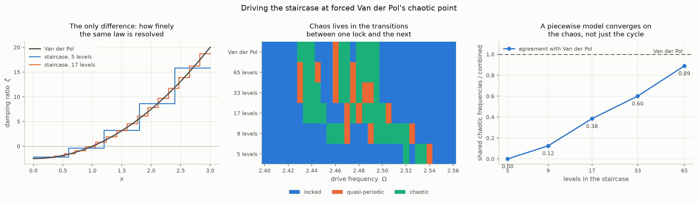
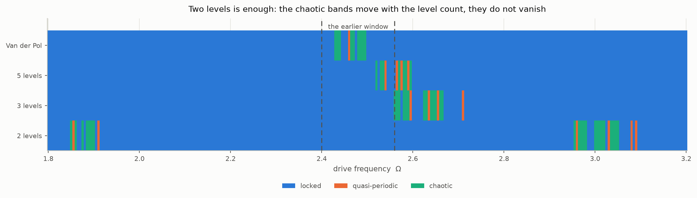

# Van der Pol as the target: from the four prototypes to a prototype for chaos

`README.md` builds four switched-damping prototypes, each exact by pieces:
an arc is a matrix, a crossing is a scalar root find. This document is
everything beyond them, and it has one target throughout — the Van der Pol
oscillator,

```math
\ddot{x} - \mu(1 - x^2)\dot{x} + x = 0,
```

the smooth self-excited oscillator that is known to go chaotic under a
drive. The question was whether a prototype of this family can do what it
does, and the answer, in the order the document establishes it:

- **Van der Pol itself cannot be a prototype.** One revolution of it in the
  phase plane reduces to a single first order equation that is an Abel
  equation of the second kind, with no closed form. Its expansion in
  $`\mu`$ integrates exactly order by order and holds on the cycle to about
  $`\mu = 1`$; the integrable Hopf normal form fits its free cycle to a few
  per cent; neither carries its driven response, because the symmetry that
  makes a model integrable is what removes the chaos.
- **The two level prototype carries chaos.** At moderate damping ratios its
  driven response is entrainment only, but at heavy outer damping it has
  confirmed chaotic bands at the transitions between its locks. The level
  count moves the bands; it does not create them.
- **A three level model with five parameters is a prototype for Van der
  Pol at $`\mu = 5`$.** Fitted to the plateau edges of the driven response
  at one drive strength, with 20% leeway on the free cycle, it reproduces
  Van der Pol's lock structure at every drive strength on the tested grid
  and its chaotic bands at the two strengths that have them, missing one
  band a single fine cell wide. Its parameters are
  $`\zeta = (-1.74, 3.84, 15.0)`$ with edges at $`(1.08, 1.98)`$, in
  units where Van der Pol's amplitude is 2 and $`\omega_n = 1`$. That
  model has its own document, `THREELEVEL.md`; this one is the road to it.

The parameter guide near the end says what to set for each behaviour a
model is wanted for, and the gaps are listed after it without softening;
the three level model's own guide, measurements and gaps are in
`THREELEVEL.md`.
Every number here is reproduced by a script named where it is quoted;
`polar.py` for the integration, `vanderpol.py`, `forced.py`, `section.py`
and `staircase.py` for the driven results, `figures.py` for every figure.

Notation follows the README: $`x_1 = x`$, $`x_2 = \dot{x}`$, damping
ratios $`\zeta`$, $`\omega_n = 1`$ throughout so that $`\mu`$ is the
README's $`\mu/\omega_n`$.

# Part I: the target cannot be integrated

The first two chapters are the integration attempt. They settle that Van
der Pol has no closed form of the kind the prototypes have, and what can be
had instead.

## The polar reduction

Take $`x = r\cos\theta`$ and $`\dot{x} = -r\sin\theta`$. The sign makes
$`\theta`$ increase with time and the orbit run clockwise in the
$`(x, \dot{x})`$ plane, the way every phase portrait in the README runs,
and it puts $`\theta = 0`$ on the positive $`x`$ axis where $`\dot{x} = 0`$
— the section `vanderpol.py` already uses, the maxima of $`x`$. Substituting
and solving for the two rates:

```math
\begin{aligned}
\dot{r} &= \mu\, r\,(1 - r^2\cos^2\theta)\sin^2\theta \\
\dot{\theta} &= 1 + \mu\,(1 - r^2\cos^2\theta)\sin\theta\cos\theta
\end{aligned}
```

Both are verified by substituting back into the Cartesian field. At
$`\mu = 0`$ the radius is constant and the angle advances at unit rate: the
linear oscillator's circle. The $`\mu`$ terms carry the whole nonlinearity,
and they read directly. The radial rate is positive where
$`\lvert x \rvert \lt 1`$ and negative outside, weighted by
$`\sin^2\theta = \dot{x}^2/r^2`$: energy goes in where the damping is
negative and comes out where it is positive, in proportion to the velocity
squared, which is the energy balance the README's closed form for weak
damping was built on. The angular rate is *not* constant: its correction
changes sign from quadrant to quadrant, so a revolution is not $`2\pi`$ of
uniform rotation and the period is not $`2\pi`$.

Dividing the two removes time and leaves one equation for the orbit:

```math
\frac{dr}{d\theta} =
\frac{\mu\, r\,(1 - r^2\cos^2\theta)\sin^2\theta}
     {1 + \mu\,(1 - r^2\cos^2\theta)\sin\theta\cos\theta}
```

One revolution is this equation integrated from $`\theta = 0`$ to
$`2\pi`$ from $`r(0) = r_0`$, and the time it takes is

```math
T(r_0) = \int_0^{2\pi} \frac{d\theta}{1 + \mu\,(1 - r^2\cos^2\theta)\sin\theta\cos\theta}
```

along the solution. That is the whole problem: a single scalar first order
equation, non-autonomous in $`\theta`$, and the question is whether it has a
closed form.

### The chart holds on the cycle at every $`\mu`$

Before asking that, the reduction has to be valid: $`r(\theta)`$ is a graph
only where $`\dot{\theta} \gt 0`$, so that the angle never stalls or turns
back. It might not be — at large $`\mu`$ the cycle is a relaxation
oscillation whose fast jumps are nearly vertical in the phase plane, and
nothing guarantees a vertical line through the origin's neighbourhood is
swept monotonically. Integrating the cycle in Cartesian coordinates and
reading the angle off afterwards, so that nothing is assumed:

| $`\mu`$ | $`T`$ | amplitude | min $`\dot{\theta}`$ on the cycle | min $`r`$ | $`\theta`$ monotone |
| --- | --- | --- | --- | --- | --- |
| 0.1 | 6.28711 | 2.00010 | 0.914 | 1.937 | yes |
| 0.5 | 6.38068 | 2.00249 | 0.615 | 1.722 | yes |
| 1 | 6.66329 | 2.00862 | 0.348 | 1.532 | yes |
| 2 | 7.62987 | 2.01989 | 0.107 | 1.341 | yes |
| 3 | 8.85910 | 2.02330 | 0.042 | 1.258 | yes |
| 5 | 11.61223 | 2.02151 | 0.013 | 1.183 | yes |
| 10 | 19.07837 | 2.01429 | 0.003 | 1.114 | yes |

The angle never reverses. It comes close: the minimum of $`\dot{\theta}`$
falls roughly as $`1/\mu^2`$, and that is the slow crawl of the relaxation
oscillator. On the crawl $`\dot{x} \approx -x/(\mu(x^2-1))`$, and putting
that into $`\dot{\theta}`$ gives $`\dot{\theta} \approx \sin^2\theta`$ —
small, but positive. So the cycle is a graph $`r(\theta)`$ at every
$`\mu`$ tested, and the amplitudes agree with the control chapter's 2.00010 and
2.02151 to every digit quoted there.

Off the cycle the chart might have an edge, and where it is matters for
the map. Starting a revolution at $`(r_0, 0)`$ and asking whether
$`\dot{\theta}`$ stays positive all the way round, for $`r_0`$ from 0.05
to 8 at each of $`\mu = 0.5, 1, 1.5, 2, 3, 5`$: it always does. Large radii
are never a problem from this section, because a revolution started on the
$`x`$ axis far out drops onto the slow crawl at once and crawls in with
$`\dot{\theta} \approx \sin^2\theta \gt 0`$. Small radii looked as if
they should fail at $`\mu = 2`$, where the linearisation at the origin,
$`\ddot{x} - \mu\dot{x} + x = 0`$, acquires real eigenvalues
$`\mu/2 \pm \sqrt{\mu^2/4 - 1}`$ and the unstable focus becomes an
unstable node; near a node there is a sector of directions in which the
angle runs backwards, and at $`\mu = 5`$ it is there — at
$`\theta = 0.6\pi`$ and $`r = 0.01`$, $`\dot{\theta} = -0.47`$. But a
trajectory leaving the $`x`$ axis approaches the node's fast eigendirection
from one side, tangentially, and never crosses to the side where the angle
reverses; by the time it is far enough out for the nonlinearity to bend it,
the bend is clockwise again. So from this section the chart holds for
every starting radius tested, at every $`\mu`$ tested, and the map
$`r_0 \mapsto r(2\pi)`$ is defined wherever it was asked for. That is an
observation over the tested range, not a proof.

## Why it does not integrate in closed form

Put $`s = r^2`$, which clears the square root the radius would otherwise
carry. The orbit equation becomes

```math
\bigl[1 + \mu\sin\theta\cos\theta - \mu\, s\,\sin\theta\cos^3\theta\bigr]\frac{ds}{d\theta}
= 2\mu\sin^2\theta\; s - 2\mu\sin^2\theta\cos^2\theta\; s^2
```

which is $`(g_0 + g_1 s)\, s' = f_1 s + f_2 s^2`$ with coefficients that
are trigonometric polynomials in $`\theta`$: an **Abel equation of the
second kind**. The classification matters because it says precisely what is
different from the prototypes.

- **A linear zone gives a separable equation.** For the linear oscillator
  with damping ratio $`\zeta`$ the same reduction gives
  $`dr/d\theta = -2\zeta r\sin^2\theta/(1 - \zeta\sin 2\theta)`$: linear in
  $`r`$, so $`\ln r`$ is a quadrature of a function of $`\theta`$ alone.
  That is why every arc of every prototype is exact, and why the README's
  transit equations close.
- **Van der Pol adds one power of $`r^2`$ to each side.** The
  $`s^2`$ on the right and the $`s`$ multiplying $`s'`$ on the left are the
  $`x^2`$ in $`\mu(1 - x^2)`$, and they are what stop the separation. A
  single extra $`s^2`$ on the right alone would make it Riccati, which maps
  to a linear second order equation and is solvable whenever that is. The
  extra factor on the *left* pushes it past Riccati into Abel.
- **Abel equations have no general solution.** Particular integrable
  families are known, but nothing places this one in any of them, and
  `sympy` finds no solvable class for it in either variable.

That is the structural answer, and there is a rigorous one behind it. Odani
proved in 1995 that the Van der Pol limit cycle is not an algebraic curve
for any $`\mu \ne 0`$ — no polynomial in $`(x, \dot{x})`$ vanishes on it —
and the study of Liouvillian first integrals for Liénard systems, the class
Van der Pol belongs to, finds them only in degenerate cases. That last
result is reported from the literature rather than checked here; Odani's is
the one to rely on, and it is enough. A closed form of the kind the
prototypes have would make the cycle the level set of an elementary
expression, and it is not.

So the answer to the question asked is: the polar phase plane is the right
place to look, it reduces the revolution to one equation, and that equation
is exactly one step too nonlinear. What is left is to integrate it as far as
it *can* be integrated exactly, and that turns out to be a long way.

## What does integrate: the expansion in $`\mu`$, exactly

Write the revolution as a series in $`\mu`$ at fixed $`r_0`$:

```math
r(\theta) = r_0 + \mu\, r_1(\theta) + \mu^2 r_2(\theta) + \cdots,
\qquad r_k(0) = 0
```

Each order satisfies $`r_k' = `$ a known function of $`\theta`$ and the
lower orders, obtained by expanding the right hand side of the orbit
equation. The first is a plain quadrature:

```math
r_1(\theta) = \int_0^\theta r_0\,(1 - r_0^2\cos^2\tau)\sin^2\tau\, d\tau
= r_0\left[\frac{\theta}{2} - \frac{\sin 2\theta}{4}\right]
- r_0^3\left[\frac{\theta}{8} - \frac{\sin 4\theta}{32}\right]
```

The secular $`\theta`$ terms are what make the radius drift over a
revolution, and they feed the next order: $`r_2'`$ contains
$`r_1`$ multiplied by trigonometric factors, so $`r_2`$ contains
$`\theta^2`$, and so on. Every order is therefore of one form —
a polynomial in $`\theta`$ times a trigonometric polynomial — and that
form is closed under everything the recursion needs: products, integration
from zero (by parts, finitely many times), and evaluation at $`2\pi`$.
Nothing is approximated at any order. `polar.series` does the algebra in
exact rational arithmetic and returns the map

```math
P(r_0) = r(2\pi) = r_0 + \mu P_1(r_0) + \mu^2 P_2(r_0) + \cdots
```

as polynomials:

```math
\begin{aligned}
P_1 &= \pi r_0\left(1 - \frac{r_0^2}{4}\right) \\
P_2 &= \frac{\pi^2}{32}\, r_0\,(r_0^2 - 4)(3r_0^2 - 4) \\
P_3 &= -\frac{\pi r_0}{6144}\Bigl[(163 + 240\pi^2)r_0^6 - (1304 + 1728\pi^2)r_0^4
       + (2784 + 3328\pi^2)r_0^2 - (768 + 1024\pi^2)\Bigr]
\end{aligned}
```

with $`P_4`$ and $`P_5`$ printed by the script. $`P_1`$ is the
Krylov–Bogoliubov averaged drift, and it vanishes at $`r_0 = 2`$: the
familiar amplitude. $`P_2`$ vanishes there too, so the amplitude has no
$`O(\mu)`$ correction. $`P_3(2) = \pi/48`$ does not, and dividing by
$`P_1'(2) = -2\pi`$ gives the first correction:

```math
r^* = 2 + \frac{\mu^2}{96} - \frac{1033\,\mu^4}{552960} + O(\mu^6)
```

which is the classical expansion of the Van der Pol amplitude. At
$`\mu = 0.1`$ it gives $`2.000104`$ against the integrated $`2.000104`$.

The revolution time expands the same way,
$`T = T_0 + \mu T_1 + \mu^2 T_2 + \cdots`$, with

```math
T_0 = 2\pi, \qquad T_1 = 0, \qquad
T_2 = \frac{\pi}{128}\bigl(21r_0^4 - 88r_0^2 + 32\bigr), \qquad
T_3 = -\frac{\pi^2}{256}\, r_0^2\,(r_0^2 - 4)(21r_0^2 - 44)
```

$`T_1`$ vanishes identically — the angular correction is odd over a
revolution at every radius — and at the fixed point
$`T_2(2) = \pi/8`$, so

```math
T(r^*) = 2\pi\left[1 + \frac{\mu^2}{16} - \frac{5\,\mu^4}{3072} + O(\mu^6)\right]
```

The $`\mu^2/16`$ is the textbook frequency shift $`\omega = 1 - \mu^2/16`$,
and the $`\mu^4`$ term is what $`1/\omega`$ gives from the next known
coefficient of $`\omega`$, $`+17\mu^4/3072`$. The multiplier of the map at
its fixed point expands as

```math
P'(r^*) = 1 - 2\pi\mu + 2\pi^2\mu^2
 - \left(\tfrac{4}{3}\pi^3 + \tfrac{\pi}{4}\right)\mu^3
 + \left(\tfrac{2}{3}\pi^4 + \tfrac{\pi^2}{2}\right)\mu^4 + O(\mu^5)
```

against $`e^{-2\pi\mu} = 1 - 2\pi\mu + 2\pi^2\mu^2 - \tfrac{4}{3}\pi^3\mu^3 + \tfrac{2}{3}\pi^4\mu^4 + \cdots`$.
The two agree through second order and part company at third, by exactly
$`-\pi\mu^3/4`$, and the $`\mu^4`$ difference is what that term's cross
product with $`-2\pi\mu`$ requires. So the whole of it is one line:

```math
\ln P'(r^*) = -2\pi\mu - \frac{\pi\mu^3}{4} + O(\mu^5)
```

Dividing by the period turns it into a rate, $`\ln P'/T = -\mu(1 + \mu^2/16) + O(\mu^5)`$:
the Floquet exponent is $`-\mu`$ per unit time to leading order — the control chapter's measured 0.5330 at
$`\mu = 0.1`$ against $`e^{-0.2\pi} = 0.5335`$
— corrected by the same $`\mu^2/16`$ that corrects the frequency. That
logarithmic form matters below, because it converges where the polynomial
does not.

## How far the series reaches

An exact series is only as useful as its convergence, and this one is a
series in $`\mu`$ for a map whose true form has an essential change of
character at $`\mu = 2`$, where the origin stops being a focus. Against
the integrated revolution, the absolute error in $`r(2\pi)`$:

| $`\mu`$ | $`r_0`$ | order 1 | order 3 | order 5 |
| --- | --- | --- | --- | --- |
| 0.1 | 1 | $`4.1\times10^{-3}`$ | $`6.3\times10^{-4}`$ | $`4.0\times10^{-5}`$ |
| 0.1 | 2 | $`4.9\times10^{-5}`$ | $`1.7\times10^{-5}`$ | $`6.1\times10^{-7}`$ |
| 0.1 | 3 | 0.56 | 0.52 | 0.64 |
| 0.3 | 1 | $`6.0\times10^{-2}`$ | $`2.0\times10^{-2}`$ | $`2.2\times10^{-2}`$ |
| 0.3 | 2 | $`7.9\times10^{-4}`$ | $`9.8\times10^{-4}`$ | $`3.5\times10^{-4}`$ |
| 0.3 | 3 | 2.6 | 21 | 226 |
| 0.5 | 1 | 0.31 | $`2.5\times10^{-2}`$ | 0.25 |
| 0.5 | 2 | $`2.4\times10^{-3}`$ | $`5.8\times10^{-3}`$ | $`6.3\times10^{-3}`$ |
| 1 | 2 | $`8.6\times10^{-3}`$ | $`5.7\times10^{-2}`$ | 0.28 |

And at the fixed point:

| $`\mu`$ | $`r^*`$ integrated | $`r^*`$ series | $`P'`$ integrated | $`P'`$ polynomial | $`e^{-2\pi\mu - \pi\mu^3/4}`$ | $`T`$ integrated | $`T`$ series |
| --- | --- | --- | --- | --- | --- | --- | --- |
| 0.1 | 2.0001040 | 2.0001040 | 0.5331 | 0.5339 | 0.5331 | 6.287111 | 6.287111 |
| 0.25 | 2.0006437 | 2.0006437 | 0.2053 | 0.2776 | 0.2053 | 6.307688 | 6.307689 |
| 0.5 | 2.0024879 | 2.0024874 | $`3.918\times10^{-2}`$ | 1.89 | $`3.917\times10^{-2}`$ | 6.380676 | 6.380721 |
| 0.75 | 2.0052773 | 2.0052683 | $`6.459\times10^{-3}`$ | 11.7 | $`6.450\times10^{-3}`$ | 6.500368 | 6.500843 |
| 1 | 2.0086199 | 2.0085485 | $`8.597\times10^{-4}`$ | 42 | $`8.514\times10^{-4}`$ | 6.663287 | 6.665658 |
| 1.5 | 2.0152265 | 2.0139801 | $`6.467\times10^{-6}`$ | 248 | $`5.697\times10^{-6}`$ | 7.096374 | 7.114986 |
| 2 | 2.0198914 | 2.0117766 | $`1.274\times10^{-8}`$ | 848 | $`6.512\times10^{-9}`$ | 7.629874 | 7.690357 |

Read together, four things:

- **On the cycle the series is good to about $`\mu = 1`$.** The amplitude
  is right to $`5\times10^{-7}`$ at $`\mu = 0.5`$ and $`7\times10^{-5}`$ at
  $`\mu = 1`$; the period to $`5\times10^{-5}`$ and $`2\times10^{-3}`$. By
  $`\mu = 2`$ both are wrong in the third figure.
- **The multiplier must be taken in logarithmic form.** The polynomial
  truncation of $`P'(r^*)`$ is useless past $`\mu = 0.1`$: it exceeds one
  at $`\mu = 0.5`$. The same coefficients rearranged as
  $`e^{-2\pi\mu - \pi\mu^3/4}`$ are right to four figures at $`\mu = 0.5`$,
  to one per cent at $`\mu = 1`$, and within a factor of two at $`\mu = 2`$
  where the multiplier itself is $`10^{-8}`$. A quantity that shrinks
  exponentially wants its exponent expanded, not itself.
- **Away from the cycle the series holds only near it.** Around
  $`r_0 = 2`$ it converges for $`\mu \lesssim 0.3`$. At $`r_0 = 3`$ it fails
  at every $`\mu`$ tested, even $`0.1`$, and adding orders makes it worse.
  The reason is that $`\mu`$ is the wrong small parameter there: the
  damping met on the revolution is $`\mu(x^2 - 1)`$, which is order one at
  $`r_0 = 3`$ however small $`\mu`$ is. The expansion is really in the
  damping accumulated over a revolution, and the series in $`\mu`$ at fixed
  $`r_0`$ only sees that as a growing coefficient.
- **The failure is a radius of convergence, not a shortage of terms.**
  Wherever the series is wrong, order 5 is no better than order 3 and
  usually worse.

<picture>
  <source media="(prefers-color-scheme: dark)" srcset="figures/polar-dark.png">
  
</picture>

*Left: the cycle as $`r(\theta)`$ over one revolution — a near circle at $`\mu = 0.1`$, and at $`\mu = 5`$ a relaxation oscillation that dips to $`r = 1.18`$ yet is still a single-valued graph. Middle: the drift over one revolution at $`\mu = 0.3`$, integrated and from the series at three orders; the series holds to about $`r_0 = 2`$ and leaves at larger radius. Right: the multiplier of the cycle against $`\mu`$; the first order $`e^{-2\pi\mu}`$ holds to about 0.3, the logarithmic series to about 1.*

## The multiplier a finite difference could not resolve


The control chapter below reports the Floquet multiplier of the Van der
Pol cycle at $`\mu = 5`$ as unresolvable: a finite difference of the period map cannot
tell a genuinely tiny multiplier from its own rounding, and the estimate
changed sign as the step was swept. The polar revolution gets it another
way. The derivative $`\partial r/\partial r_0`$ is integrated as its own
linear equation alongside $`r`$ — the variational equation of the orbit
equation — so it is never formed as a difference of two nearly equal
orbits, and its dynamic range is that of a floating point exponent rather
than a mantissa.

| $`\mu`$ | amplitude | $`P'(r^*)`$ | period |
| --- | --- | --- | --- |
| 1 | 2.0086199 | $`8.597\times10^{-4}`$ | 6.66329 |
| 2 | 2.0198914 | $`1.274\times10^{-8}`$ | 7.62987 |
| 3 | 2.0233041 | $`6.989\times10^{-16}`$ | 8.85910 |
| 5 | 2.0215081 | $`7.739\times10^{-38}`$ | 11.61223 |

The $`\mu = 1`$ row reproduces the control chapter's $`8.6\times10^{-4}`$,
which was resolvable by differencing, and the $`\mu = 5`$ row is the number
it could not produce. Its logarithm, $`-37.111`$, is the same to six
figures under `DOP853` at two tolerances and under `Radau`, and from
integrating $`\ln(\partial r/\partial r_0)`$ directly instead. So the
multiplier is $`7.7\times10^{-38}`$, not zero, and "immeasurably small"
stands as a statement about the method that said it.

## Where this leaves the mapping step

The hope behind the question was that an integrable revolution would make
Van der Pol a prototype in its own right, with the one-revolution map
following and `MAPS.md`'s machinery applying to it. That hope is not
realised in the form intended, and the reason is now precise rather than a
suspicion. What is available instead is two forms of the same map:

- **A polynomial map for small $`\mu`$.** Exact order by order, with the
  fixed point, multiplier and period in closed form to the order taken,
  good on the cycle to about $`\mu = 1`$ and near it to about
  $`\mu = 0.3`$. This is the regime the control chapter finds Van der Pol behaviourally
  indistinguishable from the deadzone prototype, so it is also the regime
  where a prototype is least needed.
- **A one-line numerical map for any $`\mu`$.** One integration of the
  orbit equation over $`\theta \in [0, 2\pi]`$, with the derivative and the
  period carried alongside for free. It is defined at every starting
  radius and every $`\mu`$ tested, it is a scalar integration in a bounded
  variable rather than a search for a section crossing, and it is what
  produced the multipliers above.

Neither is the closed form that would have made Van der Pol a fifth
prototype. The map itself, and what it says about the cycle, is left for
the mapping analysis as intended.

## An integrable model instead: the Hopf normal form

If the revolution cannot be integrated, the other way round is to start
from something that can, and ask how far it can be tuned towards Van der
Pol. The natural candidate is the **Hopf normal form**, also called
Stuart–Landau, taken as a planar system rather than as a second order
equation in $`x`$:

```math
\dot{r} = \frac{\mu}{2}\, r\left(1 - \frac{r^2}{R^2}\right), \qquad
\dot{\theta} = \frac{2\pi}{T}
```

The radial law separates, so everything about it is closed form: the
transient, the one-revolution map

```math
P(r_0) = \frac{R}{\sqrt{1 + (R^2/r_0^2 - 1)\, e^{-\mu T}}}
```

its multiplier $`e^{-\mu T}`$ at the fixed point $`R`$, and its period
$`T`$. With $`R = 2`$ and $`T = 2\pi`$ its map is exactly the first order
term of the series above — it *is* the averaged Van der Pol — and it is the
system every weakly nonlinear oscillator reduces to near its Hopf point. It
generalises without losing the closed form: any radial law
$`\dot{r} = r\,h(r^2)`$ with $`h`$ rational integrates by quadrature, and
$`\dot{\theta}`$ may depend on $`r^2`$, so nested cycles and an
amplitude-dependent frequency can be added. `polar.stuart_landau_map`
carries it.

Untuned, with $`\mu`$ taken literally, the absolute error of its map
against the integrated Van der Pol revolution:

| $`\mu`$ | $`r_0 = 1`$ | $`r_0 = 2`$ | $`r_0 = 3`$ | $`r_0 = 5`$ |
| --- | --- | --- | --- | --- |
| 0.1 | $`5.6\times10^{-4}`$ | $`4.9\times10^{-5}`$ | $`7.4\times10^{-3}`$ | $`7.7\times10^{-2}`$ |
| 0.3 | $`1.1\times10^{-2}`$ | $`7.9\times10^{-4}`$ | $`1.6\times10^{-2}`$ | $`5.9\times10^{-2}`$ |
| 0.5 | $`1.8\times10^{-2}`$ | $`2.4\times10^{-3}`$ | $`8.5\times10^{-3}`$ | $`2.1\times10^{-2}`$ |
| 1 | $`4.1\times10^{-3}`$ | $`8.6\times10^{-3}`$ | $`7.7\times10^{-3}`$ | $`7.2\times10^{-3}`$ |

Compare the series table above: near the cycle at $`\mu = 0.3`$ the two are
equally good, and at $`r_0 = 3`$ and $`5`$, where the series had left
entirely, the normal form is still within a few per cent, because it is
bounded by construction rather than a polynomial in $`r_0`$.

**Tuned**, it has three parameters and Van der Pol's cycle has three
observables. Pinning $`R`$ to the amplitude, $`T`$ to the period and
$`\mu_{\text{eff}} = -\ln P'(r^*)/T`$ to the multiplier makes the tuned map
match the fixed point, its slope and the revolution time by construction;
what it predicts elsewhere is the test. Relative error of the tuned map:

| $`\mu`$ | $`\mu_{\text{eff}}`$ | $`R`$ | $`r_0 = 0.5`$ | $`r_0 = 1`$ | $`r_0 = 3`$ | $`r_0 = 5`$ |
| --- | --- | --- | --- | --- | --- | --- |
| 0.3 | 0.3017 | 2.0009 | $`1.3\times10^{-2}`$ | $`1.0\times10^{-2}`$ | $`7.4\times10^{-3}`$ | $`2.7\times10^{-2}`$ |
| 0.5 | 0.5077 | 2.0025 | $`4.5\times10^{-2}`$ | $`1.6\times10^{-2}`$ | $`4.3\times10^{-3}`$ | $`1.0\times10^{-2}`$ |
| 1 | 1.0594 | 2.0086 | $`2.5\times10^{-2}`$ | $`3.7\times10^{-3}`$ | $`1.7\times10^{-4}`$ | $`3.0\times10^{-4}`$ |
| 2 | 2.3826 | 2.0199 | $`2.2\times10^{-4}`$ | $`7.8\times10^{-6}`$ | $`3.2\times10^{-9}`$ | $`5.0\times10^{-9}`$ |

So as a model of the **free** response it beats the series, and it beats
the two-level prototype: three fitted numbers, a closed form for the whole
transient, no root finds. The $`\mu = 2`$ row is not the triumph it looks:
there the map is so contracting that one revolution lands within
$`10^{-8}`$ of the cycle from anywhere, so any model with the right fixed
point and slope is right everywhere. The rows at $`0.3`$ to $`1`$, a few
per cent, are the honest measure.

### Why the staircase says this is the wrong test

The staircase chapters below establish two things about fitting Van der
Pol that bear directly here. Matching the free cycle is a weak test: at
nine levels the staircase matched the free radius and period to half a per
cent while placing its chaotic bands almost entirely in the wrong place.
And what sets the driven response is the *shape* of the damping law across
the amplitude range the driven orbit visits — not the switch, not the
saturation, but the resolution with which $`\mu(1 - x^2)`$ is represented.

The normal form has no shape in $`x`$ at all. Its damping depends on
$`r^2 = x^2 + \dot{x}^2`$ alone, and that rotational symmetry is exactly
what makes it integrable. Three things follow, none of them fixable by
tuning:

- **The cycle is an exact circle**, so the waveform has no harmonics. Van
  der Pol's third harmonic is about $`\mu/8`$ of the fundamental at small
  $`\mu`$, and the harmonic signatures `speculation.md` uses to tell the
  models apart vanish.
- **Under a drive it cannot go chaotic.** In the frame rotating with the
  drive it is planar and autonomous, so Poincaré–Bendixson caps it at
  locking and beating. The period-adding bands between the 3, 4 and 5
  locks — the structure the staircase needed sixty-five levels to place —
  do not exist in it.
- **Its nonlinearity does not grow with amplitude in $`x`$.** A larger orbit
  is not a more nonlinear one in the sense that mattered in the control
  section, so it lives on the same side of that distinction as the
  two-level prototype, by a different route.

The general point is worth stating, because it is the answer to whether
some *other* integrable equation might do better. Integrability means a
first integral or a separating symmetry; a damping law that changes with
$`x`$ across the orbit is what the relaxation regime and its chaos are made
of; and the two are in tension by definition. A globally integrable model
can be made to fit the free cycle to a few per cent, as above, and can be
made to fit it exactly at a point. It cannot carry the driven response,
because the structure that would carry it is the structure integrability
removes. The staircase's answer stands for that regime: exact by pieces,
not exact globally.

So the split is by regime. Below about $`\mu = 1`$ the tuned normal form
is the better prototype, closed form throughout, which the piecewise model
is not — and that is the regime where the control chapter found Van der Pol
behaviourally identical to the two-level prototype and free of chaos
anyway. In the relaxation regime nothing integrable is known to apply, and
the staircase is the model.

# Part II: building the prototype

The chapters that follow continue the README's development past its four
prototypes: a fifth with a second threshold, then what a drive does, then
Van der Pol as the control, and from there to the model that reproduces it.

## The staircase as a dial towards a smooth nonlinearity

The three level model of `THREELEVEL.md` is the first step of a staircase
of levels fitted to a smooth damping law; the staircase is what the level
count chapters below drive.


The staircase is also a dial between a switched nonlinearity and a smooth
one. Fitting levels to $`\zeta_{\mathrm{vdp}}(x) = -\mu(1-x^2)/2`$ at
$`\mu = 1`$, where the true cycle radius is exactly 2:

| levels | 2 | 3 | 5 | 9 | 17 |
| --- | --- | --- | --- | --- | --- |
| cycle radius | 1.72605 | 1.82330 | 1.94997 | 1.99303 | 2.00318 |

The free cycle closes on Van der Pol's as levels are added. Whether the
*driven* response does, and how many levels that takes, is what the rest
of this document establishes: it takes two levels to get chaos at all and
three to put it where Van der Pol's is, once the levels are chosen for the
driven response rather than sampled from the law.

### Numerical note

The exact half-cycle map has to time **both** events in each zone — reaching
the next threshold, and turning round — and take the earlier one. Solving
only for the threshold is wrong in a way that is easy to miss: the arc
formula is the linear solution for its zone, which oscillates forever, so
its first arrival at a distant threshold can be several oscillations after
the real trajectory has turned round and left. That produced half cycles of
9.06 against a half period of $`\pi`$, an amplitude jumping from 0.59 to 2.33
across a step of 0.01 in the starting peak, and a Floquet multiplier of
$`10^{12}`$. With both events timed, the map agrees with direct integration
to $`10^{-11}`$ across the tested amplitudes.

## Forcing the two level prototype

All four prototypes are planar and autonomous, so Poincaré–Bendixson caps
them at equilibria and limit cycles. Chaos needs a third state, and the
ordinary way a real system acquires one is a drive. Adding a sinusoid to
the symmetric deadzone model changes only the right hand side:

```math
\ddot{x} + 2\omega_n\left[\zeta_{-}\dot{x} + (\zeta_{+}-\zeta_{-})\,\mathrm{dz}(\dot{x})\right] + \omega_n^2 x = A\cos\Omega t
```

Everything switched is untouched, so $`A = 0`$ recovers the unforced
prototype exactly and the whole preceding analysis is the $`A = 0`$ edge of
what follows. `forced.py` carries this section.

### The drive adds no parameters

The unforced problem has one scale, the deadzone half width $`v_0`$, and the
period depends only on $`\omega_n`$ and the two damping ratios. The drive
brings a frequency and an acceleration, and both are measured against what
is already there:

```math
r = \frac{\Omega}{\omega_{lc}}, \qquad a = \frac{A}{\omega_n v_0}
```

where $`\omega_{lc} = 2\pi/T`$ is the *cycle* frequency from the previous
sections, not $`\omega_n`$. The pair $`(r, a)`$ is the complete parameter
plane. Scaling $`v_0`$ and $`A`$ together by three scales the orbit by
3.000000 and leaves the rotation number at 1.000000 — verified, not assumed.

The differentiation correspondence also survives. If $`x`$ solves the
deadzone model under $`A\cos\Omega t`$ then $`X = \dot{x}`$ solves the
displacement-switched model under $`-A\Omega\sin\Omega t`$, so the peak
velocity of one equals the peak displacement of the other. Checked at three
$`(r, a)`$ pairs, agreeing to $`2.7\times 10^{-10}`$. The four models remain
two pairs related by differentiation.

### At moderate damping the response entrains

Sample the state once per drive period. Across every combination tested the
section is one of exactly three things.

<picture>
  <source media="(prefers-color-scheme: dark)" srcset="figures/forced-sections-dark.png">
  
</picture>

*A single point is a response locked to the drive. A closed curve carries two incommensurate frequencies. A chain of islands appears once the contraction per cycle is weak; the inset shows one island is a flattened curve, not a point. A fractal cloud — what chaos would look like — does not appear.*

The rotation number $`w`$, orbit windings per drive period, makes this
quantitative. With no drive it is the smooth hyperbola $`w = 1/r`$: an
autonomous cycle keeps its own frequency because it has nothing to lock to.
Drive flattens it into plateaus.

<picture>
  <source media="(prefers-color-scheme: dark)" srcset="figures/forced-tongues-dark.png">
  
</picture>

*Left: the staircase, at three drive strengths. Right: the 1:1 Arnold tongue, each edge located by bisection. It closes to a point at zero drive on $`\Omega = \omega_{lc}`$ and widens from there; where an edge leaves the frequency window the fill runs to the axis and no edge is drawn.*

The 1:1 tongue is the whole story at the reference pair
$`\zeta_{+} = 0.3`$, $`\zeta_{-} = -0.1`$. Bisecting for its edges:

| $`a = A/\omega_n v_0`$ | left edge | right edge | width | $`(r_{+}-1)/(1-r_{-})`$ |
| --- | --- | --- | --- | --- |
| 0.05 | 0.9853 | 1.0149 | 0.0295 | 1.01 |
| 0.10 | 0.9689 | 1.0323 | 0.0634 | 1.04 |
| 0.20 | 0.9370 | 1.0691 | 0.1321 | 1.10 |
| 0.45 | 0.8354 | 1.2083 | 0.3728 | 1.27 |
| 0.80 | 0.7115 | 1.4170 | 0.7055 | 1.45 |
| 1.20 | 0.5857 | 1.6886 | 1.1029 | 1.66 |
| 1.80 | 0.4801 | 2.0941 | 1.6140 | 2.10 |
| 2.20 | 0.4190 | 2.3789 | 1.9599 | 2.37 |

Two things to read off it. The width opens as $`a^{1.079}`$ over
$`0.05 \le a \le 0.20`$ — close to the linear opening an Arnold tongue
should have, and the small departure from 1 is the measured value, not a
correction to it. And the tongue is symmetric only while it is narrow: the
last column is the ratio of how far it reaches above $`\omega_{lc}`$ to how
far below, and it grows from 1.01 to 2.37. A strong drive can pull this
oscillator well above its free frequency but not nearly so far below it.

Higher order locks exist but are narrow: a 2:1 near $`r = 2`$, a 4:1 at
$`r = 1.35`$, a 5:1 at $`r = 0.70`$, an 11:1 at $`r = 2.20`$. Everything
else in a 41 × 14 grid over $`r \in [0.4, 2.4]`$, $`a \in [0.05, 3.0]`$ is
quasi-periodic.

**No chaos was found anywhere.** The largest Lyapunov exponent over every
non-locked cell of that grid is $`+0.0012`$, consistent with a torus. The
same held at $`(\zeta_{+}, \zeta_{-})`$ of $`(1.0, -0.5)`$, $`(2.0, -0.8)`$,
$`(4.0, -0.9)`$ and $`(8.0, -0.95)`$ — overdamped outside, nearly escaping
inside — with every exponent still negative. That is the limit of the
tested range, not of the prototype: at the heavier pair
$`(10.63, -0.62)`$ this same model is chaotic, at drive ratios and
strengths inside this grid. The level floor chapter below has the sweep.

That grid stops at $`r = 2.4`$, which turned out to be too narrow a window to
draw a conclusion from: the control system's chaos lives above $`r = 4`$. A
second grid taking $`r`$ out to 8 at drive strengths up to $`a = 5`$ — 155
cells — also finds none, and the four largest exponents in it converge to
$`-0.0007`$, $`+0.00003`$, $`-0.0118`$ and $`-0.0003`$ under a fivefold longer
run. The result stands; the window it stands over is $`r \le 8`$.

### Why not, and where to look

The unforced Floquet result survives forcing unchanged, and it explains the
absence. Differencing the $`q`$-fold stroboscopic map at its fixed point
gives two multipliers whose product is the same $`\exp(2\Lambda)`$ built
from the dwell weighted sum of the pole real parts:

| $`a`$ | $`r`$ | $`q`$ | $`\mu_1, \mu_2`$ | $`\mu_1\mu_2`$ | $`e^{2\Lambda T}`$ |
| --- | --- | --- | --- | --- | --- |
| 0.45 | 1.00 | 1 | 0.5502, 0.1611 | 8.864e-02 | 8.856e-02 |
| 1.50 | 0.60 | 1 | $`-0.245 \pm 0.244i`$ | 1.197e-01 | 1.195e-01 |
| 0.60 | 1.35 | 4 | 0.8547, 0.2843 | 2.430e-01 | 2.391e-01 |
| 1.00 | 2.00 | 2 | 0.4479, 0.7846 | 3.515e-01 | 3.520e-01 |

The pair itself is sometimes real and sometimes complex, so only the product
is pinned — but the product is what matters. The stroboscopic map contracts
area by $`\exp(2\Lambda)`$ every cycle, and at ordinary damping ratios that
is 0.20.

It is tempting to stop there and say chaos needs that contraction near unity,
so that a multiplier can reach $`-1`$ and start a period doubling cascade.
**That explanation is wrong, and the control chapter below refutes it.**
Van der Pol at $`\mu = 5`$ contracts by $`7.7\times10^{-38}`$ per cycle —
the polar chapter resolves that number — and is chaotic. Strong
contraction does not prevent chaos.

Following that down does produce the expected precursors. As
$`\exp(2\Lambda)`$ rises the staircase fills in — high order locks appear
where there had been only the 1:1 tongue and smooth tori — and some
sections stop being simple curves and break into chains of islands. Both
are the near-resonant structure of a nearly area-preserving map:

| $`\zeta_{+}`$ | $`\zeta_{-}`$ | $`\exp(2\Lambda)`$ | lock orders seen | max Lyapunov |
| --- | --- | --- | --- | --- |
| 0.300 | $`-0.1000`$ | 0.2036 | 1, 2, 4, 5, 11 | $`+0.0012`$ |
| 0.050 | $`-0.0150`$ | 0.7731 | 1, 3 | $`+0.0004`$ |
| 0.010 | $`-0.0030`$ | 0.9498 | 1, 2, 3, 9, 13, 19 | $`+0.0002`$ |
| 0.003 | $`-0.0009`$ | 0.9847 | 1, 2, 3, 6, 7, 8, 9, 13, 17, 19 | $`+0.00002`$ |

Alongside those, island chains: at $`\zeta_{+} = 0.01`$, $`\zeta_{-} = -0.003`$
the section at $`a = 0.1`$, $`r = 1.4`$ settles onto seven small closed
curves permuted cyclically, and stays at a scatter of $`1.6\times10^{-4}`$
however long the transient is run — so it is a chain, not a lock that has
not finished settling. That is the middle case the third panel above draws.

Every one of those rows still has no chaotic cell in it.

$`\exp(2\Lambda)`$ here is verified against a directly differenced monodromy
matrix, not taken from the algebra: at the reference pair the formula gives
0.203640 where the measured multipliers are $`(0.99997, 0.20363)`$, the unit
one being the neutral direction along the cycle.

**Where the chaos actually is.** The rows above go towards weak damping,
where the map is nearly area preserving and the precursors appear. That is
the wrong direction. The level floor chapter finds chaos in this same
two level model at $`(\zeta_{+}, \zeta_{-}) = (10.63, -0.62)`$ — heavier
outer damping than any row here, not lighter — in bands at the transitions
between its locks, at drive ratios and strengths inside this grid. The
negative result of this chapter is a statement about the damping pairs it
tested, and the reach towards weak damping is bounded by settling time: at
$`\exp(2\Lambda) = 0.985`$ a transient takes about 1200 cycles to die, and
the cost rises as $`1/\lvert\Lambda\rvert`$.

### Numerical note

Every threshold in this section is relative to the orbit, and each was
absolute first, and wrong. Clustering the stroboscopic points at a fixed
radius invented locks three ways: it chopped a small invariant curve into
twenty phantom clusters, it could not tell an island chain from a lock of
the same order, and it split a still-settling orbit into several tight
clusters. Testing recurrence directly fixes all three. But an *absolute*
recurrence threshold then manufactured chaos: at the centre of the 1:1
tongue the resonant orbit is ten times larger than off resonance, so the
integrator's own error grows with it, the residual crossed a fixed
$`10^{-7}`$ while the relative residual was $`10^{-8}`$ — identical to the
locked cells either side — and the Lyapunov estimate, whose separation had
fallen below the integration error at that scale, read the noise as
exponents up to $`+0.30`$. Four cells were reported as chaotic. All four are
1:1 locks with rotation number 1.000000.

The discarded transient has to be computed too. At $`\exp(2\Lambda) = 0.985`$
a transient needs about 1200 cycles to fall below the recurrence threshold;
a sweep discarding 500 reported the entire 1:1 tongue as absent, and every
one of those cells is a 1:1 lock once the transient is given time to die.

The lesson generalises past this section: in a piecewise linear system the
orbit's scale and its settling time both vary by orders of magnitude across
the parameter plane, so any fixed tolerance is a claim about a region rather
than a method.


## Control: the same measurements on Van der Pol

Every result above is about one system, and a negative result about one
system is worth little without a control. Van der Pol is the natural one.
It is also a second order oscillator with nonlinear damping and a limit
cycle, it is the most studied forced oscillator there is, and it is *known*
to go chaotic — so it tests the measurements as much as the prototype.

```math
\ddot{x} - \mu(1 - x^2)\dot{x} + \omega_n^2 x = A\cos\Omega t
```

`vanderpol.py` carries it. Both systems are measured by the same engine,
`section.py`, which takes the flow as an argument; `forced.py` is left
untouched, so the two are independent code paths, and `section.py`'s self
check reproduces `forced.py`'s answers on all eight cases its lock test was
debugged against.

### The positive control

At $`\mu = 5`$, $`A = 5`$, $`\Omega = 2.466`$ — the classic chaotic case —
the classifier returns **chaos, $`\lambda = +0.094`$**, while the
neighbouring cells come back as clean locks of order 3 and 5 at
$`\lambda = -0.20`$ to $`-0.40`$.

This matters more than any single number in this document. Before it, every
"no chaos" result here was produced by machinery that had never once
detected chaos, and so was equally consistent with the machinery not working.
It works.

### What is the same, and what is not

<picture>
  <source media="(prefers-color-scheme: dark)" srcset="figures/vanderpol-compare-dark.png">
  
</picture>

*The same drive, the same grid, the same measurements. At weak nonlinearity Van der Pol reproduces the prototype; at strong nonlinearity it goes chaotic where the prototype does not.*

Over $`r \in [0.5, 8]`$, 155 cells each, chaotic cells counted after the
convergence check described below:

| system | contraction | chaotic cells | largest $`\lambda`$ |
| --- | --- | --- | --- |
| deadzone prototype | 0.2036 | 0 | $`+0.0034`$ |
| Van der Pol, $`\mu = 0.1`$ | 0.5330 | 0 | $`+0.0002`$ |
| Van der Pol, $`\mu = 1.0`$ | $`8.6\times10^{-4}`$ | 1 | $`+0.0380`$ |
| Van der Pol, $`\mu = 5.0`$ | unresolvable | 2 | $`+0.1180`$ |

*Correction.* That last contraction was first published here as
$`6.1\times10^{-4}`$. It is not a measurement. Sweeping the differencing
step over five orders gives $`-0.746`$, $`-6.99\times10^{-4}`$,
$`+6.12\times10^{-4}`$, $`+2.38\times10^{-4}`$, $`-4.96\times10^{-5}`$,
$`-2.32\times10^{-3}`$ and $`-0.249`$ — the sign flips and the magnitude
moves four orders, so no digit of it was real. A relaxation oscillator
contracts transverse to its cycle by more than double precision can express
through a finite difference. The other two rows survive the same test:
0.53307 holds across six orders of step, and $`8.6\times10^{-4}`$ to about a
tenth. `vanderpol.contraction_resolved` now applies that test and returns
``nan`` rather than a number it cannot stand behind. The polar chapter
resolves the same multiplier by a different route — the variational
equation integrated along one revolution, which never forms a difference —
and finds $`7.7\times10^{-38}`$, stable to six figures across integrators.

The conclusion is unaffected, and if anything sharpened: contraction runs
0.5330, $`8.6\times10^{-4}`$, immeasurably small across the three, while
chaos runs absent, present, present. Whatever separates them is still not
how fast they forget a transient.

**At $`\mu = 0.1`$ Van der Pol *is* the prototype**, behaviourally: a 1:1
tongue opening from $`\Omega = \omega_{lc}`$, narrow higher order locks at
$`r = 2, 3, 7`$, tori between them, no chaos. Everything the forcing chapter
above concluded is reproduced by a completely different nonlinearity.

**The contraction does not order the outcome.** $`\mu = 0.1`$ has by far
the weakest contraction of the three and is the one with no chaos at all;
$`\mu = 5`$ contracts by $`7.7\times10^{-38}`$ and is chaotic. Whatever
separates these systems, it is not how fast they forget a transient — which
retires the explanation offered in the forcing chapter.

### What does separate them

Two structural differences are measurable at the reference pair, and one
conclusion drawn from them was wrong.

**At $`\zeta_{+} = 0.3`$ the prototype's nonlinearity is confined.** Outside
the deadzone its damping ratio is exactly $`\zeta_{+}`$, the nonlinearity
lives in a band of width $`2v_0`$, and a larger orbit spends less of its
time there — so at this pair a stronger drive makes the response more
linear, and its 1:1 tongue widens with drive until it swallows the whole
frequency range. That is measured. What was concluded from it — that a
saturating nonlinearity cannot go chaotic, and that the prototypes are the
wrong tool for a nonlinearity that grows with amplitude — is retired by the
chapters that follow: the same two level model is chaotic at a heavier
damping pair, a three level model reproduces Van der Pol's map, and in the
chaotic regime the driven displacement barely grows, so the saturation is
never reached. What separates the systems at a given damping pair is the
*shape* of the damping across the amplitude range the driven orbit visits,
and how finely it is resolved there.

**There is no free amplitude scale in Van der Pol.** The prototype's cycle
amplitude is proportional to $`v_0`$, so $`v_0`$ scales out and the forced
problem has exactly two parameters. Van der Pol's cycle sits at $`x \approx 2`$
whatever $`\mu`$ is — measured as 2.00010 at $`\mu = 0.1`$ and 2.02151 at
$`\mu = 5`$ — fixed by the polynomial, with nothing to scale out. Scaling the
drive by three grows the prototype's orbit by exactly 3.0 and Van der Pol's by
1.0890. So $`\mu`$ is an irreducible third parameter, and it is the one that
turns chaos on. In the prototype the corresponding knob is the damping
shape, which the normalisation chapter turns.

### What this says about the family

The two level prototypes have their clean stability boundaries and their
two parameter forced problem, and at moderate damping ratios their driven
response is entrainment: locks, tori, island chains. That is the right tool
for a system whose nonlinearity saturates — a deadzone, a clearance, a
friction threshold, a limiter — and the two-amplitude class test in
`speculation.md` says whether a measurement is one. For a system whose
nonlinearity grows with amplitude and goes chaotic under drive, the same
family still serves, with heavier outer damping for chaos at all and a
third level to put the chaos where the smooth system has it. The
parameter guide at the end of this document says what to set.

### Numerical note

The chaos threshold was set from the noise floor rather than chosen. A first
pass called seven cells chaotic; re-running each exponent at five times the
run length and a hundred times the twin separation flipped four of them —
$`+0.0071 \to -0.0003`$, $`+0.0079 \to +0.0004`$, $`+0.0123 \to -0.0001`$,
$`+0.0041 \to -0.0010`$ — while the three that held, $`+0.094`$, $`+0.101`$
and $`+0.036`$, barely moved. The floor is therefore about 0.008, and the
threshold used above is 0.02, with a factor of two of clearance either side.
`section.confirm_chaos` runs that test, so a marginal cell can be checked
rather than trusted.

## Driving the staircase at Van der Pol's chaotic point: the level count

The control chapter asked what separates the two systems. The staircase
puts a dial on the one thing that differs between them — how finely the
same damping law is resolved — so the question can be tested rather than
argued. `staircase.window_scan` does it.

Both systems are driven identically — same amplitude $`A = 5`$, same
frequency, same initial state, same transient, and classified by the same
engine in `section.py`. The only difference between the runs is the damping
law, and the only thing varied across them is how many levels the staircase
has.

### Saturation is not what is being tested

The driven Van der Pol orbit at this point reaches $`\lvert x \rvert \approx 2.15`$,
barely beyond its free radius of 2.02 — the velocity is what grows, to
about 10. Since the staircase switches on *displacement*, fitting it out to
$`x = 3`$ puts the whole chaotic orbit inside the fitted range and its outer
plateau is never visited.

Whatever the level count does here, it is not about saturation.

### Chaos at every level count, once the frequency is swept

At $`\mu = 5`$, $`A = 5`$, $`\Omega = 2.466`$ — the classic chaotic case:

| levels | behaviour | $`\lambda`$ | confirmed |
| --- | --- | --- | --- |
| 2 | lock 3 | $`-0.302`$ | |
| 3 | lock 3 | $`-0.615`$ | |
| 5 | lock 3 | $`-0.442`$ | |
| 9 | **chaos** | $`+0.093`$ | yes |
| 17 | torus | $`-0.012`$ | |
| 33 | **chaos** | $`+0.055`$ | yes |
| 65 | **chaos** | $`+0.088`$ | yes |
| Van der Pol | chaos | $`+0.101`$ | yes |

Every chaotic verdict here passed `section.confirm_chaos` — five times the
run length and a hundred times the twin separation.

**Piecewise constant damping is not an obstruction to chaos**, and this
table understates how little it takes. It was first read as saying that two
or three levels are too coarse to carry the mechanism. They are not: the
single frequency above happens to sit on their lock 3, and swept across
frequency the two level staircase — the original piecewise constant Van der
Pol — has two chaotic bands of its own, at the transitions its own locks
make. The sweep is under *Two levels is the floor* below. What the level
count sets is *where* the bands sit, not whether they exist.

### The chaos lives between the locks

The single frequency above is a poor summary, and the row at 17 levels
shows why. Sweeping the drive frequency instead:

<picture>
  <source media="(prefers-color-scheme: dark)" srcset="figures/staircase-vdp-dark.png">
  
</picture>

*Left: the only difference between the systems. Middle: how each responds as the drive frequency is swept. Right: agreement with Van der Pol against level count.*

Every one of the six systems runs the same sequence as $`\Omega`$ rises —
lock 3, a chaotic band, lock 4, a second chaotic band, lock 5 — with the
chaos confined to the transitions between one lock and the next. This is
period adding, and it is the structure the staircase has to reproduce, not
a single point in it.

The level count moves those bands. Counting the sampled frequencies where
both are chaotic against those where either is:

| levels | chaotic frequencies | shared with Van der Pol | agreement |
| --- | --- | --- | --- |
| 5 | 3 | 0 of 9 | 0.000 |
| 9 | 9 | 2 of 9 | 0.125 |
| 17 | 9 | 5 of 9 | 0.385 |
| 33 | 7 | 6 of 9 | 0.600 |
| 65 | 8 | **8 of 9** | **0.889** |

At five levels the bands are in the wrong place entirely. By sixty-five
they sit on Van der Pol's, with exponents agreeing to within the noise —
$`+0.106`$ against $`+0.110`$ at $`\Omega = 2.435`$, $`+0.118`$ against
$`+0.098`$ at 2.470. The seventeen level row is not an anomaly but the same
effect: its bands are shifted, so a single frequency samples one system
inside a band and another outside it.

### Two levels is the floor: the bands move, they do not vanish

The single frequency and the narrow window both tested the coarse
staircases where Van der Pol's transitions are, and a coarse staircase
has a different free cycle — two levels runs at $`T = 8.88`$ against Van
der Pol's $`11.61`$ — so its locks, and the transitions between them,
need not be there at all. `staircase.level_floor` sweeps 2, 3 and 5 levels
over the narrow window and then over $`\Omega \in [1.8, 3.2]`$ at the
same 0.005 spacing, 281 frequencies, with Van der Pol alongside:

| levels | free $`T`$ | chaotic in $`[2.40, 2.56]`$ | chaotic in $`[1.8, 3.2]`$ | where the bands are |
| --- | --- | --- | --- | --- |
| 2 | 8.88 | 0 of 33 | 21 of 281 | 1.850–1.900 (between locks 1 and 3), 2.955–3.050 (locks 3 to 4) |
| 3 | 11.81 | 1 of 33 | 13 of 281 | 2.560–2.590 (locks 3 to 4), 2.625–2.665 (locks 4 to 5) |
| 5 | 11.34 | 3 of 33 | 7 of 281 | 2.520–2.535, 2.570–2.595 |
| Van der Pol | 11.61 | 9 of 33 | 9 of 281 | 2.430–2.440, 2.465–2.470, 2.480–2.495 |

Every one of the fifty chaotic cells in the wide window — 21, 13, 7 and 9
— passed `section.confirm_chaos`, five times the run length and a hundred
times the twin separation, with no estimate below $`+0.023`$ against a
threshold of $`0.02`$. Every system has chaotic bands, and every band sits
in a transition between one lock and the next. Two levels stays locked 3:1 from
$`\Omega = 1.92`$ to $`2.95`$ — the whole of the earlier window and well
beyond — and goes chaotic on either side of that lock. The narrow window
saw a lock at two levels because the lock is a full unit of frequency
wide. Van der Pol's count is the same over both windows, so the earlier
window contained all of its bands and none of the coarse staircases'.

Three checks stand behind the two level rows, because they overturn the
reading the single-frequency test invited. The exact-Jacobian exponent of `maps.py`,
which has no noise floor, gives $`+0.113`$ at $`\Omega = 1.890`$ and
$`+0.029`$ at $`3.000`$, against $`-0.319`$ on the lock at $`2.500`$; three
levels gives $`+0.096`$ at $`2.585`$ and $`-0.583`$ on the lock at
$`2.300`$. Starting the two level system from four different states, the
band at $`3.000`$ is chaotic from all four; the band at $`1.890`$ is
chaotic from one and a 3:1 lock from the other three, so there the chaos
coexists with a lock and which one is found depends on where the system
starts. And the deadzone prototype of the forcing chapter — the same
dynamics, since the two level staircase is its derivative — classified
directly at the corresponding drive $`A/\Omega`$ with
$`\zeta_{+} = 10.63`$, $`\zeta_{-} = -0.62`$, $`v_0 = 1.5`$, is chaotic
at $`(r, a) = (4.24, 1.11)`$ from every one of five starting states, with
rotation number $`0.2727`$ against the staircase's $`0.2724`$, and at
$`(2.67, 1.76)`$ from three of five. Both drive ratios and both drive
strengths are inside the window the forcing chapter swept. What that
chapter did not reach is the damping: its heaviest pair was
$`(8.0, -0.95)`$, and its negative result stands over the pairs it
tested and no further.

<picture>
  <source media="(prefers-color-scheme: dark)" srcset="figures/level-floor-dark.png">
  
</picture>

*The coarsest staircases and Van der Pol across a wide window. Every strip has chaotic bands in the transitions between its locks; the two level strip's sit outside the earlier window entirely, one below its long 3:1 lock and one above.*

So the level floor for chaos in this family is two — the first
nonlinear prototype in this document. What more levels buy is
convergence: the bands move onto Van der Pol's as the damping law is
resolved, which is the agreement table above. A two level prototype for
chaos is therefore available, and its chaotic bands are exact-by-pieces
objects like everything else here; the price is that they sit at a
drive-frequency and damping pair of their own, not at the smooth
system's.

## Normalising a coarse model onto Van der Pol's map

If two levels carry the mechanism, the natural question is whether a two
or three level model can be *tuned* to put its bands where Van der Pol's
are — by changing the damping ratios, or moving the zone edges — rather
than fitted level by level. `staircase.normalise` tries three ways, and
`staircase.fit_bands` a fourth; the tables are theirs.

**Matching the free cycle first.** The two level model's period depends on
its two damping ratios alone and its edge sets the amplitude exactly
proportionally, so requiring Van der Pol's free amplitude and period fixes
$`\zeta_0`$ given $`\zeta_1`$ and then fixes the edge. What remains is a
one parameter family in $`\zeta_1`$: every member has Van der Pol's free
cycle to the last digit, and a different damping *shape*. Swept over
$`\Omega \in [2.30, 2.70]`$ at 0.005, scored by the same Jaccard agreement as
the level count table:

| $`\zeta_1`$ | $`\zeta_0`$ | $`x_0`$ | chaotic | shared | agreement | where the bands are |
| --- | --- | --- | --- | --- | --- | --- |
| 3 | $`-1.703`$ | 0.976 | 11 | 0 | 0.000 | 2.585–2.700 |
| 5 | $`-1.351`$ | 1.308 | 16 | 3 | 0.136 | 2.485–2.590 |
| 6.5 | $`-1.252`$ | 1.445 | 14 | 2 | 0.095 | 2.450–2.545 |
| 7.25 | $`-1.220`$ | 1.496 | 12 | 6 | **0.400** | 2.435–2.530 |
| 8 | $`-1.195`$ | 1.538 | 13 | 6 | 0.375 | 2.425–2.520 |
| 9 | $`-1.169`$ | 1.585 | 13 | 5 | 0.294 | 2.415–2.505 |
| 10.63 | $`-1.137`$ | 1.644 | 13 | 6 | 0.375 | 2.420–2.485 |
| 15 | $`-1.089`$ | 1.745 | 13 | 3 | 0.158 | 2.390–2.455 |
| 25 | $`-1.044`$ | 1.850 | 13 | 1 | 0.048 | 2.355–2.430 |
| 40 | $`-1.020`$ | 1.912 | 16 | 1 | 0.042 | 2.345–2.415 |

The bands slide monotonically down in frequency as the outer damping
rises, and pass through Van der Pol's between $`\zeta_1 = 7`$ and $`11`$.
Counts in these tables move by a cell between runs of the same scan, where
a Lyapunov estimate sits near the threshold, so the agreement is read to
about 0.05.
At $`\zeta_1 = 7.25`$ the sequence is lock 3 to 2.430, chaos, lock 4 at
2.450, chaos to 2.530, lock 5 from 2.535 — Van der Pol's within 0.03 —
and across the whole wide window $`[1.8, 3.2]`$ that is the only chaotic
region, as it is for Van der Pol; all twelve of its chaotic cells pass
`section.confirm_chaos`. The agreement, 0.40, is what the fitted staircase
reached at seventeen levels. Two levels with the right shape do what
seventeen levels with the fitted shape do.

**Scaling uniformly does not.** The obvious normalisation — every damping
ratio by one factor to hit the period, every edge by another to hit the
amplitude — lands somewhere on that family but not at the right place:

| levels | $`\zeta`$ scale | edge scale | chaotic | shared | agreement | where the bands are |
| --- | --- | --- | --- | --- | --- | --- |
| 2 | 1.716 | 1.194 | 16 | 2 | 0.087 | 2.370–2.445 |
| 3 | 0.976 | 1.034 | 13 | 0 | 0.000 | 2.565–2.680 |
| 5 | 1.040 | 1.032 | 6 | 2 | 0.154 | 2.455–2.525 |

The three level row is the instructive one. Its fitted period was already
within two per cent of Van der Pol's, so the scaling barely touches it,
and its bands stay at 2.56 to 2.68 where the earlier sweep found them.
Matching the free cycle does not place the bands. Nor does the outer
level: holding the three level model's free cycle and moving its outer
ratio from 6 to 20 leaves every band where it was, because the driven
orbit peaks at $`\lvert x \rvert \approx 2.06`$ and the outer zone starts at
2.1 — a level the orbit does not visit cannot move anything. What places
the bands is the shape of the damping across the range the orbit
actually sweeps, which is the same conclusion the level count reached from
the other side.

**Fitting the bands directly, and what it leads to.** The rest of this
chapter's work — freeing every parameter with 20% leeway on the free cycle
and fitting the plateau edges of the driven response, the three level model
that comes out of it, its regime map across the drive grid and its phase
plane beside Van der Pol's — is `THREELEVEL.md`, the three level model's
own document. The two level fit lands on Van der Pol's plateau edges with
agreement 0.50 and is chaotic straight through where Van der Pol has its
4:1 window; the three level fit reproduces the whole period adding
sequence with agreement 0.90.

## Matching the free cycle is a much weaker test than matching the driven one

This is the part that bears on fitting field data. At nine levels the
staircase's unforced cycle already matches Van der Pol's to half a per
cent — radius 2.0118 against 2.0215, period 11.480 against 11.612 — while
its chaotic bands are still almost entirely in the wrong place, 2 of 9.
Agreement on the free response is not evidence of agreement under
excitation.

A model fitted to a ringdown can therefore reproduce it faithfully and
still predict the wrong behaviour when the machine is driven. The
two-amplitude class test in `speculation.md` is a partial guard; matching a
*driven* response at two frequencies would be a stronger one.

### Numerical note

Sample the transition, not the range. A first sweep of this comparison
stepped $`\Omega`$ by 0.05 and reported **zero** chaotic points for Van der
Pol — a system the same code, same initial state and same transient had
confirmed chaotic at $`\Omega = 2.466`$ minutes earlier. Nothing was
inconsistent: the chaotic bands are narrower than that spacing and the grid
stepped over them, 2.450 landing on lock 4 and 2.500 on lock 5. Reported as
it stood, the table would have said the staircase was chaotic where Van der
Pol was not, which is the reverse of the truth and entirely an artefact of
grid spacing.

The scan resolution used above is 0.005, ten times finer than the bands.
Where a quantity varies on a scale set by the dynamics rather than by the
range being explored, the grid has to be chosen from the former.

# Part III: what to set, and what is missing

## Setting the parameters: which model, and what to set

Units first. $`\omega_n`$ sets the timescale and nothing else: every time
quoted here is in units of $`1/\omega_n`$, so a measured natural frequency
scales all of them. The boundary — $`v_0`$ for a velocity switch, $`x_0`$ or
the edges for a displacement switch — sets the amplitude exactly
proportionally and touches nothing else, so a measured amplitude scales it.
The damping ratios are dimensionless and carry all the behaviour. A drive
enters through two numbers, $`r = \Omega/\omega_{lc}`$ and
$`a = A/(\omega_n x_0)`$, with $`\omega_{lc}`$ the free cycle frequency.

| behaviour wanted | model | parameters | how to set them | what it will not do |
| --- | --- | --- | --- | --- |
| damped ringdown, no self-excitation | linear prototype | $`\zeta \gt 0`$, $`\omega_n`$ | $`\omega_n`$ from the period, $`\zeta`$ from the logarithmic decrement | anything nonlinear |
| self-excited limit cycle, frequency independent of amplitude, waveform near sinusoidal (Van der Pol at $`\mu \lesssim 1`$) | two levels, velocity or displacement switched, symmetric or offset | $`\zeta_{-} \lt 0 \lt \zeta_{+}`$ (symmetric) or $`\zeta_{-} \lt 0 \lt \bar\zeta`$ (offset); boundary | period gives $`F(\zeta_{+},\zeta_{-})`$ by the README's exact reduction; amplitude gives the boundary; settling rate and harmonics give $`\zeta_{+}`$; $`\zeta_{-}`$ is only bounded, anything past about $`-0.3`$ fits equally | chaos under drive at these ratios (none found to $`\zeta_{+} = 8`$, $`a \le 5`$, $`r \le 8`$); even harmonics if symmetric |
| the same free response in closed form | Hopf normal form | $`\mu_{\text{eff}}`$, $`R`$, $`T`$ | $`R`$ from amplitude, $`T`$ from period, $`\mu_{\text{eff}} = -\ln P'/T`$ from the multiplier | harmonics; any driven behaviour beyond locking and beating; chaos ever |
| hard excitation: quiet until knocked past a threshold, then a large sustained oscillation | three levels (`THREELEVEL.md`) | $`\zeta_{0} \gt 0`$, $`\zeta_{1} \lt 0`$, $`\zeta_{2} \gt 0`$, edges $`a \lt b`$; the worked case is $`(0.15, -0.25, 0.40)`$, edges $`(0.6, 1.6)`$ | $`\zeta_{0}`$ from small-signal decay; the threshold amplitude is the inner unstable cycle and the large amplitude the outer stable one, both from the averaged crossing formula then the exact half map | the driven response has not been mapped for this case |
| relaxation oscillation that entrains and goes chaotic under drive (Van der Pol at $`\mu = 5`$) | three levels, fitted to the driven response (`THREELEVEL.md`) | $`\zeta = (-1.74, 3.84, 15.0)`$, edges $`(1.08, 1.98)`$ for amplitude 2 and $`\omega_n = 1`$ | scale the edges by the measured amplitude over 2 and all times by $`1/\omega_n`$; to fit a different system, `staircase.fit_bands` on the two plateau edges of adjacent locks at one drive strength, free cycle within 20% | the lock 1 to lock 3 chaotic sliver at $`A = 10`$; locks sit 2% low in frequency; nothing beyond $`A = 10`$, $`r = 8`$ |
| chaos under drive at all, with the fewest parameters | two levels, heavy outer damping | $`\zeta_{1} \gtrsim 8`$ with $`\zeta_{0} \approx -1.2`$; the fitted pair is $`(-1.24, 8.33)`$, $`x_0 = 1.44`$ | as above, on the two plateau edges | the lock 4 window inside the chaotic region; the inside of the region is chaotic straight through |

**Which class a measurement falls into.** Drive it at two amplitudes: if
the frequency shifts, it is a stiffness nonlinearity and none of these
models fits at any parameters. If the frequency holds, look at the
spectrum: even harmonics mean an offset boundary, their absence a
symmetric one; the $`n`$-th harmonic ratio scaling by $`n`$ between the
two candidates says whether the sensor measured displacement or velocity.
Then drive it at two amplitudes again and watch the driven response, not
the free one: if the lock plateaus and the transitions between them keep
moving with drive amplitude, the damping shape across the visited range
matters and it needs the three level model fitted to those transitions.
A free response fitted to a ringdown says nothing about any of that.

**What a fit costs.** The two level free cycle is a few root finds. The
three level driven fit is a Nelder–Mead over five parameters at about a
minute per evaluation, three quarters of an hour in all, and its result is
a shape chosen for the driven response, not a sampling of any damping
law: the fitted core level is $`-1.74`$ where Van der Pol's law is
$`-2.5`$ at the origin.

## Gaps

- **One relaxation parameter.** Only Van der Pol at $`\mu = 5`$ has a
  fitted prototype. At $`\mu = 1`$, where Van der Pol has one chaotic cell,
  nothing has been fitted and it is not known whether three levels are
  enough.
- **One grid.** The regime map covers drive amplitudes to 10 and ratios to
  8 at $`\mu = 5`$. Beyond that nothing is known.
- **A two per cent frequency offset in every lock**, carried by the fitted
  model's seven per cent longer free period. Tighter leeway on the period,
  or a second drive amplitude in the objective, has not been tried.
- **One missing band**: the chaotic sliver one fine cell wide at Van der
  Pol's lock 1 to lock 3 transition at $`A = 10`$.
- **No fit to data.** Every fit used the exact Van der Pol model as its
  data. Nothing has been fitted to a measured or noisy signal, and the
  plateau-edge objective's robustness to noise is untested.
- **Multistability is unmapped.** At the lower two level band the chaos
  coexists with a 3:1 lock and which is found depends on the starting
  state. Basins have not been mapped for any model.
- **No rule from law to levels.** Converting a known smooth damping law
  into three levels needs the driven fit; there is no formula, and the
  fitted levels are not samples of the law.
- **No theory for three.** That three levels suffice is an empirical
  result over one grid.
- **The maps need root finds.** Every prototype's map is finitely many
  analytic pieces joined by scalar root finds; Van der Pol's has no closed
  form at all, and its exact series holds only to about $`\mu = 1`$ on the
  cycle.
- **The agreement measure is coarse.** Jaccard agreement on a 0.005 grid
  jitters by a cell between runs where a Lyapunov estimate sits near the
  threshold; the level count table's agreements are read at that precision.

## Retired claims

Each of these was stated in this repository and is withdrawn, with what
replaced it.

| claim | replaced by |
| --- | --- |
| The prototypes never go chaotic under forcing | The two level prototype is chaotic at $`(10.63, -0.62)`$ inside the swept drive window; the negative result holds over the damping pairs it tested |
| Chaos needs contraction near unity | Van der Pol contracts by $`7.7\times10^{-38}`$ per cycle and is chaotic |
| Van der Pol's contraction at $`\mu = 5`$ is $`6.1\times10^{-4}`$ | Unresolvable by finite difference; $`7.7\times10^{-38}`$ by the variational equation along a polar revolution |
| The damping saturates, so the prototypes are the wrong tool for a nonlinearity that grows with amplitude | In the chaotic regime the driven displacement barely grows and the saturation is never reached; the fitted three level model reproduces Van der Pol's map |
| About nine levels is where chaos begins; two or three are too coarse | Chaos at two levels; the level count moves the bands |
| Matching the free cycle is the way to fit | The free cycle does not place the driven transitions; the damping shape across the visited range does |
| Forcing and a smooth comparison are speculative future work (`speculation.md`) | Both done, here |

# Notes

## Numerical note on the integration

The polar revolution and the Cartesian return are integrated with
`DOP853` at relative tolerance $`10^{-12}`$ and absolute $`10^{-14}`$,
and agree on $`r(2\pi)`$ and on $`T`$ to within $`2\times10^{-12}`$ at every
one of the nine $`(\mu, r_0)`$ pairs checked. The map's derivative from the
variational equation agrees with a central difference of the Cartesian
return to the difference's own accuracy, about $`10^{-9}`$. The series is
computed in exact arithmetic; its only floating point step is evaluating
the polynomials. Order five takes a few minutes, most of it in the fifth
order, and the cost roughly quintuples per order. The symbols are created
without assumptions: with $`r_0`$ and $`\mu`$ declared positive, `sympy`
spent twenty minutes deciding signs of the map's coefficients before
differentiating it, and never finished.

Two things went wrong on the way and are worth recording. The first version
of the series took the wrong $`\mu`$-coefficient when combining the
denominator's expansion with the numerator's, which left $`P_1`$ right and
everything after it wrong; the fixed point's $`\mu^2/96`$, known
independently, is what caught it. The second gave the period an $`O(\mu)`$
term that a symmetry argument says must vanish, from the same kind of
indexing slip in the period's own expansion. Both are the reason every
coefficient above is checked against a number obtained some other way.

## References

- K. Odani, *The limit cycle of the van der Pol equation is not algebraic*,
  Journal of Differential Equations 115 (1995) 146–152. The non-algebraic
  cycle.
- J. Llibre and C. Valls, *Liouvillian first integrals for Liénard
  polynomial differential systems*, Proceedings of the American
  Mathematical Society 138 (2010) 3229–3239. The Liouvillian result, cited
  from its abstract only.
- C. M. Andersen and J. F. Geer, *Power series expansions for the frequency
  and period of the limit cycle of the van der Pol equation*, SIAM Journal
  on Applied Mathematics 42 (1982) 678–693. The expansions in $`\mu`$
  carried to high order; the coefficients here were derived independently
  and agree with the low orders as usually quoted.
