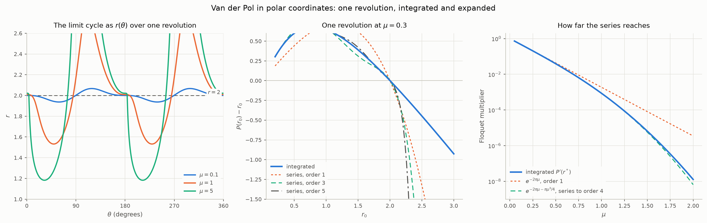

# Van der Pol in polar coordinates: integrating one revolution

Every cycle in `README.md` is integrated exactly because each zone of a
prototype is linear: an arc is a matrix, a crossing is a scalar root find,
and a revolution is two of each. Van der Pol, the smooth control the README
measures the prototypes against,

```math
\ddot{x} - \mu(1 - x^2)\dot{x} + x = 0
```

has no zones. This document asks the natural question: taken in the phase
plane in polar coordinates, can one revolution of it — from
$`\theta = 0`$ round to $`\theta = 2\pi`$ — be integrated in closed form,
the way each arc of the prototypes can? If it could, the one-revolution map
would follow at once and the same machinery as `MAPS.md` would apply.

The short answer is no, and the reason is specific. Polar coordinates do
collapse the problem to a single first order equation for $`r(\theta)`$,
which is the right object, and that equation is checked here against the
plain Cartesian integration to $`10^{-13}`$. But it is an **Abel equation
of the second kind** — one class beyond Riccati, which is the last class
that linearises — and its solution is not an elementary function. What
*does* integrate exactly is the expansion of that revolution in $`\mu`$:
every order is a polynomial in $`\theta`$ times a trigonometric polynomial,
so every order has a closed form, and the one-revolution map comes out as
explicit polynomials in $`r_0`$, order by order. Its fixed point reproduces
the classical amplitude $`2 + \mu^2/96 - 1033\mu^4/552960`$ and period
$`2\pi(1 + \mu^2/16 + \cdots)`$, gives the Floquet multiplier as
$`\exp(-2\pi\mu - \pi\mu^3/4)`$, and holds on the cycle to about
$`\mu \approx 1`$ — though only near the cycle, and only for
$`\mu \lesssim 0.3`$ away from it.

`polar.py` carries every number below; `python3 polar.py` prints them and
writes the figure. The time has been scaled by $`\omega_n`$ throughout, so
$`\mu`$ here is the README's $`\mu/\omega_n`$.

## The polar reduction

Take $`x = r\cos\theta`$ and $`\dot{x} = -r\sin\theta`$. The sign makes
$`\theta`$ increase with time and the orbit run clockwise in the
$`(x, \dot{x})`$ plane, the way every phase portrait in the README runs,
and it puts $`\theta = 0`$ on the positive $`x`$ axis where $`\dot{x} = 0`$
— the section `vanderpol.py` already uses, the maxima of $`x`$. Substituting
and solving for the two rates:

```math
\begin{aligned}
\dot{r} &= \mu\, r\,(1 - r^2\cos^2\theta)\sin^2\theta \\
\dot{\theta} &= 1 + \mu\,(1 - r^2\cos^2\theta)\sin\theta\cos\theta
\end{aligned}
```

Both are verified by substituting back into the Cartesian field. At
$`\mu = 0`$ the radius is constant and the angle advances at unit rate: the
linear oscillator's circle. The $`\mu`$ terms carry the whole nonlinearity,
and they read directly. The radial rate is positive where
$`\lvert x \rvert \lt 1`$ and negative outside, weighted by
$`\sin^2\theta = \dot{x}^2/r^2`$: energy goes in where the damping is
negative and comes out where it is positive, in proportion to the velocity
squared, which is the energy balance the README's closed form for weak
damping was built on. The angular rate is *not* constant: its correction
changes sign from quadrant to quadrant, so a revolution is not $`2\pi`$ of
uniform rotation and the period is not $`2\pi`$.

Dividing the two removes time and leaves one equation for the orbit:

```math
\frac{dr}{d\theta} =
\frac{\mu\, r\,(1 - r^2\cos^2\theta)\sin^2\theta}
     {1 + \mu\,(1 - r^2\cos^2\theta)\sin\theta\cos\theta}
```

One revolution is this equation integrated from $`\theta = 0`$ to
$`2\pi`$ from $`r(0) = r_0`$, and the time it takes is

```math
T(r_0) = \int_0^{2\pi} \frac{d\theta}{1 + \mu\,(1 - r^2\cos^2\theta)\sin\theta\cos\theta}
```

along the solution. That is the whole problem: a single scalar first order
equation, non-autonomous in $`\theta`$, and the question is whether it has a
closed form.

### The chart holds on the cycle at every $`\mu`$

Before asking that, the reduction has to be valid: $`r(\theta)`$ is a graph
only where $`\dot{\theta} \gt 0`$, so that the angle never stalls or turns
back. It might not be — at large $`\mu`$ the cycle is a relaxation
oscillation whose fast jumps are nearly vertical in the phase plane, and
nothing guarantees a vertical line through the origin's neighbourhood is
swept monotonically. Integrating the cycle in Cartesian coordinates and
reading the angle off afterwards, so that nothing is assumed:

| $`\mu`$ | $`T`$ | amplitude | min $`\dot{\theta}`$ on the cycle | min $`r`$ | $`\theta`$ monotone |
| --- | --- | --- | --- | --- | --- |
| 0.1 | 6.28711 | 2.00010 | 0.914 | 1.937 | yes |
| 0.5 | 6.38068 | 2.00249 | 0.615 | 1.722 | yes |
| 1 | 6.66329 | 2.00862 | 0.348 | 1.532 | yes |
| 2 | 7.62987 | 2.01989 | 0.107 | 1.341 | yes |
| 3 | 8.85910 | 2.02330 | 0.042 | 1.258 | yes |
| 5 | 11.61223 | 2.02151 | 0.013 | 1.183 | yes |
| 10 | 19.07837 | 2.01429 | 0.003 | 1.114 | yes |

The angle never reverses. It comes close: the minimum of $`\dot{\theta}`$
falls roughly as $`1/\mu^2`$, and that is the slow crawl of the relaxation
oscillator. On the crawl $`\dot{x} \approx -x/(\mu(x^2-1))`$, and putting
that into $`\dot{\theta}`$ gives $`\dot{\theta} \approx \sin^2\theta`$ —
small, but positive. So the cycle is a graph $`r(\theta)`$ at every
$`\mu`$ tested, and the amplitudes agree with the README's 2.00010 and
2.02151 to every digit quoted there.

Off the cycle the chart might have an edge, and where it is matters for
the map. Starting a revolution at $`(r_0, 0)`$ and asking whether
$`\dot{\theta}`$ stays positive all the way round, for $`r_0`$ from 0.05
to 8 at each of $`\mu = 0.5, 1, 1.5, 2, 3, 5`$: it always does. Large radii
are never a problem from this section, because a revolution started on the
$`x`$ axis far out drops onto the slow crawl at once and crawls in with
$`\dot{\theta} \approx \sin^2\theta \gt 0`$. Small radii looked as if
they should fail at $`\mu = 2`$, where the linearisation at the origin,
$`\ddot{x} - \mu\dot{x} + x = 0`$, acquires real eigenvalues
$`\mu/2 \pm \sqrt{\mu^2/4 - 1}`$ and the unstable focus becomes an
unstable node; near a node there is a sector of directions in which the
angle runs backwards, and at $`\mu = 5`$ it is there — at
$`\theta = 0.6\pi`$ and $`r = 0.01`$, $`\dot{\theta} = -0.47`$. But a
trajectory leaving the $`x`$ axis approaches the node's fast eigendirection
from one side, tangentially, and never crosses to the side where the angle
reverses; by the time it is far enough out for the nonlinearity to bend it,
the bend is clockwise again. So from this section the chart holds for
every starting radius tested, at every $`\mu`$ tested, and the map
$`r_0 \mapsto r(2\pi)`$ is defined wherever it was asked for. That is an
observation over the tested range, not a proof.

## Why it does not integrate in closed form

Put $`s = r^2`$, which clears the square root the radius would otherwise
carry. The orbit equation becomes

```math
\bigl[1 + \mu\sin\theta\cos\theta - \mu\, s\,\sin\theta\cos^3\theta\bigr]\frac{ds}{d\theta}
= 2\mu\sin^2\theta\; s - 2\mu\sin^2\theta\cos^2\theta\; s^2
```

which is $`(g_0 + g_1 s)\, s' = f_1 s + f_2 s^2`$ with coefficients that
are trigonometric polynomials in $`\theta`$: an **Abel equation of the
second kind**. The classification matters because it says precisely what is
different from the prototypes.

- **A linear zone gives a separable equation.** For the linear oscillator
  with damping ratio $`\zeta`$ the same reduction gives
  $`dr/d\theta = -2\zeta r\sin^2\theta/(1 - \zeta\sin 2\theta)`$: linear in
  $`r`$, so $`\ln r`$ is a quadrature of a function of $`\theta`$ alone.
  That is why every arc of every prototype is exact, and why the README's
  transit equations close.
- **Van der Pol adds one power of $`r^2`$ to each side.** The
  $`s^2`$ on the right and the $`s`$ multiplying $`s'`$ on the left are the
  $`x^2`$ in $`\mu(1 - x^2)`$, and they are what stop the separation. A
  single extra $`s^2`$ on the right alone would make it Riccati, which maps
  to a linear second order equation and is solvable whenever that is. The
  extra factor on the *left* pushes it past Riccati into Abel.
- **Abel equations have no general solution.** Particular integrable
  families are known, but nothing places this one in any of them, and
  `sympy` finds no solvable class for it in either variable.

That is the structural answer, and there is a rigorous one behind it. Odani
proved in 1995 that the Van der Pol limit cycle is not an algebraic curve
for any $`\mu \ne 0`$ — no polynomial in $`(x, \dot{x})`$ vanishes on it —
and the study of Liouvillian first integrals for Liénard systems, the class
Van der Pol belongs to, finds them only in degenerate cases. That last
result is reported from the literature rather than checked here; Odani's is
the one to rely on, and it is enough. A closed form of the kind the
prototypes have would make the cycle the level set of an elementary
expression, and it is not.

So the answer to the question asked is: the polar phase plane is the right
place to look, it reduces the revolution to one equation, and that equation
is exactly one step too nonlinear. What is left is to integrate it as far as
it *can* be integrated exactly, and that turns out to be a long way.

## What does integrate: the expansion in $`\mu`$, exactly

Write the revolution as a series in $`\mu`$ at fixed $`r_0`$:

```math
r(\theta) = r_0 + \mu\, r_1(\theta) + \mu^2 r_2(\theta) + \cdots,
\qquad r_k(0) = 0
```

Each order satisfies $`r_k' = `$ a known function of $`\theta`$ and the
lower orders, obtained by expanding the right hand side of the orbit
equation. The first is a plain quadrature:

```math
r_1(\theta) = \int_0^\theta r_0\,(1 - r_0^2\cos^2\tau)\sin^2\tau\, d\tau
= r_0\left[\frac{\theta}{2} - \frac{\sin 2\theta}{4}\right]
- r_0^3\left[\frac{\theta}{8} - \frac{\sin 4\theta}{32}\right]
```

The secular $`\theta`$ terms are what make the radius drift over a
revolution, and they feed the next order: $`r_2'`$ contains
$`r_1`$ multiplied by trigonometric factors, so $`r_2`$ contains
$`\theta^2`$, and so on. Every order is therefore of one form —
a polynomial in $`\theta`$ times a trigonometric polynomial — and that
form is closed under everything the recursion needs: products, integration
from zero (by parts, finitely many times), and evaluation at $`2\pi`$.
Nothing is approximated at any order. `polar.series` does the algebra in
exact rational arithmetic and returns the map

```math
P(r_0) = r(2\pi) = r_0 + \mu P_1(r_0) + \mu^2 P_2(r_0) + \cdots
```

as polynomials:

```math
\begin{aligned}
P_1 &= \pi r_0\left(1 - \frac{r_0^2}{4}\right) \\
P_2 &= \frac{\pi^2}{32}\, r_0\,(r_0^2 - 4)(3r_0^2 - 4) \\
P_3 &= -\frac{\pi r_0}{6144}\Bigl[(163 + 240\pi^2)r_0^6 - (1304 + 1728\pi^2)r_0^4
       + (2784 + 3328\pi^2)r_0^2 - (768 + 1024\pi^2)\Bigr]
\end{aligned}
```

with $`P_4`$ and $`P_5`$ printed by the script. $`P_1`$ is the
Krylov–Bogoliubov averaged drift, and it vanishes at $`r_0 = 2`$: the
familiar amplitude. $`P_2`$ vanishes there too, so the amplitude has no
$`O(\mu)`$ correction. $`P_3(2) = \pi/48`$ does not, and dividing by
$`P_1'(2) = -2\pi`$ gives the first correction:

```math
r^* = 2 + \frac{\mu^2}{96} - \frac{1033\,\mu^4}{552960} + O(\mu^6)
```

which is the classical expansion of the Van der Pol amplitude. At
$`\mu = 0.1`$ it gives $`2.000104`$ against the integrated $`2.000104`$.

The revolution time expands the same way,
$`T = T_0 + \mu T_1 + \mu^2 T_2 + \cdots`$, with

```math
T_0 = 2\pi, \qquad T_1 = 0, \qquad
T_2 = \frac{\pi}{128}\bigl(21r_0^4 - 88r_0^2 + 32\bigr), \qquad
T_3 = -\frac{\pi^2}{256}\, r_0^2\,(r_0^2 - 4)(21r_0^2 - 44)
```

$`T_1`$ vanishes identically — the angular correction is odd over a
revolution at every radius — and at the fixed point
$`T_2(2) = \pi/8`$, so

```math
T(r^*) = 2\pi\left[1 + \frac{\mu^2}{16} - \frac{5\,\mu^4}{3072} + O(\mu^6)\right]
```

The $`\mu^2/16`$ is the textbook frequency shift $`\omega = 1 - \mu^2/16`$,
and the $`\mu^4`$ term is what $`1/\omega`$ gives from the next known
coefficient of $`\omega`$, $`+17\mu^4/3072`$. The multiplier of the map at
its fixed point expands as

```math
P'(r^*) = 1 - 2\pi\mu + 2\pi^2\mu^2
 - \left(\tfrac{4}{3}\pi^3 + \tfrac{\pi}{4}\right)\mu^3
 + \left(\tfrac{2}{3}\pi^4 + \tfrac{\pi^2}{2}\right)\mu^4 + O(\mu^5)
```

against $`e^{-2\pi\mu} = 1 - 2\pi\mu + 2\pi^2\mu^2 - \tfrac{4}{3}\pi^3\mu^3 + \tfrac{2}{3}\pi^4\mu^4 + \cdots`$.
The two agree through second order and part company at third, by exactly
$`-\pi\mu^3/4`$, and the $`\mu^4`$ difference is what that term's cross
product with $`-2\pi\mu`$ requires. So the whole of it is one line:

```math
\ln P'(r^*) = -2\pi\mu - \frac{\pi\mu^3}{4} + O(\mu^5)
```

Dividing by the period turns it into a rate, $`\ln P'/T = -\mu(1 + \mu^2/16) + O(\mu^5)`$:
the Floquet exponent is $`-\mu`$ per unit time to leading order — the
README's measured 0.5330 at $`\mu = 0.1`$ against $`e^{-0.2\pi} = 0.5335`$
— corrected by the same $`\mu^2/16`$ that corrects the frequency. That
logarithmic form matters below, because it converges where the polynomial
does not.

## How far the series reaches

An exact series is only as useful as its convergence, and this one is a
series in $`\mu`$ for a map whose true form has an essential change of
character at $`\mu = 2`$, where the origin stops being a focus. Against
the integrated revolution, the absolute error in $`r(2\pi)`$:

| $`\mu`$ | $`r_0`$ | order 1 | order 3 | order 5 |
| --- | --- | --- | --- | --- |
| 0.1 | 1 | $`4.1\times10^{-3}`$ | $`6.3\times10^{-4}`$ | $`4.0\times10^{-5}`$ |
| 0.1 | 2 | $`4.9\times10^{-5}`$ | $`1.7\times10^{-5}`$ | $`6.1\times10^{-7}`$ |
| 0.1 | 3 | 0.56 | 0.52 | 0.64 |
| 0.3 | 1 | $`6.0\times10^{-2}`$ | $`2.0\times10^{-2}`$ | $`2.2\times10^{-2}`$ |
| 0.3 | 2 | $`7.9\times10^{-4}`$ | $`9.8\times10^{-4}`$ | $`3.5\times10^{-4}`$ |
| 0.3 | 3 | 2.6 | 21 | 226 |
| 0.5 | 1 | 0.31 | $`2.5\times10^{-2}`$ | 0.25 |
| 0.5 | 2 | $`2.4\times10^{-3}`$ | $`5.8\times10^{-3}`$ | $`6.3\times10^{-3}`$ |
| 1 | 2 | $`8.6\times10^{-3}`$ | $`5.7\times10^{-2}`$ | 0.28 |

And at the fixed point:

| $`\mu`$ | $`r^*`$ integrated | $`r^*`$ series | $`P'`$ integrated | $`P'`$ polynomial | $`e^{-2\pi\mu - \pi\mu^3/4}`$ | $`T`$ integrated | $`T`$ series |
| --- | --- | --- | --- | --- | --- | --- | --- |
| 0.1 | 2.0001040 | 2.0001040 | 0.5331 | 0.5339 | 0.5331 | 6.287111 | 6.287111 |
| 0.25 | 2.0006437 | 2.0006437 | 0.2053 | 0.2776 | 0.2053 | 6.307688 | 6.307689 |
| 0.5 | 2.0024879 | 2.0024874 | $`3.918\times10^{-2}`$ | 1.89 | $`3.917\times10^{-2}`$ | 6.380676 | 6.380721 |
| 0.75 | 2.0052773 | 2.0052683 | $`6.459\times10^{-3}`$ | 11.7 | $`6.450\times10^{-3}`$ | 6.500368 | 6.500843 |
| 1 | 2.0086199 | 2.0085485 | $`8.597\times10^{-4}`$ | 42 | $`8.514\times10^{-4}`$ | 6.663287 | 6.665658 |
| 1.5 | 2.0152265 | 2.0139801 | $`6.467\times10^{-6}`$ | 248 | $`5.697\times10^{-6}`$ | 7.096374 | 7.114986 |
| 2 | 2.0198914 | 2.0117766 | $`1.274\times10^{-8}`$ | 848 | $`6.512\times10^{-9}`$ | 7.629874 | 7.690357 |

Read together, four things:

- **On the cycle the series is good to about $`\mu = 1`$.** The amplitude
  is right to $`5\times10^{-7}`$ at $`\mu = 0.5`$ and $`7\times10^{-5}`$ at
  $`\mu = 1`$; the period to $`5\times10^{-5}`$ and $`2\times10^{-3}`$. By
  $`\mu = 2`$ both are wrong in the third figure.
- **The multiplier must be taken in logarithmic form.** The polynomial
  truncation of $`P'(r^*)`$ is useless past $`\mu = 0.1`$: it exceeds one
  at $`\mu = 0.5`$. The same coefficients rearranged as
  $`e^{-2\pi\mu - \pi\mu^3/4}`$ are right to four figures at $`\mu = 0.5`$,
  to one per cent at $`\mu = 1`$, and within a factor of two at $`\mu = 2`$
  where the multiplier itself is $`10^{-8}`$. A quantity that shrinks
  exponentially wants its exponent expanded, not itself.
- **Away from the cycle the series holds only near it.** Around
  $`r_0 = 2`$ it converges for $`\mu \lesssim 0.3`$. At $`r_0 = 3`$ it fails
  at every $`\mu`$ tested, even $`0.1`$, and adding orders makes it worse.
  The reason is that $`\mu`$ is the wrong small parameter there: the
  damping met on the revolution is $`\mu(x^2 - 1)`$, which is order one at
  $`r_0 = 3`$ however small $`\mu`$ is. The expansion is really in the
  damping accumulated over a revolution, and the series in $`\mu`$ at fixed
  $`r_0`$ only sees that as a growing coefficient.
- **The failure is a radius of convergence, not a shortage of terms.**
  Wherever the series is wrong, order 5 is no better than order 3 and
  usually worse.

<picture>
  <source media="(prefers-color-scheme: dark)" srcset="figures/polar-dark.png">
  
</picture>

*Left: the cycle as $`r(\theta)`$ over one revolution — a near circle at $`\mu = 0.1`$, and at $`\mu = 5`$ a relaxation oscillation that dips to $`r = 1.18`$ yet is still a single-valued graph. Middle: the drift over one revolution at $`\mu = 0.3`$, integrated and from the series at three orders; the series holds to about $`r_0 = 2`$ and leaves at larger radius. Right: the multiplier of the cycle against $`\mu`$; the first order $`e^{-2\pi\mu}`$ holds to about 0.3, the logarithmic series to about 1.*

## A number the README could not resolve

The README reports the Floquet multiplier of the Van der Pol cycle at
$`\mu = 5`$ as unresolvable: a finite difference of the period map cannot
tell a genuinely tiny multiplier from its own rounding, and the estimate
changed sign as the step was swept. The polar revolution gets it another
way. The derivative $`\partial r/\partial r_0`$ is integrated as its own
linear equation alongside $`r`$ — the variational equation of the orbit
equation — so it is never formed as a difference of two nearly equal
orbits, and its dynamic range is that of a floating point exponent rather
than a mantissa.

| $`\mu`$ | amplitude | $`P'(r^*)`$ | period |
| --- | --- | --- | --- |
| 1 | 2.0086199 | $`8.597\times10^{-4}`$ | 6.66329 |
| 2 | 2.0198914 | $`1.274\times10^{-8}`$ | 7.62987 |
| 3 | 2.0233041 | $`6.989\times10^{-16}`$ | 8.85910 |
| 5 | 2.0215081 | $`7.739\times10^{-38}`$ | 11.61223 |

The $`\mu = 1`$ row reproduces the README's $`8.6\times10^{-4}`$, which
was resolvable by differencing, and the $`\mu = 5`$ row is the number the
README could not produce. Its logarithm, $`-37.111`$, is the same to six
figures under `DOP853` at two tolerances and under `Radau`, and from
integrating $`\ln(\partial r/\partial r_0)`$ directly instead. So the
multiplier is $`7.7\times10^{-38}`$, not zero, and the README's "immeasurably
small" stands as a statement about the method it used.

## Where this leaves the mapping step

The hope behind the question was that an integrable revolution would make
Van der Pol a prototype in its own right, with the one-revolution map
following and `MAPS.md`'s machinery applying to it. That hope is not
realised in the form intended, and the reason is now precise rather than a
suspicion. What is available instead is two forms of the same map:

- **A polynomial map for small $`\mu`$.** Exact order by order, with the
  fixed point, multiplier and period in closed form to the order taken,
  good on the cycle to about $`\mu = 1`$ and near it to about
  $`\mu = 0.3`$. This is the regime the README found Van der Pol behaviourally
  indistinguishable from the deadzone prototype, so it is also the regime
  where a prototype is least needed.
- **A one-line numerical map for any $`\mu`$.** One integration of the
  orbit equation over $`\theta \in [0, 2\pi]`$, with the derivative and the
  period carried alongside for free. It is defined at every starting
  radius and every $`\mu`$ tested, it is a scalar integration in a bounded
  variable rather than a search for a section crossing, and it is what
  produced the multipliers above.

Neither is the closed form that would have made Van der Pol a fifth
prototype. The map itself, and what it says about the cycle, is left for
the mapping analysis as intended.

## Numerical note

The polar revolution and the Cartesian return are integrated with
`DOP853` at relative tolerance $`10^{-12}`$ and absolute $`10^{-14}`$,
and agree on $`r(2\pi)`$ and on $`T`$ to within $`2\times10^{-12}`$ at every
one of the nine $`(\mu, r_0)`$ pairs checked. The map's derivative from the
variational equation agrees with a central difference of the Cartesian
return to the difference's own accuracy, about $`10^{-9}`$. The series is
computed in exact arithmetic; its only floating point step is evaluating
the polynomials. Order five takes a few minutes, most of it in the fifth
order, and the cost roughly quintuples per order. The symbols are created
without assumptions: with $`r_0`$ and $`\mu`$ declared positive, `sympy`
spent twenty minutes deciding signs of the map's coefficients before
differentiating it, and never finished.

Two things went wrong on the way and are worth recording. The first version
of the series took the wrong $`\mu`$-coefficient when combining the
denominator's expansion with the numerator's, which left $`P_1`$ right and
everything after it wrong; the fixed point's $`\mu^2/96`$, known
independently, is what caught it. The second gave the period an $`O(\mu)`$
term that a symmetry argument says must vanish, from the same kind of
indexing slip in the period's own expansion. Both are the reason every
coefficient above is checked against a number obtained some other way.

## References

- K. Odani, *The limit cycle of the van der Pol equation is not algebraic*,
  Journal of Differential Equations 115 (1995) 146–152. The non-algebraic
  cycle.
- J. Llibre and C. Valls, *Liouvillian first integrals for Liénard
  polynomial differential systems*, Proceedings of the American
  Mathematical Society 138 (2010) 3229–3239. The Liouvillian result, cited
  from its abstract only.
- C. M. Andersen and J. F. Geer, *Power series expansions for the frequency
  and period of the limit cycle of the van der Pol equation*, SIAM Journal
  on Applied Mathematics 42 (1982) 678–693. The expansions in $`\mu`$
  carried to high order; the coefficients here were derived independently
  and agree with the low orders as usually quoted.
